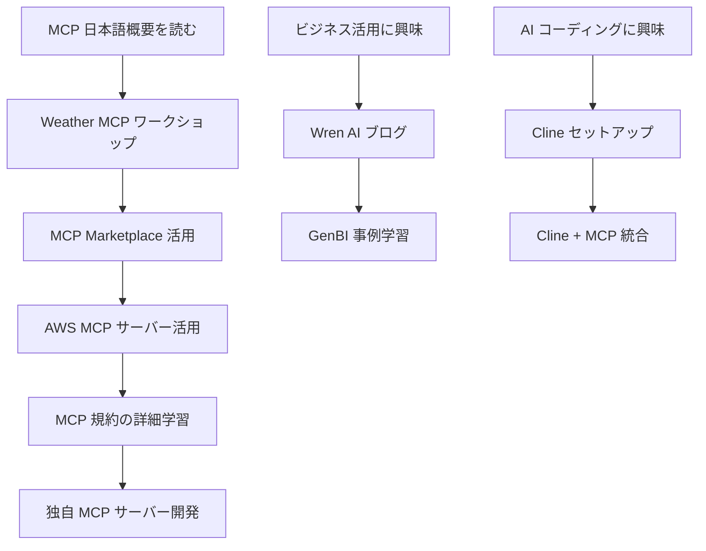

# Model Context Protocol (MCP) リソース索引

このドキュメントは、当リポジトリ内の MCP（Model Context Protocol）関連のすべてのリソースを整理し、学習者が効率的に情報にアクセスできるようにするためのインデックスです。

## 📚 主要ドキュメント

### 1. 概要・入門資料
| ドキュメント | 説明 | パス |
|-------------|------|------|
| **MCP 日本語概要** | MCP の包括的な日本語説明書 | [`/MCP_日本語概要.md`](./MCP_日本語概要.md) |
| **MCP ワークショップシリーズ** | 実践的な学習コンテンツの総合案内 | [`/workshops/ai-coding-workshop/cline/1.mcp/README.md`](./workshops/ai-coding-workshop/cline/1.mcp/README.md) |

### 2. 技術仕様・ガイドライン
| ドキュメント | 説明 | パス |
|-------------|------|------|
| **MCP 規約** | 開発・運用時の詳細なガイドライン | [`/workshops/ai-coding-workshop/cline/0.setup/1.cline/.clinerules-mcp.md`](./workshops/ai-coding-workshop/cline/0.setup/1.cline/.clinerules-mcp.md) |
| **MCP ワークショップマニュアル** | 実装手順とベストプラクティス | [`/workshops/ai-coding-workshop/cline/manuals/workshops/mcp.md`](./workshops/ai-coding-workshop/cline/manuals/workshops/mcp.md) |

## 🛠️ 実践的なワークショップ

### レベル別学習パス

#### 初級：MCP の基礎理解
1. **[MCP 日本語概要](./MCP_日本語概要.md)** - MCP の基本概念と重要性を理解
2. **[Weather MCP サーバー実装](./workshops/ai-coding-workshop/cline/1.mcp/0.weather-mcp/README.md)** - 最初の MCP サーバーを作成

#### 中級：既存 MCP の活用
3. **MCP Marketplace 活用** - 公開されている MCP サーバーの利用方法（準備中）
4. **AWS MCP サーバー活用** - AWS 公式 MCP サーバーの活用（準備中）

#### 上級：統合・カスタマイズ
5. **[MCP 規約](./workshops/ai-coding-workshop/cline/0.setup/1.cline/.clinerules-mcp.md)** - 本格的な開発・運用のためのガイドライン

## 🎯 用途別リソース

### AI コーディング支援
| 用途 | 推奨リソース | 説明 |
|------|-------------|------|
| **Cline との統合** | [Cline ワークショップ](./workshops/ai-coding-workshop/cline/manuals/workshops/cline.md) | Cline での MCP 活用方法 |
| **開発環境構築** | [セットアップガイド](./workshops/ai-coding-workshop/cline/0.setup/1.cline/.clinerules-mcp.md) | MCP 対応開発環境の構築 |

### ビジネスインテリジェンス
| 用途 | 推奨リソース | 説明 |
|------|-------------|------|
| **データ分析** | [Wren AI ブログ](./databases/wren/blog/README.md) | GenBI と MCP の組み合わせ |
| **データベース統合** | [Wren 販売分析例](./databases/wren/blog/sales.html) | 実際のビジネス活用事例 |

### Web 検索・情報収集
| 用途 | 推奨リソース | 説明 |
|------|-------------|------|
| **リアルタイム検索** | [MCP 公式サーバー](https://github.com/modelcontextprotocol/servers) | Web Research MCP の活用 |
| **コンテンツ変換** | [MCP 公式サーバー](https://github.com/modelcontextprotocol/servers) | Markdownify MCP の活用 |

## 📖 ブログ・解説記事

### Cline と MCP の統合
| タイトル | 内容 | パス |
|---------|------|------|
| **Cline について** | MCP による拡張性の詳細解説 | [`/workshops/ai-coding-workshop/cline/blog/02_about_cline.md`](./workshops/ai-coding-workshop/cline/blog/02_about_cline.md) |

### ビジネス活用事例
| タイトル | 内容 | パス |
|---------|------|------|
| **GenBI と MCP** | ビジネスインテリジェンスでの活用 | [`/databases/wren/blog/README.md`](./databases/wren/blog/README.md) |
| **販売分析事例** | 実際のデータ分析での MCP 活用 | [`/databases/wren/blog/sales.html`](./databases/wren/blog/sales.html) |

## 🔧 技術リファレンス

### 開発ツール・SDK
| リソース | 説明 | 外部リンク |
|---------|------|----------|
| **MCP 公式ドキュメント** | プロトコル仕様と API リファレンス | [modelcontextprotocol.github.io](https://modelcontextprotocol.github.io/) |
| **MCP Servers リポジトリ** | 公式 MCP サーバーのコレクション | [GitHub](https://github.com/modelcontextprotocol/servers) |
| **AWS MCP リポジトリ** | AWS 公式 MCP サーバー | [GitHub](https://github.com/aws/aws-mcp) |

### プログラミング言語別リソース
| 言語 | 推奨学習リソース | 外部リンク |
|------|----------------|----------|
| **TypeScript** | MCP サーバー開発の主要言語 | [TypeScript 公式](https://www.typescriptlang.org/docs/) |
| **Python** | AWS MCP サーバー等で使用 | [Python 公式](https://docs.python.org/3/) |
| **Node.js** | MCP サーバーの実行環境 | [Node.js 公式](https://nodejs.org/docs/) |

## 🚀 学習の進め方

### 推奨学習フロー

### 学習時間の目安
- **基礎理解**（MCP 概要）: 30分
- **初回実装**（Weather MCP）: 2-3時間
- **既存 MCP 活用**: 1-2時間
- **AWS MCP 活用**: 2-4時間
- **本格的な開発**: 1-2日

## 🔒 セキュリティ・ベストプラクティス

### 必読セキュリティガイド
1. **[MCP 日本語概要 - セキュリティ考慮事項](./MCP_日本語概要.md#セキュリティ考慮事項)**
2. **[MCP 規約 - セキュリティガイドライン](./workshops/ai-coding-workshop/cline/0.setup/1.cline/.clinerules-mcp.md)**

### セキュリティチェックリスト
- [ ] 組織のポリシー確認
- [ ] 信頼できるソースからの MCP のみ使用
- [ ] API キーの安全な管理
- [ ] 最小権限の原則の適用
- [ ] 定期的な監査の実施

## 🆘 トラブルシューティング・サポート

### よくある問題と解決方法
| 問題 | 解決方法 | 参考資料 |
|------|---------|---------|
| **MCP サーバーが起動しない** | 環境変数と依存関係を確認 | [MCP 規約](./workshops/ai-coding-workshop/cline/0.setup/1.cline/.clinerules-mcp.md) |
| **Cline で MCP が認識されない** | 設定ファイルの形式を確認 | [Cline ワークショップ](./workshops/ai-coding-workshop/cline/manuals/workshops/cline.md) |
| **権限エラー** | autoApprove 設定を確認 | [MCP 規約](./workshops/ai-coding-workshop/cline/0.setup/1.cline/.clinerules-mcp.md) |

### サポートリソース
- **GitHub Issues**: 各 MCP サーバーのリポジトリで問題報告
- **公式ドキュメント**: [modelcontextprotocol.github.io](https://modelcontextprotocol.github.io/)
- **コミュニティ**: Discord サーバーでのリアルタイムサポート

---

## 📝 更新履歴

- **2024年**: 初版作成 - MCP リソースの体系的整理
- 定期的な更新により、最新の MCP 情報を反映

---

**注意**: このインデックスは当リポジトリ内の MCP 関連リソースを整理したものです。最新の MCP 仕様や機能については、[公式ドキュメント](https://modelcontextprotocol.github.io/)を参照してください。