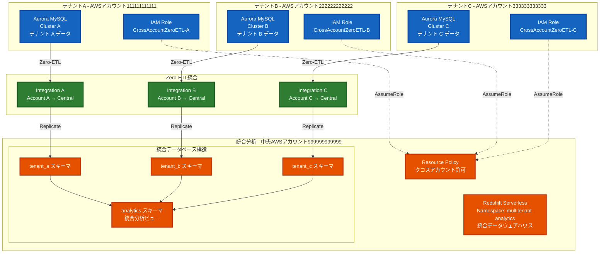
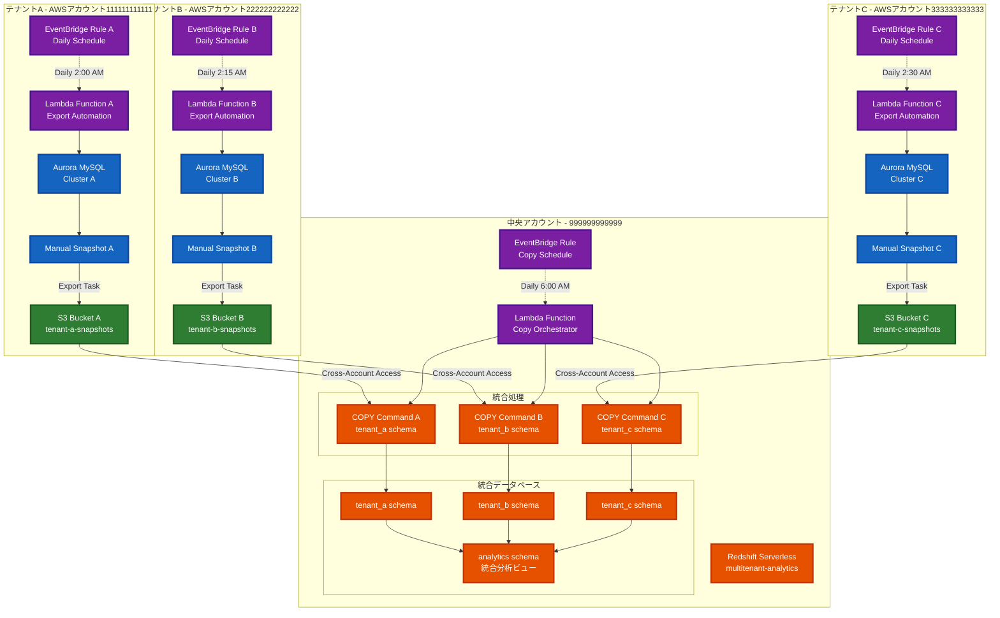

# Future Works

本資料は今後の検証項目をまとめたもので、確実な情報ではありません。

# Aurora MySQL から Redshift Serverless への Zero-ETL 統合のパフォーマンス影響調査

## 調査概要

Amazon Aurora MySQL から Amazon Redshift Serverless への Zero-ETL 統合について、MySQL 側のパフォーマンスへの影響を調査しました。結論として、Zero-ETL 統合は MySQL 側のパフォーマンスに最小限の影響しか与えないことが確認されました。

## 主要な調査結果

### 1. Enhanced Binlog による最小限のパフォーマンス影響

Aurora MySQL の Zero-ETL 統合は、Enhanced Binlog という最適化された機能を使用しています。この機能により、従来の MySQL バイナリログと比較して、ソースデータベースへのパフォーマンス影響が大幅に軽減されています。

Enhanced Binlog の主な特徴
- バイナリログとトランザクションを並列でストレージに書き込むことで、binlog 有効化によるデータベースソースへのパフォーマンス影響を軽減
- 高度に並行性の高いワークロードで最大 40% のスループット向上を実現
- バイナリログリカバリ時間を最大 99% 短縮（数分から数秒へ）

### 2. 高スループット処理能力

Aurora MySQL の Zero-ETL 統合は、以下の高いパフォーマンス指標を達成しています。

- **処理能力**: 毎分 100 万トランザクション以上の処理が可能
- **レイテンシ**: データ変更から Redshift への反映まで数秒以内（p50 レイテンシが 15 秒未満）
- **影響範囲**: ソースデータベースへの最小限の影響

### 3. 実際の導入事例での検証

Infosys の導入事例では、以下の結果が報告されています。

- Aurora テーブルでのデータ変更（INSERT、UPDATE、DELETE）が Redshift クラスターに即座に反映
- 変更はミリ秒単位で複製される
- 10,000 行の初期バルクロードが 2,516-2,528 ミリ秒のレイテンシで Redshift に複製
- 継続的なデータ挿入テストでは 1,560-1,570 ミリ秒のレイテンシを維持

### 4. 従来の ETL との比較

従来の ETL プロセスと比較した場合の Zero-ETL の優位性

| 項目 | 従来の ETL | Zero-ETL |
|------|------------|----------|
| レイテンシ | 初期 2 分 + 追加数秒 | 2-3 秒 |
| ソースへの影響 | バッチ処理による負荷 | 最小限の継続的負荷 |
| 管理の複雑さ | 高い（パイプライン管理が必要） | 低い（フルマネージド） |
| リアルタイム性 | 限定的 | ほぼリアルタイム |

### 5. パフォーマンス最適化の仕組み

Zero-ETL が最小限の影響を実現する技術的な仕組み

1. **ストレージレベルでの最適化**: Aurora の分散ストレージアーキテクチャを活用し、ストレージレベルでデータ移動を効率化

2. **並列処理**: バイナリログの書き込みとトランザクションコミットを並列実行することで、競合を最小化

3. **I/O キャッシュ**: バイナリログ I/O キャッシュにより、最新のバイナリログ変更イベントをライター DB インスタンス上の循環キャッシュに保持し、読み取り I/O を最小化

4. **Enhanced Binlog**: 従来の MySQL binlog と比較して、コンピュート競合を削減し、データベース復旧時間を改善

### 6. 制限事項と考慮点

パフォーマンス影響は最小限ですが、以下の点に注意が必要です：

1. **DDL 操作**: 特定の DDL 変更（テーブル中間への列追加など）は完全なテーブル再同期をトリガーし、一時的にレプリケーションラグが増加する可能性

2. **大量トランザクション**: 初期データロードや大量のデータ変更時は、20-25 分以上のシード時間が必要になる場合

3. **XA トランザクション**: XA トランザクションは統合を `Syncing` 状態にする可能性

## 結論

Aurora MySQL から Redshift Serverless への Zero-ETL 統合は、Enhanced Binlog 技術により、ソースデータベースのパフォーマンスに最小限の影響しか与えません。実際の導入事例でも、高いスループット（毎分 100 万トランザクション以上）と低いレイテンシ（数秒以内）を維持しながら、ソースデータベースの運用に支障をきたすことなく動作することが確認されています。

従来の ETL プロセスと比較して、Zero-ETL は管理の複雑さを大幅に軽減し、ほぼリアルタイムでのデータ統合を実現しながら、ソースシステムへの負荷を最小限に抑える優れたソリューションです。

## 参照 URL

1. [Aurora zero-ETL integrations - AWS Documentation](https://docs.aws.amazon.com/AmazonRDS/latest/AuroraUserGuide/zero-etl.html)
2. [Binary logging optimizations in Amazon Aurora MySQL version 3 | AWS Database Blog](https://aws.amazon.com/blogs/database/binary-logging-optimizations-in-amazon-aurora-mysql-version-3/)
3. [How Infosys used Amazon Aurora zero-ETL integration with Amazon Redshift for near real-time analytics and insights](https://aws.amazon.com/blogs/database/how-infosys-used-amazon-aurora-zero-etl-to-amazon-redshift-for-near-real-time-analytics-and-insights/)
4. [AWS Zero-ETL to Redshift: Real-Time Wins, Hidden Traps, and the Cost-Smart Path to Production](https://medium.com/@amitmeme/aws-zero-etl-to-redshift-real-time-wins-hidden-traps-and-the-cost-smart-path-to-production-b15d0b5e5928)
5. [Amazon Aurora zero-ETL Integration with Amazon Redshift – Feature Page](https://aws.amazon.com/rds/aurora/zero-etl/)

# Aurora MySQL Zero-ETL 統合設定ガイド

複数AWSアカウントのAurora MySQLをZero-ETLでRedshift Serverlessに統合する手順。

## アーキテクチャ概要



## 実装手順

### Phase 1: 前提条件の準備

#### 1.1 各テナントアカウントでのAurora MySQL設定

**必要なDB Cluster Parameter Group設定:**
```sql
-- 各テナントのAurora MySQLで設定
binlog_format = ROW
binlog_row_image = FULL
binlog_checksum = NONE
```

#### 1.2 中央アカウントでのRedshift Serverless設定

- Namespace: multitenant-analytics
- Workgroup: multitenant-wg
- Base Capacity: 8 RPU
- Case Sensitivity有効化: `enable_case_sensitive_identifier = true`

### Phase 2: IAMロールとクロスアカウント権限設定

#### 2.1 各テナントアカウントでのIAMロール作成

```json
{
  "Version": "2012-10-17",
  "Statement": [
    {
      "Effect": "Allow",
      "Action": [
        "rds:CreateIntegration",
        "rds:DescribeIntegrations",
        "rds:DeleteIntegration",
        "rds:ModifyIntegration"
      ],
      "Resource": [
        "arn:aws:rds:us-east-1:111111111111:db:*",
        "arn:aws:rds:us-east-1:111111111111:integration:*"
      ]
    },
    {
      "Effect": "Allow",
      "Action": [
        "redshift-serverless:CreateInboundIntegration"
      ],
      "Resource": [
        "arn:aws:redshift-serverless:us-east-1:999999999999:namespace/multitenant-analytics"
      ]
    }
  ]
}
```

#### 2.2 中央アカウントでのRedshift Resource Policy

```json
{
  "Version": "2012-10-17",
  "Statement": [
    {
      "Sid": "AllowCrossAccountIntegration",
      "Effect": "Allow",
      "Principal": {
        "AWS": [
          "arn:aws:iam::111111111111:root",
          "arn:aws:iam::222222222222:root",
          "arn:aws:iam::333333333333:root"
        ]
      },
      "Action": [
        "redshift-serverless:CreateInboundIntegration"
      ],
      "Resource": "arn:aws:redshift-serverless:us-east-1:999999999999:namespace/multitenant-analytics"
    }
  ]
}
```

### Phase 3: Zero-ETL統合の作成

#### 3.1 AWS CLI実装例

**テナントAでの統合作成:**
```bash
# テナントAアカウント (111111111111) で実行
aws rds create-integration \
  --source-arn "arn:aws:rds:us-east-1:111111111111:cluster:tenant-a-mysql" \
  --target-arn "arn:aws:redshift-serverless:us-east-1:999999999999:namespace/multitenant-analytics" \
  --integration-name "tenant-a-to-central-integration" \
  --data-filter "include:tenant_a.*.*" \
  --region us-east-1
```

**テナントBでの統合作成:**
```bash
# テナントBアカウント (222222222222) で実行
aws rds create-integration \
  --source-arn "arn:aws:rds:us-east-1:222222222222:cluster:tenant-b-mysql" \
  --target-arn "arn:aws:redshift-serverless:us-east-1:999999999999:namespace/multitenant-analytics" \
  --integration-name "tenant-b-to-central-integration" \
  --data-filter "include:tenant_b.*.*" \
  --region us-east-1
```

**テナントCでの統合作成:**
```bash
# テナントCアカウント (333333333333) で実行
aws rds create-integration \
  --source-arn "arn:aws:rds:us-east-1:333333333333:cluster:tenant-c-mysql" \
  --target-arn "arn:aws:redshift-serverless:us-east-1:999999999999:namespace/multitenant-analytics" \
  --integration-name "tenant-c-to-central-integration" \
  --data-filter "include:tenant_c.*.*" \
  --region us-east-1
```

### Phase 4: 統合ステータスの確認

```bash
# 統合ステータスの確認
aws rds describe-integrations \
  --integration-identifier "tenant-a-to-central-integration"

# 期待するステータス: "active"
```

### Phase 5: dbtマクロでのマルチテナント処理

```sql
-- macros/get_tenant_union.sql

  SELECT 'tenant_a' as tenant_id, * FROM {{ source('tenant_a', table_name) }}
  UNION ALL
  SELECT 'tenant_b' as tenant_id, * FROM {{ source('tenant_b', table_name) }}
  UNION ALL
  SELECT 'tenant_c' as tenant_id, * FROM {{ source('tenant_c', table_name) }}

```

## 制約事項

- Aurora MySQLはInnoDBストレージエンジンのみサポート
- プライマリキーがすべてのテーブルに必須
- バイナリログベースのため、binlogフィルタリングは使用不可
- ソースとターゲットは同一リージョンである必要
- 外部キー制約の一部機能（CASCADE、SET NULL等）は非対応

# Aurora MySQL Snapshot エクスポート方式によるRedshift Serverless統合

複数AWSアカウントのAurora MySQLをSnapshotエクスポート経由でRedshift Serverlessに統合する詳細実装ガイド。

## アーキテクチャ概要



## 詳細実装手順

### Phase 1: 前提条件とIAM設定

#### 1.1 各テナントアカウントでのIAM設定

**RDS Export Service Role (各テナントアカウント):**
```json
{
  "Version": "2012-10-17",
  "Statement": [
    {
      "Effect": "Allow",
      "Action": [
        "s3:PutObject*",
        "s3:GetObject*",
        "s3:DeleteObject*",
        "s3:ListBucket"
      ],
      "Resource": [
        "arn:aws:s3:::tenant-a-snapshots/*",
        "arn:aws:s3:::tenant-a-snapshots"
      ]
    }
  ]
}
```

**Trust Policy:**
```json
{
  "Version": "2012-10-17",
  "Statement": [
    {
      "Effect": "Allow",
      "Principal": {
        "Service": "export.rds.amazonaws.com"
      },
      "Action": "sts:AssumeRole"
    }
  ]
}
```

#### 1.2 中央アカウントでのクロスアカウントアクセス設定

**Redshift Service Role (中央アカウント):**
```json
{
  "Version": "2012-10-17",
  "Statement": [
    {
      "Effect": "Allow",
      "Action": [
        "s3:GetObject",
        "s3:ListBucket"
      ],
      "Resource": [
        "arn:aws:s3:::tenant-a-snapshots/*",
        "arn:aws:s3:::tenant-a-snapshots",
        "arn:aws:s3:::tenant-b-snapshots/*",
        "arn:aws:s3:::tenant-b-snapshots",
        "arn:aws:s3:::tenant-c-snapshots/*",
        "arn:aws:s3:::tenant-c-snapshots"
      ]
    }
  ]
}
```

#### 1.3 S3バケットポリシー (各テナントアカウント)

```json
{
  "Version": "2012-10-17",
  "Statement": [
    {
      "Sid": "AllowCentralAccountAccess",
      "Effect": "Allow",
      "Principal": {
        "AWS": "arn:aws:iam::999999999999:role/RedshiftS3AccessRole"
      },
      "Action": [
        "s3:GetObject",
        "s3:ListBucket"
      ],
      "Resource": [
        "arn:aws:s3:::tenant-a-snapshots",
        "arn:aws:s3:::tenant-a-snapshots/*"
      ]
    },
    {
      "Sid": "AllowRDSExportService",
      "Effect": "Allow",
      "Principal": {
        "AWS": "arn:aws:iam::111111111111:role/RDSExportServiceRole"
      },
      "Action": [
        "s3:PutObject",
        "s3:GetObject",
        "s3:DeleteObject",
        "s3:ListBucket"
      ],
      "Resource": [
        "arn:aws:s3:::tenant-a-snapshots",
        "arn:aws:s3:::tenant-a-snapshots/*"
      ]
    }
  ]
}
```

### Phase 2: KMS暗号化設定

#### 2.1 KMSキーポリシー (各テナントアカウント)

```json
{
  "Version": "2012-10-17",
  "Statement": [
    {
      "Sid": "AllowRDSExportService",
      "Effect": "Allow",
      "Principal": {
        "Service": "export.rds.amazonaws.com"
      },
      "Action": [
        "kms:CreateGrant",
        "kms:DescribeKey",
        "kms:Encrypt",
        "kms:GenerateDataKey"
      ],
      "Resource": "*"
    },
    {
      "Sid": "AllowCentralAccountDecrypt",
      "Effect": "Allow",
      "Principal": {
        "AWS": "arn:aws:iam::999999999999:role/RedshiftS3AccessRole"
      },
      "Action": [
        "kms:Decrypt",
        "kms:DescribeKey"
      ],
      "Resource": "*"
    }
  ]
}
```

### Phase 3: 自動化Lambda関数

#### 3.1 スナップショット作成・エクスポート Lambda (各テナントアカウント)

```python
import boto3
import json
from datetime import datetime, timedelta
import os

def lambda_handler(event, context):
    rds_client = boto3.client('rds')
    
    # 環境変数から設定を取得
    cluster_identifier = os.environ['CLUSTER_IDENTIFIER']
    s3_bucket = os.environ['S3_BUCKET']
    kms_key_id = os.environ['KMS_KEY_ID']
    iam_role_arn = os.environ['IAM_ROLE_ARN']
    
    timestamp = datetime.now().strftime('%Y%m%d-%H%M%S')
    snapshot_id = f"{cluster_identifier}-snapshot-{timestamp}"
    
    try:
        # 1. マニュアルスナップショット作成
        print(f"Creating snapshot: {snapshot_id}")
        snapshot_response = rds_client.create_db_cluster_snapshot(
            DBClusterSnapshotIdentifier=snapshot_id,
            DBClusterIdentifier=cluster_identifier,
            Tags=[
                {
                    'Key': 'Purpose',
                    'Value': 'DataExport'
                },
                {
                    'Key': 'CreatedBy',
                    'Value': 'AutomationLambda'
                }
            ]
        )
        
        # 2. スナップショット完了まで待機
        waiter = rds_client.get_waiter('db_cluster_snapshot_completed')
        waiter.wait(
            DBClusterSnapshotIdentifier=snapshot_id,
            WaiterConfig={
                'Delay': 60,
                'MaxAttempts': 60
            }
        )
        
        # 3. スナップショットARN取得
        snapshot_arn = snapshot_response['DBClusterSnapshot']['DBClusterSnapshotArn']
        
        # 4. S3エクスポート開始
        export_task_id = f"{cluster_identifier}-export-{timestamp}"
        print(f"Starting export task: {export_task_id}")
        
        export_response = rds_client.start_export_task(
            ExportTaskIdentifier=export_task_id,
            SourceArn=snapshot_arn,
            S3BucketName=s3_bucket,
            IamRoleArn=iam_role_arn,
            KmsKeyId=kms_key_id,
            ExportOnly=[
                'tenant_a.users',
                'tenant_a.orders',
                'tenant_a.products'
            ]
        )
        
        # 5. 古いスナップショット削除 (7日以上前)
        cleanup_old_snapshots(rds_client, cluster_identifier)
        
        return {
            'statusCode': 200,
            'body': json.dumps({
                'message': 'Export task started successfully',
                'snapshotId': snapshot_id,
                'exportTaskId': export_task_id,
                'exportStatus': export_response['Status']
            })
        }
        
    except Exception as e:
        print(f"Error: {str(e)}")
        return {
            'statusCode': 500,
            'body': json.dumps({
                'error': str(e)
            })
        }

def cleanup_old_snapshots(rds_client, cluster_identifier):
    """7日以上前の自動作成スナップショットを削除"""
    try:
        response = rds_client.describe_db_cluster_snapshots(
            DBClusterIdentifier=cluster_identifier,
            SnapshotType='manual'
        )
        
        cutoff_date = datetime.now() - timedelta(days=7)
        
        for snapshot in response['DBClusterSnapshots']:
            if (snapshot['SnapshotCreateTime'] < cutoff_date and 
                'AutomationLambda' in str(snapshot.get('TagList', []))):
                
                print(f"Deleting old snapshot: {snapshot['DBClusterSnapshotIdentifier']}")
                rds_client.delete_db_cluster_snapshot(
                    DBClusterSnapshotIdentifier=snapshot['DBClusterSnapshotIdentifier']
                )
                
    except Exception as e:
        print(f"Cleanup warning: {str(e)}")
```

#### 3.2 Redshift COPY オーケストレーション Lambda (中央アカウント)

```python
import boto3
import json
from datetime import datetime, timedelta
import os

def lambda_handler(event, context):
    redshift_data = boto3.client('redshift-data')
    
    # 環境変数から設定
    cluster_identifier = os.environ['REDSHIFT_CLUSTER']
    database = os.environ['DATABASE']
    
    tenants = [
        {
            'name': 'tenant_a',
            's3_bucket': 'tenant-a-snapshots',
            'account': '111111111111'
        },
        {
            'name': 'tenant_b', 
            's3_bucket': 'tenant-b-snapshots',
            'account': '222222222222'
        },
        {
            'name': 'tenant_c',
            's3_bucket': 'tenant-c-snapshots', 
            'account': '333333333333'
        }
    ]
    
    results = []
    
    for tenant in tenants:
        try:
            # 1. 前日のデータをトランケート
            truncate_sql = f"TRUNCATE TABLE {tenant['name']}.users, {tenant['name']}.orders, {tenant['name']}.products;"
            
            truncate_response = redshift_data.execute_statement(
                ClusterIdentifier=cluster_identifier,
                Database=database,
                Sql=truncate_sql
            )
            
            # 2. COPYコマンド実行
            copy_commands = [
                f"""
                COPY {tenant['name']}.users 
                FROM 's3://{tenant['s3_bucket']}/{tenant['name']}/users/' 
                IAM_ROLE 'arn:aws:iam::999999999999:role/RedshiftS3AccessRole'
                FORMAT AS PARQUET;
                """,
                f"""
                COPY {tenant['name']}.orders 
                FROM 's3://{tenant['s3_bucket']}/{tenant['name']}/orders/' 
                IAM_ROLE 'arn:aws:iam::999999999999:role/RedshiftS3AccessRole'
                FORMAT AS PARQUET;
                """,
                f"""
                COPY {tenant['name']}.products 
                FROM 's3://{tenant['s3_bucket']}/{tenant['name']}/products/' 
                IAM_ROLE 'arn:aws:iam::999999999999:role/RedshiftS3AccessRole'
                FORMAT AS PARQUET;
                """
            ]
            
            copy_results = []
            for sql in copy_commands:
                response = redshift_data.execute_statement(
                    ClusterIdentifier=cluster_identifier,
                    Database=database,
                    Sql=sql
                )
                copy_results.append(response['Id'])
            
            results.append({
                'tenant': tenant['name'],
                'status': 'started',
                'truncate_query_id': truncate_response['Id'],
                'copy_query_ids': copy_results
            })
            
        except Exception as e:
            results.append({
                'tenant': tenant['name'],
                'status': 'error',
                'error': str(e)
            })
    
    # 3. 統合分析ビューの更新
    try:
        analytics_sql = """
        INSERT INTO analytics.daily_summary 
        SELECT 
            CURRENT_DATE as summary_date,
            'tenant_a' as tenant_id,
            COUNT(*) as user_count,
            SUM(CASE WHEN created_date = CURRENT_DATE THEN 1 ELSE 0 END) as new_users_today
        FROM tenant_a.users
        UNION ALL
        SELECT 
            CURRENT_DATE,
            'tenant_b',
            COUNT(*),
            SUM(CASE WHEN created_date = CURRENT_DATE THEN 1 ELSE 0 END)
        FROM tenant_b.users
        UNION ALL
        SELECT 
            CURRENT_DATE,
            'tenant_c', 
            COUNT(*),
            SUM(CASE WHEN created_date = CURRENT_DATE THEN 1 ELSE 0 END)
        FROM tenant_c.users;
        """
        
        analytics_response = redshift_data.execute_statement(
            ClusterIdentifier=cluster_identifier,
            Database=database,
            Sql=analytics_sql
        )
        
        results.append({
            'analytics_update': 'started',
            'query_id': analytics_response['Id']
        })
        
    except Exception as e:
        results.append({
            'analytics_update': 'error',
            'error': str(e)
        })
    
    return {
        'statusCode': 200,
        'body': json.dumps({
            'message': 'Redshift copy operations initiated',
            'results': results,
            'timestamp': datetime.now().isoformat()
        })
    }
```

### Phase 4: EventBridge スケジューラー設定

#### 4.1 各テナントアカウントでのスケジュール設定

```bash
# テナントA: 毎日 AM 2:00 (UTC) に実行
aws events put-rule \
  --name "aurora-snapshot-export-daily" \
  --schedule-expression "cron(0 2 * * ? *)" \
  --description "Daily Aurora snapshot export for tenant A"

aws events put-targets \
  --rule "aurora-snapshot-export-daily" \
  --targets "Id"="1","Arn"="arn:aws:lambda:us-east-1:111111111111:function:aurora-snapshot-export"

# テナントB: 毎日 AM 2:15 (UTC) に実行  
aws events put-rule \
  --name "aurora-snapshot-export-daily" \
  --schedule-expression "cron(15 2 * * ? *)" \
  --description "Daily Aurora snapshot export for tenant B"

# テナントC: 毎日 AM 2:30 (UTC) に実行
aws events put-rule \
  --name "aurora-snapshot-export-daily" \
  --schedule-expression "cron(30 2 * * ? *)" \
  --description "Daily Aurora snapshot export for tenant C"
```

#### 4.2 中央アカウントでのCOPYスケジュール設定

```bash
# 中央アカウント: 毎日 AM 6:00 (UTC) に実行 (エクスポート完了後)
aws events put-rule \
  --name "redshift-copy-daily" \
  --schedule-expression "cron(0 6 * * ? *)" \
  --description "Daily Redshift COPY from tenant snapshots"

aws events put-targets \
  --rule "redshift-copy-daily" \
  --targets "Id"="1","Arn"="arn:aws:lambda:us-east-1:999999999999:function:redshift-copy-orchestrator"
```

### Phase 5: CloudWatch監視設定

#### 5.1 カスタムメトリクス作成

```python
# Lambda内でのメトリクス送信例
import boto3

cloudwatch = boto3.client('cloudwatch')

def send_custom_metric(metric_name, value, unit='Count', tenant=None):
    dimensions = [
        {
            'Name': 'Function',
            'Value': 'AuroraSnapshotExport'  
        }
    ]
    
    if tenant:
        dimensions.append({
            'Name': 'Tenant',
            'Value': tenant
        })
    
    cloudwatch.put_metric_data(
        Namespace='MultiTenant/DataPipeline',
        MetricData=[
            {
                'MetricName': metric_name,
                'Dimensions': dimensions,
                'Value': value,
                'Unit': unit
            }
        ]
    )

# 使用例
send_custom_metric('SnapshotExportSuccess', 1, 'Count', 'tenant_a')
send_custom_metric('DataProcessingTime', 1800, 'Seconds', 'tenant_a')
```

#### 5.2 CloudWatchアラーム設定

```bash
# エクスポート失敗アラーム
aws cloudwatch put-metric-alarm \
  --alarm-name "aurora-export-failure" \
  --alarm-description "Aurora snapshot export failure" \
  --metric-name "Errors" \
  --namespace "AWS/Lambda" \
  --statistic "Sum" \
  --period 300 \
  --threshold 1 \
  --comparison-operator "GreaterThanOrEqualToThreshold" \
  --dimensions "Name=FunctionName,Value=aurora-snapshot-export" \
  --evaluation-periods 1 \
  --alarm-actions "arn:aws:sns:us-east-1:111111111111:data-pipeline-alerts"

# Redshift COPY失敗アラーム  
aws cloudwatch put-metric-alarm \
  --alarm-name "redshift-copy-failure" \
  --alarm-description "Redshift COPY operation failure" \
  --metric-name "Errors" \
  --namespace "AWS/Lambda" \
  --statistic "Sum" \
  --period 300 \
  --threshold 1 \
  --comparison-operator "GreaterThanOrEqualToThreshold" \
  --dimensions "Name=FunctionName,Value=redshift-copy-orchestrator" \
  --evaluation-periods 1 \
  --alarm-actions "arn:aws:sns:us-east-1:999999999999:data-pipeline-alerts"
```

### Phase 6: コスト最適化設定

#### 6.1 S3ライフサイクルポリシー

```json
{
  "Rules": [
    {
      "ID": "SnapshotDataLifecycle",
      "Status": "Enabled",
      "Filter": {
        "Prefix": "tenant_"
      },
      "Transitions": [
        {
          "Days": 30,
          "StorageClass": "STANDARD_IA"
        },
        {
          "Days": 90, 
          "StorageClass": "GLACIER"
        },
        {
          "Days": 365,
          "StorageClass": "DEEP_ARCHIVE"
        }
      ],
      "Expiration": {
        "Days": 2555
      }
    }
  ]
}
```

#### 6.2 Redshift使用量最適化

```sql
-- 自動VACUUM設定
ALTER TABLE tenant_a.users SET (autovacuum = on);
ALTER TABLE tenant_a.orders SET (autovacuum = on);
ALTER TABLE tenant_a.products SET (autovacuum = on);

-- 圧縮エンコーディング最適化
ANALYZE COMPRESSION tenant_a.users;
ANALYZE COMPRESSION tenant_a.orders;
ANALYZE COMPRESSION tenant_a.products;

-- 統計情報更新の自動化
CREATE OR REPLACE PROCEDURE update_table_stats()
AS $$
BEGIN
  ANALYZE tenant_a.users;
  ANALYZE tenant_a.orders;
  ANALYZE tenant_a.products;
  ANALYZE tenant_b.users;
  ANALYZE tenant_b.orders;
  ANALYZE tenant_b.products;
  ANALYZE tenant_c.users;
  ANALYZE tenant_c.orders;
  ANALYZE tenant_c.products;
END;
$$ LANGUAGE plpgsql;
```

