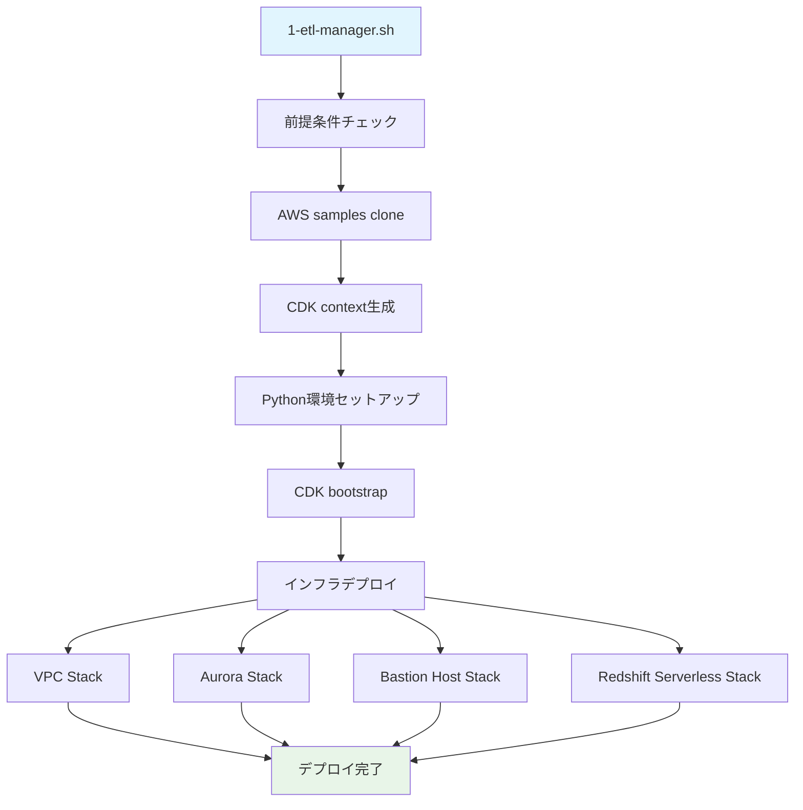
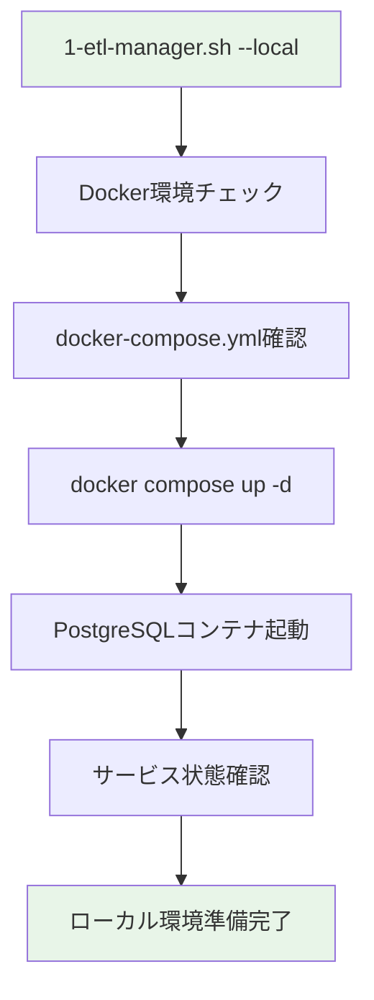

# Phase 1: Infrastructure Deployment

## 📋 概要
AWS CDKを使用してZero-ETL統合に必要なインフラストラクチャを構築します。
- VPC（Virtual Private Cloud）
- Aurora PostgreSQL クラスター
- Redshift Serverless ワークグループ
- Bastion Host（セキュアアクセス用）

## 🚀 実行手順

AWSクラウド環境とローカルのDocker環境のどちらでもインフラストラクチャをセットアップすることが可能です。

### 事前準備

```bash
cd scripts && uv venv && source .venv/bin/activate && cd -
```

### リモート実行（AWS CloudFormation）

#### ドライラン（推奨）
```bash
./1-etl-manager.sh -p aurora-postgresql -c config.json --dry-run
```

#### 実際のデプロイ
```bash
./1-etl-manager.sh -p aurora-postgresql -c config.json
```

#### クリーンアップ
```bash
./1-etl-manager.sh -p aurora-postgresql -c config.json --cleanup
```

### ローカル実行（Docker Compose）

#### 開発・テスト用ローカル実行

```bash
# ローカルDocker環境のセットアップ
./1-etl-manager.sh -p aurora-postgresql -c config.json --local

# ローカル環境のクリーンアップ
./1-etl-manager.sh -p aurora-postgresql -c config.json --local --cleanup
```

#### ローカル実行の特徴
- **Docker Compose**: PostgreSQLコンテナを自動起動
- **高速セットアップ**: AWSリソース作成不要で数秒で完了
- **開発効率**: ローカル開発・テスト用の軽量環境
- **コスト削減**: AWS料金不要でテスト実行が可能

## 🏗️ システム構成図

### リモート実行（AWS CloudFormation）


### ローカル実行（Docker Compose）


## 📦 デプロイされるリソース

### リモート実行（AWS CloudFormation）

### 1. VPC Stack
- VPC with public/private subnets
- Internet Gateway
- NAT Gateway
- Route Tables
- Security Groups

### 2. Aurora PostgreSQL Stack
- Aurora PostgreSQL 16.4 cluster
- Writer/Reader instances
- Parameter groups
- Subnet groups
- Secrets Manager integration
- マルチテナント用スキーマ設定

### 3. Bastion Host Stack
- EC2 instance in public subnet
- SSM Session Manager enabled
- PostgreSQL client pre-installed
- IAM roles and policies
- **🆕 自動ファイル転送機能**（config.json設定に基づく）

### 4. Redshift Serverless Stack
- Redshift Serverless namespace
- Redshift Serverless workgroup
- IAM service roles
- Resource policies (for Zero-ETL integration)
- dbt統合用設定

## 🆕 Config.json の新機能

### Phase別データベース接続設定
```json
"phases": {
  "database": {
    "connection_db": "postgres", 
    "description": "Database creation phase - connects to default postgres DB"
  },
  "schema": {
    "connection_db": "multitenant_analytics",
    "description": "Schema creation phase - connects to target DB"
  }
}
```

### Bastion Host自動転送設定
```json
"bastion": {
  "autoTransfer": {
    "enabled": true,
    "directories": ["sql", "scripts"],
    "files": ["config.json"],
    "excludePatterns": ["*.log", "*.tmp", "target/"]
  }
}
```

### dbt統合設定
```json
"dbt": {
  "enabled": true,
  "profileName": "multitenant_analytics",
  "targetDatabase": "multitenant_analytics",
  "targetSchema": "analytics"
}
```

## ✅ 成功条件

### CloudFormation スタック状態
- ✅ **VPC Stack**: `CREATE_COMPLETE`
- ✅ **Aurora Stack**: `CREATE_COMPLETE`  
- ✅ **Bastion Host Stack**: `CREATE_COMPLETE`
- ✅ **Redshift Serverless Stack**: `CREATE_COMPLETE`

### リソース確認コマンド
```bash
# Aurora エンドポイント確認
aws rds describe-db-clusters --query 'DBClusters[].Endpoint'

# Redshift Serverless ワークグループ確認  
aws redshift-serverless list-workgroups

# Bastion Host 確認
aws ec2 describe-instances --filters "Name=tag:Name,Values=*Bastion*" --query 'Reservations[].Instances[].InstanceId'
```

## 🎯 次フェーズ進行条件

Phase 2（Database Setup）に進むための必須条件：

### 1. Aurora PostgreSQL アクセス可能
- ✅ Aurora cluster endpoint取得可能
- ✅ Secrets Manager認証情報アクセス可能
- ✅ Database connection確立可能（Bastion Host経由）

### 2. Bastion Host 稼働中
- ✅ EC2 instance `running` 状態
- ✅ SSM Session Manager接続可能
- ✅ PostgreSQL client (`psql`) インストール済み

### 3. Redshift Serverless 準備完了
- ✅ Namespace `AVAILABLE` 状態
- ✅ Workgroup `AVAILABLE` 状態
- ✅ Zero-ETL integration用 IAM roles設定済み

## 🔧 前提条件

### AWS環境
- AWS CLI設定済み（`aws configure`）
- 適切なIAM権限（VPC、RDS、Redshift、EC2作成権限）
- AWS CDK bootstrapped (`cdk bootstrap`)

### ローカル環境
- Node.js & npm
- Python 3.8+
- uv (Python package manager)
- jq (JSON processor)

### 設定ファイル
- `config.json` 存在確認（プロジェクト設定、Aurora、Redshift、Zero-ETL設定を含む）
- dbt統合設定が有効化されていること
- Bastion Host自動転送設定が適切に構成されていること

## 🐛 トラブルシューティング

### よくある問題と解決方法

#### 1. CDK Bootstrap エラー
```bash
# Bootstrap実行
cdk bootstrap

# 特定リージョンでのBootstrap
cdk bootstrap aws://ACCOUNT-NUMBER/REGION
```

#### 2. IAM権限不足
```bash
# 現在のIAM権限確認
aws sts get-caller-identity
aws iam get-user
```

#### 3. リソース制限エラー
- VPC制限: デフォルト5個まで
- Aurora制限: リージョンあたり40クラスターまで
- Redshift制限: アカウントあたり制限あり

#### 4. スタック作成失敗時
```bash
# エラー詳細確認
aws cloudformation describe-stack-events --stack-name STACK-NAME

# 失敗したスタック削除
cdk destroy STACK-NAME
```

## 📊 実行時間目安
- **合計**: 15-25分
- VPC Stack: 2-3分
- Aurora Stack: 8-12分
- Bastion Host Stack: 2-3分  
- Redshift Serverless Stack: 3-7分

## 📈 次のステップ
Phase 1が成功したら、Phase 2（Database Setup）に進んでください。

詳細は `README-PHASE-2.md` を参照してください。
