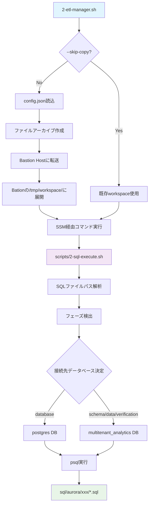

# Phase 2: マルチテナント分析プラットフォーム - データベースセットアップ

## 🎯 概要

Bastion Host経由でAurora PostgreSQLにマルチテナント分析プラットフォームのデータベース構造を構築します。本フェーズでは、自動化されたファイル転送とSSM実行により、セキュアで効率的なデータベースセットアップを実現します。

## 🚀 実行手順

### 基本的な4ステップ実行

```bash
# 1. データベース作成（postgresデータベースに接続してmultitenant_analyticsを作成）
./2-etl-manager.sh -p aurora-postgresql -c config.json --bastion-command "scripts/2-sql-execute.sh config.json sql/aurora/database/create-multitenant-database.sql"

# 2. スキーマ・テーブル作成（multitenant_analyticsデータベースに接続）
./2-etl-manager.sh -p aurora-postgresql -c config.json --bastion-command "scripts/2-sql-execute.sh config.json sql/aurora/schema/create-tenant-schemas.sql"

# 3. サンプルデータ投入
./2-etl-manager.sh -p aurora-postgresql -c config.json --bastion-command "scripts/2-sql-execute.sh config.json sql/aurora/data/insert-sample-data.sql"

# 4. セットアップ検証
./2-etl-manager.sh -p aurora-postgresql -c config.json --bastion-command "scripts/2-sql-execute.sh config.json sql/aurora/verification/verify-setup.sql"
```

### ⚡ 高速実行（--skip-copyオプション）

2回目以降の実行では、ファイル転送をスキップして実行時間を大幅短縮できます：

```bash
# ファイル転送をスキップして検証のみ実行（約10-15秒短縮）
./2-etl-manager.sh -p aurora-postgresql -c config.json --skip-copy --bastion-command "scripts/2-sql-execute.sh config.json sql/aurora/verification/verify-setup.sql"
```

**注意**: `--skip-copy`は既にファイルがBastion Hostに転送済みの場合のみ使用してください。

## 🏗️ システム構成図



## 📁 ディレクトリ構造

```
multitenant-analytics-platform/
├── 2-etl-manager.sh              # メインオーケストレーションスクリプト
├── config.json                   # 統合設定ファイル
├── scripts/
│   └── 2-sql-execute.sh         # SQL実行エンジン（フェーズ対応）
└── sql/
    ├── aurora/                   # Aurora PostgreSQL用SQL
    │   ├── database/
    │   │   └── create-multitenant-database.sql    # DB作成
    │   ├── schema/
    │   │   └── create-tenant-schemas.sql           # スキーマ・テーブル作成
    │   ├── data/
    │   │   └── insert-sample-data.sql              # サンプルデータ
    │   └── verification/
    │       └── verify-setup.sql                    # 検証クエリ
    └── redshift/                 # Redshift用（Phase 3で使用）
```

## ⚙️ コンポーネントの役割

### 1. `2-etl-manager.sh` - オーケストレーション層
- **ファイル転送管理**: `config.json`の`bastion.autoTransfer`設定に基づく自動転送
- **SSM実行制御**: Session Managerを通じたセキュアなコマンド実行
- **Aurora接続情報取得**: CloudFormationとSecrets Managerからの動的取得
- **エラーハンドリング**: 実行結果の監視と適切なエラー報告

### 2. `scripts/2-sql-execute.sh` - SQL実行エンジン
- **フェーズ自動検出**: SQLファイルパスから実行フェーズを判定
- **接続先DB切替**: フェーズに応じた適切なデータベース選択
- **環境変数管理**: Aurora接続情報の安全な受け渡し
- **実行結果報告**: 詳細なログ出力とエラー情報

### 3. `config.json` - 統合設定管理
```json
{
  "aurora": {
    "phases": {
      "database": {
        "connection_db": "postgres",
        "description": "Database creation phase"
      },
      "schema": {
        "connection_db": "multitenant_analytics", 
        "description": "Schema creation phase"
      }
    }
  },
  "bastion": {
    "autoTransfer": {
      "enabled": true,
      "directories": ["sql", "scripts"],
      "files": ["config.json"]
    }
  }
}
```

### 4. SQL資産（`sql/aurora/`）
- **フェーズベース分類**: 実行順序と依存関係を明確化
- **単一責任原則**: 各SQLファイルは特定の目的に特化
- **再利用性**: テナント追加時もスクリプト変更不要

## 🔄 ファイル転送メカニズム

### 自動転送プロセス
1. **アーカイブ作成**: `sql/`, `scripts/`, `config.json`をtar.gz形式で圧縮
2. **Base64エンコード**: SSM経由での安全な転送のため
3. **Bastion Host展開**: `/tmp/workspace/`ディレクトリに展開
4. **実行権限付与**: スクリプトファイルに自動で実行権限設定

### 相対パス使用が可能な理由
```bash
# Bastion Host上での実行例
cd /tmp/workspace
export AURORA_ENDPOINT='...' AURORA_USER='...' AURORA_PASSWORD='...'
scripts/2-sql-execute.sh config.json sql/aurora/verification/verify-setup.sql
```
ワーキングディレクトリを`/tmp/workspace`に変更するため、相対パスでファイル参照が可能です。

## 🔧 フェーズベース実行システム

### フェーズ検出ロジック
```bash
# SQLファイルパスからフェーズを自動検出
sql/aurora/database/create-multitenant-database.sql  → database フェーズ
sql/aurora/schema/create-tenant-schemas.sql          → schema フェーズ  
sql/aurora/data/insert-sample-data.sql               → data フェーズ
sql/aurora/verification/verify-setup.sql             → verification フェーズ
```

### 接続データベース切替
| フェーズ | 接続先DB | 理由 |
|----------|----------|------|
| `database` | `postgres` | 新データベース作成のため既存DBに接続 |
| `schema` | `multitenant_analytics` | 作成済みDBに対してスキーマ作成 |
| `data` | `multitenant_analytics` | テーブルが存在するDBに接続 |
| `verification` | `multitenant_analytics` | データ確認のため対象DBに接続 |

## 🆚 自動化 vs 手動運用

検証作業時にはどちらをお使いいたでいても構いません。

### 🤖 自動化実行
```bash
# ワンコマンドでセキュアな実行
./2-etl-manager.sh -p aurora-postgresql -c config.json --bastion-command "scripts/2-sql-execute.sh config.json sql/aurora/verification/verify-setup.sql"
```

**メリット:**
- ✅ セキュアなSSM Session Manager経由実行
- ✅ 自動ファイル転送とクリーンアップ  
- ✅ 実行ログの詳細記録
- ✅ エラー時の適切な情報出力

### 🔧 手動実行
```bash
# Bastion Hostに手動ログイン
aws ssm start-session --target i-04c3d030b10847eab

# 手動でファイル配置とSQL実行
sudo -u ec2-user -i
mkdir -p /tmp/manual-workspace
# ファイルを手動でコピー...
psql -h aurora-endpoint -U postgres -d multitenant_analytics -f verify-setup.sql
```

## ✅ 実行結果の確認

### データベース構造確認
```bash
./2-etl-manager.sh -p aurora-postgresql -c config.json --skip-copy --bastion-command "scripts/2-sql-execute.sh config.json sql/aurora/verification/verify-setup.sql"
```

**期待される出力例:**
```
 schemaname
------------
 tenant_a
 tenant_b  
 tenant_c
(3 rows)

 schemaname | tablename | tableowner
------------+-----------+------------
 tenant_a   | users     | postgres
 tenant_b   | users     | postgres
 tenant_c   | users     | postgres
(3 rows)

  tenant  | user_count
----------+------------
 tenant_a |          5
 tenant_b |          5
 tenant_c |          5
(3 rows)
```

## 🔍 トラブルシューティング

### よくある問題と解決策

#### 1. `--skip-copy`でworkspaceが存在しない
```
[WARNING] Workspace directory /tmp/workspace does not exist on Bastion Host
[WARNING] You may need to run without --skip-copy first to transfer files
```
**解決策**: 初回は`--skip-copy`なしで実行してファイル転送を完了させる

#### 2. 接続エラー
```
[ERROR] Could not retrieve Aurora endpoint from CloudFormation
```
**解決策**: Phase 1が正常完了し、Aurora クラスターが稼働中であることを確認

## 🎯 次フェーズ準備

Phase 3（Zero-ETL Integration）進行の前提条件、

### ✅ 必須完了項目
- [x] `multitenant_analytics` データベース作成済み
- [x] 3つのテナントスキーマ（`tenant_a`, `tenant_b`, `tenant_c`）存在
- [x] 各スキーマに`users`テーブル作成済み
- [x] 各テナントに5件のサンプルデータ投入済み
- [x] Zero-ETL Data Filter準備完了:
  ```
  include: multitenant_analytics.tenant_a.users
  include: multitenant_analytics.tenant_b.users
  include: multitenant_analytics.tenant_c.users
  ```

詳細は `README-PHASE-3.md` を参照してください。