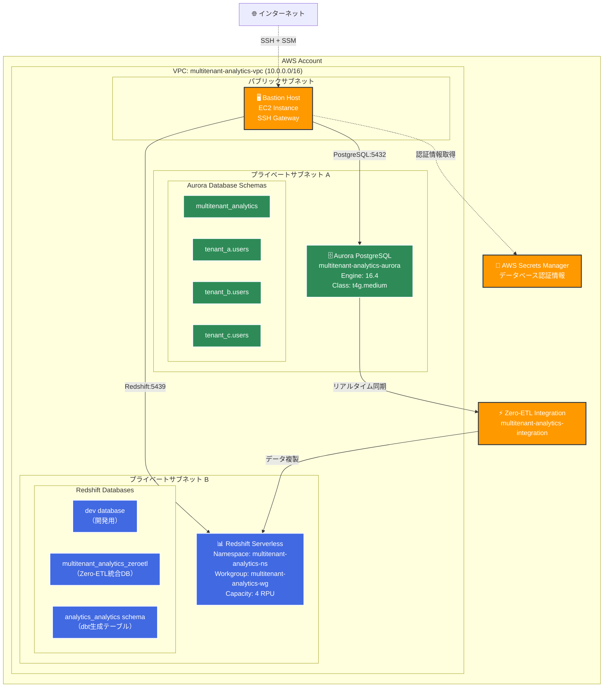
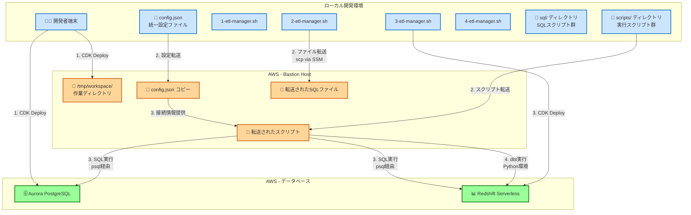
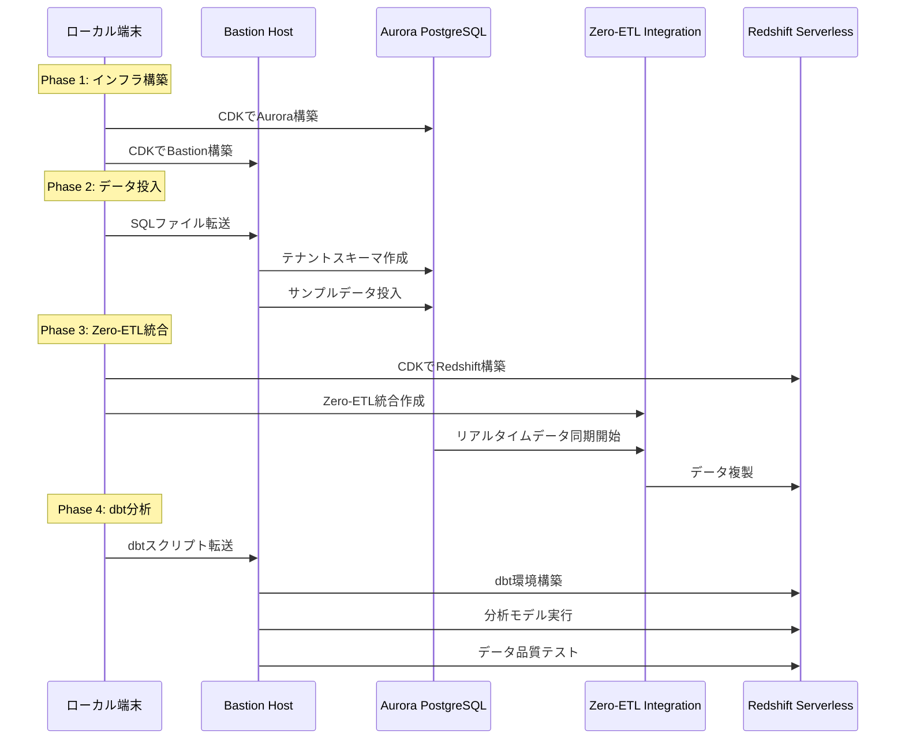

# マルチテナント分析プラットフォーム

AWS Zero-ETL統合を活用したマルチテナントデータプラットフォーム。Aurora PostgreSQLからRedshift Serverlessへのリアルタイムデータ同期により、運用データベースに負荷をかけることなく、高速な分析クエリを実現します。この基盤のRedshiftをGenerative BIのデータソースとして利用できます。

## 🏗️ システム全体アーキテクチャ

### 1. インフラストラクチャアーキテクチャ



### 2. スクリプト実行フローアーキテクチャ

**重要ポイント**: すべてのスクリプトはローカル端末から実行しますが、実際のデータベース操作はBastion Host経由で行われます。



## 🚀 4フェーズワークフロー

このプラットフォームは4つの段階的なフェーズで構築されます。各フェーズは前のフェーズの完了を前提としており、順次実行する必要があります。

```mermaid
graph LR
    subgraph "Phase 1: Infrastructure"
        P1_CDK[CDK Deploy<br/>Aurora + Bastion]
        P1_VPC[VPC構築]
        P1_AURORA[Aurora PostgreSQL]
        P1_BASTION[Bastion Host]
    end
    
    subgraph "Phase 2: Data Population"
        P2_SCHEMA[テナントスキーマ作成]
        P2_DATA[サンプルデータ投入]
        P2_VERIFY[データ検証]
    end
    
    subgraph "Phase 3: Zero-ETL Integration"
        P3_REDSHIFT[Redshift Serverless構築]
        P3_INTEGRATION[Zero-ETL統合設定]
        P3_SYNC[データ同期検証]
    end
    
    subgraph "Phase 4: dbt Analytics"
        P4_DBT[dbt環境構築]
        P4_MODELS[分析モデル実行]
        P4_TESTS[データ品質テスト]
    end
    
    P1_CDK --> P1_VPC --> P1_AURORA --> P1_BASTION
    P1_BASTION --> P2_SCHEMA --> P2_DATA --> P2_VERIFY
    P2_VERIFY --> P3_REDSHIFT --> P3_INTEGRATION --> P3_SYNC
    P3_SYNC --> P4_DBT --> P4_MODELS --> P4_TESTS
```



### Phase 1: インフラストラクチャ構築
Aurora PostgreSQLクラスターとBastion Hostを構築します。すべてのデータベースはプライベートサブネット内に配置され、Bastion Host経由でのみアクセス可能になります。

### Phase 2: マルチテナントデータ投入
Bastion Host経由でAurora PostgreSQLにアクセスし、3つのテナント（tenant_a、tenant_b、tenant_c）のスキーマとサンプルデータを作成します。

### Phase 3: Zero-ETL統合
Redshift Serverlessを構築し、Aurora PostgreSQLからのリアルタイムデータ同期を確立します。Zero-ETL統合により、運用データベースに負荷をかけることなく分析が可能になります。

### Phase 4: dbt分析基盤
dbtフレームワークを活用し、Zero-ETL統合されたデータから分析テーブルを作成します。全テナントのデータを統合した分析ビューと品質テストを自動化します。

## ⚙️ config.json 設定ガイド

このプロジェクトの全設定は `config.json` で一元管理されています。各セクションの役割を説明します。（設定を変えた場合の挙動を確認しきれていないため最初の検証段階では極力変えないでください。設定変更によるバグが見つかった場合はIssue起票をお願いします）

### 📋 基本プロジェクト設定
```json
{
  "project": {
    "name": "multitenant-analytics-platform",    // プロジェクト名（AWSリソース名のプレフィックス）
    "description": "Multitenant Analytics Platform with dbt and Zero-ETL",
    "environment": "dev",                        // 環境名（dev/staging/prod）
    "region": "us-east-1"                       // AWSリージョン
  }
}
```

### 🌐 ネットワーク設定
```json
{
  "networking": {
    "vpcName": "multitenant-analytics-vpc",     // VPC名
    "createNewVpc": true,                       // 新規VPC作成フラグ
    "vpcCidr": "10.0.0.0/16"                   // VPCのCIDRブロック
  }
}
```

### 🗄️ Aurora PostgreSQL設定
```json
{
  "aurora": {
    "clusterName": "multitenant-analytics-aurora",  // Auroraクラスター名
    "engine": "postgresql",                         // エンジンタイプ
    "version": "16.4",                             // PostgreSQLバージョン
    "instanceClass": "t4g.medium",                 // インスタンスサイズ
    "masterUsername": "postgres",                  // マスターユーザー名
    "databaseName": "multitenant_analytics",       // データベース名
    "multiAz": true,                              // マルチAZ配置
    "backupRetention": 7,                         // バックアップ保持期間
    "encrypted": true,                            // 暗号化有効
    "connection": {
      "host": "${AURORA_ENDPOINT}",               // 実行時に自動設定
      "port": 5432,
      "database": "multitenant_analytics",
      "username": "${AURORA_USER}",
      "password": "${AURORA_PASSWORD}"
    },
    "phases": {                                   // Phase別の接続DB設定
      "database": {
        "connection_db": "postgres",              // Phase1: デフォルトDB接続
        "description": "Database creation phase - connects to default postgres DB"
      },
      "schema": {
        "connection_db": "multitenant_analytics", // Phase2以降: 作成したDB接続
        "description": "Schema creation phase - connects to target DB"
      },
      "data": {
        "connection_db": "multitenant_analytics",
        "description": "Data insertion phase - connects to target DB"
      },
      "verification": {
        "connection_db": "multitenant_analytics",
        "description": "Verification phase - connects to target DB"
      }
    }
  }
}
```

### 📊 Redshift Serverless設定  
```json
{
  "redshift": {
    "dbName": "multitenant_analytics",           // データベース名
    "namespace": "multitenant-analytics-ns",      // Redshift名前空間
    "workgroup": "multitenant-analytics-wg",      // Redshiftワークグループ  
    "baseCapacity": 4,                           // 基本容量（RPU）
    "encrypted": true,                           // 暗号化有効
    "caseSensitive": true                        // ケースセンシティブ設定
  }
}
```

### ⚡ Zero-ETL統合設定
```json
{
  "zeroEtl": {
    "integrationName": "multitenant-analytics-integration",
    "dataFilter": "include: multitenant_analytics.tenant_a.users, include: multitenant_analytics.tenant_b.users, include: multitenant_analytics.tenant_c.users",
    "description": "Zero-ETL integration for multitenant analytics"
  }
}
```

### 🎯 dbt設定
```json
{
  "dbt": {
    "enabled": true,
    "profileName": "multitenant_analytics",
    "targetDatabase": "multitenant_analytics",
    "targetSchema": "analytics"
  }
}
```

### 📁 Bastion Host ファイル転送設定
```json
{
  "bastion": {
    "autoTransfer": {
      "enabled": true,
      "directories": ["sql", "scripts"],          // 転送するディレクトリ
      "files": ["config.json"],                  // 転送するファイル
      "excludePatterns": [                       // 除外パターン
        "*.log", "*.tmp", "target/", "*.pyc", 
        "__pycache__/", ".venv/", "dbt_packages/", 
        "logs/", "node_modules/", "aws-samples-zero-etl/"
      ],
      "compressionLevel": 6
    },
    "phase2": {
      "autoTransfer": {
        "enabled": true,
        "directories": ["sql/aurora"],
        "files": ["config.json", "scripts/2-sql-execute.sh"]
      }
    },
    "phase3": {
      "autoTransfer": {
        "enabled": true,
        "directories": ["sql/redshift"],
        "files": ["config.json", "scripts/3-sql-execute.sh", "bastion-redshift-connection.json"]
      }
    },
    "phase4": {
      "autoTransfer": {
        "enabled": true,
        "directories": ["sql/redshift/dbt"],
        "files": ["config.json", "scripts/4-dbt-execute.sh", "scripts/setup-dbt-environment.sh", "bastion-redshift-connection.json"]
      }
    },
    "workingDirectory": "/tmp/workspace"
  }
}
```

### 🏷️ AWSタグ設定
```json
{
  "tags": {
    "Project": "MultitenantAnalyticsPlatform",
    "Environment": "dev",
    "Owner": "data-platform-team",
    "CostCenter": "analytics",
    "Purpose": "MultitenantAnalytics"
  }
}
```

## 🔧 実行フローの詳細

### スクリプト実行パターン

このシステムの核心は、ローカル端末から安全にAWSリソースを操作する洗練されたアーキテクチャにあります。各Phase のetl-manager.shスクリプトは、config.jsonを統一設定として活用し、Bastion Hostを中継点として複雑なデータベース操作を自動化します。

1. **Phase 1**: ローカルからCDKでインフラ構築
   - Aurora PostgreSQLクラスター作成
   - Bastion Host EC2インスタンス作成
   - VPC、サブネット、セキュリティグループ設定

2. **Phase 2**: config.jsonとSQLファイルをBastionに転送 → Bastion経由でAurora操作
   - 自動ファイル転送: `sql/aurora/` ディレクトリ全体
   - テナントスキーマ作成SQL実行
   - サンプルデータ投入SQL実行

3. **Phase 3**: RedshiftをCDK構築 → Bastion経由でRedshift操作 → Zero-ETL統合
   - Redshift Serverless作成
   - Zero-ETL統合設定
   - データ同期検証

4. **Phase 4**: dbt環境をBastion上で構築 → Bastion経由でdbt実行
   - Python仮想環境作成
   - dbt-redshiftインストール
   - 分析モデル実行とテスト

### データフロー実行シーケンス



## 🛠️ 前提条件

### 必要なツール
```bash
# AWS CLI v2
aws --version

# CDK CLI
npm install -g aws-cdk
cdk --version

# Node.js & npm
node --version
npm --version

# jq (JSON処理)
jq --version

# Python 3.7+
python3 --version
```

### AWS設定
```bash
# AWS認証情報設定
aws configure

# CDKブートストラップ
cdk bootstrap
```

### 必要なIAM権限
AdministratorAccessポリシーがアタッチされたIAMユーザー/ロールが必要です。

## 📁 プロジェクト構造

```
multitenant-analytics-platform/
├── config.json                    # 🔧 統一設定ファイル
├── 1-etl-manager.sh               # 📜 Phase 1: インフラ構築
├── 2-etl-manager.sh               # 📜 Phase 2: データ投入
├── 3-etl-manager.sh               # 📜 Phase 3: Zero-ETL統合
├── 4-etl-manager.sh               # 📜 Phase 4: dbt分析
├── README-PHASE-1.md              # 📖 Phase 1 詳細ガイド
├── README-PHASE-2.md              # 📖 Phase 2 詳細ガイド
├── README-PHASE-3.md              # 📖 Phase 3 詳細ガイド
├── README-PHASE-4.md              # 📖 Phase 4 詳細ガイド
├── ZERO_ETL_INTEGRATION_GUIDE.md  # 📖 Zero-ETL統合ガイド
├── sql/                           # 📁 SQLスクリプト群
│   ├── aurora/                    # Aurora PostgreSQL用
│   │   ├── database/
│   │   ├── schema/
│   │   ├── data/
│   │   └── verification/
│   └── redshift/                  # Redshift用
│       ├── database/
│       ├── schema/
│       ├── verification/
│       └── dbt/
├── scripts/                       # 📁 実行スクリプト群
│   ├── 2-sql-execute.sh          # Phase 2 SQL実行
│   ├── 3-sql-execute.sh          # Phase 3 SQL実行
│   ├── 4-sql-execute.sh          # Phase 4 SQL実行
│   ├── 4-dbt-execute.sh          # Phase 4 dbt実行
│   ├── setup-dbt-environment.sh  # dbt環境セットアップ
│   └── configure-bastion-redshift-sg.py  # セキュリティグループ設定
├── dbt/                           # 📁 dbtプロジェクト
│   ├── dbt_project.yml
│   ├── profiles.yml
│   ├── models/
│   └── macros/
└── aws-samples-zero-etl/          # 📁 AWS公式サンプル
```

## 🚨 トラブルシューティング

### よくある問題と解決方法

#### CDKデプロイエラー
```bash
# CDKブートストラップが未実行の場合
cdk bootstrap

# リージョン指定が必要な場合
cdk bootstrap aws://ACCOUNT-NUMBER/REGION
```

#### Bastion Host接続エラー
```bash
# SSMエージェントの状態確認
aws ssm describe-instance-information

# セキュリティグループの確認
aws ec2 describe-security-groups
```

#### Zero-ETL統合エラー
```bash
# 統合ステータス確認
aws rds describe-integrations

# Aurora設定確認
aws rds describe-db-clusters --db-cluster-identifier multitenant-analytics-aurora
```

### ログ確認方法
```bash
# CloudFormationスタックログ
aws cloudformation describe-stack-events --stack-name STACK_NAME

# Bastionホストログ確認（SSM経由）
# 各etl-manager.shスクリプト実行時に詳細ログが出力されます
```

## 🔒 セキュリティ考慮事項

### 多層防御アプローチ
- **ネットワーク分離**: Aurora PostgreSQLは完全にプライベートサブネット内に隔離
- **アクセス制御**: Bastion Hostを唯一のアクセスポイントとして設定
- **暗号化**: 保存時・転送時の両方で暗号化を実施
- **認証情報管理**: AWS Secrets Managerでの安全な認証情報管理
- **SSH**: AWS Systems Manager Session Managerによる安全な接続

## 🚀 次のステップ

### 拡張可能性
1. **追加テナント**: 新しいテナントスキーマの動的追加
2. **複数リージョン**: 災害復旧（DR）環境の構築
3. **機械学習**: Amazon SageMakerとの統合
4. **BI Tool統合**: Tableau、QuickSight、Lookerとの接続

### 運用自動化
1. **CI/CD パイプライン**: GitHub Actionsでの自動デプロイ
2. **データパイプライン**: Apache Airflowでのワークフロー管理
3. **テスト自動化**: dbtテストの拡張とデータ品質監視

## 🤝 サポート

### ドキュメント
- [Phase 1 詳細ガイド](README-PHASE-1.md)
- [Phase 2 詳細ガイド](README-PHASE-2.md)  
- [Phase 3 詳細ガイド](README-PHASE-3.md)
- [Phase 4 詳細ガイド](README-PHASE-4.md)

---

🎉 **マルチテナント分析プラットフォームの構築完了！**

AWS Zero-ETL統合の力を活用して、エンタープライズレベルのデータ分析をお楽しみください。
