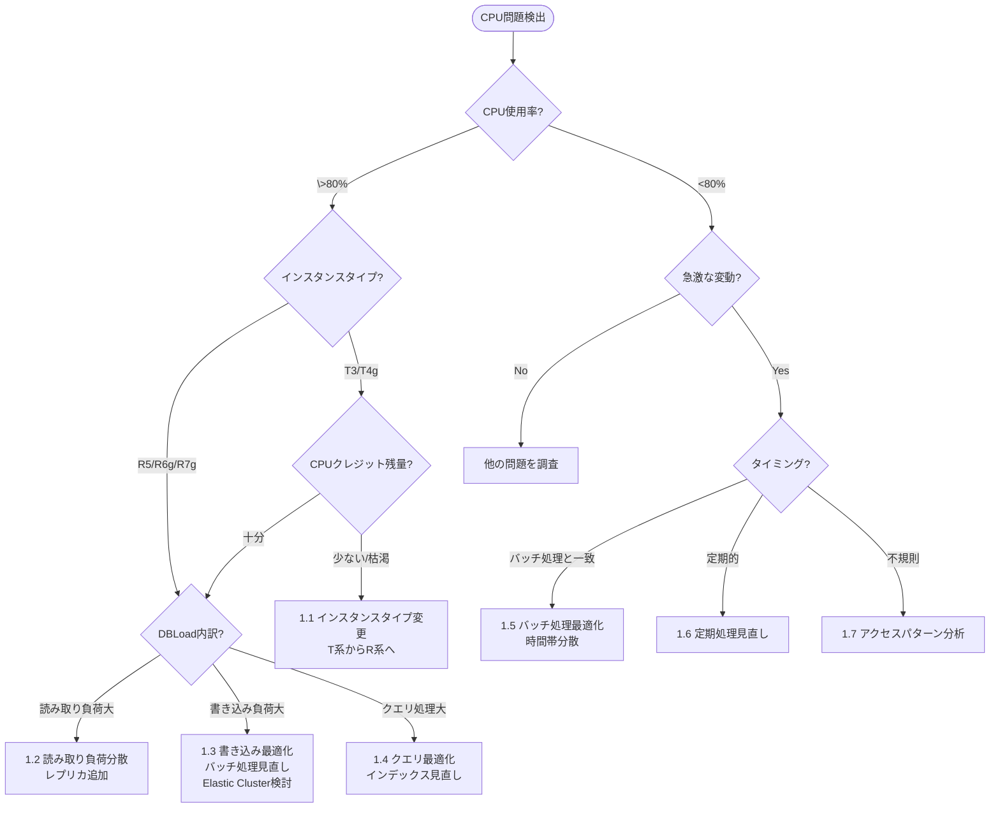
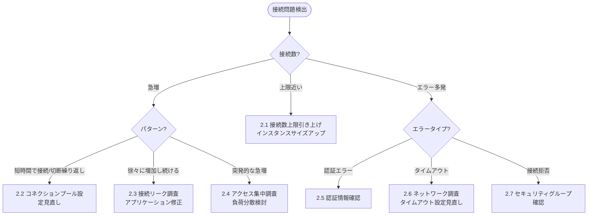
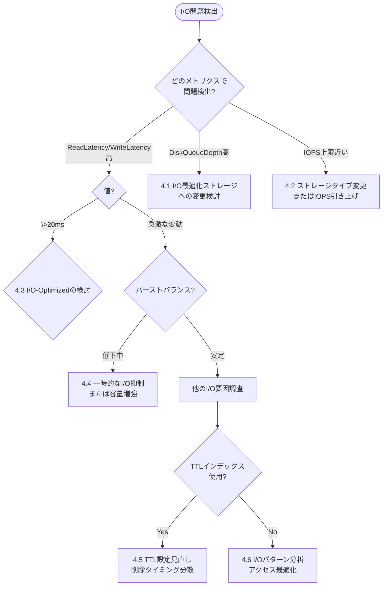
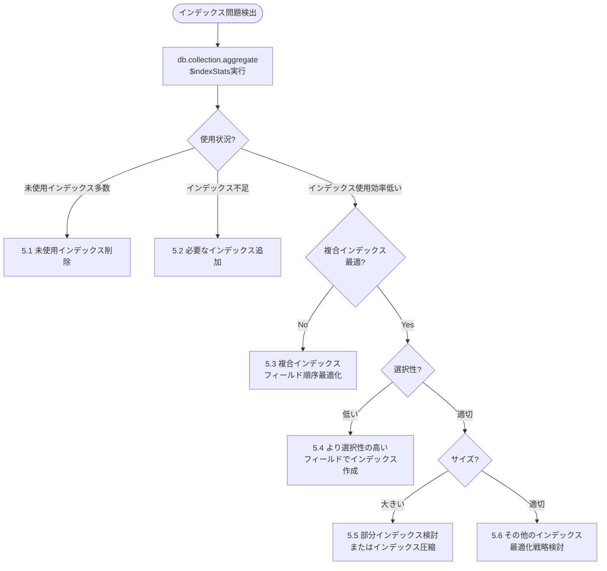
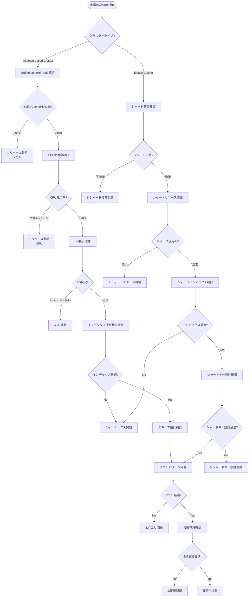

# Amazon DocumentDB トラブルシューティングガイド

## 目次
1. [概要](#概要)
2. [スパイク対策フローチャート](#スパイク対策フローチャート)
3. [スパイク対策の詳細調査フロー](#スパイク対策の詳細調査フロー)
4. [定常的な負荷対策フローチャート](#定常的な負荷対策フローチャート)
5. [定常的な負荷対策の詳細調査フロー](#定常的な負荷対策の詳細調査フロー)
6. [ユーザー診断ガイド](#ユーザー診断ガイド)

## ユーザー診断ガイド

パフォーマンス問題の診断や調査に関する詳細な情報は、[ユーザー診断ガイド](spike-10-diagnostics.md)を参照してください。このガイドでは、以下の内容を提供します：

- システム診断の基本フロー
- キャッシュパフォーマンス分析
- クエリ診断と最適化
- コレクション操作統計の確認
- Elastic Cluster診断
- システム全体のモニタリング

## 概要

このガイドでは、Amazon DocumentDBのパフォーマンス問題に対するトラブルシューティングフローを提供します。
トラブルシューティングは大きく「スパイク対策」と「定常的な負荷対策」の2つに分けられます。

- **スパイク対策**: 突発的な負荷増加や一時的なパフォーマンス低下に対する対応
- **定常的な負荷対策**: 継続的なパフォーマンス最適化と長期的な安定運用のための対策

各フローチャートでは、クラスタータイプ（Instance-based ClusterまたはElastic Cluster）に応じた調査パスを示し、
具体的なメトリクス値に基づいて問題の原因を特定します。

現時点でフローチャートは完全な網羅性を持つわけではないためあくまで参考程度に利用して下さい。

## スパイク対策フローチャート

## スパイク対策の詳細調査フロー

### 1. リソース問題（CPU）

### 2. 接続問題

### 3. クエリ問題

### 4. I/O問題

### 5. インデックス問題

## 定常的な負荷対策フローチャート

## スパイク対策ソリューション

### 1. リソース問題ソリューション

詳細は [スパイク対策 - リソース問題ソリューション](spike-01-resources.md) を参照してください。

1.1 **インスタンスタイプ変更（T系からR系へ）**
- T系インスタンスはCPUクレジットを消費するバースト可能なインスタンス
- 本番環境では安定したパフォーマンスを提供するR5やR6gなどのインスタンスタイプを使用
- 実装: インスタンスタイプの変更（ダウンタイムが発生する可能性あり）

1.2 **読み取り負荷分散（レプリカ追加）**
- 読み取りクエリをレプリカに分散させることでプライマリノードの負荷を軽減
- 実装: レプリカの追加とアプリケーションの読み取りルーティング設定

1.3 **書き込み最適化（バッチ処理見直し）**
- 書き込み処理をバッチ化して効率化
- 実装: 小さな書き込みをまとめる、書き込みタイミングを分散させる

1.4 **クエリ最適化（インデックス見直し）**
- クエリパターンに基づいて適切なインデックスを作成
- 実装: `explain()`を使用してクエリプランを分析し、必要なインデックスを作成

1.5 **バッチ処理最適化（時間帯分散）**
- バッチ処理を負荷の少ない時間帯に実行
- 実装: バッチ処理のスケジュール変更、処理の分割

1.6 **定期処理見直し**
- 定期的に実行される処理の最適化
- 実装: 処理頻度の見直し、処理内容の効率化

1.7 **アクセスパターン分析**
- 不規則なスパイクの原因となるアクセスパターンを特定
- 実装: アプリケーションログ分析、CloudWatchメトリクスの詳細分析

### 2. 接続問題ソリューション

詳細は [スパイク対策 - 接続問題ソリューション](spike-02-connections.md) を参照してください。

2.1 **接続数上限引き上げ（インスタンスサイズアップ）**
- インスタンスサイズを大きくして接続数上限を引き上げ
- 実装: インスタンスタイプの変更

2.2 **コネクションプール設定見直し**
- アプリケーション側のコネクションプール設定を最適化
- 実装: プール設定の調整（最小/最大接続数、アイドルタイムアウト）

2.3 **接続リーク調査（アプリケーション修正）**
- 接続がクローズされずに残る原因を特定
- 実装: アプリケーションコードの修正、接続管理の改善

2.4 **アクセス集中調査（負荷分散検討）**
- 突発的なアクセス集中の原因を特定
- 実装: 負荷分散、キャッシング導入

2.5 **認証情報確認**
- 認証エラーの原因を特定
- 実装: 認証情報の更新、権限設定の見直し

2.6 **ネットワーク調査（タイムアウト設定見直し）**
- ネットワーク関連の問題を特定
- 実装: タイムアウト設定の調整、ネットワーク構成の見直し

2.7 **セキュリティグループ確認**
- セキュリティグループの設定を確認
- 実装: 必要なポートの開放、ルールの見直し

### 3. クエリ問題ソリューション

詳細は [スパイク対策 - クエリ問題ソリューション](spike-03-queries.md) を参照してください。クエリの診断と最適化については、[ユーザー診断ガイド](spike-10-diagnostics.md#クエリ診断)も併せて参照してください。

3.1 **インデックス作成または修正**
- クエリパターンに基づいて適切なインデックスを作成
- 実装: 新規インデックス作成、既存インデックスの修正

3.2 **クエリ最適化（ページネーション導入）**
- 大量のデータを返すクエリにページネーションを導入
- 実装: limit/skipの使用、カーソルベースのページネーション

3.3 **クエリ単純化（アプリ側で処理分担）**
- 複雑なクエリをシンプルにし、一部の処理をアプリケーション側で実行
- 実装: クエリの分割、アプリケーションでの後処理

3.4 **同時実行制限（キューイング導入）**
- 同時実行クエリ数を制限
- 実装: アプリケーション側でのキューイング、実行制御

3.5 **その他の最適化（プロジェクション活用）**
- 必要なフィールドのみを取得するようにプロジェクションを設定
- 実装: クエリのプロジェクション設定最適化

### 4. I/O問題ソリューション

詳細は [スパイク対策 - I/O問題ソリューション](spike-04-io.md) を参照してください。

4.1 **I/O最適化ストレージへの変更検討**
- I/O負荷が高い場合、I/O最適化ストレージへの変更を検討
- 実装: ストレージタイプの変更

4.2 **ストレージタイプ変更またはIOPS引き上げ**
- IOPS上限に近づいている場合、ストレージタイプの変更またはIOPSの引き上げを検討
- 実装: ストレージ設定の変更

4.3 **I/O-Optimizedへの変更**
- StandardからI/O-Optimizedへの変更でより予測可能なパフォーマンスを確保
- 実装: ストレージタイプの変更

4.4 **一時的なI/O抑制または容量増強**
- バーストバランスが低下している場合、一時的にI/O負荷を抑制または容量を増強
- 実装: 不要な処理の一時停止、ストレージ容量の増強

4.5 **TTL設定見直し（削除タイミング分散）**
- TTLインデックスによる削除タイミングを分散
- 実装: TTL値の調整、削除処理の分散

4.6 **I/Oパターン分析（アクセス最適化）**
- I/Oパターンを分析し、アクセスを最適化
- 実装: アクセスパターンの見直し、キャッシング導入

### 5. インデックス問題ソリューション

インデックスの使用状況分析と診断については、[ユーザー診断ガイド](spike-10-diagnostics.md#インデックス使用状況の分析)を参照してください。

5.1 **未使用インデックス削除**
- 使用されていないインデックスを特定して削除
- 実装: `db.collection.aggregate([{$indexStats:{}}])`で使用状況を確認し、不要なインデックスを削除

5.2 **必要なインデックス追加**
- クエリパターンに基づいて必要なインデックスを追加
- 実装: 新規インデックスの作成

5.3 **複合インデックスフィールド順序最適化**
- 複合インデックスのフィールド順序を最適化
- 実装: インデックスの再作成（フィールド順序を変更）

5.4 **より選択性の高いフィールドでインデックス作成**
- 選択性の高いフィールド（重複値が1%未満）を優先してインデックス作成
- 実装: インデックス設計の見直し

5.5 **部分インデックス検討またはインデックス圧縮**
- 部分インデックスの使用を検討
- 実装: 条件付きインデックスの作成

5.6 **その他のインデックス最適化戦略検討**
- インデックスの種類や設定を見直し
- 実装: インデックス戦略の総合的な見直し

## 定常的な負荷対策ソリューション

### 6. シャード分散問題ソリューション

詳細は [定常的な負荷対策 - シャード分散問題ソリューション](steady-06-sharding.md) を参照してください。

6.1 **シャード間データ分散の最適化**
- データ分散の均一性を改善
- 実装: シャード間のデータ再分散

6.2 **チャンクサイズの最適化**
- チャンクサイズを調整してデータ分散を改善
- 実装: チャンクサイズの設定変更

6.3 **バランサー設定の調整**
- シャード間のデータ移動を最適化
- 実装: バランサー設定の調整

### 7. シャードスケール問題ソリューション

詳細は [定常的な負荷対策 - シャードスケール問題ソリューション](steady-07-scaling.md) を参照してください。

7.1 **シャード数の増加**
- 負荷を分散するためにシャードを追加
- 実装: シャードの追加、データ再分散

7.2 **シャードリソースの増強**
- 個々のシャードのリソースを増強
- 実装: インスタンスタイプの変更

7.3 **シャード間の負荷分散最適化**
- シャード間の負荷を均等化
- 実装: ルーティング設定の調整

### 8. シャードキー設計問題ソリューション

詳細は [定常的な負荷対策 - シャードキー設計問題ソリューション](steady-08-shardkey.md) を参照してください。

8.1 **シャードキー選択の最適化**
- より均一な分散を実現するシャードキーの選択
- 実装: シャードキーの再設計

8.2 **複合シャードキーの検討**
- 複数フィールドを組み合わせたシャードキーの使用
- 実装: 複合シャードキーの設計と実装

8.3 **ハッシュベースシャードキーの検討**
- ハッシュベースのシャードキーによる均一分散
- 実装: ハッシュシャードキーの実装

### 9. スキーマ設計問題ソリューション

詳細は [定常的な負荷対策 - スキーマ設計問題ソリューション](steady-09-schema.md) を参照してください。

9.1 **データモデルの最適化**
- スキーマ設計を見直し、最適化
- 実装: データモデルの再設計

9.2 **正規化レベルの調整**
- 適切な正規化レベルを選択
- 実装: スキーマの再構築

9.3 **埋め込みドキュメントの最適化**
- 埋め込みドキュメント構造を見直し、最適化
- 実装: ドキュメント構造の再設計
