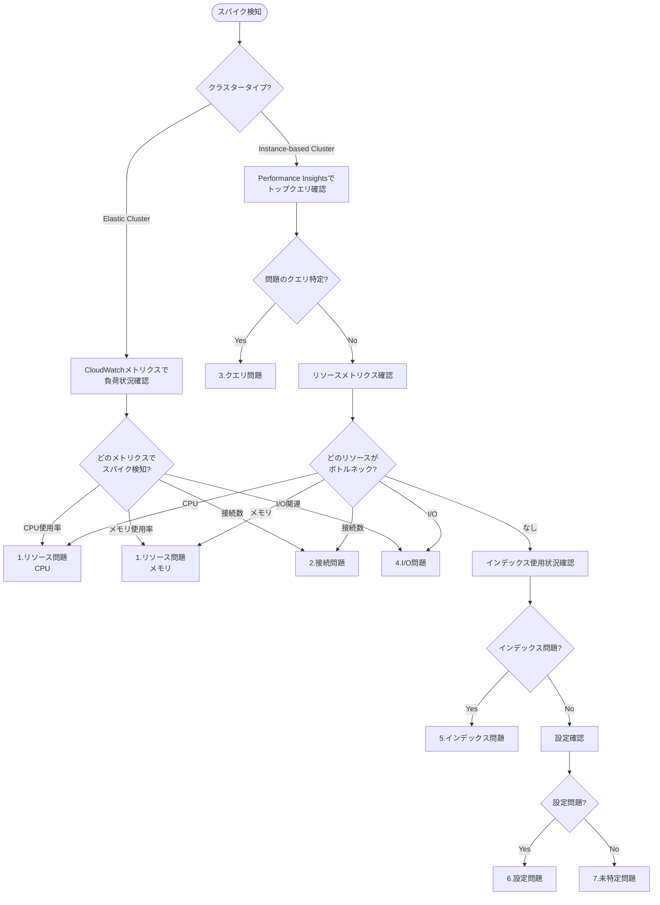
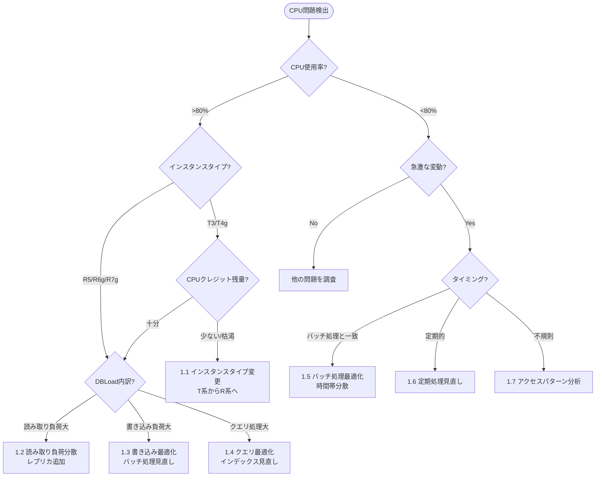
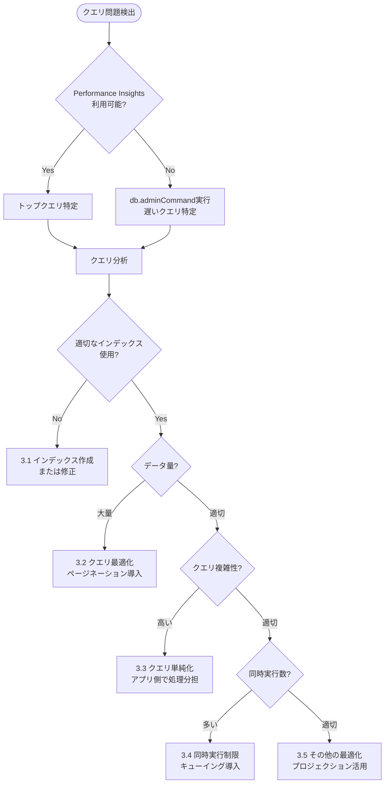
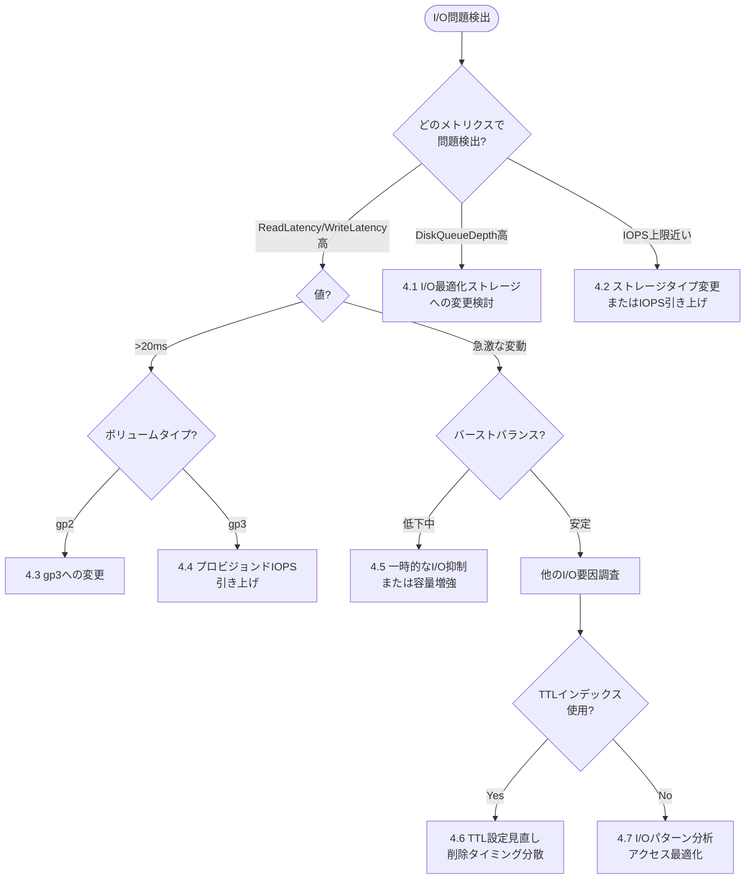
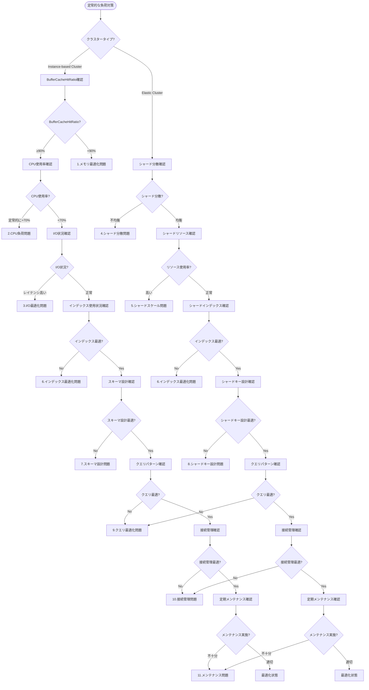
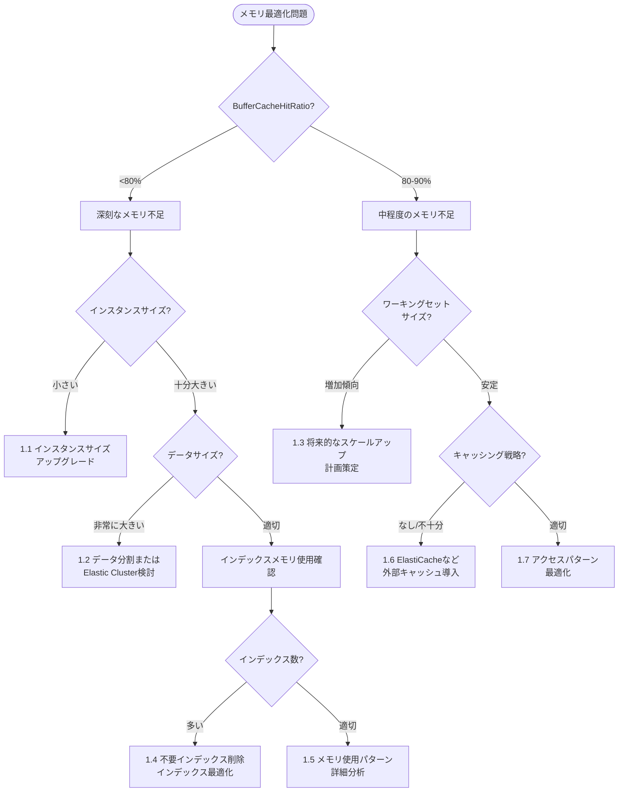
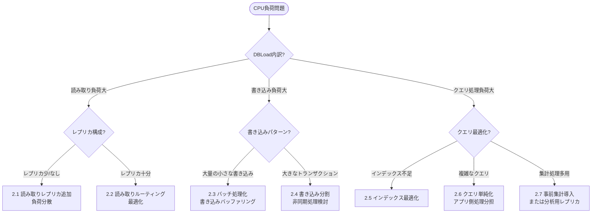

# Amazon DocumentDB トラブルシューティングガイド

## 目次
1. [概要](#概要)
2. [スパイク対策フローチャート](#スパイク対策フローチャート)
3. [スパイク対策の詳細調査フロー](#スパイク対策の詳細調査フロー)
4. [定常的な負荷対策フローチャート](#定常的な負荷対策フローチャート)
5. [定常的な負荷対策の詳細調査フロー](#定常的な負荷対策の詳細調査フロー)
6. [ソリューション集](#ソリューション集)

## 概要

このガイドでは、Amazon DocumentDBのパフォーマンス問題に対するトラブルシューティングフローを提供します。トラブルシューティングは大きく「スパイク対策」と「定常的な負荷対策」の2つに分けられます。

- **スパイク対策**: 突発的な負荷増加や一時的なパフォーマンス低下に対する対応
- **定常的な負荷対策**: 継続的なパフォーマンス最適化と長期的な安定運用のための対策

各フローチャートでは、クラスタータイプ（Instance-based ClusterまたはElastic Cluster）に応じた調査パスを示し、具体的なメトリクス値に基づいて問題の原因を特定します。

## スパイク対策フローチャート

## スパイク対策の詳細調査フロー

### 1. リソース問題（CPU）

### 2. 接続問題

### 3. クエリ問題

### 4. I/O問題

### 5. インデックス問題

## 定常的な負荷対策フローチャート

## 定常的な負荷対策の詳細調査フロー

### 1. メモリ最適化問題

### 2. CPU負荷問題

## ソリューション集

### スパイク対策ソリューション

#### 1. リソース問題ソリューション

1.1 **インスタンスタイプ変更（T系からR系へ）**
- T系インスタンスはCPUクレジットを消費するバースト可能なインスタンス
- 本番環境では安定したパフォーマンスを提供するR5やR6gなどのインスタンスタイプを使用
- 実装: インスタンスタイプの変更（ダウンタイムが発生する可能性あり）

1.2 **読み取り負荷分散（レプリカ追加）**
- 読み取りクエリをレプリカに分散させることでプライマリノードの負荷を軽減
- 実装: レプリカの追加とアプリケーションの読み取りルーティング設定

1.3 **書き込み最適化（バッチ処理見直し）**
- 書き込み処理をバッチ化して効率化
- 実装: 小さな書き込みをまとめる、書き込みタイミングを分散させる

1.4 **クエリ最適化（インデックス見直し）**
- クエリパターンに基づいて適切なインデックスを作成
- 実装: `explain()`を使用してクエリプランを分析し、必要なインデックスを作成

1.5 **バッチ処理最適化（時間帯分散）**
- バッチ処理を負荷の少ない時間帯に実行
- 実装: バッチ処理のスケジュール変更、処理の分割

1.6 **定期処理見直し**
- 定期的に実行される処理の最適化
- 実装: 処理頻度の見直し、処理内容の効率化

1.7 **アクセスパターン分析**
- 不規則なスパイクの原因となるアクセスパターンを特定
- 実装: アプリケーションログ分析、CloudWatchメトリクスの詳細分析

#### 2. 接続問題ソリューション

2.1 **接続数上限引き上げ（インスタンスサイズアップ）**
- インスタンスサイズを大きくして接続数上限を引き上げ
- 実装: インスタンスタイプの変更

2.2 **コネクションプール設定見直し**
- アプリケーション側のコネクションプール設定を最適化
- 実装: プール設定の調整（最小/最大接続数、アイドルタイムアウト）

2.3 **接続リーク調査（アプリケーション修正）**
- 接続がクローズされずに残る原因を特定
- 実装: アプリケーションコードの修正、接続管理の改善

2.4 **アクセス集中調査（負荷分散検討）**
- 突発的なアクセス集中の原因を特定
- 実装: 負荷分散、キャッシング導入

2.5 **認証情報確認**
- 認証エラーの原因を特定
- 実装: 認証情報の更新、権限設定の見直し

2.6 **ネットワーク調査（タイムアウト設定見直し）**
- ネットワーク関連の問題を特定
- 実装: タイムアウト設定の調整、ネットワーク構成の見直し

2.7 **セキュリティグループ確認**
- セキュリティグループの設定を確認
- 実装: 必要なポートの開放、ルールの見直し

#### 3. クエリ問題ソリューション

3.1 **インデックス作成または修正**
- クエリパターンに基づいて適切なインデックスを作成
- 実装: 新規インデックス作成、既存インデックスの修正

3.2 **クエリ最適化（ページネーション導入）**
- 大量のデータを返すクエリにページネーションを導入
- 実装: limit/skipの使用、カーソルベースのページネーション

3.3 **クエリ単純化（アプリ側で処理分担）**
- 複雑なクエリをシンプルにし、一部の処理をアプリケーション側で実行
- 実装: クエリの分割、アプリケーションでの後処理

3.4 **同時実行制限（キューイング導入）**
- 同時実行クエリ数を制限
- 実装: アプリケーション側でのキューイング、実行制御

3.5 **その他の最適化（プロジェクション活用）**
- 必要なフィールドのみを取得するようにプロジェクションを設定
- 実装: クエリのプロジェクション設定最適化

#### 4. I/O問題ソリューション

4.1 **I/O最適化ストレージへの変更検討**
- I/O負荷が高い場合、I/O最適化ストレージへの変更を検討
- 実装: ストレージタイプの変更

4.2 **ストレージタイプ変更またはIOPS引き上げ**
- IOPS上限に近づいている場合、ストレージタイプの変更またはIOPSの引き上げを検討
- 実装: ストレージ設定の変更

4.3 **gp3への変更**
- gp2からgp3への変更でより予測可能なパフォーマンスを確保
- 実装: ストレージタイプの変更

4.4 **プロビジョンドIOPS引き上げ**
- I/O負荷が高い場合、プロビジョンドIOPSの引き上げを検討
- 実装: ストレージ設定の変更

4.5 **一時的なI/O抑制または容量増強**
- バーストバランスが低下している場合、一時的にI/O負荷を抑制または容量を増強
- 実装: 不要な処理の一時停止、ストレージ容量の増強

4.6 **TTL設定見直し（削除タイミング分散）**
- TTLインデックスによる削除タイミングを分散
- 実装: TTL値の調整、削除処理の分散

4.7 **I/Oパターン分析（アクセス最適化）**
- I/Oパターンを分析し、アクセスを最適化
- 実装: アクセスパターンの見直し、キャッシング導入

#### 5. インデックス問題ソリューション

5.1 **未使用インデックス削除**
- 使用されていないインデックスを特定して削除
- 実装: `db.collection.aggregate([{$indexStats:{}}])`で使用状況を確認し、不要なインデックスを削除

5.2 **必要なインデックス追加**
- クエリパターンに基づいて必要なインデックスを追加
- 実装: 新規インデックスの作成

5.3 **複合インデックスフィールド順序最適化**
- 複合インデックスのフィールド順序を最適化
- 実装: インデックスの再作成（フィールド順序を変更）

5.4 **より選択性の高いフィールドでインデックス作成**
- 選択性の高いフィールド（重複値が1%未満）を優先してインデックス作成
- 実装: インデックス設計の見直し

5.5 **部分インデックス検討またはインデックス圧縮**
- 部分インデックスの使用を検討
- 実装: 条件付きインデックスの作成

5.6 **その他のインデックス最適化戦略検討**
- インデックスの種類や設定を見直し
- 実装: インデックス戦略の総合的な見直し

### 定常的な負荷対策ソリューション

#### 1. メモリ最適化ソリューション

1.1 **インスタンスサイズアップグレード**
- メモリ容量を増やしてBufferCacheHitRatioを改善
- 実装: インスタンスタイプの変更

1.2 **データ分割またはElastic Cluster検討**
- データサイズが非常に大きい場合、データ分割またはElastic Clusterへの移行を検討
- 実装: アーキテクチャの見直し、Elastic Clusterへの移行

1.3 **将来的なスケールアップ計画策定**
- ワーキングセットサイズの増加傾向に基づいてスケールアップ計画を策定
- 実装: 定期的な容量計画レビュー、自動スケーリング設定

1.4 **不要インデックス削除、インデックス最適化**
- 不要なインデックスを削除し、インデックスを最適化
- 実装: インデックス使用状況の定期的な確認、最適化

1.5 **メモリ使用パターン詳細分析**
- メモリ使用パターンを詳細に分析
- 実装: メモリ使用状況の詳細モニタリング、パターン分析

1.6 **ElastiCacheなど外部キャッシュ導入**
- 外部キャッシュを導入してメモリ負荷を軽減
- 実装: ElastiCacheの導入、キャッシング戦略の策定

#### 2. CPU負荷問題ソリューション

2.1 **読み取りレプリカ追加（負荷分散）**
- 読み取り負荷を複数のレプリカに分散
- 実装: レプリカノードの追加、アプリケーションの読み取りルーティング設定

2.2 **読み取りルーティング最適化**
- レプリカ間での読み取り負荷の均等分散
- 実装: アプリケーションのルーティングロジック改善

2.3 **バッチ処理化（書き込みバッファリング）**
- 小さな書き込みをバッチ処理にまとめる
- 実装: バッチ処理ロジックの実装、書き込みバッファの導入

2.4 **書き込み分割（非同期処理検討）**
- 大きなトランザクションを小さな単位に分割
- 実装: 非同期処理の導入、トランザクション分割ロジックの実装

2.5 **インデックス最適化**
- インデックス設計の見直しによるCPU負荷軽減
- 実装: インデックス構成の最適化

2.6 **クエリ単純化（アプリ側処理分担）**
- 複雑なクエリの処理をアプリケーション側で分担
- 実装: アプリケーションロジックの改修

2.7 **事前集計導入または分析用レプリカ**
- 集計処理の負荷を軽減
- 実装: 事前集計テーブルの作成、分析用レプリカの設定

#### 3. I/O最適化問題ソリューション

3.1 **ストレージタイプの最適化**
- I/O特性に合わせたストレージタイプの選択
- 実装: gp3やio1への変更、IOPSの調整

3.2 **I/Oパターンの最適化**
- I/O操作のパターンを見直し、効率化
- 実装: バッチ処理の導入、アクセスパターンの改善

3.3 **キャッシュ戦略の改善**
- BufferCacheHitRatioの向上
- 実装: インスタンスサイズの調整、キャッシュ設定の最適化

3.4 **データ分布の最適化**
- データの物理的な配置を最適化
- 実装: インデックス再構築、データ再編成

#### 4. シャード分散問題ソリューション

4.1 **シャードキー設計の見直し**
- データ分散の均一性を改善
- 実装: シャードキーの再設計、データ再分散

4.2 **チャンクサイズの最適化**
- チャンクサイズを調整してデータ分散を改善
- 実装: チャンクサイズの設定変更

4.3 **バランサー設定の調整**
- シャード間のデータ移動を最適化
- 実装: バランサー設定の調整

#### 5. シャードスケール問題ソリューション

5.1 **シャード数の増加**
- 負荷を分散するためにシャードを追加
- 実装: シャードの追加、データ再分散

5.2 **シャードリソースの増強**
- 個々のシャードのリソースを増強
- 実装: インスタンスタイプの変更

5.3 **シャード間の負荷分散最適化**
- シャード間の負荷を均等化
- 実装: ルーティング設定の調整

#### 6. インデックス最適化問題ソリューション

6.1 **インデックス使用状況の分析**
- インデックスの使用効率を評価
- 実装: インデックス使用統計の分析

6.2 **インデックス構成の最適化**
- インデックスの構成を見直し
- 実装: インデックスの再設計

6.3 **インデックスメンテナンス計画**
- 定期的なインデックスメンテナンス
- 実装: メンテナンススケジュールの策定

#### 7. スキーマ設計問題ソリューション

7.1 **データモデルの最適化**
- スキーマ設計の見直し
- 実装: データモデルの再設計

7.2 **正規化レベルの調整**
- 適切な正規化レベルの選択
- 実装: スキーマの再構築

7.3 **埋め込みドキュメントの最適化**
- 埋め込みドキュメント構造の見直し
- 実装: ドキュメント構造の再設計

#### 8. クエリ最適化問題ソリューション

8.1 **クエリパターンの分析**
- クエリの実行パターンを分析
- 実装: クエリログの分析、実行計画の確認

8.2 **クエリの書き換え**
- 非効率なクエリを最適化
- 実装: クエリロジックの改善

8.3 **アグリゲーションパイプラインの最適化**
- 集計処理の効率化
- 実装: パイプラインの再設計

#### 9. 接続管理問題ソリューション

9.1 **接続プールの最適化**
- 接続プール設定の見直し
- 実装: プール設定の調整

9.2 **接続タイムアウトの調整**
- タイムアウト設定の最適化
- 実装: タイムアウト値の調整

9.3 **接続監視の強化**
- 接続状態の監視体制を改善
- 実装: モニタリングの強化

#### 10. メンテナンス問題ソリューション

10.1 **定期メンテナンス計画の策定**
- 計画的なメンテナンススケジュール
- 実装: メンテナンス計画の作成

10.2 **自動化メンテナンスの導入**
- メンテナンスタスクの自動化
- 実装: 自動化スクリプトの作成

10.3 **メンテナンス手順の標準化**
- メンテナンス作業の標準化
- 実装: 手順書の整備
