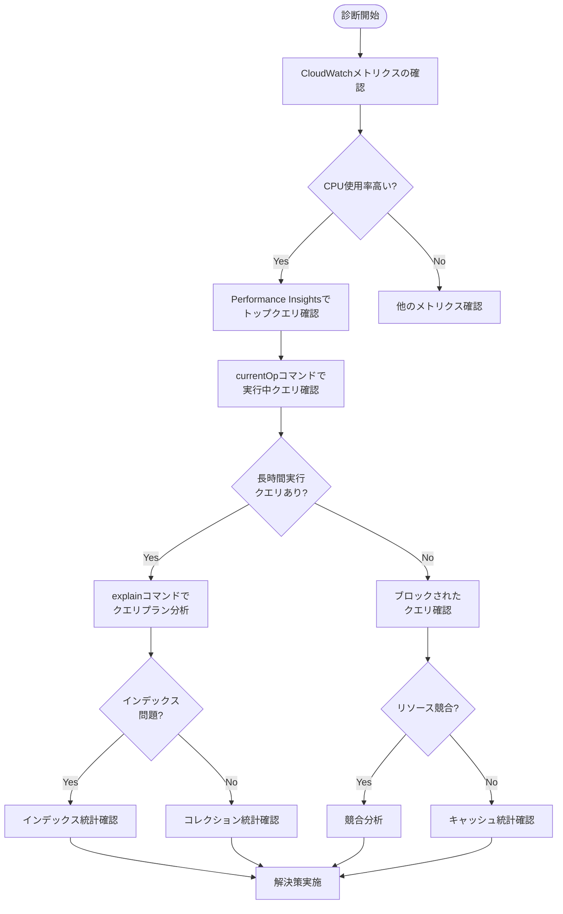

 # [Amazon DocumentDB ユーザー診断ガイド](https://docs.aws.amazon.com/ja_jp/documentdb/latest/developerguide/user_diagnostics.html)

## 概要

このガイドでは、Amazon DocumentDBのパフォーマンス問題を診断するための詳細な手法を提供します。システムの状態を把握し、パフォーマンス低下の原因を特定するための様々な診断コマンドとその解釈方法について説明します。

## システム診断の基本フロー

Amazon DocumentDBのパフォーマンス問題を診断する際は、以下の基本フローに従うことで効率的に原因を特定できます。



## キャッシュパフォーマンス分析

キャッシュのパフォーマンスを分析することで、データ取得の効率とシステムパフォーマンスを把握できます。分析は、キャッシュとディスクから読み取られるデータの量に基づいています。

特定のコレクションのキャッシュ統計は、以下のコマンドで確認できます：

```javascript
db.collection.stats()
```

このコマンドの出力の `cacheStats` フィールドには、以下の重要な情報が含まれています：

* **collBlksHit**: このコレクションの操作中にキャッシュから読み取られたブロック数
* **collBlksRead**: このコレクションの操作中にディスクから読み込まれた（キャッシュミス）ブロック数
* **collHitRatio**: このコレクションのキャッシュヒット率（100 * [collBlksHit / (collBlksHit + collBlksRead)]）
* **idxBlksHit**: このコレクションで作成されたインデックスのキャッシュから読み取られたブロック数
* **idxBlksRead**: このコレクションで作成されたインデックスのディスクから読み込まれた（キャッシュミス）ブロック数
* **idxHitRatio**: このコレクションで作成されたインデックスのキャッシュヒット率（100 * [idxBlksHit / (idxBlksHit + idxBlksRead)]）

キャッシュヒット率が低い場合（90%未満）、インスタンスのメモリサイズが作業データセットに対して不十分である可能性があります。この場合、インスタンスタイプのスケールアップを検討するか、不要なインデックスを削除してメモリ使用量を最適化することが推奨されます。

各インデックスのキャッシュ統計をより詳細に確認するには、以下のコマンドを使用します：

```javascript
db.collection.aggregate([{$indexStats:{}}]).pretty()
```

## クエリ診断

### 長時間実行クエリの特定と終了

長時間実行されているクエリやブロックされているクエリを特定するには、`currentOp`コマンドを使用します。以下のクエリは、10秒以上実行されているか、リソースを待機しているすべてのクエリをリストします：

```javascript
db.adminCommand({
    aggregate: 1,
    pipeline: [
        {$currentOp: {}},
        {$match: 
            {$or: [
                {secs_running: {$gt: 10}},
                {WaitState: {$exists: true}}]}},
        {$project: {_id:0, opid: 1, secs_running: 1, WaitState: 1, blockedOn: 1, command: 1}}],
    cursor: {}
});
```

問題のあるクエリを特定したら、そのクエリの`opid`を使用して終了できます：

```javascript
db.adminCommand({killOp: 1, op: <opid>});
```

### クエリの進捗状況モニタリング

クエリの進捗状況を監視するには、上記の`currentOp`コマンドを定期的に実行し、`secs_running`フィールドの値が増加しているかどうかを確認します。値が増加している場合、クエリは進行中です。

クエリが`WaitState`フィールドを持っている場合、そのクエリはリソースの競合によってブロックされています。`WaitState`の値は、クエリがどのようなリソースを待っているかを示します：

* **CollectionLock**: コレクションロックを待機中
* **Latch**: 内部ラッチを待機中
* **SystemLock**: システムロックを待機中
* **BufferLock**: バッファロックを待機中
* **IO**: I/O操作の完了を待機中
* **BackgroundActivity**: バックグラウンドアクティビティの完了を待機中

`blockedOn`フィールドがある場合、そのフィールドの値は、このクエリをブロックしている操作の`opid`を示します。

### クエリプランの最適化

クエリの実行が遅い場合、`explain`コマンドを使用してクエリプランを分析し、最適化の機会を特定できます：

```javascript
db.runCommand({explain: {<query document>}})
```

例えば、以下のようなクエリのプランを確認できます：

```javascript
db.runCommand({explain:{
    aggregate: "sample-document",
    pipeline: [{$match: {x: {$eq: 1}}}],
    cursor: {batchSize: 1}}
});
```

出力に`"COLLSCAN"`が含まれている場合、クエリはコレクション全体をスキャンしており、適切なインデックスを作成することでパフォーマンスを向上できる可能性があります。

## コレクション操作統計

特定のコレクションに対して実行された挿入、更新、削除操作の数を確認するには、以下のコマンドを使用します：

```javascript
db.collection.stats()
```

このコマンドの出力の`opCounter`フィールドには、以下の情報が含まれています：

* **numDocsIns**: このコレクションに挿入されたドキュメントの数
* **numDocsUpd**: このコレクションで更新されたドキュメントの数
* **numDocsDel**: このコレクションから削除されたドキュメントの数

また、同じ出力の他のフィールドから、以下の情報も確認できます：

* **collScans**: コレクションに対して実行されたフルスキャンの数
* **idxScans**: インデックスを使用したスキャンの数

これらの統計情報は、クラスターの再起動やインスタンスのスケーリング操作によってリセットされるため、`lastReset`フィールドの値を確認して、統計情報が収集された期間を把握することが重要です。

## Elastic Cluster診断

### Elastic Clusterのクエリプラン分析

Elastic Clusterのクエリプランを分析するには、標準クラスターと同様に`explain`コマンドを使用しますが、出力の解釈が異なります：

```javascript
db.runCommand({explain: {find: "collection", filter: {"field": "value"}}})
```

Elastic Clusterの`explain`出力には、以下のような階層構造が含まれます：

1. **elasticPlannerVersion**: Elastic Clusterのプランナーバージョン
2. **winningPlan**: 選択されたクエリプラン
   - **stage**: クエリの実行ステージ（例：`"SINGLE_SHARD"`）
   - **shards**: 各シャードの詳細情報
     - **shardName**: シャードの識別子
     - **plannerVersion**: シャード内のプランナーバージョン
     - **winningPlan**: シャード内の実行プラン
       - **stage**: シャード内の実行ステージ（例：`"PARTITION_MERGE"`）
       - **inputStages**: 入力ステージの配列
         - **stage**: 入力ステージのタイプ（例：`"COLLSCAN"`, `"IXSCAN"`）
         - **partitionCount**: パーティション数

各シャードの`"COLLSCAN"`ステージは、そのシャード内でインデックスが使用されていないことを示します。シャードキーの選択とインデックス作成を見直すことで、パフォーマンスを向上できる可能性があります。

## システム全体のモニタリング

### システム使用状況の分析

システムの使用状況を分析するには、以下のコマンドを使用して、各名前空間で実行されているクエリとオペレーションの数をカウントします：

```javascript
db.adminCommand({aggregate: 1,
                 pipeline: [{$currentOp: {allUsers: true, idleConnections: true}},
                            {$group: {_id: {desc: "$desc", ns: "$ns", WaitState: "$WaitState"}, count: {$sum: 1}}}],
                 cursor: {}
                });
```

この出力を定期的に監視することで、システムの負荷パターンを把握し、リソース競合の原因を特定できます。

### インデックス使用状況の分析

インデックスの使用状況を分析し、未使用のインデックスを特定するには、以下のコマンドを使用します：

```javascript
db.collection.aggregate([{$indexStats:{}}]).pretty()
```

このコマンドは、各インデックスの使用状況に関する以下の情報を提供します：

* **name**: インデックスの名前
* **key**: インデックスのキー
* **host**: ホスト名
* **accesses**: アクセス統計
  * **ops**: インデックスを使用した操作の数
  * **since**: 統計収集の開始時間

未使用のインデックスを特定したら、それらを削除することで書き込みパフォーマンスを向上させ、メモリ使用量を最適化できます。

### 欠落しているインデックスの特定

欠落しているインデックスを特定するには、プロファイラーを有効にし、実行時間の長いクエリを監視します：

```javascript
db.setProfilingLevel(1, 100)  // 100ms以上かかるクエリをプロファイリング
```

プロファイラーのログを確認し、`COLLSCAN`ステージを含むクエリを特定します：

```javascript
db.system.profile.find({millis: {$gt: 100}, "planSummary": /COLLSCAN/}).sort({ts: -1})
```

これらのクエリに対して`explain`を実行し、適切なインデックスを作成することでパフォーマンスを向上させることができます。

## 便利な診断クエリ集

以下に、Amazon DocumentDBの診断に役立つクエリをまとめました：

### 1. 実行中のすべての操作をリスト

```javascript
db.adminCommand({currentOp: 1, $all: 1});
```

### 2. 長時間実行クエリの特定

```javascript
db.adminCommand({
    aggregate: 1,
    pipeline: [
        {$currentOp: {}},
        {$match: {secs_running: {$gt: 10}}},
        {$project: {_id:0, opid: 1, secs_running: 1, ns: 1, command: 1}}],
    cursor: {}
});
```

### 3. ブロックされているクエリの特定

```javascript
db.adminCommand({
    aggregate: 1,
    pipeline: [
        {$currentOp: {}},
        {$match: {WaitState: {$exists: true}}},
        {$project: {_id:0, opid: 1, WaitState: 1, blockedOn: 1, command: 1}}],
    cursor: {}
});
```

### 4. 名前空間ごとの操作数

```javascript
db.adminCommand({
    aggregate: 1,
    pipeline: [
        {$currentOp: {allUsers: true, idleConnections: true}},
        {$group: {_id: "$ns", count: {$sum: 1}}},
        {$sort: {count: -1}}],
    cursor: {}
});
```

### 5. ガベージコレクション活動の監視

```javascript
db.adminCommand({
    aggregate: 1,
    pipeline: [
        {$currentOp: {allUsers: true}},
        {$match: {desc: "GARBAGE_COLLECTION"}},
        {$project: {_id:0, garbageCollection: 1, secs_running: 1}}],
    cursor: {}
});
```

これらの診断クエリを活用することで、Amazon DocumentDBのパフォーマンス問題をより効果的に特定し、解決することができます。
