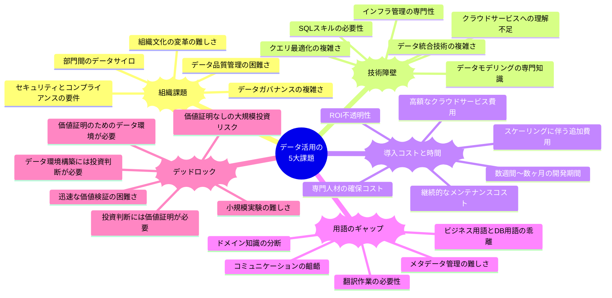

## データ活用における現代の課題とWren AIによる新しいアプローチ

## データ統合と分析の従来の課題
企業がデータ駆動型の意思決定を目指す中で、データ活用には複数の重大な障壁が存在します。これらの障壁は、組織がデータの真の価値を引き出し、競争優位性を確立する能力を著しく制限しています。

### 組織課題
多くの企業では、部門間のデータサイロが形成され、情報の共有と統合が困難になっています。各部門が独自のデータ管理方法を持ち、全社的な視点でのデータ活用が阻害されています。また、データガバナンスの複雑さも大きな課題です。データの品質、セキュリティ、コンプライアンスを確保するためのポリシーと手順を確立し維持することは、多大なリソースを必要とします。さらに、組織文化の変革も容易ではなく、データドリブンな意思決定への移行には、従来の直感や経験に基づく意思決定からの大きな転換が求められます。

### 技術障壁
データ活用の技術的な側面も大きな障壁となっています。SQLやデータモデリングなどの専門知識は、一般的なビジネスユーザーには馴染みがなく、データへのアクセスと分析を困難にしています。クエリの最適化や複雑なデータ変換も専門的なスキルを要します。さらに、クラウドサービスへの理解も大きな課題です。AWSやAzure、GCPなどのクラウドプラットフォームは強力なデータ処理能力を提供しますが、これらのサービスを効果的に利用するには専門知識が必要です。多くのビジネスユーザーはデータを見たいだけであり、クラウドインフラストラクチャの複雑さや、どのクエリが安全で効率的かといった技術的詳細には関心がありません。

### 導入コストと時間
データインフラストラクチャの構築には、多大な初期投資と継続的なメンテナンスコストが伴います。高額なクラウドサービス費用、専門人材の確保、ハードウェアとソフトウェアのライセンス費用などが含まれます。また、データパイプラインの構築には数週間から数ヶ月の時間がかかり、ビジネスニーズに迅速に対応することが難しくなります。さらに、投資対効果（ROI）の不透明性も大きな課題です。データインフラへの投資がどのようなビジネス価値をもたらすかを事前に定量化することは困難であり、投資判断を複雑にしています。

### 用語のギャップ
ビジネス用語とデータベース用語の間には大きなギャップが存在します。データベース内のテーブル名やフィールド名は技術的な命名規則に従っていることが多く、ビジネスユーザーにとって直感的に理解できるものではありません。このギャップにより、ビジネスユーザーとデータ専門家の間でコミュニケーションの齟齬が生じ、要件の誤解や分析結果の誤った解釈につながることがあります。また、ドメイン知識の分断も問題です。ビジネスコンテキストを理解しているユーザーとデータ構造を理解している技術者が別々に存在することで、データの真の価値を引き出すことが難しくなります。

### デッドロック
おそらく最も深刻な課題は、データ活用における「デッドロック」の状況です。経営層はデータに基づいた意思決定を行いたいと考えていますが、適切なデータ環境を構築するには相当な投資が必要です。しかし、その投資判断を行うためには、データ活用がもたらす具体的な価値を示す必要があります。一方、データ活用の価値を示すためには、まずデータ環境を構築する必要があります。この循環的な問題により、多くの組織はデータ活用の第一歩を踏み出せずにいます。データチームは価値を証明するために環境構築を進めたいが投資が必要、経営層は投資判断のために価値の証明が必要、という袋小路に陥っているのです。

確かに、SnowflakeやSageMaker Unified Studioなどの最新のクラウドサービスは、これらの問題の一部を緩和することができます。しかし、これらのソリューションを導入するには相当な初期投資と専門知識が必要であり、気軽に試すにはハードルが高いものです。多くの組織では、一連のETL構築やデータウェアハウスに工数と資金を投じる前に、まずは有用なビジネス活用に貢献するデータを早く生み出し、それらの価値を体感したいと考えています。実際のビジネス価値が明確に示されない限り、経営層や現場には、わざわざETLやクラウドサービスで複数の機能を使って組み合わせる工数をかけるモチベーションが発生しません。このような「価値証明」なしに大規模なデータインフラ投資を正当化することは、特に中小企業や予算制約のある部門では困難です。

## Wren AIが提案する新しいデータアクセスパラダイム
Wren AIは、これらの課題に対して根本的に異なるアプローチを提案しています。従来の「データを一箇所に集める」という考え方から脱却し、「必要なときに必要なデータにアクセスする」というパラダイムシフトを実現します。

このアプローチでは、まずWren AIがユーザーの自然言語クエリを理解し、必要なデータソースを特定します。次に、それぞれのデータソースに対して適切な権限で直接アクセスし、スキーマ情報を動的に取得します。重要なのは、このプロセスでビジネス用語とデータベース用語のマッピングが行われることです。ユーザーが「顧客生涯価値」について質問した場合、システムはこれが技術的には「customer_ltv」テーブルの「value_usd」カラムを参照していることを理解します。

複数のデータソースにまたがる質問に対しては、Wren AIは各ソースに対して最適化されたSQLクエリを生成し、結果をリアルタイムで統合します。これは実質的に「ライブETL」として機能し、事前に大規模なデータ統合を行う必要がなくなります。例えば、「先月の地域別売上と顧客満足度の相関関係」という質問に対して、売上データはトランザクションデータベースから、顧客満足度データはCRMシステムから取得し、その場で分析を行うことができます。

このアプローチの利点は、データの鮮度が常に最新であること、セキュリティが向上すること（データは必要な時だけアクセスされ、一元管理されない）、そして何より、ETLプロセスの構築と維持に関連する膨大なオーバーヘッドが削減されることです。ビジネスユーザーは技術的な詳細を気にすることなく、自然な言葉でデータにアクセスし、インサイトを得ることができます。

さらに、Wren AIは使用パターンから学習し、頻繁に使用されるデータパスやクエリパターンを最適化することができます。これにより、時間の経過とともにシステムのパフォーマンスと応答性が向上し、ユーザーエクスペリエンスがさらに改善されます。

このビジョンは、データ民主化の真の姿を体現しています。技術的な障壁を取り除き、組織内の誰もがデータの力を活用できるようにすることで、より迅速で情報に基づいた意思決定が可能になります。Wren AIのアプローチは、データ活用の未来を形作る重要な一歩となるでしょう。
