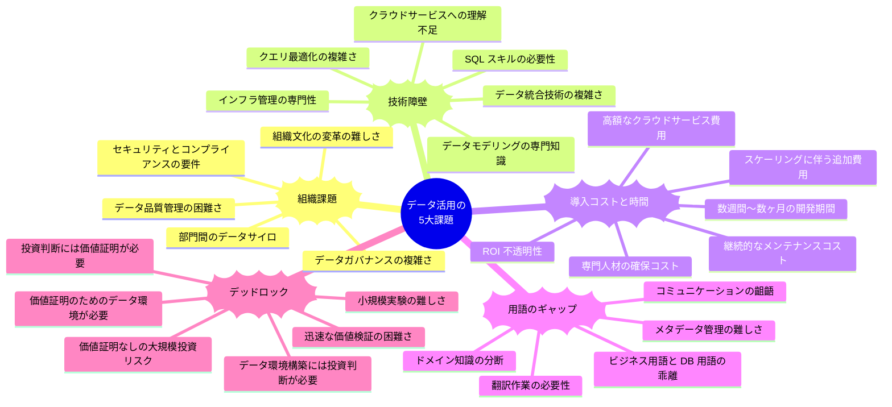

## データ活用における現代の課題とWren AIによる新しいアプローチ



## データ統合と分析の従来の課題
企業がデータ駆動型の意思決定を目指す中で、データ活用には複数の重大な障壁が存在します。これらの障壁は、組織がデータの真の価値を引き出し、競争優位性を確立する能力を著しく制限しています。

### 組織課題
多くの企業では、部門間のデータサイロが形成され、情報の共有と統合が困難になっています。各部門が独自のデータ管理方法を持ち、全社的な視点でのデータ活用が阻害されています。また、データガバナンスの複雑さも大きな課題です。データの品質、セキュリティ、コンプライアンスを確保するためのポリシーと手順を確立し維持することは、多大なリソースを必要とします。さらに、組織文化の変革も容易ではなく、データドリブンな意思決定への移行には、従来の直感や経験に基づく意思決定からの大きな転換が求められます。

### 技術障壁
データ活用の技術的な側面も大きな障壁となっています。SQL やデータモデリングなどの専門知識は、一般的なビジネスユーザーには馴染みがなく、データへのアクセスと分析を困難にしています。クエリの最適化や複雑なデータ変換も専門的なスキルを要します。さらに、クラウドサービスへの理解も大きな課題です。Amazon Web Services (AWS) は強力なデータ処理能力を提供しますが、これらのサービスを効果的に利用するには専門知識が必要です。多くのビジネスユーザーはデータを見たいだけであり、クラウドインフラストラクチャの複雑さや、どのクエリが安全で効率的かといった技術的詳細には関心がありません。

### 導入コストと時間
データインフラストラクチャの構築には、多大な初期投資と継続的なメンテナンスコストが伴います。クラウドサービス費用、専門人材の確保、ハードウェアとソフトウェアのライセンス費用などが含まれます。また、データパイプラインの構築には数週間から数ヶ月の時間がかかり、ビジネスニーズに迅速に対応することが難しくなります。さらに、投資対効果（ROI）の不透明性も大きな課題です。データインフラへの投資がどのようなビジネス価値をもたらすかを事前に定量化することは困難であり、投資判断を複雑にしています。

### 用語のギャップ
ビジネス用語とデータベース用語の間には大きなギャップが存在します。データベース内のテーブル名やフィールド名は技術的な命名規則に従っていることが多く、ビジネスユーザーにとって直感的に理解できるものではありません。このギャップにより、ビジネスユーザーとデータ専門家の間でコミュニケーションの齟齬が生じ、要件の誤解や分析結果の誤った解釈につながることがあります。また、ドメイン知識の分断も問題です。ビジネスコンテキストを理解しているユーザーとデータ構造を理解している技術者が別々に存在することで、データの真の価値を引き出すことが難しくなります。

### デッドロック
おそらく最も深刻な課題は、データ活用における「デッドロック」の状況です。経営層はデータに基づいた意思決定を行いたいと考えていますが、適切なデータ環境を構築するには相当な投資が必要です。しかし、その投資判断を行うためには、データ活用がもたらす具体的な価値を示す必要があります。一方、データ活用の価値を示すためには、まずデータ環境を構築する必要があります。この循環的な問題により、多くの組織はデータ活用の第一歩を踏み出せずにいます。データチームは価値を証明するために環境構築を進めたいが投資が必要、経営層は投資判断のために価値の証明が必要、という袋小路に陥っているのです。

確かに、Snowflake や Amazon SageMaker Unified Studio などの最新のクラウドサービスは、これらの問題の一部を緩和することができます。しかし、これらのソリューションを導入するには相当な初期投資と専門知識が必要であり、気軽に試すにはハードルが高いものです。多くの組織では、一連の ETL 構築やデータウェアハウスに工数と資金を投じる前に、まずは有用なビジネス活用に貢献するデータを早く生み出し、それらの価値を体感したいと考えています。実際のビジネス価値が明確に示されない限り、経営層や現場には、わざわざ ETL やクラウドサービスで複数の機能を使って組み合わせる工数をかけるモチベーションが発生しません。このような「価値証明」なしに大規模なデータインフラ投資を正当化することは、特に中小企業や予算制約のある部門では困難です。

## Wren AI とは

Wren AI は、自然言語でデータベースにクエリを実行し、正確な SQL（Text-to-SQL）、チャート（Text-to-Charts）、AI 生成のインサイトを数秒で取得できる GenBI（Generative Business Intelligence）エージェントです。複数のコンポーネントから構成される包括的なプラットフォームとして、データ活用の課題を解決します。

### Wren AI の主要コンポーネント

1. **Wren Engine**: Wren AI の中核となるセマンティックエンジンです。ビジネスコンテキストを理解し、データソースとのマッピングを行います。Model Context Protocol (MCP) クライアントと AI エージェントのためのセマンティックレイヤーを提供し、ビジネス用語とデータベース構造の橋渡しをします。Apache DataFusion をベースにした強力なクエリエンジンを内蔵しており、複雑なデータ変換や集計を効率的に処理します。

2. **Wren AI Service**: ベクトルデータベースを使用してクエリを処理し、LLM が正確な SQL を生成するよう導きます。自然言語クエリをビジネスコンテキストに基づいて解釈し、適切なデータソースを特定します。RAG（Retrieval Augmented Generation）技術を活用して、より正確な結果を提供します。

3. **Wren UI**: ユーザーフレンドリーなインターフェースを提供し、自然言語でのデータ探索と分析を可能にします。生成された SQL クエリ、チャート、インサイトを視覚的に表示し、ユーザーがデータとインタラクティブにやり取りできる環境を提供します。

4. **Ibis Server**: 様々なデータソース（PostgreSQL、MySQL、DuckDB など）への接続を担当するコネクタとして機能します。統一された API インターフェースを通じて、異なるデータベースシステムとシームレスに連携します。

5. **Qdrant**: ベクトルデータベースとして、コンテキスト検索と意味理解をサポートします。自然言語クエリとビジネスコンテキストの効率的なマッチングを実現します。

これらのコンポーネントが連携することで、Wren AI は以下の課題を解決します：

- **技術的障壁の解消**: 自然言語インターフェースにより、SQL 知識がなくてもデータにアクセス可能
- **用語のギャップの解消**: ビジネス用語とデータベース用語の自動マッピング
- **導入時間の短縮**: 既存のデータソースに直接接続し、数日以内に価値を示すことが可能
- **組織間の協力促進**: 共通の言語基盤を提供し、部門間のデータ共有を促進
- **デッドロックの解消**: 小規模から始め、価値を証明しながら段階的に拡大可能


## データ活用の5大課題に対するWren AIとMCPによる包括的解決策

### 組織課題への解決策
組織内のデータ活用において、部門間のデータサイロや複雑なデータガバナンスが大きな障壁となっています。Wren AI はこの課題に対して、データを一箇所に集約するという集約型アプローチを根本から変えます。

Wren AI を活用することで、各部門のデータをその場所に残したまま、必要に応じて横断的にアクセスできるようになります。例えば、マーケティング部門のデータベースと営業部門の CRM データを物理的に統合することなく、両方のデータを組み合わせた分析が可能になります。

もちろん、組織のデータ活用成熟度が向上するにつれて、レイクハウスアプローチなどの集約型アプローチに移行することが適切なケースもあります。しかし、多くの組織では、認証認可の仕組みがシステムごとに散らばっていたり、マスキングルールなども含めてデータを集めること自体に大きなハードルがあります。そのため、まずは分散型のアプローチで実験を早く回し、価値を証明することが重要です。

さらに、Model Context Protocol (MCP) の導入により、この能力は大幅に強化されます。MCP は、AI モデルが外部システムと通信するための標準化された仕組みです。わかりやすく言えば、AI とデータベースやツールを接続する「共通言語」のようなものです。これにより、異なる部門が使用している様々なシステムやデータベースに対して、統一された方法でアクセスできるようになります。

例えば、営業チームが「先月の地域別売上トップ 10 と、それぞれの顧客満足度スコアを教えて」と質問した場合、Wren AI と MCP の組み合わせにより、売上データベースと顧客満足度調査データを自動的に結びつけて分析することができます。これにより、組織全体のデータ活用が促進され、部門間の協力も自然と強化されます。

### 技術障壁への解決策
データ活用における技術的な障壁は、多くの企業にとって大きな課題です。SQL やデータモデリングの専門知識、クラウドサービスへの理解不足などが、データの価値を引き出す妨げとなっています。

Wren AI はこの課題に対して、自然言語でデータにアクセスできる革新的な仕組みを提供します。ユーザーは「先月の新規顧客獲得数を地域別に教えて」のように、日常会話のような言葉で質問するだけで、複雑なデータ分析が可能になります。裏側では、Wren AI がこの質問を適切な SQL クエリに変換し、必要なデータを取得します。

特に重要なのは、Wren AI が単に SQL を生成するだけでなく、ビジネスの文脈を理解した上でデータを解釈する点です。例えば、「顧客生涯価値が高い顧客セグメントを教えて」という質問に対して、Wren AI は「顧客生涯価値」という概念を理解し、それを計算するための正確なデータと計算式を特定します。これは、Wren AI が持つ「ビジネスコンテキスト理解機能」によるものです。

Wren Engine MCP Server と組み合わせることで、この技術的な障壁の解消はさらに進みます。従来は複雑なデータベースコネクターの設定や ETL（抽出・変換・ロード）プロセスの構築が必要でしたが、MCP サーバーを介することで、これらの技術的な複雑さが隠蔽されます。ユーザーはクラウドの技術的詳細を気にすることなく、データの価値に集中できるようになります。

セキュリティ面でも、Amazon EC2 などのクラウド環境に MCP 利用のための環境を構築することで、ローカルパソコンからの直接アクセスによるリスクを回避しながら、安全にデータを活用することができます。AWS 環境でのセキュアな MCP 実装については、AWS AI Coding Workshop のガイドが参考になります。

### 導入コストと時間への解決策
データ活用基盤の構築には、従来、多大な初期投資と時間が必要でした。データウェアハウスの構築、ETL プロセスの開発、専門人材の確保など、数週間から数ヶ月の時間と相当なコストがかかります。

Wren AI と MCP の組み合わせは、この課題に対して画期的な解決策を提供します。従来のデータウェアハウス構築と ETL プロセスの代わりに、既存のデータソースに直接接続することで、導入時間を数週間から数日に短縮します。

具体的には、Wren AI が提供する「ビジネスデータ理解機能」により、データの意味や関係性を定義するプロセスが大幅に簡素化されます。例えば、「売上」という概念が複数のデータベースで異なる名前や計算方法で存在する場合、Wren AI はこれらを統一的に扱うための定義を簡単に作成できます。これにより、複雑な ETL 処理を構築することなく、一貫したデータ分析が可能になります。

MCP サーバーを活用することで、既存の AI アシスタント（Claude、Cline、Cursor など）から Wren AI の機能にアクセスできるようになります。これは、USB ポートのように様々なデバイスを接続できる標準インターフェースのようなものです。企業は既に使い慣れている AI ツールを活用しながら、Wren AI の高度なデータ分析機能を利用できるため、追加の学習コストを最小限に抑えることができます。

さらに、クラウド環境での MCP 実装により、必要に応じて柔軟にリソースを調整できるため、初期投資を抑えながら段階的に拡大していくことが可能です。これにより、投資対効果（ROI）の不透明性という課題も解消されます。

### 用語のギャップへの解決策
ビジネス用語とデータベース用語の間のギャップは、データ活用における大きな障壁です。例えば、マーケティング担当者が「コンバージョン率」について質問したい場合、データベースでは「conversion_rate」や「cvr」など技術的な名称で保存されていることがあります。

Wren AI はこの課題に対して、ビジネス用語とデータベース用語を橋渡しする「言語理解レイヤー」を提供します。このレイヤーにより、ユーザーは自分の普段使っている言葉でデータについて質問できるようになります。

具体的には、Wren AI がビジネス用語とデータベース構造の対応関係を学習し、自動的にマッピングします。例えば、ユーザーが「新規顧客の平均購入額」について質問すると、システムはこれが「new_customers」テーブルの「avg_order_value」カラムを参照していることを自動的に理解します。

さらに重要なのは、Wren AI が単純な用語の置き換えだけでなく、ビジネスロジックも理解する点です。例えば、「利益率」という概念が「(売上 - コスト) / 売上」という計算式で定義される場合、Wren AI はこの計算ロジックを理解し、適切なデータを組み合わせて結果を導き出します。

MCP と組み合わせることで、この言語理解レイヤーは様々な AI アシスタントから利用可能になります。ユーザーは自分の好みの AI ツールを使いながら、一貫したビジネス言語でデータにアクセスできるようになります。これにより、組織全体で共通の言語基盤が確立され、部門間のコミュニケーションが円滑になります。

### デッドロックへの解決策
データ活用における最も深刻な課題は「デッドロック」の状況です。経営層はデータに基づいた意思決定を行いたいと考えていますが、適切なデータ環境を構築するには相当な投資が必要です。しかし、その投資判断を行うためには、データ活用がもたらす具体的な価値を示す必要があります。この循環的な問題により、多くの組織はデータ活用の第一歩を踏み出せずにいます。

Wren AI と MCP の組み合わせは、このデッドロックを解消するための画期的なアプローチを提供します。従来のように大規模なデータインフラを先に構築するのではなく、「まず価値を示し、それから拡大する」というモデルを実現します。

具体的には、MCP サーバーを介して既存のデータソースに直接接続することで、数日以内に初期の価値を示すことができます。例えば、マーケティングデータと販売データを組み合わせた簡単な分析から始め、その価値を証明した後に、より多くのデータソースや高度な分析へと段階的に拡大していくことができます。

特に Amazon EC2 などのクラウド環境に MCP サーバーを構築することで、セキュリティを確保しながら迅速に実証実験を行うことが可能です。これにより、大規模な投資判断を行う前に、データ活用の具体的な価値を経営層に示すことができます。

例えば、「新規顧客獲得コストと顧客生涯価値の関係を分析したい」というビジネス課題がある場合、従来のアプローチでは複数のデータソースを統合するための ETL プロセスを構築し、データウェアハウスを設計・実装する必要がありました。しかし、Wren AI と MCP を活用すれば、既存のデータソースに直接接続し、数日以内に初期分析結果を得ることができます。この結果に基づいて投資判断を行い、段階的に対象範囲を拡大していくことができるのです。

このアプローチにより、「価値を示すためにはデータ環境が必要、データ環境を構築するには投資判断が必要、投資判断には価値証明が必要」という循環的な問題から脱却し、データ活用の真の価値を解放することができます。

### Wren AIとMCPによる具体的な価値創出例
Wren AI と MCP の組み合わせがもたらす価値をより具体的に理解するために、いくつかの実例を見てみましょう。

**営業部門での活用例**
営業マネージャーが「先月の地域別売上トップ 10 と、それぞれの顧客満足度スコアを教えて」と質問します。従来であれば、この質問に答えるためには、売上データベースと顧客満足度調査データを手動で結合し、分析する必要がありました。

Wren AI と MCP を活用すると、この質問を自然言語で入力するだけで、システムが自動的に:

「売上」と「顧客満足度」の概念を理解し、関連するデータソースを特定
適切な SQL クエリを生成して各データベースに問い合わせ
結果を統合して意味のあるインサイトを提供
グラフやチャートで視覚的に表現
という一連のプロセスを実行します。営業マネージャーは技術的な知識がなくても、データに基づいた意思決定を迅速に行うことができます。

**マーケティング部門での活用例**
マーケティング担当者が「コンバージョン率が最も高いキャンペーンとそのターゲット層の特徴を教えて」と質問します。Wren AI は:

「コンバージョン率」と「キャンペーン」の関係を理解
各キャンペーンのコンバージョン率を計算
最も高いキャンペーンを特定
そのキャンペーンのターゲット層のデータを分析
特徴的なパターンを抽出
という複雑な分析を自動的に行います。これにより、マーケティング担当者はデータサイエンティストの支援なしに、データドリブンなキャンペーン最適化が可能になります。

**経営層での活用例**
CFO が「今四半期の部門別利益率と前年同期比を教えて」と質問します。Wren AI は:

「利益率」の計算方法を理解（売上からコストを引き、売上で割る）
各部門のデータを集計
今年と前年のデータを比較
変化率を計算
重要なインサイトをハイライト
という分析を即座に実行します。経営層は複雑な BI ツールを操作することなく、重要な経営指標をリアルタイムで把握できるようになります。

| 課題 | 集約型アプローチ | Wren AI + MCPの解決策 | 主な利点 |
|------|----------------|---------------------|--------|
| 組織課題 | データサイロの統合、集中型データガバナンス構築 | MCPによる標準化されたデータアクセス、Wren Engineによるセマンティックレイヤー | ・部門間データの横断的活用・既存組織構造を尊重・統一されたデータアクセス標準 |
| 技術障壁 | SQL・データモデリングスキル、複雑なETL、コネクター設定 | 自然言語インターフェース、MCPによる抽象化、クラウド環境でのセキュアな実装 | ・技術知識不要でアクセス可能・複雑なコネクター設定不要・AWS 環境でのセキュアな実装 |
| 導入コストと時間 | 大規模ETL構築、データウェアハウス投資、専門人材確保 | MCPサーバーによる直接接続、Wren Engineのセマンティックモデリング | ・導入期間の大幅短縮・初期投資の最小化・段階的拡張による投資効率化 |
| 用語のギャップ | 手動マッピング、データディクショナリ作成、翻訳レイヤー | Wren Engineのセマンティックレイヤー、リアルタイムSQL書き換え | ・ビジネス用語での質問が可能・一貫したデータ解釈・部門間の共通言語基盤 |
| デッドロック | 大規模投資→価値証明の循環、リスクの高い初期投資 | クラウド環境でのMCP実装、小規模実証→価値証明→段階的拡大 | ・迅速な価値検証・セキュアな実証環境・成功事例の横展開容易 |

```mermaid
mindmap
  root((データ活用の<br>解決策))
    ))組織課題の解決((
      ::icon(fa fa-users)
      データサイロを解体せず横断的アクセス
      MCPによる標準化されたデータ連携
      分散型ガバナンスモデルの実現
      段階的なデータ文化の醸成
      部門間の協力促進と知識共有
    ))技術障壁の克服((
      ::icon(fa fa-code)
      自然言語でのデータアクセ
