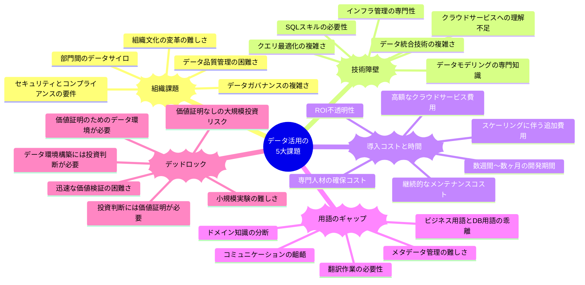
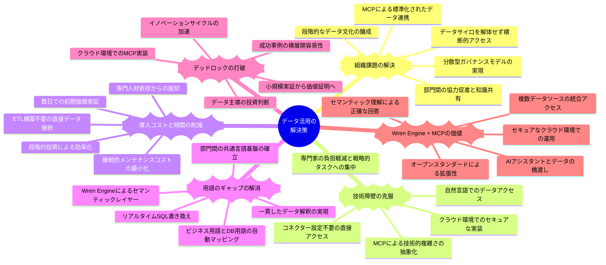

## データ活用における現代の課題とWren AIによる新しいアプローチ

## データ統合と分析の従来の課題
企業がデータ駆動型の意思決定を目指す中で、データ活用には複数の重大な障壁が存在します。これらの障壁は、組織がデータの真の価値を引き出し、競争優位性を確立する能力を著しく制限しています。

### 組織課題
多くの企業では、部門間のデータサイロが形成され、情報の共有と統合が困難になっています。各部門が独自のデータ管理方法を持ち、全社的な視点でのデータ活用が阻害されています。また、データガバナンスの複雑さも大きな課題です。データの品質、セキュリティ、コンプライアンスを確保するためのポリシーと手順を確立し維持することは、多大なリソースを必要とします。さらに、組織文化の変革も容易ではなく、データドリブンな意思決定への移行には、従来の直感や経験に基づく意思決定からの大きな転換が求められます。

### 技術障壁
データ活用の技術的な側面も大きな障壁となっています。SQLやデータモデリングなどの専門知識は、一般的なビジネスユーザーには馴染みがなく、データへのアクセスと分析を困難にしています。クエリの最適化や複雑なデータ変換も専門的なスキルを要します。さらに、クラウドサービスへの理解も大きな課題です。AWSは強力なデータ処理能力を提供しますが、これらのサービスを効果的に利用するには専門知識が必要です。多くのビジネスユーザーはデータを見たいだけであり、クラウドインフラストラクチャの複雑さや、どのクエリが安全で効率的かといった技術的詳細には関心がありません。

### 導入コストと時間
データインフラストラクチャの構築には、多大な初期投資と継続的なメンテナンスコストが伴います。クラウドサービス費用、専門人材の確保、ハードウェアとソフトウェアのライセンス費用などが含まれます。また、データパイプラインの構築には数週間から数ヶ月の時間がかかり、ビジネスニーズに迅速に対応することが難しくなります。さらに、投資対効果（ROI）の不透明性も大きな課題です。データインフラへの投資がどのようなビジネス価値をもたらすかを事前に定量化することは困難であり、投資判断を複雑にしています。

### 用語のギャップ
ビジネス用語とデータベース用語の間には大きなギャップが存在します。データベース内のテーブル名やフィールド名は技術的な命名規則に従っていることが多く、ビジネスユーザーにとって直感的に理解できるものではありません。このギャップにより、ビジネスユーザーとデータ専門家の間でコミュニケーションの齟齬が生じ、要件の誤解や分析結果の誤った解釈につながることがあります。また、ドメイン知識の分断も問題です。ビジネスコンテキストを理解しているユーザーとデータ構造を理解している技術者が別々に存在することで、データの真の価値を引き出すことが難しくなります。

### デッドロック
おそらく最も深刻な課題は、データ活用における「デッドロック」の状況です。経営層はデータに基づいた意思決定を行いたいと考えていますが、適切なデータ環境を構築するには相当な投資が必要です。しかし、その投資判断を行うためには、データ活用がもたらす具体的な価値を示す必要があります。一方、データ活用の価値を示すためには、まずデータ環境を構築する必要があります。この循環的な問題により、多くの組織はデータ活用の第一歩を踏み出せずにいます。データチームは価値を証明するために環境構築を進めたいが投資が必要、経営層は投資判断のために価値の証明が必要、という袋小路に陥っているのです。

確かに、SnowflakeやSageMaker Unified Studioなどの最新のクラウドサービスは、これらの問題の一部を緩和することができます。しかし、これらのソリューションを導入するには相当な初期投資と専門知識が必要であり、気軽に試すにはハードルが高いものです。多くの組織では、一連のETL構築やデータウェアハウスに工数と資金を投じる前に、まずは有用なビジネス活用に貢献するデータを早く生み出し、それらの価値を体感したいと考えています。実際のビジネス価値が明確に示されない限り、経営層や現場には、わざわざETLやクラウドサービスで複数の機能を使って組み合わせる工数をかけるモチベーションが発生しません。このような「価値証明」なしに大規模なデータインフラ投資を正当化することは、特に中小企業や予算制約のある部門では困難です。

## データ活用の5大課題に対するWren AIとMCPによる包括的解決策

### 組織課題への解決策
Wren AIは組織課題に対して、データサイロを解体することなく横断的なアクセスを可能にします。従来のアプローチでは部門間のデータ統合が必要でしたが、Wren AIは各部門のデータをその場所に残したまま、必要に応じて動的にアクセスします。Model Context Protocol(MCP)の導入により、この能力はさらに強化されます。MCPは標準化されたオープンフレームワークとして、AIモデルが外部サービスと一貫性のある安全な方法で通信することを可能にします。これにより、異なる部門のデータソースに対して統一されたインターフェースでアクセスできるようになり、組織全体のデータ活用が促進されます。データガバナンスにおいても、集中型の複雑な構造ではなく、MCPを通じた標準化されたアクセス制御により、セキュリティとコンプライアンスを確保しながら柔軟性を高めることができます。また、組織文化の変革においても、技術的な障壁を下げることで、データドリブンな意思決定を段階的に導入できるようになります。

### 技術障壁への解決策
技術的な障壁に対して、Wren AIとMCPの組み合わせは革新的なソリューションを提供します。ユーザーはSQLやデータモデリングの知識がなくても、日常会話のような言葉でデータに質問できます。MCPの標準化されたインターフェースにより、AIアシスタントは様々なデータソースに簡単に接続できるようになります。従来は複雑なETLプロセスやデータベースコネクターの設定が必要でしたが、MCPサーバーを介することで、これらの技術的な複雑さが抽象化されます。特にWren Engineを搭載したMCPサーバーは、セマンティックレイヤーを提供し、ビジネスコンテキストを理解した上でデータにアクセスすることができます。クラウドサービスへの理解不足という課題に対しても、MCPがインフラストラクチャの複雑さを隠蔽し、ユーザーはクラウドの技術的詳細を気にすることなく、データの価値に集中できます。セキュリティを確保するために、EC2などのクラウド環境にMCP利用のための環境を構築することで、ローカルパソコンからの直接アクセスによるリスクを回避しながら、安全にデータを活用することができます。AWS環境でのセキュアなMCP実装については、AWS AI Coding Workshopのガイドが参考になります。

### 導入コストと時間への解決策
Wren AIとMCPの組み合わせは、導入コストと時間の課題に対して画期的な解決策を提供します。従来のデータウェアハウス構築とETLプロセスの代わりに、MCPサーバーを介して既存のデータソースに直接接続することで、導入時間を数週間から数日に短縮します。特にWren Engineを活用したMCPサーバーは、セマンティックモデリング機能により、複雑なETL構築なしでもビジネスロジック、関係性、メトリクス、KPIを構造化された形式で定義できます。これにより、専門人材の確保コストも大幅に削減されます。継続的なメンテナンスコストについても、MCPの標準化されたアプローチにより、データパイプラインの監視や更新に費やす時間とリソースを最小限に抑えることができます。スケーリングに伴う追加費用についても、クラウド環境でのMCP実装により、必要に応じて柔軟にリソースを調整できます。最も重要なのは、小規模から始めて段階的に拡大できる導入モデルを提供することで、初期投資を抑えながら価値を証明できる点です。MCPの標準化されたアプローチにより、一度構築したソリューションを他の部門や用途にも容易に展開できるため、投資対効果を最大化することができます。

### 用語のギャップへの解決策
Wren AIとWren Engineは用語のギャップという課題に対して、強力なセマンティックレイヤーを提供します。このレイヤーは、ビジネス用語とデータベース用語の間の橋渡しとなり、ユーザーが自然な言葉で質問すると、システムがそれを適切なデータベース構造にマッピングします。MCPと組み合わせることで、このセマンティック機能は様々なAIアシスタントやツールから利用可能になります。例えば、ユーザーがClaudeやClineなどのMCPクライアントを通じて「顧客生涯価値」について質問すると、Wren Engineを搭載したMCPサーバーがこれを「customer_ltv」テーブルの「value_usd」カラムに正確にマッピングします。Wren Engineの「リアルタイムSQL書き換え」機能により、AIが生成したSQLは必要なジョイン、フィルター、計算、アクセス制御を適用して最適化されます。コミュニケーションの齟齬も、共通の言語基盤を提供することで解消され、ビジネスユーザーとデータ専門家の間の翻訳作業が不要になります。ドメイン知識の分断についても、Wren Engineが組織のコンテキストを学習し、業界固有の概念や関係性を理解することで対応します。これにより、組織全体で一貫したデータ解釈が可能になり、部門間のコミュニケーションが円滑になります。

### デッドロックへの解決策
Wren AIとMCPの組み合わせは、データ活用における最も深刻な課題であるデッドロックを解消するための画期的なアプローチを提供します。MCPの標準化されたインターフェースとWren Engineのセマンティック機能により、「まず価値を示し、それから拡大する」というモデルが実現します。従来のアプローチでは、データ環境の構築と価値証明の間の循環的な依存関係が障壁となっていましたが、MCPサーバーを介して既存のデータソースに直接接続することで、数日以内に初期の価値を示すことができます。特にEC2などのクラウド環境にMCPサーバーを構築することで、セキュリティを確保しながら迅速に実証実験を行うことが可能です。これにより、大規模な投資判断を行う前に、データ活用の具体的な価値を経営層に示すことができます。価値が証明された後は、段階的に対象範囲を拡大し、より多くのデータソースや高度なユースケースに対応していくことができます。MCPの拡張性により、一度構築したソリューションを他の部門や用途にも容易に展開できるため、成功事例を組織全体に広げることができます。このアプローチにより、「価値を示すためにはデータ環境が必要、データ環境を構築するには投資判断が必要、投資判断には価値証明が必要」という循環的な問題から脱却し、データ活用の真の価値を解放することができます。

## Wren AIとMCPによる5大課題への包括的解決策一覧表
| 課題 | 従来のアプローチ | Wren AI + MCPの解決策 | 主な利点 |
|------|----------------|---------------------|--------|
| 組織課題 | データサイロの統合、集中型データガバナンス構築 | MCPによる標準化されたデータアクセス、Wren Engineによるセマンティックレイヤー | ・部門間データの横断的活用・既存組織構造を尊重・統一されたデータアクセス標準 |
| 技術障壁 | SQL・データモデリングスキル、複雑なETL、コネクター設定 | 自然言語インターフェース、MCPによる抽象化、クラウド環境でのセキュアな実装 | ・技術知識不要でアクセス可能・複雑なコネクター設定不要・AWS環境でのセキュアな実装 |
| 導入コストと時間 | 大規模ETL構築、データウェアハウス投資、専門人材確保 | MCPサーバーによる直接接続、Wren Engineのセマンティックモデリング | ・導入期間の大幅短縮・初期投資の最小化・段階的拡張による投資効率化 |
| 用語のギャップ | 手動マッピング、データディクショナリ作成、翻訳レイヤー | Wren Engineのセマンティックレイヤー、リアルタイムSQL書き換え | ・ビジネス用語での質問が可能・一貫したデータ解釈・部門間の共通言語基盤 |
| デッドロック | 大規模投資→価値証明の循環、リスクの高い初期投資 | クラウド環境でのMCP実装、小規模実証→価値証明→段階的拡大 | ・迅速な価値検証・セキュアな実証環境・成功事例の横展開容易 |

## Wren EngineとMCPによるデータアクセスの革新
Wren EngineとMCPの組み合わせは、企業のデータ活用に革命をもたらします。従来のデータアクセスでは、複雑なETLプロセスやデータベースコネクターの設定が必要でしたが、MCPサーバーを介することで、これらの技術的な複雑さが抽象化されます。特にWren Engineを搭載したMCPサーバーは、セマンティックレイヤーを提供し、ビジネスコンテキストを理解した上でデータにアクセスすることができます。

重要なのは、MCPがAIモデルと外部サービスの間の「USB-C」のような標準インターフェースとして機能することです。これにより、Claude、Cline、Cursorなどの様々なAIアシスタントから、一貫した方法でデータにアクセスできるようになります。ユーザーは自分の好みのAIアシスタントを使いながら、Wren Engineの強力なセマンティック機能を活用することができます。

セキュリティ面では、ローカルパソコンからのデータアクセスによるリスクを避けるため、EC2などのクラウド環境にMCP利用のための環境を構築することが推奨されます。AWS環境でのセキュアなMCP実装については、AWS AI Coding Workshopのガイドが詳細な手順を提供しています。このアプローチにより、企業のセキュリティポリシーに準拠しながら、革新的なAIデータアクセスを実現することができます。

Wren EngineとMCPの組み合わせにより、企業はETLプロセスの構築やデータウェアハウスへの大規模投資を行う前に、データの価値を迅速に検証し、段階的に拡大していくことができます。これにより、データ活用における「デッドロック」を解消し、真のデータドリブン組織への変革を加速することができるのです。
