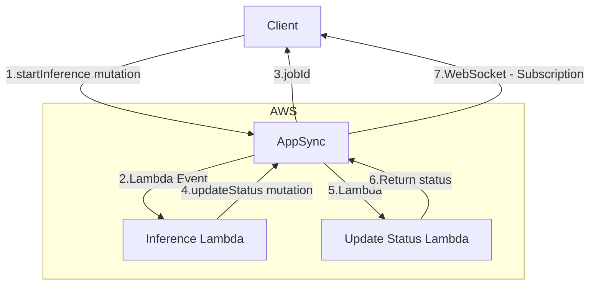
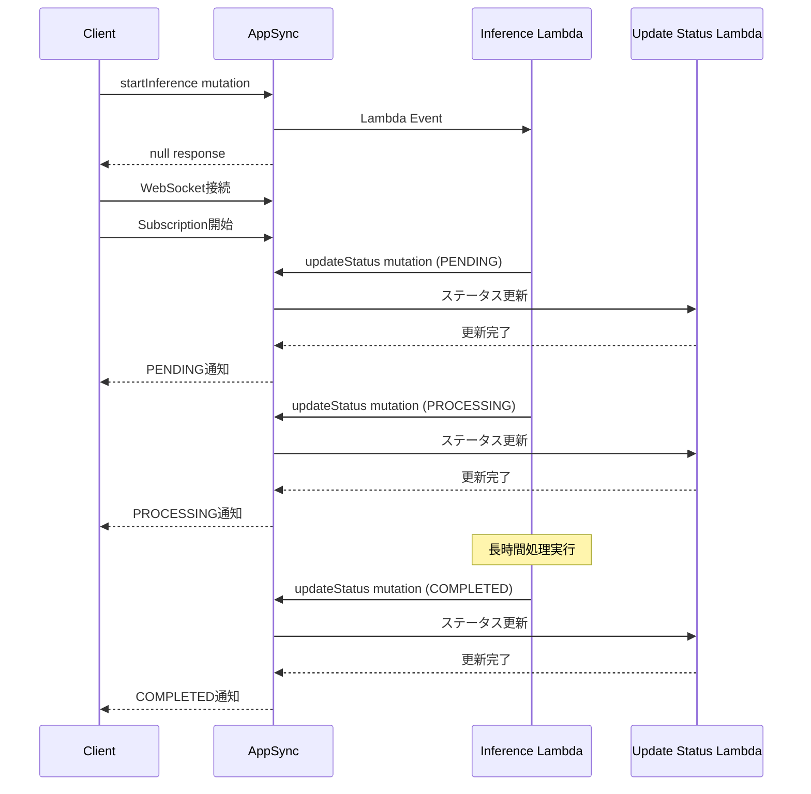

# AppSync Long-Running Process Pattern

## 概要

このプロジェクトは、AWS AppSyncを使用して長時間実行プロセスを処理するためのパターンを実装したものです。AppSyncのSubscription機能とWebSocketを活用することで、非同期処理の状態をリアルタイムに通知する機能を実現しています。例として、Amazon Bedrock での長時間の実行を想定して実装されています。

### 解決する課題

1. AppSyncのタイムアウト制限（30秒）への対応
   - Lambda関数の非同期実行により、タイムアウトを回避
   - 処理状態をリアルタイムに通知

2. 長時間実行処理の状態管理
   - WebSocketを使用したリアルタイム通知
   - 明確な状態遷移（PENDING → PROCESSING → COMPLETED/FAILED）
   - クライアントへの即時レスポンス

3. スケーラブルな設計
   - イベント駆動型アーキテクチャ
   - 疎結合なコンポーネント構成
   - 堅牢なエラーハンドリング

## アーキテクチャ概要

このパターンは以下のような特徴を持っています：

- AppSync GraphQL APIによる統一的なインターフェース提供
- Lambda関数による非同期処理（Event型の呼び出し）
- WebSocketを使用したリアルタイム状態通知
- Cognito認証による安全なアクセス制御
- Lambda Authorizer認可
- シンプルな状態管理（PENDING → PROCESSING → COMPLETED/FAILED）

## Get Started

### 1. 前提条件

- Node.js 18.x以上
- Python 3.11以上
- uv（Pythonパッケージマネージャー）
- AWS CDK CLI

### 2. 環境構築

```bash
# プロジェクトディレクトリに移動
cd aws-samples/machinelearning/ai-gateway/appsync-pattern

# Python依存関係のインストール
uv venv && source .venv/bin/activate
uv sync
```

### 3. Lambda Layer のセットアップ

```bash
# Lambda Layer用の依存関係をインストール
cd cdk/lambda/layers

# Pythonパッケージのインストール（aiohttp, gql）
for d in aiohttp gql; do mkdir -p "$d/python" && pip install -r "$d/requirements.txt" -t "$d/python"; done

# Node.jsパッケージのインストール（jwt）
cd jwt/nodejs && npm install && cd ../../
```

### 4. CDKデプロイ

```bash
# CDKディレクトリに移動して依存関係をインストール
cd ../../ && npm install

# CDKスタックをデプロイ（cdk/ディレクトリで実行）
npx cdk deploy --outputs-file cdk-outputs.json
```

### 5. テスト環境の準備

```bash
# テストディレクトリに移動
cd ../test

# 環境変数の設定
cp .env.sample .env

# .envファイルを編集
# - TEST_USER_EMAIL: Cognitoテストユーザーのメールアドレス
# - TEST_USER_PASSWORD: テストユーザーのパスワード（8文字以上、大小文字、数字、特殊文字を含む）

# Cognitoテストユーザーを作成するスクリプトを実行, .env の設定を元にユーザー作成
uv run create_test_user.py
```

### 6. テストの実行

```bash
# テストディレクトリで実行（uvを使用）
uv run test_graphql_api.py

# 詳細なログ出力を取得する場合
time uv run test_graphql_api.py -v > output.log 2>&1

# Optional:
#   subscription 検証をしたい場合に update mutation をローカルから実行可能
uv run update_status_test.py
```

## 設計方針

### ディレクトリ構造概要

```
.
├── cdk/                    # CDKプロジェクトのルート
│   ├── bin/               # CDKアプリケーションのエントリーポイント
│   ├── graphql/          # GraphQL関連ファイル
│   │   └── schema.graphql # GraphQLスキーマ定義
│   ├── lambda/           # Lambda関数のソースコード
│   │   ├── inference.py  # 推論処理の実装
│   │   └── layers/       # Lambda層
│   │       ├── aiohttp/  # 非同期HTTP通信用ライブラリ（Python）
│   │       ├── gql/      # GraphQLクライアント（Python）
│   │       └── jwt/      # JWT認証（Node.js）
│   └── lib/              # CDKスタックの定義
└── test/                  # テストコード
    ├── test_graphql_api.py   # GraphQL APIテスト
    ├── create_test_user.py   # Congitoテストユーザー作成
    └── test_helpers.py       # テストヘルパー関数
```

### システム構成



### 処理フロー



1. クライアント側
   - startInference mutationの実行
   - WebSocket接続の確立
   - Subscriptionの開始（onInferenceStatusChange）
   - jobIdの受け取り
   - Subscriptionによる状態変更イベントの待ち受け

2. サーバー側
   - AppSyncがstartInference mutationを受け付け
   - Lambda関数を非同期呼び出し（Event型）
   - 即座にクライアントに処理を返却
   - Lambda関数が長時間処理を実行
   - 状態変更をupdateStatus mutation実行で通知
   - updateStatus mutationを受け付けて別のLambd別がステータス通知処理を実行
   - 状態変更をSubscriptionで通知（PENDING → PROCESSING → COMPLETED/FAILED）

## 実装上の注意事項

1. テスト実行時の注意
   - テスト実行前にCDKスタックが正しくデプロイされていることを確認
   - テストユーザーの認証情報が正しく設定されていることを確認
   - WebSocket接続のタイムアウトは6分に設定されています
   - 長時間実行テストはデフォルトでは5分程度かかる設定になっています

3. エラーハンドリング
   - Lambda関数のタイムアウト設定を確認
   - WebSocket接続エラーの適切な処理
   - 認証エラーの確認方法

4. 運用上の注意
   - ログ出力の確認方法
   - リソースの削除方法（npx cdk destroy）
   - コスト管理の注意点
   - Lambda から Appsync への認証に API Key を利用している
      - 必要に応じて SighV4 等に変更