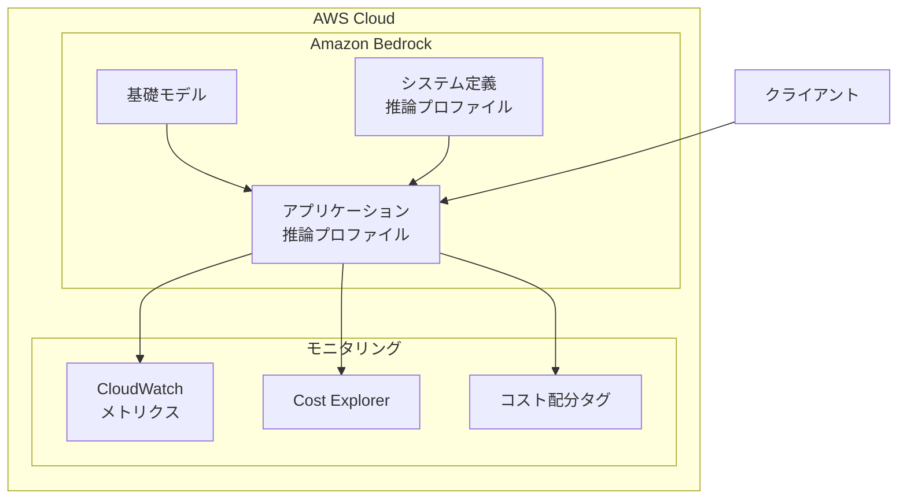
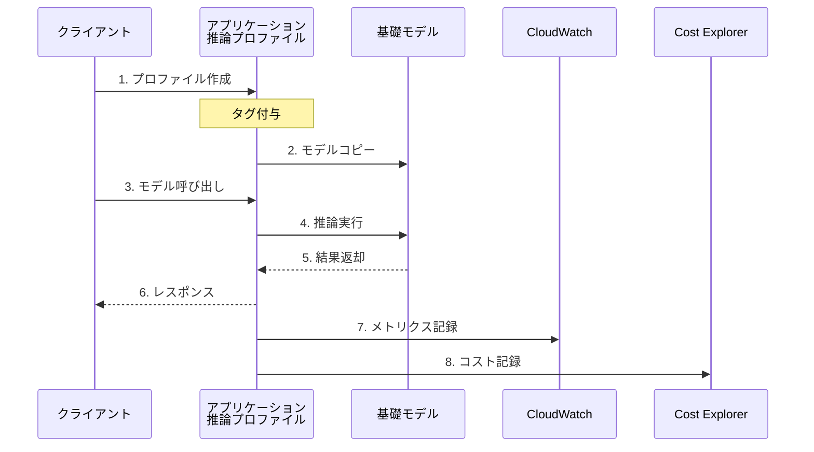
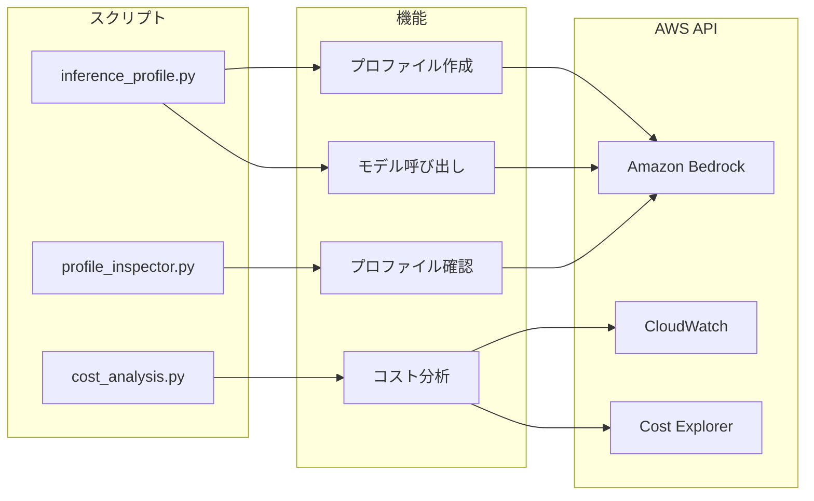

# Amazon Bedrock アプリケーション推論プロファイル

このサンプルコードは、Amazon Bedrock のアプリケーション推論プロファイルの実装、テスト、検証、および運用方法を示すものです。

## システム構成図



## 処理フロー



## アプリケーション推論プロファイルとは

Amazon Bedrock のアプリケーション推論プロファイルを使用することで、以下が可能になります：

- オンデマンド基礎モデルやシステム定義の推論プロファイルにコスト配分タグを付与
- 組織の分類（コストセンター、部門、チーム、アプリケーション）に基づく使用状況の追跡
- 複数のワークロードにわたるAI支出の管理
- コストオーバーランのリスク低減
- 重要なアプリケーションの優先順位付け

## コンポーネント構成



## 使用方法

### 1. アプリケーション推論プロファイルの作成

`copyFrom` キーのバリューには、システム定義の推論プロファイルまたはベースモデルの ARN を入力します。

AWS CLIを使用する場合:
```bash
PROFILE_NAME=infra REGION=us-east-1 && aws bedrock create-inference-profile \
  --region $REGION \
  --inference-profile-name $PROFILE_NAME \
  --description 'your-description' \
  --model-source "{\"copyFrom\": \"arn:aws:bedrock:${REGION}::foundation-model/anthropic.claude-3-5-sonnet-20240620-v1:0\"}" \
  --tags "[{\"key\": \"BedrockCostAllocateTag\", \"value\": \"${PROFILE_NAME}\"}]"
```

Pythonスクリプトを使用する場合:
```python
# 一連の手順を実行するサンプル
uv run inference_profile.py
```

### 2. プロファイルの確認

プロファイル情報の確認:
```python
uv run profile_inspector.py
```

表示される情報:
- 基本情報（名前、ARN、ステータス、作成日時など）
- 設定情報（モデル設定、タグ、メタデータ）
- 使用状況メトリクス

AWS CLIで確認する場合:
```bash
# プロファイル一覧の取得
aws bedrock list-inference-profiles \
  --region 'ap-northeast-1' \
  --type-equals 'APPLICATION'

# 特定のプロファイルの詳細を取得
aws bedrock get-inference-profile \
  --inference-profile-identifier <profile-arn>

# タグの確認
aws resourcegroupstaggingapi get-resources \
  --tag-filters Key=dept,Values=your-department \
  --region ap-northeast-1
```

### 3. コスト分析

#### 設定ファイルの準備

コスト分析を実行する前に、`config.json`を設定する必要があります。このファイルでは、分析対象の推論プロファイル名を指定します。

```json
{
    "profile_names": [
        "claims_dept_claude_3_sonnet_profile",
        "underwriting_dept_llama3_70b_profile"
    ]
}
```

- `profile_names`: 分析対象の推論プロファイル名のリスト
  - 各プロファイルには`dept`タグが設定されている必要があります
    - dept 以外を tag key に利用する場合はコードを修正してください
  - タグ情報は自動的にプロファイルから取得されます

設定ファイルが存在しない場合は、デフォルト設定が使用されます。

#### コスト情報の確認

コスト分析の実行:
```python
uv run cost_analysis.py
```

表示される情報:
- 部門別コスト集計（プロファイルのdeptタグに基づく）
- 使用量メトリクス
  - 呼び出し回数（InvocationCount）
  - 処理時間（ProcessingTime）
  - トークン数（TokenCount）
  - 文字数（CharacterCount）

注意: コスト分析を実行する前に、対象のプロファイルに適切なdeptタグが設定されていることを確認してください。タグが設定されていない場合は警告メッセージが表示されます。

### 4. モデルの呼び出し

AWS CLIを使用する場合:
```bash
# プロファイルARNの取得
INFERENCE_PROFILE_ARN=$(aws bedrock list-inference-profiles \
  --region 'ap-northeast-1' \
  --type-equals 'APPLICATION' \
  --query inferenceProfileSummaries[0].inferenceProfileArn \
  --output text)

# モデルの呼び出し
aws bedrock-runtime converse \
  --region ap-northeast-1 \
  --model-id $INFERENCE_PROFILE_ARN \
  --messages '[{"role": "user", "content": [{"text": "こんにちは！"}]}]'
```

Pythonスクリプトを使用する場合:
```python
# Converse APIの使用
response = converse(profile_arn, messages)

# ストリーミング応答の使用
response = converse_stream(profile_arn, messages)
```

## プロジェクト構成

```
inference-profile/
├── README.md                # このファイル
├── requirements.txt         # 依存関係の定義
├── inference_profile.py     # メインスクリプト
├── profile_inspector.py     # プロファイル検査ツール
├── cost_analysis.py        # コスト分析ツール
└── config.json             # コスト分析の設定ファイル
```

## 注意事項

1. リージョンの確認
   - アプリケーション推論プロファイルが利用可能なリージョンであることを確認
   - 東京リージョン（ap-northeast-1）でも利用可能

2. AWS CLI バージョン
   - v2.18.17以上が必要
   - 古いバージョンの場合は更新が必要

3. 認証情報
   - 適切なIAM権限が必要
   - Bedrockへのアクセス権限の確認

4. コスト管理
   - タグベースのコスト配分の有効化
   - 定期的なコスト監視の推奨

## サポート

問題が発生した場合は、以下を確認してください：

1. AWS認証情報が正しく設定されているか
2. 必要なIAM権限があるか
3. AWS CLIのバージョンが適切か
4. 使用するリージョンでBedrockが利用可能か
5. ログ出力でエラーの詳細を確認

## ライセンス

このサンプルコードはMITライセンスで提供されています。
