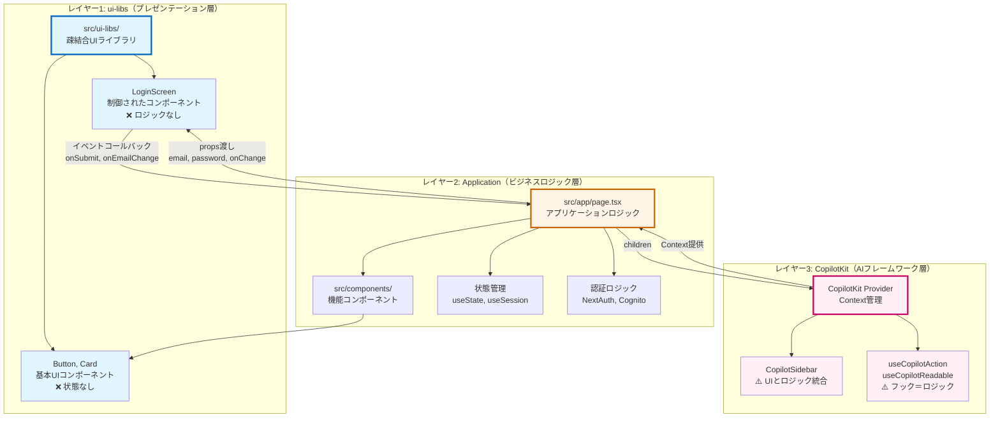
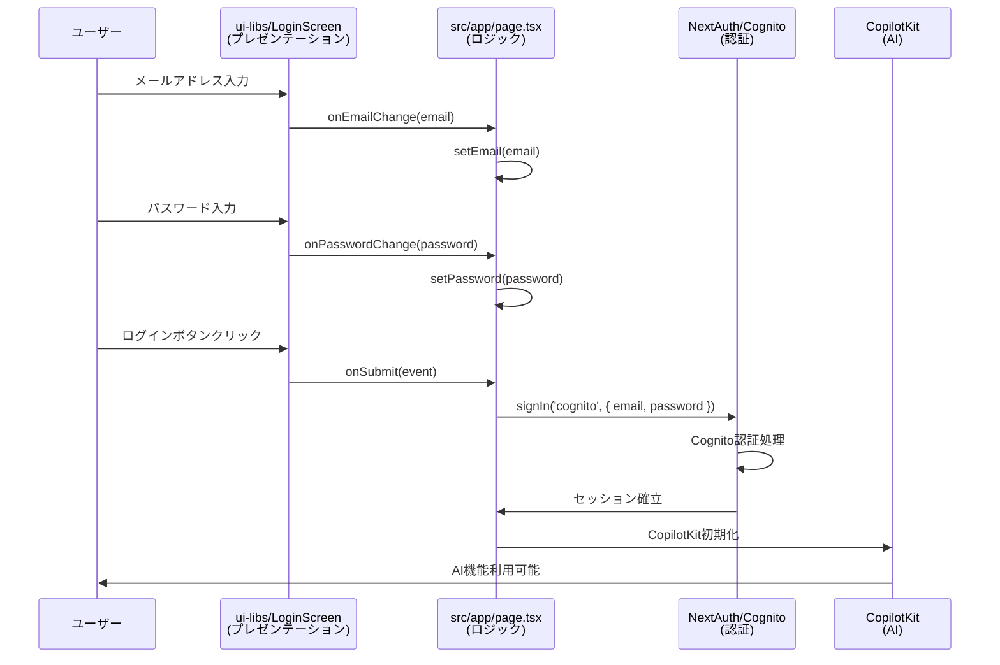

# CopilotKit × Cognito 認証統合アプリケーション

Amazon CognitoとCopilotKitを統合したNext.jsアプリケーションです。NextAuth.js v5を使用してCognito認証を実装し、認証後にCopilotKitのAIチャット機能を提供します。

## 🎯 目的

このアプリケーションは、以下の技術スタックの統合を実証します：

1. ✅ **NextAuth.js v5** - Cognito OAuth 2.0認証
2. ✅ **CloudFront + Lambda Function URL** - グローバル配信
3. ✅ **trustHostバグ回避策** - プロキシ環境での認証フロー
4. ✅ **CopilotKit + Mastra** - AIエージェント統合
5. ✅ **Amazon Bedrock** - Claude Sonnet 4モデル
6. ✅ **Generative UI** - 動的コンポーネントレンダリング
7. ✅ **JWT管理** - ID Token、Access Token、Refresh Token
8. ✅ **SSM Parameter Store** - 環境変数管理

## 📋 前提条件

- **Cognitoスタック**がデプロイ済み（`infrastructure/scripts/deploy-cognito.sh`）
- **Node.js 20.x以降**
- **AWS CLI設定済み**（SSM Parameter Store アクセス用）

## 🚀 起動方法

### 0. テストユーザー作成

infrastructureディレクトリでCognitoスタックをデプロイ後、テストユーザーを作成します：

```bash
cd ../infrastructure/scripts/
NODE_ENV=dev ./create-test-user.sh
```

ユーザー情報は`test-user-info.txt`に保存されます。

### 1. 依存関係インストール（初回のみ）

```bash
npm install
```

### 2. 開発サーバー起動（推奨）

**ラッパースクリプトを使用**（SSM Parameter Storeから自動取得）：

```bash
# dev環境で起動（デフォルト: CLIENT_SUFFIX=dev, PORT=3001）
./scripts/dev.sh

# prod環境で起動
CLIENT_SUFFIX=prod ./scripts/dev.sh

# ポート番号を変更
PORT=3002 ./scripts/dev.sh

# 組み合わせ
CLIENT_SUFFIX=prod PORT=3003 ./scripts/dev.sh
```

ブラウザで http://localhost:3001 にアクセスします。

**スクリプトの動作**:
1. SSM Parameter StoreからCognito情報を取得（`CLIENT_SUFFIX`で環境指定）
2. NextAuth v5環境変数を自動設定（`AUTH_COGNITO_ID`、`AUTH_COGNITO_ISSUER`など）
3. 開発サーバーを起動

**環境の切り替え**:
- `CLIENT_SUFFIX`環境変数で環境を指定（デフォルト: `dev`）
- `dev` → SSMパス: `/copilotkit-agentcore/dev/cognito/*`
- `prod` → SSMパス: `/copilotkit-agentcore/prod/cognito/*`

**infrastructure側との対応**:
```bash
# 1. infrastructure側でdev環境をセットアップ＆デプロイ
cd ../infrastructure
NODE_ENV=dev ./scripts/setup.sh
NODE_ENV=dev ./scripts/deploy.sh

# 2. frontend-copilotkit側でローカル開発
cd ../frontend-copilotkit
./scripts/dev.sh  # デフォルトでCLIENT_SUFFIX=dev
```

### 3. 環境変数について

**全ての環境変数は`scripts/dev.sh`で自動的に設定されます。**

- `AUTH_COGNITO_ID`, `AUTH_COGNITO_ISSUER` - SSM Parameter Storeから動的取得
- `AUTH_SECRET` - 起動時に自動生成
- `AUTH_TRUST_HOST` - 自動設定（CloudFront対応）
- `AWS_REGION` - デフォルト: us-east-1

手動で環境変数を設定する必要はありません。

## 🎨 UI/UXデザイン

### デザインシステム：紫ベースの統一

プロジェクト全体で**紫色（Purple）**をメインカラーとした統一されたデザインシステムを採用しています。

#### カラーパレット

```css
/* プライマリーカラー */
--copilot-kit-primary-color: #9333ea;  /* purple-600 */

/* アクセントカラー */
purple-100: #f3e8ff  /* 背景色 */
purple-400: #c084fc  /* 枠線 */
purple-600: #9333ea  /* ボタン */
purple-700: #7e22ce  /* テキスト */
purple-900: #581c87  /* 濃いテキスト */

/* セカンダリーカラー */
rose-600/40: #fb7185  /* シャドウ */
```

#### 適用箇所

1. **LandingScreen（ログイン前）**
   - プロジェクト名：紫の波線付き下線
   - グラフノード：薄い紫の円形
   - Sign Inボタン：紫の背景

2. **LoginScreen（認証画面）**
   - カード枠線：紫のring
   - ボタン：紫の背景
   - フォーカス：紫のring

3. **Homeページ（ログイン後）**
   - ヘッダータイトル：紫のテキスト
   - サインアウトボタン：紫の枠線
   - AgentListCard：紫のバッジと枠線
   - AuthInfo：紫のアクセント

4. **CopilotKit チャット**
   - アシスタントメッセージ：薄い紫の背景
   - ユーザーメッセージ：紫の背景
   - プライマリーカラー：紫

### ui-libs コンポーネントカタログ

#### 認証（Auth）

**LoginScreen**
- ログインフォーム（Email/Password）
- 制御されたコンポーネント
- Larainfo.comのデザインを採用
```tsx
<LoginScreen
  email={email}
  password={password}
  onEmailChange={setEmail}
  onPasswordChange={setPassword}
  onSubmit={handleSubmit}
/>
```

**LandingScreen**
- ログイン前のホーム画面
- SVGグラフアニメーション（10個のノード、🪁アイコン）
- Sign In/Sign Upボタン
```tsx
<LandingScreen
  appName="My App"
  tagline="Welcome message"
  onSignInClick={() => signIn('cognito')}
  onKiteClick={() => signIn('cognito')}
/>
```

#### ダッシュボード（Dashboard）

**AgentListCard**
- AI Agent/MCPサーバーのリスト表示
- グリッドレイアウト（2列）
- ステータスバッジ（利用可能/利用不可）
- ルーティング対応（href属性）
```tsx
<AgentListCard
  agents={[
    {
      id: 'weather',
      name: '天気予報エージェント',
      description: '指定した場所の天気情報を取得',
      icon: '🌤️',
      type: 'agent',
      status: 'available',
      href: '/agents/weather'  // オプション
    }
  ]}
/>
```

#### 基本UI（UI）

**Button**
- 再利用可能なボタンコンポーネント
- バリアント：default, outline, ghost等

**Card**
- コンテンツカード
- CardHeader, CardContent等のサブコンポーネント

### 認証情報の拡張表示

**AuthInfo**コンポーネントは以下の情報を表示します：

- **ユーザー情報**
  - Email、Username、Sub（ユーザーID）

- **ID Token**
  - トークン文字列（truncated表示）
  - 発行者（iss）、対象（aud）
  - 発行時刻（iat）、有効期限（exp）

- **Access Token**
  - トークン文字列（truncated表示）
  - 発行時刻、有効期限
  - Scope情報

- **Refresh Token**（存在する場合）
  - トークン文字列（truncated表示）

- **セッション情報**
  - Provider、Session Expires

## 🏗️ アーキテクチャ設計とui-libs

### 設計原則：3層アーキテクチャ

本プロジェクトは、**疎結合な設計**を採用し、3つの明確なレイヤーに分離されています。



### なぜこの設計？

#### 問題：CopilotKitをui-libsに含めるべきか？

**答え：NO**

**理由:**
1. **CopilotKitはフレームワーク**
   - `<CopilotKit>`はContextプロバイダー
   - `useCopilotAction`等のhooksは状態管理とロジックを含む
   - **UIとロジックが密結合**している

2. **ui-libsは疎結合UIライブラリ**
   - ロジックを持たない
   - プロジェクト固有の依存を持たない
   - 制御されたコンポーネント（Controlled Components）

3. **役割が根本的に異なる**
   - CopilotKit = AIフレームワーク（状態 + UI + ロジック）
   - ui-libs = プレゼンテーションライブラリ（UIのみ）

### 実装パターン比較

#### ❌ 悪い例：ui-libsにロジックを含める

```tsx
// ui-libs/components/auth/LoginScreen.tsx（NG例）
export function LoginScreen() {
  const [email, setEmail] = useState('')  // ← ロジック！
  const [password, setPassword] = useState('')  // ← 状態管理！
  
  const handleSubmit = () => {
    signIn('cognito', { email, password })  // ← 外部依存！
  }
  
  return <form onSubmit={handleSubmit}>...</form>
}
```

**問題点:**
- `useState`（状態管理）を含む
- 外部API（`signIn`）への依存
- 他のプロジェクトで再利用不可

#### ✅ 良い例：制御されたコンポーネント

```tsx
// ui-libs/components/auth/LoginScreen.tsx（OK例）
export interface LoginScreenProps {
  email: string                          // ← propsで受け取る
  password: string
  onEmailChange: (value: string) => void // ← イベントハンドラ
  onPasswordChange: (value: string) => void
  onSubmit: (e: React.FormEvent) => void
}

export function LoginScreen({ 
  email, 
  password, 
  onEmailChange, 
  onPasswordChange, 
  onSubmit 
}: LoginScreenProps) {
  return (
    <form onSubmit={onSubmit}>
      <input 
        value={email} 
        onChange={(e) => onEmailChange(e.target.value)} 
      />
      <input 
        value={password} 
        onChange={(e) => onPasswordChange(e.target.value)} 
      />
      <button type="submit">Login</button>
    </form>
  )
}
```

**利点:**
- ロジックなし（純粋な表示）
- 状態は親から受け取る
- どんなプロジェクトでも再利用可能

#### ✅ アプリケーション側の実装

```tsx
// src/app/page.tsx
export default function Home() {
  const { data: session } = useSession()
  
  // ← アプリケーション層が状態を管理
  const [email, setEmail] = useState('')
  const [password, setPassword] = useState('')
  
  // ← アプリケーション層がロジックを実装
  const handleLogin = (e: React.FormEvent) => {
    e.preventDefault()
    signIn('cognito', { email, password })
  }
  
  if (!session) {
    return (
      <LoginScreen
        email={email}
        password={password}
        onEmailChange={setEmail}
        onPasswordChange={setPassword}
        onSubmit={handleLogin}
      />
    )
  }
  
  // ← CopilotKitは独立したレイヤー
  return (
    <CopilotKit runtimeUrl="/api/copilotkit" agent="weatherAgent">
      <CopilotSidebar labels={{...}}>
        <AuthenticatedView />
      </CopilotSidebar>
    </CopilotKit>
  )
}
```

### データフロー図



### ディレクトリ構造とレイヤー

```
frontend-copilotkit-v2/
├── src/
│   ├── ui-libs/                    # レイヤー1: 疎結合UIライブラリ
│   │   ├── components/
│   │   │   ├── ui/                 # ✅ ロジックなし
│   │   │   │   ├── button.tsx     # - propsのみ
│   │   │   │   └── card.tsx       # - イベントハンドラは親から
│   │   │   └── auth/               # ✅ 制御されたコンポーネント
│   │   │       └── LoginScreen.tsx # - useState禁止
│   │   └── lib/
│   │       └── utils.ts            # ✅ 純粋関数のみ
│   │
│   ├── app/                        # レイヤー2: アプリケーション層
│   │   ├── page.tsx                # ✅ ビジネスロジック
│   │   │                           # - useState使用OK
│   │   │                           # - NextAuth使用OK
│   │   │                           # - ui-libsを使用
│   │   │                           # - CopilotKitをラップ
│   │   └── api/
│   │       ├── auth/               # ✅ 認証ロジック
│   │       └── copilotkit/         # ✅ CopilotKit統合
│   │
│   ├── components/                 # レイヤー2: 機能コンポーネント
│   │   ├── auth/
│   │   │   └── AuthInfo.tsx        # ✅ セッション情報表示
│   │   └── features/
│   │       ├── ProverbsSection.tsx # ✅ ことわざ機能
│   │       └── WeatherCard.tsx     # ✅ Generative UI
│   │
│   └── mastra/                     # レイヤー3: AIエージェント
│       └── agents/
│           └── weatherAgent.ts     # ✅ CopilotKit統合
│
└── tailwind.config.js              # Tailwind設定
    # 重要：ui-libsをcontentに含める！
```

### 重要なルール

#### ui-libsで禁止されていること

```tsx
// ❌ useState, useReducer などのhooks
const [state, setState] = useState()

// ❌ useEffect（副作用）
useEffect(() => { fetch(...) })

// ❌ 外部API呼び出し
signIn('cognito')
fetch('/api/users')

// ❌ Context（状態共有）
const value = useContext(SomeContext)

// ❌ プロジェクト固有の依存
import { signIn } from 'next-auth'
import { useCopilotAction } from '@copilotkit/react-core'
```

#### ui-libsで許可されていること

```tsx
// ✅ propsでデータを受け取る
function LoginScreen({ email, onEmailChange }: Props) {

// ✅ イベントハンドラを親に委譲
<input onChange={(e) => onEmailChange(e.target.value)} />

// ✅ 純粋なユーティリティ関数
cn('class1', 'class2')

// ✅ 基本的なReact標準機能
<button type="submit">...</button>
```

### CopilotKitとui-libsの共存

```tsx
// src/app/page.tsx
export default function Home() {
  // アプリケーション層で状態管理
  const [email, setEmail] = useState('')
  const [password, setPassword] = useState('')
  
  if (!session) {
    // ui-libsの制御されたコンポーネント
    return (
      <LoginScreen
        email={email}
        password={password}
        onEmailChange={setEmail}
        onPasswordChange={setPassword}
        onSubmit={(e) => {
          e.preventDefault()
          signIn('cognito', { email, password })
        }}
      />
    )
  }
  
  // CopilotKitは独立したレイヤー
  // ui-libsとは直接関係なし
  return (
    <CopilotKit runtimeUrl="/api/copilotkit" agent="weatherAgent">
      <CopilotSidebar>
        {/* この中でui-libsのButtonやCardを使用可能 */}
        <AuthenticatedView />
      </CopilotSidebar>
    </CopilotKit>
  )
}
```

### まとめ

| レイヤー | 役割 | 状態管理 | 外部依存 | 例 |
|---------|------|---------|---------|-----|
| **ui-libs** | プレゼンテーション | ❌ 禁止 | ❌ 禁止 | LoginScreen, Button, Card |
| **Application** | ビジネスロジック | ✅ OK | ✅ OK | page.tsx, NextAuth, useState |
| **CopilotKit** | AIフレームワーク | ✅ 内包 | ✅ 内包 | CopilotSidebar, useCopilotAction |

**キーポイント:**
- ✅ ui-libsは**どんなプロジェクトでも使える**汎用UIライブラリ
- ✅ CopilotKitは**このプロジェクト専用の**AIフレームワーク
- ✅ この2つは**別々のレイヤー**として共存する

---

## 🏗️ 認証アーキテクチャ

### 認証フロー

```
ブラウザ
  ↓ [1] サインインボタンクリック
Next.js (localhost:3001)
  ↓ [2] Cognito認証ページへリダイレクト
  │     authorization.params.redirect_uri を動的設定
Cognito Hosted UI
  ↓ [3] ユーザー認証
  ↓ [4] コールバック: /api/auth/callback/cognito?code=xxx
Next.js Route Handler
  ├─ [5] reqWithTrustedOrigin() でリクエスト書き換え
  │     （GitHub Issue #12176 回避策）
  ├─ [6] トークン交換
  │     token.params.redirect_uri を動的設定
  └─ [7] セッション確立
App
  └─ CopilotKit UI表示
```

### システム構成（本番環境）

```
CloudFront Distribution
  ├─ X-Forwarded-Host: d123.cloudfront.net
  ├─ X-Forwarded-Proto: https
  ↓
Lambda Function URL
  ├─ Next.js App (Standalone)
  ├─ NextAuth.js v5
  │   ├─ trustHost: true
  │   └─ reqWithTrustedOrigin() 回避策
  └─ CopilotKit Integration
       ↓
[On going] AgentCore Runtime
  └─ AI応答 + MCPツール
```

## 🔐 NextAuth.js v5 設定

### 主要な実装ポイント

#### 1. `src/auth.ts` - NextAuth設定

```typescript
export const { auth, handlers, signIn, signOut } = NextAuth({
  providers: [
    Cognito({
      client: {
        token_endpoint_auth_method: 'none',  // Public Client
      },
    }),
  ],
  callbacks: {
    jwt: async ({ token, account }) => {
      // Cognitoトークンを保存
      if (account) {
        token.idToken = account.id_token;
        token.accessToken = account.access_token;
        token.refreshToken = account.refresh_token;
      }
      return token;
    },
    session: async ({ session, token }) => {
      // セッションにトークンを含める
      session.idToken = token.idToken;
      session.accessToken = token.accessToken;
      return session;
    },
  },
  debug: process.env.NODE_ENV === 'development',
  trustHost: true,  // CloudFront対応
});
```

#### 2. `src/app/api/auth/[...nextauth]/route.ts` - trustHostバグ回避策

**問題**: NextAuth v5 beta版では`trustHost: true`が正しく動作しない（GitHub Issue #12176）

**解決策**: リクエストオブジェクトを手動で書き換え

```typescript
const reqWithTrustedOrigin = (req: NextRequest): NextRequest => {
  if (process.env.AUTH_TRUST_HOST !== 'true') return req;
  
  const proto = req.headers.get('x-forwarded-proto');
  const host = req.headers.get('x-forwarded-host');
  
  if (!proto || !host) return req;
  
  const trustedOrigin = `${proto}://${host}`;
  const { href, origin } = req.nextUrl;
  
  // オリジンを書き換えた新しいリクエストを作成
  return new NextRequest(href.replace(origin, trustedOrigin), req);
};

export const GET = (req: NextRequest) => 
  handlers.GET(reqWithTrustedOrigin(req));
export const POST = (req: NextRequest) => 
  handlers.POST(reqWithTrustedOrigin(req));
```

この回避策により：
- Authorization Request時の`redirect_uri`が正しく設定される
- Token Exchange時の`redirect_uri`も一致する
- CloudFront、localhost、ポートフォワーディングすべてに対応

### 環境変数（NextAuth v5）

**ビルド時に必要**:
```bash
AUTH_COGNITO_ID=xxx              # Cognito Client ID
AUTH_COGNITO_ISSUER=https://...  # Cognito Issuer URL
AUTH_SECRET=xxx                  # セッション暗号化キー
AUTH_TRUST_HOST=true             # プロキシ対応
```

**重要**: NextAuth v5では環境変数の命名規則が変更されています：
- v4: `COGNITO_CLIENT_ID` → v5: `AUTH_COGNITO_ID`
- v4: `COGNITO_ISSUER` → v5: `AUTH_COGNITO_ISSUER`
- v4: `NEXTAUTH_SECRET` → v5: `AUTH_SECRET`
- v4: `NEXTAUTH_URL`（不要） → v5: `AUTH_TRUST_HOST=true`

## 🪁 Mastra AIエージェント統合

### 主要機能

#### 1. **Weather Agent** - 天気情報エージェント
- Amazon Bedrock Claude Sonnet 4を使用
- Open-Meteo APIから天気データを取得
- Generative UIで天気情報を動的表示

#### 2. **Shared State** - アプリとエージェント間の状態共有
- `useCoAgent`フックでproverbs（ことわざ）を共有
- エージェントが状態を更新し、UIにリアルタイム反映

#### 3. **Generative UI** - 動的コンポーネントレンダリング
- 天気カード: 温度、湿度、風速などを視覚的に表示
- メモリ更新の可視化

#### 4. **Frontend Actions**
- テーマカラー変更: UIのテーマをリアルタイムで変更

### Mastraエージェント構成

```typescript
// src/mastra/agents/index.ts
export const weatherAgent = new Agent({
  name: "Weather Agent",
  tools: { weatherTool },
  model: bedrock("us.anthropic.claude-sonnet-4-20250514-v1:0"),
  instructions: "You are a helpful assistant.",
  memory: new Memory({
    storage: new LibSQLStore({ url: "file::memory:" }),
    options: {
      workingMemory: {
        enabled: true,
        schema: AgentState,
      },
    },
  }),
});
```

### AWS認証: Credential Provider Chain

**ローカルと本番で統一されたAWS認証方式を採用しています。**

#### 実装
```typescript
// src/mastra/agents/index.ts
import { createAmazonBedrock } from "@ai-sdk/amazon-bedrock";
import { fromNodeProviderChain } from "@aws-sdk/credential-providers";

const bedrock = createAmazonBedrock({
  region: process.env.AWS_REGION || 'us-east-1',
  credentialProvider: fromNodeProviderChain(),
});
```

#### 認証の仕組み

**Credential Provider Chain**は以下の順序で認証情報を自動検索します：

1. **環境変数** - `AWS_ACCESS_KEY_ID`, `AWS_SECRET_ACCESS_KEY`, `AWS_SESSION_TOKEN`
2. **Lambda実行ロール** - 本番環境（CloudFront + Lambda）
3. **ECS/EKSロール** - コンテナ環境
4. **EC2インスタンスプロファイル** - EC2環境
5. **AWS CLI設定** - `~/.aws/credentials` (ローカル開発)

#### 環境別の動作

**ローカル開発:**
```bash
# AWS CLIが設定済みであれば自動的に認証情報を取得
aws configure list  # 確認

# dev.shでは環境変数設定不要
./scripts/dev.sh
```

**本番環境（Lambda）:**
- Lambda実行ロールに自動的にアタッチされたIAM権限を使用
- アクセスキー不要（セキュア）

#### IAM権限要件

**ローカル開発:**
```json
{
  "Effect": "Allow",
  "Action": [
    "bedrock:InvokeModel",
    "bedrock:InvokeModelWithResponseStream"
  ],
  "Resource": "arn:aws:bedrock:*:*:inference-profile/*"
}
```

**本番環境（Lambda実行ロール）:**
```yaml
# infrastructure/lambda-role.yml
Policies:
  - PolicyName: BedrockAccess
    PolicyDocument:
      Version: '2012-10-17'
      Statement:
        - Effect: Allow
          Action:
            - bedrock:InvokeModel
            - bedrock:InvokeModelWithResponseStream
          Resource: !Sub 'arn:aws:bedrock:${AWS::Region}::foundation-model/anthropic.claude-*'
```

#### メリット

1. ✅ **セキュア** - 本番環境でアクセスキーを管理不要
2. ✅ **統一** - ローカルと本番で同じコード
3. ✅ **自動** - 環境に応じて最適な認証方法を選択
4. ✅ **ベストプラクティス** - AWSの推奨パターン

## 📁 プロジェクト構造

```
frontend-copilotkit-v2/
├── src/
│   ├── auth.ts                           # NextAuth v5設定
│   ├── mastra/                           # Mastraエージェント実装
│   │   ├── index.ts                      # Mastraインスタンス
│   │   ├── agents/
│   │   │   └── index.ts                  # weatherAgent定義
│   │   └── tools/
│   │       └── index.ts                  # weatherTool実装
│   ├── app/
│   │   ├── layout.tsx                    # ルートレイアウト（agent指定）
│   │   ├── page.tsx                      # メインページ（Generative UI）
│   │   ├── providers.tsx                 # SessionProvider
│   │   └── api/
│   │       ├── auth/[...nextauth]/
│   │       │   └── route.ts              # NextAuth Route Handler（バグ回避策含む）
│   │       └── copilotkit/
│   │           └── route.ts              # CopilotKit + Mastra統合
│   ├── components/
│   └── types/
│       └── next-auth.d.ts                # NextAuth型定義拡張
├── scripts/
│   └── dev.sh                            # 開発サーバー起動スクリプト
├── package.json
├── next.config.ts
└── README.md
```

## 🔧 開発のヒント

### デバッグログの有効化

`src/auth.ts`で`debug: true`を設定：

```typescript
export const { auth, handlers, signIn, signOut } = NextAuth({
  // ...
  debug: true,  // または process.env.NODE_ENV === 'development'
});
```

### Lambda CloudWatchログの確認（本番環境）

```bash
# Lambda関数の特定
aws lambda list-functions \
  --query 'Functions[?contains(FunctionName, `CopilotKitNextjsStack`)].FunctionName'

# ログのストリーミング
aws logs tail /aws/lambda/[関数名] --follow
```

### ローカル環境でのCognito設定確認

```bash
# SSM Parameter Storeから確認
aws ssm get-parameter \
  --name "/copilotkit-agentcore/dev/cognito/client-id" \
  --query "Parameter.Value" \
  --output text
```

## 🐛 トラブルシューティング

### `redirect_mismatch`エラー

**原因**: `redirect_uri`がCognitoに登録されていない

**解決**:
1. Cognitoコールバック URLを確認:
   ```bash
   aws cognito-idp describe-user-pool-client \
     --user-pool-id [pool-id] \
     --client-id [client-id]
   ```
2. `trustHost`バグ回避策が実装されているか確認
3. CloudFrontデプロイ後、CustomResourceが自動的にURLを追加

### 認証後にエラーページに遷移

**原因**: セッションコールバックの問題

**確認**:
- `src/auth.ts`の`callbacks`が正しく実装されているか
- トークンが正しく保存されているか

### 環境変数が読み込まれない

**原因**: `.env`ファイルの配置またはNext.jsの環境変数読み込み順序

**解決**:
- `scripts/dev.sh`を使用（推奨）
- または環境変数を明示的にエクスポート

## 📚 関連ドキュメント

- **[NextAuth.js v5 Documentation](https://authjs.dev/)** - NextAuth.js公式ドキュメント
- **[GitHub Issue #12176](https://github.com/nextauthjs/next-auth/issues/12176)** - trustHostバグと回避策
- **[CopilotKit Documentation](https://docs.copilotkit.ai/)** - CopilotKit統合ガイド
- **infrastructure/TROUBLESHOOTING_COGNITO_AUTH.md** - 詳細なトラブルシューティング記録

## 🔒 セキュリティ上の注意

### 本番環境での推奨事項

1. **`AUTH_SECRET`の安全な生成**:
   ```bash
   openssl rand -base64 32
   ```

2. **環境変数の保護**:
   - `.env.production`をGit管理しない
   - AWS Secrets Managerまたはパラメータストアを使用

3. **HTTPSの強制**:
   - 本番環境では必ずHTTPSを使用
   - CloudFrontで強制リダイレクト設定

4. **トークンの適切な管理**:
   - セッションタイムアウトの設定
   - リフレッシュトークンのローテーション

## 🚀 デプロイ

このアプリケーションは`infrastructure/scripts/deploy-frontend.sh`を使用してAWSにデプロイされます。

詳細は`infrastructure/README.md`を参照してください。

---

**開発**: このアプリケーションはNextAuth.js v5とCognitoの統合検証用です。本番環境への適用前に、セキュリティとパフォーマンスの要件を確認してください。
