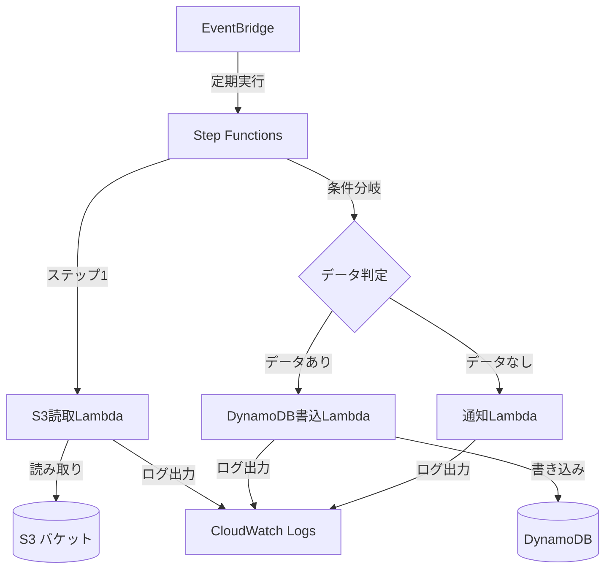
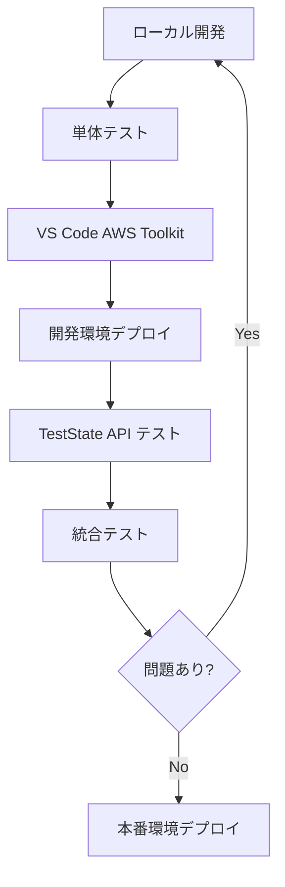

# AWS Step Functions サンプルプロジェクト

このプロジェクトは、AWS Step Functions、AWS Lambda、Amazon DynamoDB、Amazon S3、Amazon EventBridge を使用したサーバーレスアプリケーションのサンプルです。  
ローカルの VS Code IDE に AWS Toolkit を導入してAWS Step Functions のローカル開発をスムーズに行うためのガイドを提供します。

## 概要

このアプリケーションは以下のワークフローをサンプルとして提供します：

1. Amazon S3 バケットからデータを定期的に読み取る
2. 読み取ったデータを処理し、Amazon DynamoDB に保存する

## アーキテクチャ



## 前提条件

- AWS CLI
- AWS SAM CLI
- Python 3.11 以上
- uv を導入済み

## セットアップ

1. 依存関係をインストールします：

```bash
uv venv && source .venv/bin/activate
uv sync
```

2. SAMを使用してデプロイします：

環境に応じて以下のようにデプロイします：

```bash
# テスト環境へのデプロイ
sam build
sam deploy --guided --parameter-overrides Environment=dev

# 本番環境へのデプロイ
sam build
sam deploy --guided --parameter-overrides Environment=prod
```

注意: 初回デプロイ時は `--guided` オプションを使用してください。2回目以降は `--guided` を省略できます。

## サンプルデータの作成

デプロイ後、Amazon S3 バケットにサンプルデータを作成するには、以下の手順を実行してください：

1. デプロイ時に作成されたS3バケットの名前を確認します：

   ```bash
   export STACKNAME=sam-app
   aws cloudformation describe-stacks \
     --stack-name $STACKNAME \
     --query 'Stacks[0].Outputs[?OutputKey==`S3BucketName`].OutputValue' \
     --output text
   ```

   注：STACKNAME は、`sam deploy` 時に使用したスタック名に置き換えてください。

2. `scripts` ディレクトリに移動します：

   ```bash
   cd serverless/local-ide-with-aws-step-functions/scripts
   ```

3. `create_sample_data.py` スクリプトを実行します：

   ```bash
   # バケット名を変数に格納
   export BUCKET_NAME=$(aws cloudformation describe-stacks \
     --stack-name $STACKNAME \
     --query 'Stacks[0].Outputs[?OutputKey==`S3BucketName`].OutputValue' \
     --output text)
   
   # スクリプトを実行
   uv run create_sample_data.py $BUCKET_NAME
   ```

   注：バケット名は通常 `<stack-name>-data-bucket-<region>-<account-id>` の形式になります。

4. オプションで、プレフィックスやサンプルデータの数を指定できます：

   ```bash
   # プレフィックスとデータ数を指定してスクリプトを実行
   uv run create_sample_data.py $BUCKET_NAME --prefix custom/prefix/ --count 10
   ```

   - `--prefix`: オブジェクトのプレフィックス（デフォルト: 'data/'）
   - `--count`: 作成するサンプルデータの数（デフォルト: 5）

このスクリプトは、指定されたS3バケットにJSONフォーマットのサンプルデータファイルを作成します。

## AWS Step Functions 実行ロールの作成

TestState API を使用してステートを個別にテストするには、AWS Step Functions 実行ロールが必要です。
以下の手順で作成できます：

1. `scripts` ディレクトリに移動します：

   ```bash
   cd serverless/local-ide-with-aws-step-functions/scripts
   ```

2. `create_step_functions_role.py` スクリプトを実行します：

   ```bash
   # スタック名を設定
   export STACKNAME=sam-app
   
   # スクリプトを実行してロールを作成
   uv run create_step_functions_role.py --stack-name $STACKNAME
   ```

   注：STACKNAME は、`sam deploy`時に使用したスタック名に置き換えてください。

3. 作成されたロール ARN を環境変数に設定します：

   ```bash
   # 作成したロールの ARN を環境変数に設定
   export STEP_FUNCTIONS_ROLE_ARN=$(aws iam get-role --role-name ${STACKNAME}-sfn-execution-role --query 'Role.Arn' --output text)
   
   # 確認
   echo $STEP_FUNCTIONS_ROLE_ARN
   ```

4. このロール ARN を使用して、TestState API でステートをテストできます：

   ```bash
   aws stepfunctions test-state \
     --definition "$(cat statemachine/workflow.asl.json)" \
     --role-arn $STEP_FUNCTIONS_ROLE_ARN \
     --state "FetchFromS3" \
     --input "$(cat tests/step_inputs/s3_reader.json)"
   ```

作成されるロールには以下の権限が含まれます：
- AWS Lambda 関数の実行権限
- Amazon CloudWatch ログの作成と管理権限

## テスト

まず、AWS Lambda のコードがローカルで問題なく動作することを確認するでしょう。
これらのコードは単体テストを通じて検証されます。
しかし、この段階では各ステップの入出力や AWS リソースとの連携は含まれていません。

## 開発効率を向上させるためのアプローチ

### 1. 単体テスト（Moto の活用）

Moto を使用することで、AWSリソース（Amazon S3、Amazon DynamoDB 等）とのやり取りをモック化し、ローカルで完結した単体テストが可能になります：

```python
from moto import mock_aws
import boto3
import pytest

@mock_aws
def test_s3_reader():
    # テスト用のS3バケットとオブジェクトを作成
    s3 = boto3.client('s3')
    s3.create_bucket(Bucket='test-bucket')
    s3.put_object(Bucket='test-bucket', Key='test.json', Body='{"data": "test"}')
    
    # テスト対象の関数を実行
    result = s3_reader_function(bucket='test-bucket', key='test.json')
    assert result['data'] == 'test'
```

### 2. VS Code AWS Toolkit の活用

AWS Toolkit を VS Code に導入することで、以下の操作が単一のインターフェースで可能になります：

1. AWS Lambda 関数等の直接デプロイ
   - 関数コードの変更を開発環境に即時反映
   - ローカルでのテスト実行と結果確認

2. AWS Step Functions の操作
   - ステートマシンの視覚的なローカル開発用の編集
   - TestState API を使用したステップ単位の実 AWS リソースを用いたステップ単位テスト
   - 実行履歴の確認
   - ステップ定義の UI からのデプロイ
   - デプロイされたフローの起動と実行

### 3. 開発環境の効率的な活用

開発者専用の環境を用意することで、CI/CD パイプラインを経由せずに迅速な開発とテストが可能になります：

```bash
# 開発者専用の環境にデプロイ
sam deploy --parameter-overrides Environment=dev-{username}
```

これにより：
- 他の開発者の作業に影響を与えない
- 変更の即時反映と検証が可能
- 本番環境の安全性を確保

### 4. 段階的なテストアプローチ

1. **単体テスト（ローカル）**
   - Moto を使用した AWS リソースのモック化
   - ビジネスロジックの検証

2. **ステップ単位のテスト（開発環境）**
   - TestState API を使用した各ステートの検証
   - 入出力データの確認
   - エラーハンドリングの検証

3. **統合テスト（開発環境）**
   - ステートマシン全体の実行
   - 実際の AWS リソースとの連携確認
   - エンドツーエンドの動作検証

### 5. 効率的な開発サイクル



このアプローチにより：
- 開発からテストまでを VS Code 内で完結
- 迅速なフィードバックループの実現
- デプロイ頻度の最適化
- 問題の早期発見と修正

#### TestState API を使用したステップごとのテスト

AWS Step Functions [TestState API](https://docs.aws.amazon.com/ja_jp/step-functions/latest/dg/test-state-isolation.html) を使用すると、
ステートマシン全体をデプロイすることなく、個々のステートを単独でテストできます。
これにより、各ステートの動作を迅速に検証し、問題を早期に発見できます。

#### AWS Toolkit でのステート単体テスト手順

1. VS Code で **AWS Toolkit** エクスプローラーを開く
2. **Step Functions** セクションを展開
3. ステートマシン定義ファイル（workflow.asl.json）を右クリック
4. **Open Graph** を選択してビジュアルエディタを開く
5. テストしたいステートを右クリック
6. **Test State** を選択
7. テスト用の入力JSONを入力
8. 実行ロールを選択
9. **Start Test** をクリックしてテスト実行

#### テスト結果の確認

テスト実行後、VS Code のインターフェース内で以下の情報を確認できます：

1. **Output** タブ：ステートの出力データ
2. **Input/Output Processing** タブ：データ処理の各段階の結果
3. **Status**：成功/失敗のステータス
4. **Next State**：次に遷移するステート名


テストが成功したら、AWS Toolkit を使用して IDE からワークフローを公開できます。
また、AWS SAM、AWS CDK、AWS CloudFormation などのインフラストラクチャーをコードで管理するためのツールを使用してステートマシンをデプロイすることができます。  
デプロイした AWS Step Functions を AWS Toolkit から編集することやワークフローを実行することも可能です。

#### テストの実行方法

各ステップのテストは以下のコマンドからも実行できます：

```bash
# Amazon S3 読取ステップのテスト
aws stepfunctions test-state \
  --definition "$(cat statemachine/workflow.asl.json)" \
  --role-arn <StepFunctionsExecutionRoleArn> \
  --state "FetchFromS3" \
  --input "$(cat tests/step_inputs/s3_reader.json)"

# 条件分岐ステップのテスト
aws stepfunctions test-state \
  --definition "$(cat statemachine/workflow.asl.json)" \
  --role-arn <StepFunctionsExecutionRoleArn> \
  --state "CheckData" \
  --input "$(cat tests/step_inputs/check_data.json)"

# Amazon DynamoDB 書込ステップのテスト
aws stepfunctions test-state \
  --definition "$(cat statemachine/workflow.asl.json)" \
  --role-arn <StepFunctionsExecutionRoleArn> \
  --state "SaveToDynamoDB" \
  --input "$(cat tests/step_inputs/dynamodb_writer.json)"
```

#### パラメータの説明

- `--definition`: ステートマシンの定義（ASL JSON）
- `--role-arn`: ステートの実行に使用するIAMロール
- `--state`: テストするステートの名前
- `--input`: ステートへの入力データ

#### テスト結果の解釈

TestState APIは以下の情報を含むレスポンスを返します：

```json
{
  "output": "ステートの出力データ",
  "error": "エラーが発生した場合のエラー情報",
  "status": "SUCCEEDED | FAILED"
}
```

## Definition Substitutions の動作確認

Definition Substitutionsの動作を確認するには、以下の手順を実行します：

1. 環境ごとにデプロイして、異なるDynamoDBテーブルが作成されることを確認：

```bash
# テスト環境へのデプロイ
sam deploy --guided --parameter-overrides Environment=dev

# AWS Management Consoleで確認
# DynamoDBテーブル名が「data-table-dev」であることを確認

# 本番環境へのデプロイ
sam deploy --guided --parameter-overrides Environment=prod

# AWS Management Consoleで確認
# DynamoDBテーブル名が「data-table-prod」であることを確認
```

2. Step Functionsの実行時に正しいテーブルが使用されていることを確認：

```bash
# Step Functionsの実行を開始
aws stepfunctions start-execution \
  --state-machine-arn <StateMachineArn> \
  --input "{}"

# 実行IDを取得
EXECUTION_ID=$(aws stepfunctions list-executions \
  --state-machine-arn <StateMachineArn> \
  --query 'executions[0].executionArn' \
  --output text)

# 実行履歴を確認
aws stepfunctions get-execution-history \
  --execution-arn $EXECUTION_ID
```

実行履歴の中で、SaveToDynamoDB ステートの入力パラメータを確認し、TableName が環境に応じて正しく設定されていることを確認します。
テスト環境では「data-table-dev」、本番環境では「data-table-prod」となっているはずです。

## 環境の切り替え

テスト環境と本番環境を切り替えるには、デプロイ時に `Environment` パラメータを変更します：

- テスト環境: `Environment=dev`
- 本番環境: `Environment=prod`

例：
```bash
sam deploy --parameter-overrides Environment=prod
```

## 注意事項

- このプロジェクトはサンプルであり、本番環境での使用には適切なセキュリティ対策が必要です。
- AWS利用料金が発生する可能性があるため、不要なリソースは削除してください。
- 環境を切り替える際は、既存のリソースが上書きされる可能性があります。データの損失を防ぐため、必要に応じてバックアップを取得してください。
- [AWS Step Functions Local](https://docs.aws.amazon.com/ja_jp/step-functions/latest/dg/sfn-local.html) は現在サポートされていません。
