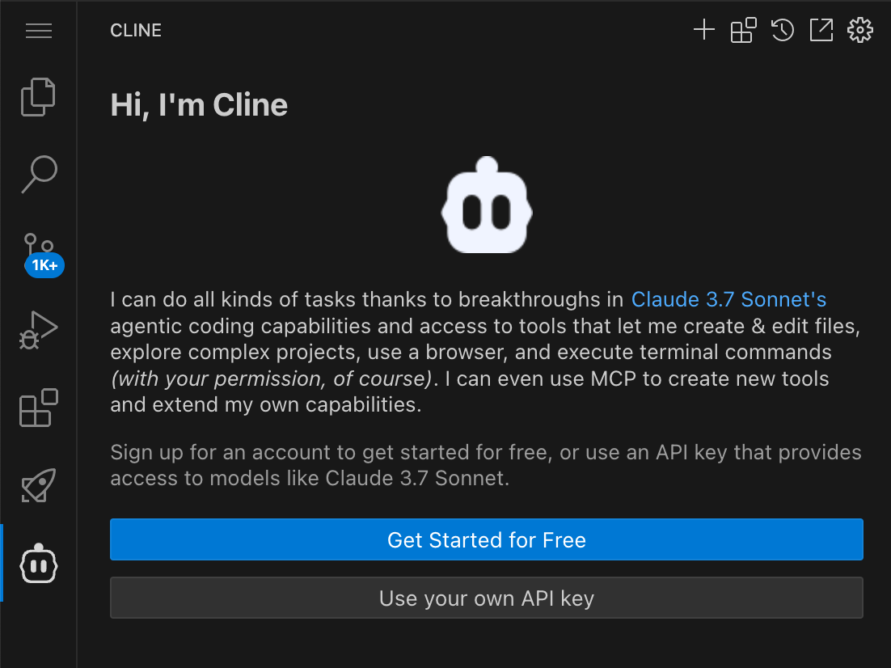
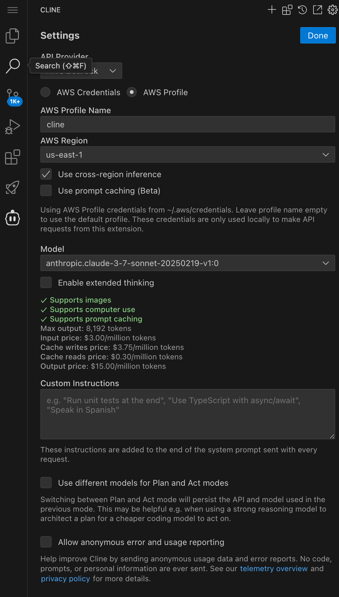
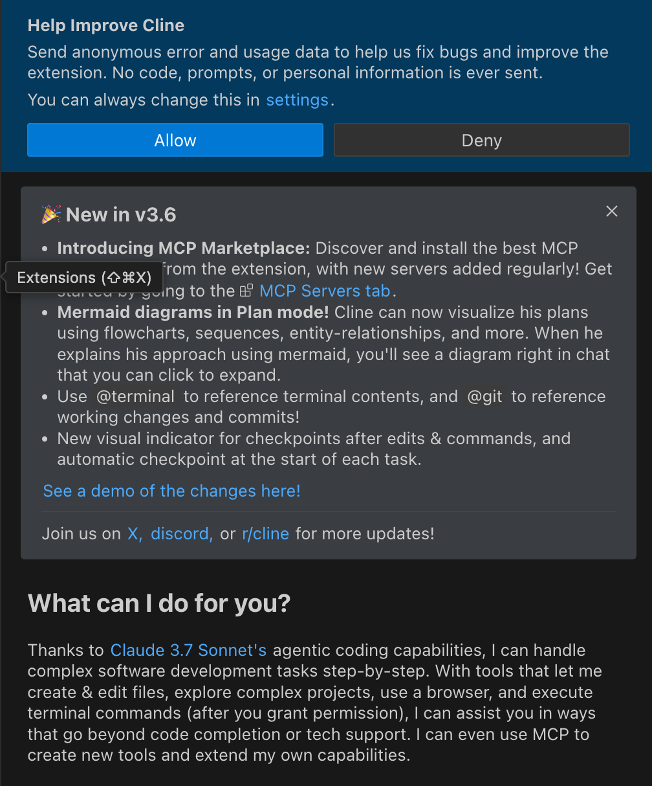

## Amazon Bedrock を利用した Cline セットアップ手順

### 1. Cline 拡張機能のインストール

VSCode の Extentions メニューから「Cline」を検索し、インストールを実行します。インストール完了後、VSCode を再起動することをお勧めします。



### 2. Amazon Bedrock の認証情報設定

認証方式として「Use your own API key」を選択し、以下の設定を行います：
- API Provider: Amazon Bedrock
- 認証方式: AWS Profile

AWS認証情報は以下の形式で `~/.aws/credentials` に設定する必要があります：

```
cat ~/.aws/credentials 
[cline]
aws_access_key_id = XXX
aws_secret_access_key = XXX
region = us-east-1
```



### 3. Cline の詳細設定

以下の設定項目を正確に入力してください：

- AWS Profile Name: cline
  - credentials ファイルで設定したプロファイル名と一致させてください
- AWS Region: us-east-1
  - Bedrock のサービスが利用可能なリージョンを指定
- ☑️ Use cross-region inference
  - このオプションは必ず有効にしてください
- Model: 最新の Claude 3 Sonnet モデル（例: anthropic.claude-3-sonnet-*）
  - 利用可能な最新のモデルを選択してください
  - UI に表示される最新のものを選択

設定が完了したら「Done」ボタンを押下します。



### 4. データ収集の設定

「Help Improve Cline」というダイアログが表示されたら、「Deny」を選択してください。

### セットアップ完了

以上で Cline の設定は完了です。VSCode のサイドバーに Cline のアイコンが表示され、利用可能な状態となります。

### トラブルシューティング

1. 認証エラーが発生する場合
   - AWS 認証情報が正しく設定されているか確認してください
   - リージョンが正しく設定されているか確認してください

2. モデルにアクセスできない場合
   - AWS アカウントで Bedrock のモデルへのアクセスが有効になっているか確認してください
   - 「Use cross-region inference」が有効になっているか確認してください

3. 拡張機能が正しく動作しない場合
   - VSCode を再起動してください
   - 拡張機能を一度アンインストールしてから再インストールしてください

### カスタマイズ設定

#### [.clinerules ファイル](https://docs.cline.bot/improving-your-prompting-skills/prompting)

本ディレクトリには、Cline の動作をカスタマイズするための `.clinerules` ファイルのサンプルを提供しています。

`.clinerules` ファイルは、プロジェクトのルートディレクトリに配置するだけで自動的に適用される設定ファイルです。このファイルを使用することで、プロジェクト固有の指示や規約を Cline に与えることができます。

詳細については、[Cline の公式ドキュメント](https://docs.cline.bot/improving-your-prompting-skills/prompting)を参照してください。
