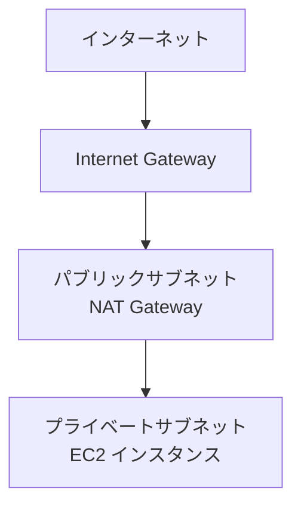
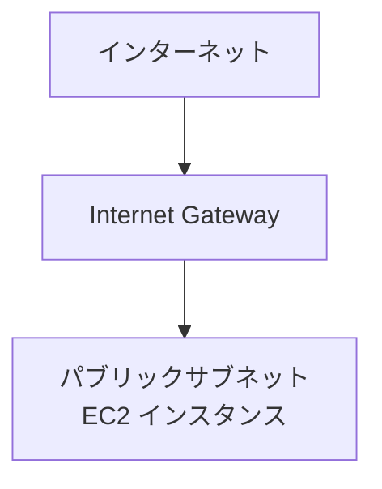

# EC2 with SSM Access CloudFormation Templates

このディレクトリには、 AWS Systems Manager アクセス可能な Amazon EC2 インスタンスをセットアップするための 2 つの AWS CloudFormation テンプレートが含まれています。

## テンプレートの選択

1. `ec2-ssm.yml` - 新しい Amazon VPC を作成する場合
   - 完全に独立した VPC 環境を構築
   - Amazon NAT Gateway 経由でインターネットアクセス
   - プライベートサブネットに EC2 を配置
   - Internet Gateway、NAT Gateway、パブリック/プライベートサブネットの完全な構成
   - より高いセキュリティが必要な環境に推奨

2. `ec2-ssm-default-vpc.yml` - デフォルト VPC を使用する場合
   - 既存のデフォルト VPC を使用
   - パブリックサブネットを自動検出（手動指定不要）
   - パラメータ入力を最小限に抑制
   - 開発環境や検証環境向けのシンプルな構成

## ネットワーク構成の詳細

### ec2-ssm.yml の構成



- Internet Gateway を介してパブリックサブネットがインターネットに接続
- NAT Gateway を介してプライベートサブネットからインターネットにアクセス可能
- EC2 インスタンスはプライベートサブネットに配置され、直接のインターネットアクセスを制限

### ec2-ssm-default-vpc.yml の構成



- デフォルト VPC の既存の Internet Gateway を使用
- パブリックサブネットを自動検出して EC2 インスタンスを配置
- シンプルな構成で素早いデプロイが可能

## デプロイ方法

### 1. ec2-ssm.yml を使用する場合

```bash
aws cloudformation deploy \
  --template-file ec2-ssm.yml \
  --stack-name ai-workshop-${USERNAME} \
  --parameter-overrides \
    UserName=${USERNAME} \
    Environment=dev \
    CodeServerPassword=code-server \
  --capabilities CAPABILITY_NAMED_IAM
```

### 2. ec2-ssm-default-vpc.yml を使用する場合

```bash
aws cloudformation deploy \
  --template-file ec2-ssm-default-vpc.yml \
  --stack-name ai-workshop-${USERNAME} \
  --parameter-overrides \
    UserName=${USERNAME} \
    Environment=dev \
    CodeServerPassword=code-server \
  --capabilities CAPABILITY_NAMED_IAM
```

## パラメータ説明

### 共通パラメータ

- `UserName`: リソース名の競合を防ぐための識別子（最大 20 文字）
- `Environment`: 環境名（ dev/stg/prod ）
- `InstanceType`: Amazon EC2 インスタンスタイプ
- `Region`: AWS リージョン
- `AmiId`: EC2 インスタンスの AMI ID
- `EbsVolumeSize`: Amazon EBS ボリュームサイズ（ GB ）
- `KeyPairName`: SSH アクセス用のキーペア名（オプション）
- `CodeServerPassword`: code-server のパスワード

### ec2-ssm.yml 固有のパラメータ

- `VpcCidr`: Amazon VPC の CIDR ブロック
- `PublicSubnet1Cidr`: パブリックサブネット 1 の CIDR
- `PublicSubnet2Cidr`: パブリックサブネット 2 の CIDR
- `AvailabilityZone1`: アベイラビリティゾーン 1
- `AvailabilityZone2`: アベイラビリティゾーン 2
- `AllowedIpRange`: Systems Manager アクセスを許可する IP レンジ

## アクセス方法

1. AWS CLI と AWS Systems Manager Session Manager プラグインをインストール

2. インスタンスの起動まで約 5-10 分待ちます

3. スタックの出力を確認します：
   ```bash
   # スタックの出力を確認
   aws cloudformation describe-stacks \
     --stack-name ai-workshop-${USERNAME} \
     --query 'Stacks[0].Outputs' \
     --output table
   ```

## code-server へのアクセス

1. ポートフォワードを設定します。以下のいずれかの方法を選択してください：

   a. AWS CLI を使用する場合：
   ```bash
   aws ssm start-session \
     --target <インスタンス ID> \
     --region us-east-1 \
     --document-name AWS-StartPortForwardingSession \
     --parameters '{"portNumber":["8080"],"localPortNumber":["18080"]}'
   ```

   b. port_forward.py スクリプトを使用する場合：
   ```bash
   cd workshops/ai-coding-workshop/cline/scripts
   uv venv && source .venv/bin/activate && uv sync
   # 必要に応じて config.yml にポートマッピングを追記してください
   uv run port_forward.py --instance-id <インスタンス ID>
   ```

   > **注意**:
   > - `<インスタンス ID>` は CloudFormation スタックの出力から確認できます
   > - ポートフォワードコマンドはローカル環境で実行する必要があります（CloudShell では実行できません）
   > - port_forward.py を使用する場合は Python と uv のインストールが必要です

2. ブラウザで http://localhost:18080 にアクセスし、code-server に接続します：
   - パスワード：環境構築時に設定した `CodeServerPassword` の値（デフォルト: code-server）

## パラメータの説明

| パラメータ名 | 説明 | デフォルト値 |
|------------|------|------------|
| UserName | リソース名の競合を防ぐためのユーザー名（英数字とハイフンが使用可能） | (必須) |
| Environment | 環境名（ dev/stg/prod ） | dev |
| InstanceType | Amazon EC2 インスタンスタイプ | m5.xlarge |
| Region | AWS リージョン | us-east-1 |
| VpcCidr | Amazon VPC の CIDR ブロック | 10.0.0.0/16 |
| EbsVolumeSize | Amazon EBS ボリュームサイズ（ GB ） | 20 |
| KeyPairName | SSH アクセス用のキーペア名 | (任意) |
| CodeServerPassword | code-server のパスワード | code-server |

## セキュリティに関する注意事項

1. `CodeServerPassword` は必ず変更してください
2. 本番環境では `AllowedIpRange` を適切な IP 範囲に制限することを推奨します
3. 環境構築後は、不要なリソースを削除してコストを最適化してください

## スタックの削除

環境が不要になった場合は、以下のコマンドでスタックを削除できます：

```bash
aws cloudformation delete-stack --stack-name ai-workshop-${USERNAME}
