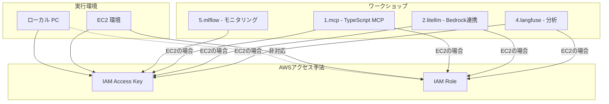

# ワークショップ詳細要件

このドキュメントでは、AI コーディングエージェントワークショップの実行環境、ワークショップパターン、AWS アクセス手法、および必要なツールとバージョンについて詳細に説明します。

## 1. 実行環境・ワークショップ・アクセス手法の対応表

### 1.1 詳細対応表

| 実行環境 | ワークショップ | アクセス手法 | 対応可否 | 必要ツール | 備考 |
|---------|--------------|-------------|---------|-----------|------|
| ローカル PC | 1.mcp | Access Key | ○ | Node.js 18.x+, TypeScript 5.3.3+ | TypeScript開発環境が必要 |
| ローカル PC | 1.mcp | IAM Role | × | - | ローカル環境では非対応 |
| ローカル PC | 2.litellm | Access Key | ○ | Python 3.9+, Docker, PostgreSQL 15 | Prompt Cachingは制限あり |
| ローカル PC | 2.litellm | IAM Role | × | - | ローカル環境では非対応 |
| ローカル PC | 4.langfuse | Access Key | ○ | Python 3.9+, Docker | - |
| ローカル PC | 4.langfuse | IAM Role | × | - | ローカル環境では非対応 |
| ローカル PC | 5.mlflow | Access Key | ○ | Python 3.10+, AWS CDK v2, Docker | CDK環境が必要 |
| ローカル PC | 5.mlflow | IAM Role | × | - | ローカル環境では非対応 |
| EC2 | 1.mcp | IAM Role | ○ | Node.js 18.x+, TypeScript 5.3.3+ | 推奨構成 |
| EC2 | 1.mcp | Access Key | ○ | Node.js 18.x+, TypeScript 5.3.3+ | - |
| EC2 | 2.litellm | IAM Role | ○ | Python 3.9+, Docker, PostgreSQL 15 | 推奨構成 |
| EC2 | 2.litellm | Access Key | ○ | Python 3.9+, Docker, PostgreSQL 15 | - |
| EC2 | 4.langfuse | IAM Role | ○ | Python 3.9+, Docker | 推奨構成 |
| EC2 | 4.langfuse | Access Key | ○ | Python 3.9+, Docker | - |
| EC2 | 5.mlflow | Access Key | ○ | Python 3.10+, AWS CDK v2, Docker | IAM Role非対応 |

## 2. 共通要件

すべての環境で必要な基本ツール：
- AWS CLI v2
- Docker
- Python 3.10+ (最も要求の厳しい 5.mlflow に合わせる)
- Node.js 18.x+
- Session Manager プラグイン（EC2環境の場合）

## 3. 環境別の詳細要件

### 3.1 ローカル PC 環境

| ツール | バージョン | 用途 |
|--------|-----------|------|
| VSCode | 最新 | 開発環境 |
| Python | 3.10+ | スクリプト実行、MLflow |
| Node.js | 18.x+ | TypeScript開発、MCP |
| AWS CLI | v2 | AWS操作 |
| Docker | 最新 | コンテナ実行 |
| TypeScript | 5.3.3+ | MCP開発 |
| AWS CDK | v2.x | MLflow インフラ構築 |

### 3.2 EC2 環境

| ツール | バージョン | 用途 |
|--------|-----------|------|
| code-server/Remote SSH | 最新 | 開発環境 |
| Python | 3.10+ | スクリプト実行、MLflow |
| Node.js | 18.x+ | TypeScript開発、MCP |
| AWS CLI | v2 | AWS操作 |
| Docker | 最新 | コンテナ実行 |
| TypeScript | 5.3.3+ | MCP開発 |
| AWS CDK | v2.x | MLflow インフラ構築 |

### 3.3 EC2 インスタンス推奨スペック

- インスタンスタイプ: m5.large
- vCPU: 2
- メモリ: 8 GB
- ストレージ: 30 GB 以上の gp3 ボリューム
- OS: Amazon Linux 2023 または Ubuntu 22.04 LTS

## 4. ワークショップ別の追加要件

### 4.1 1.mcp
- @modelcontextprotocol/sdk 0.6.0+
- @types/node 20.11.24+

### 4.2 2.litellm
- litellm 最新版
- PostgreSQL 15

### 4.3 4.langfuse
- langfuse Python SDK
- dotenv

### 4.4 5.mlflow
- mlflow 2.8.0+
- boto3 1.28.0+
- AWS CDK v2.x
