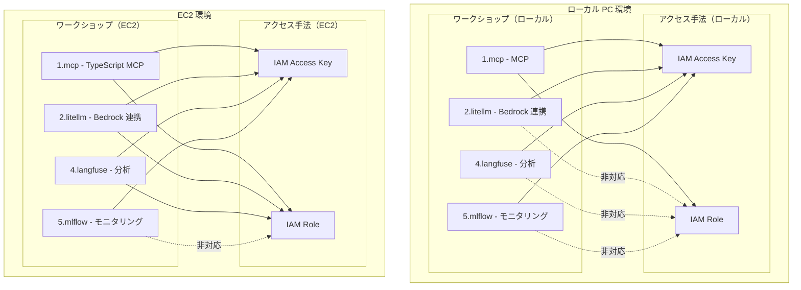

# ワークショップ詳細要件

このドキュメントでは、AI コーディングエージェントワークショップの実行環境、ワークショップパターン、AWS アクセス手法、および必要なツールとバージョンについて詳細に説明します。

## 1. 実行環境・ワークショップ・アクセス手法の対応表

### 1.1 詳細対応表

| 実行環境 | ワークショップ | アクセス手法 | 対応可否 | 必要ツール | 備考 |
|---------|--------------|-------------|---------|-----------|------|
| ローカル PC | 1.mcp | Access Key | ○ | Node.js 18.x+, TypeScript 5.3.3+ | - |
| ローカル PC | 1.mcp | IAM Role | ○ | Node.js 18.x+, TypeScript 5.3.3+ | - |
| ローカル PC | 2.litellm | Access Key | ○ | Python 3.9+, Docker | Prompt Caching は設定を修正する必要あり |
| ローカル PC | 2.litellm | IAM Role | × | - | ローカル環境では非対応 |
| ローカル PC | 4.langfuse | Access Key | ○ | Python 3.9+, Docker | - |
| ローカル PC | 4.langfuse | IAM Role | × | - | ローカル環境では非対応 |
| ローカル PC | 5.mlflow | Access Key | ○ | Python 3.10+, AWS CDK v2, Docker | CDK 環境が必要 |
| ローカル PC | 5.mlflow | IAM Role | × | - | ローカル環境では非対応 |
| EC2 | 1.mcp | IAM Role | ○ | Node.js 18.x+, TypeScript 5.3.3+ | 推奨構成 |
| EC2 | 1.mcp | Access Key | ○ | Node.js 18.x+, TypeScript 5.3.3+ | - |
| EC2 | 2.litellm | IAM Role | ○ | Python 3.9+, Docker | 推奨構成 |
| EC2 | 2.litellm | Access Key | ○ | Python 3.9+, Docker | - |
| EC2 | 4.langfuse | IAM Role | ○ | Python 3.9+, Docker | 推奨構成 |
| EC2 | 4.langfuse | Access Key | ○ | Python 3.9+, Docker | - |
| EC2 | 5.mlflow | IAM Role | × | - | IAM Role 非対応 |
| EC2 | 5.mlflow | Access Key | ○ | Python 3.10+, AWS CDK v2, Docker | 推奨構成 |

## 2. 共通要件

すべての環境で必要な基本ツール：
- AWS CLI v2
- Docker
- Python 3.10+ (最も要求の厳しい MLflow に合わせる)
- Node.js 18.x+
- Session Manager プラグイン（EC2 環境の場合）

## 3. 環境別の詳細要件

### 3.1 ローカル PC 環境

| ツール | バージョン | 用途 |
|--------|-----------|------|
| VSCode | 最新 | 開発環境 |
| Python | 3.10+ | スクリプト実行、MLflow |
| Node.js | 18.x+ | TypeScript 開発、MCP |
| AWS CLI | v2 | AWS 操作、MLflow 利用時には v2 が必要 |
| Docker | 最新 | コンテナ実行 |
| TypeScript | 5.3.3+ | MCP 開発 |
| AWS CDK | v2.x | MLflow インフラ構築 |

### 3.2 EC2 環境

| ツール | バージョン | 用途 |
|--------|-----------|------|
| code-server / Remote SSH | 最新 | 開発環境、0.setup で導入 |
| Python | 3.10+ | スクリプト実行、MLflow、導入済み |
| Node.js | 18.x+ | TypeScript 開発、MCP |
| AWS CLI | v2 | AWS 操作、MLflow 利用時には v2 が必要 |
| Docker | 最新 | コンテナ実行 |
| TypeScript | 5.3.3+ | MCP 開発 |
| AWS CDK | v2.x | MLflow インフラ構築 |
