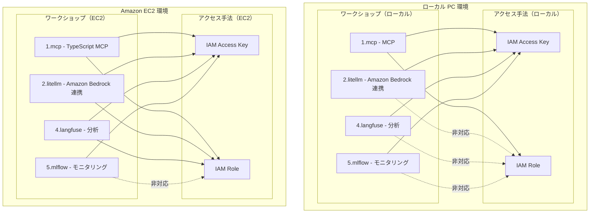

# ワークショップ詳細要件

このドキュメントでは、AI コーディングエージェントワークショップの実行環境、ワークショップパターン、AWS アクセス手法、および必要なツールとバージョンについて詳細に説明します。

## 1. 実行環境・ワークショップ・アクセス手法の対応表



### 1.1 詳細対応表

| 実行環境 | ワークショップ | アクセス手法 | 対応可否 | 必要ツール | 備考 |
|---------|--------------|-------------|---------|-----------|------|
| ローカル PC | 1.mcp | Access Key | ○ | Node.js 18.x+, TypeScript 5.3.3+ | - |
| ローカル PC | 1.mcp | IAM Role | ○ | Node.js 18.x+, TypeScript 5.3.3+ | - |
| ローカル PC | 2.litellm | Access Key | ○ | Python 3.9+, Docker | Prompt Caching 利用は設定を修正する必要あり |
| ローカル PC | 2.litellm | IAM Role | × | - | ローカル環境では非対応 |
| ローカル PC | 4.langfuse | Access Key | ○ | Python 3.9+, Docker | - |
| ローカル PC | 4.langfuse | IAM Role | × | - | ローカル環境では非対応 |
| ローカル PC | 5.mlflow | Access Key | ○ | Python 3.10+, AWS CDK v2, Docker | CDK 環境が必要 |
| ローカル PC | 5.mlflow | IAM Role | × | - | ローカル環境では非対応 |
| EC2 | 1.mcp | IAM Role | ○ | Node.js 18.x+, TypeScript 5.3.3+ | 推奨構成 |
| EC2 | 1.mcp | Access Key | ○ | Node.js 18.x+, TypeScript 5.3.3+ | - |
| EC2 | 2.litellm | IAM Role | ○ | Python 3.9+, Docker | 推奨構成 |
| EC2 | 2.litellm | Access Key | ○ | Python 3.9+, Docker | Prompt Caching 利用は設定を修正する必要あり |
| EC2 | 4.langfuse | IAM Role | ○ | Python 3.9+, Docker | 推奨構成 |
| EC2 | 4.langfuse | Access Key | ○ | Python 3.9+, Docker | - |
| EC2 | 5.mlflow | IAM Role | × | - | IAM Role 非対応 |
| EC2 | 5.mlflow | Access Key | ○ | Python 3.10+, AWS CDK v2, Docker | 推奨構成 |

## 2. 共通要件

すべての環境で必要な基本ツール：
- AWS CLI v2
- Docker
- Python 3.10+ (最も要求の厳しい MLflow に合わせる)
- Node.js 18.x+
- AWS Systems Manager Session Manager プラグイン（Amazon EC2 アクセス用）

## 3. 環境別の詳細要件

### 3.1 ローカル PC 環境

| ツール | バージョン | 用途 |
|--------|-----------|------|
| VS Code | 最新 | 開発環境 |
| Python | 3.10+ | スクリプト実行、MLflow |
| Node.js | 18.x+ | TypeScript 開発、MCP |
| AWS CLI | v2 | AWS 操作、MLflow 利用時には v2 が必要 |
| Docker | 最新 | コンテナ実行 |
| TypeScript | 5.3.3+ | MCP 開発 |
| AWS CDK | v2.x | MLflow インフラ構築 |

### 3.2 Amazon EC2 環境

Amazon EC2 環境の場合は user data を用いて事前に必要ツールをインストールしています。
mise コマンドでインストール済みのツールバージョンを確認してください。

```bash
$ mise ls
Tool    Version  Source                      Requested 
node    22.15.0  ~/.config/mise/config.toml  22
python  3.10.17  ~/.config/mise/config.toml  3.10
uv      0.6.16   ~/.config/mise/config.toml  0.6.16

# もしインストールが正常にできていない場合、以下を実行
$ mise install uv@0.6.16 python@3.10 node@

$ aws --version
aws-cli/2.27.0 Python/3.13.2 Linux/6.8.0-1024-aws exe/x86_64.ubuntu.24

$ docker -v
Docker version 28.1.1, build 4eba377
```

| ツール | バージョン | 用途 |
|--------|-----------|------|
| VS Code Server / Remote SSH | 最新 | 作業環境 |
| Python | 3.10 | スクリプト実行、MLflow |
| Node.js | 22 | TypeScript 開発、MCP |
| AWS CLI | v2 | AWS 操作、managed MLflow 構築 |
| Docker | 28.1.1 | コンテナ実行 |
| TypeScript | 5.3.3+ | MCP 開発 |