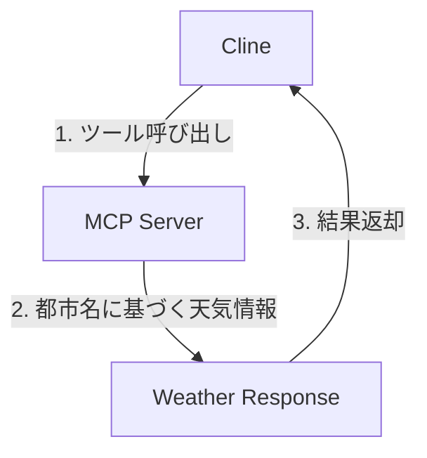
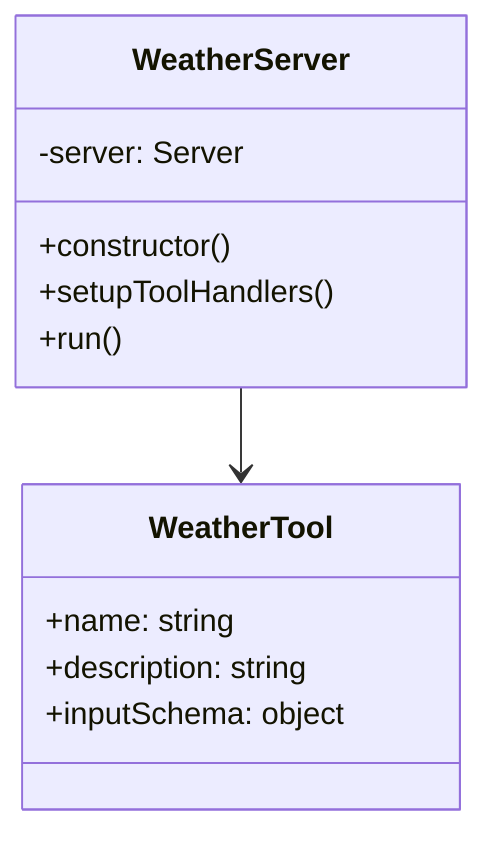
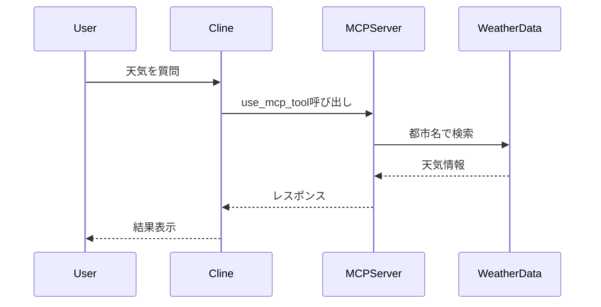

# Step 2: MCPサーバー実装の解説

## 概要
Step 1で実装した天気予報MCPサーバーの詳細な解説と、Clineなどのコーディングエージェントについて説明します。

## MCPサーバーの構成

### コンポーネントの説明
1. **Cline (AI Agent)**
   - ユーザーからの要求を解釈
   - MCPサーバーのツールを使用して天気情報を取得
   - 結果をユーザーに提示

2. **MCP Server**
   - TypeScriptで実装された天気予報サーバー
   - 都市名をパラメータとして受け取り
   - 事前定義された天気情報を返却

3. **Weather Response**
   - 都市名、天気状態、気温を含むJSON形式のレスポンス
   - 天気状態は "sunny"、"rainy"、"cloudy" のいずれか

## 実装の詳細

### 1. サーバー構造

### 2. データフロー

## コーディングエージェントの概要

### Clineとは
- AIを活用したコーディングアシスタント
- 自然言語での指示を理解し、コードの作成・編集が可能
- ツールを通じてシステムとの対話が可能

### MCPの役割
1. **拡張性**
   - 外部ツールやAPIとの連携を可能に
   - カスタムツールの追加が容易

2. **標準化**
   - ツールとの通信プロトコルを規定
   - 一貫した方法でのツール利用を実現

3. **セキュリティ**
   - 実行可能な操作を制限
   - 環境変数による認証管理

## 実装のポイント

### 1. TypeScriptの活用
- 型安全性の確保
- インターフェースの明確な定義
- コードの保守性向上

### 2. エラーハンドリング
- 不正な入力値のバリデーション
- エラーメッセージの適切な返却
- 例外処理の実装

### 3. 拡張性への配慮
- 新しい都市や天気状態の追加が容易
- 将来的なAPI連携への対応も考慮

## まとめ
- MCPサーバーを通じて、AIエージェントに新しい機能を提供
- 型安全性とエラーハンドリングを考慮した実装
- 拡張性を持たせた設計により、将来の機能追加にも対応可能
- [MCP servers](https://github.com/modelcontextprotocol/servers)