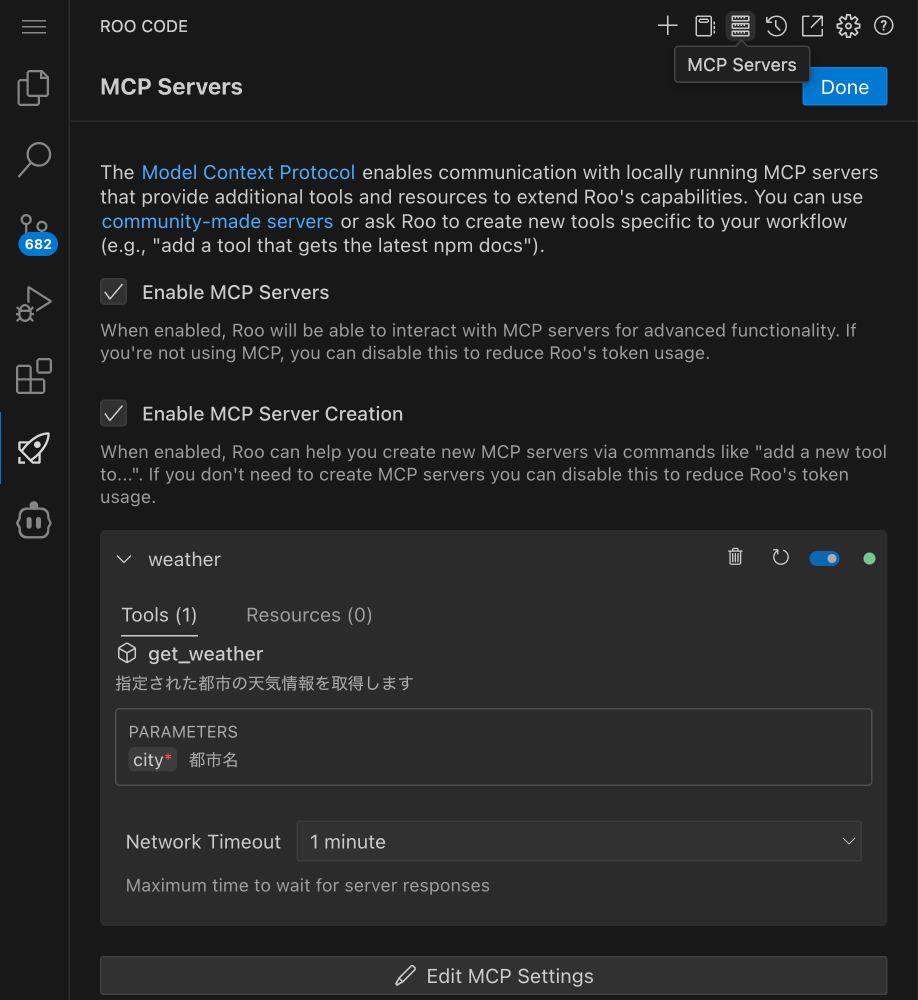
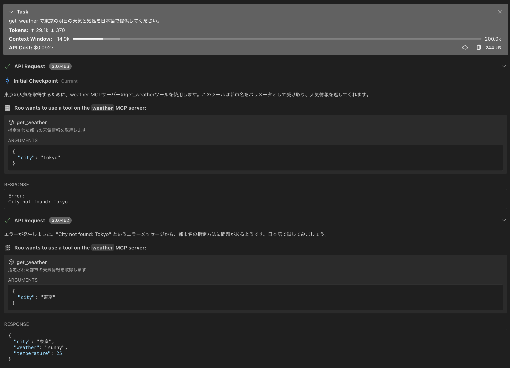

# Cline で作る Weather MCP サーバーハンズオン

## はじめに

このハンズオンでは、AI コーディングエージェント Cline を活用して、天気予報情報を提供する MCP サーバーを実装します。Cline に適切な指示を与えることで、TypeScript による MCP サーバーの実装を体験します。

## ハンズオンの目的

このハンズオンを通じて、参加者は以下のスキルを習得できます。

Cline を活用して MCP サーバーを実装することで、AI コーディングエージェントの効果的な活用方法を学びます。また、MCP の基本概念を理解し、AI エージェントの機能拡張の仕組みを体験的に理解できます。

## 開発環境の準備

このハンズオンを始める前に、Node.js 18.x 以上がインストールされていること、TypeScript の基本的な理解があること、そして VSCode と Cline の環境セットアップが完了していることを確認してください。

## Cline による MCP サーバー実装の流れ

### プロジェクトの準備

まず、MCP サーバー開発のためのプロジェクトを作成します。以下のコマンドを実行してください。

```bash
cd ~/Cline/MCP
npx @modelcontextprotocol/create-server weather-server && \
cd weather-server && \
npm install axios
```

このコマンドにより、MCP サーバーの基本的なプロジェクト構造が生成され、必要な依存関係がインストールされます。
作業は ~/Cline/MCP/weather-server で行います。

### Cline への実装依頼

次に、Cline に MCP サーバーの実装を依頼します。VSCode で Cline を開き、以下のようなプロンプトを入力してください。

```
天気予報の MCP サーバーを作成してください。以下の要件で実装をお願いします：

要件：
1. 都市名を入力として受け取り、その都市の天気予報を返すツールを提供する
2. 実際の API 通信は行わず、以下の固定値を返す：
   - 晴れ（sunny）: 東京、大阪、福岡
   - 雨（rainy）: ロンドン、シアトル
   - 曇り（cloudy）: パリ、ニューヨーク
3. TypeScript で実装する
4. MCP の SDK を使用する
5. 天気情報は以下の形式で返す：
   {
     city: string;
     weather: "sunny" | "rainy" | "cloudy";
     temperature: number;
   }

また、以下の点に注意して実装してください：
- エラーハンドリングを適切に行う
- コードの可読性を意識する
- TypeScript の型定義を活用する
- ~/Cline/MCP/weather-server サーバで作業を行う
```

### 実装の確認とフィードバック

Cline が作成したコードを確認し、必要に応じて追加の要望を出しましょう。例えば、以下のようなフィードバックが考えられます。

```
以下の点について改善をお願いします：
1. エラーメッセージをより具体的にして、ユーザーが問題を特定しやすくする
2. 温度の範囲に現実的な制限（例：-50℃〜50℃）を追加する
3. コメントを追加して処理の説明を充実させ、コードの保守性を高める
```

コードレビューの際は、型定義の適切さ、エラーハンドリングの網羅性、コードの構造と可読性、エッジケースへの対応などに注目すると良いでしょう。

### ビルドとセットアップ

実装が完了したら、以下の手順でビルドとセットアップを行います。

まず、プロジェクトをビルドします。

```bash
cd weather-server
npm run build
```

次に、VSCode の設定から MCP Settings を開き、以下の設定を追加します。args のパスを修正してください。



```json
{
  "mcpServers": {
    "weather": {
      "command": "node",
      "args": ["/absolute/path/to/weather-server/build/index.js"],
      "disabled": false,
      "autoApprove": []
    }
  }
}
```

### 動作確認

設定が完了したら、Cline に「東京の天気は？」などと質問して動作を確認します。正しく実装されていれば、設定した都市の天気情報が返されるはずです。



## 学習のポイント

このハンズオンを通じて、以下の点を学ぶことができます。

Cline に適切な指示を与えることで、複雑な実装も効率的に行えることを体験できます。TypeScript の型システムを活用した安全なコーディングの重要性や、エラーハンドリングの適切な実装方法についても理解を深められます。また、MCP の基本的な仕組みと、AI エージェントの機能拡張方法についても学ぶことができます。

## トラブルシューティング

実装中に問題が発生した場合は、以下の点を確認してください。

サーバーが起動しない場合は、ビルドが正常に完了しているか、パスが正しく設定されているか、必要な依存関係がインストールされているかを確認しましょう。天気情報が取得できない場合は、都市名が正しく指定されているか、サポートされている都市かどうかを確認してください。型エラーが発生する場合は、TypeScript の設定が正しいか、必要な型定義がインストールされているかを確認しましょう。

## 参考資料

より詳しい情報は、以下のリソースを参照してください。

- [Model Context Protocol 公式ドキュメント](https://modelcontextprotocol.github.io/)
- [TypeScript 公式ドキュメント](https://www.typescriptlang.org/docs/)
- [Node.js 公式ドキュメント](https://nodejs.org/docs/latest-v18.x/api/)
- [Cline ドキュメント](https://docs.cline.tools/)

実装に困難が生じた場合は、`answer` ディレクトリにある解答例と比較してみてください。この参照実装は、MCP サーバーの基本的な構造と実装パターンを理解するための良い教材となります。

## 解答例（answer）の使用方法

実装に困難が生じた場合や、すぐに動作確認をしたい場合は、`answer` ディレクトリにある解答例を使用することができます。answer ディレクトリには、要件を満たす完全な実装が含まれています。

### answer ディレクトリを使うタイミング

以下のような場合に answer ディレクトリの実装を参照することをお勧めします：

- 自分の実装でエラーが発生し、解決できない場合
- TypeScript や MCP の概念を理解するための参考として
- 正しい実装の例を確認したい場合
- 時間の制約があり、すぐに動作確認をしたい場合

### answer ディレクトリの MCP サーバーを設定する方法

1. まず、answer ディレクトリに移動して必要な依存関係をインストールし、ビルドを実行します。

```bash
cd /home/coder/aws-samples/workshops/ai-coding-workshop/cline/1.mcp/0.weather-mcp/answer
npm install
npm run build
```

2. VSCode の設定から MCP Settings を開き、以下の設定を追加します。

```json
{
  "mcpServers": {
    "github.com/weather-server": {
      "command": "node",
      "args": [
        "/home/coder/aws-samples/workshops/ai-coding-workshop/cline/1.mcp/0.weather-mcp/answer/build/index.js"
      ],
      "env": {},
      "disabled": false,
      "autoApprove": []
    }
  }
}
```

3. Cline を再起動して、設定を反映させます。

4. 動作確認として、以下のように使用できます：

```
use_mcp_tool
server_name: github.com/weather-server
tool_name: get_weather
arguments: {"city": "東京"}
```

## よくあるエラーとトラブルシューティング

MCP サーバーの実装中に発生しやすいエラーとその解決方法を紹介します。

### TypeScript のコンパイルエラー

**エラー例**: `tsc: command not found` や型定義に関するエラー

**解決方法**:
- TypeScript がインストールされているか確認する
- `npm install -g typescript` でグローバルにインストールするか、`npx tsc` を使用する
- `tsconfig.json` の設定を確認する（特に `moduleResolution` や `target` の設定）
- 必要な型定義ファイル（例：`@types/node`）がインストールされているか確認する

### MCP サーバーの接続エラー

**エラー例**: `Error executing MCP tool: {"name":"Error","message":"Not connected"}`

**解決方法**:
- Cline を再起動する
- MCP 設定ファイルのパスが正しいか確認する
- サーバープロセスが正常に起動しているか確認する
- ビルドが正常に完了しているか確認する

### サーバー名の設定ミス

**エラー例**: `Unknown tool` や `Unknown server`

**解決方法**:
- MCP 設定ファイルのサーバー名と、使用時のサーバー名が一致しているか確認する
- ツール名が正しく設定されているか確認する

### パスの設定ミス

**エラー例**: ファイルが見つからないエラー

**解決方法**:
- 絶対パスを使用する（`~` や相対パスではなく）
- ファイルの存在を確認する
- 実行権限が適切に設定されているか確認する
