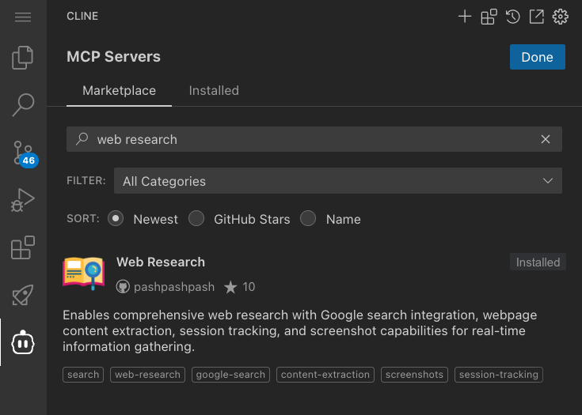

# MCP Marketplace で広がる AI エージェントの可能性

## はじめに

[MCP Marketplace](https://cline.bot/mcp-marketplace) は、AI エージェントの機能を拡張するための豊富なツールとリソースを提供します。このワークショップでは、MCP Marketplace を導入する体験をします。[Model Context Protocol servers](https://github.com/modelcontextprotocol/servers) にも多くの MCP が公開されているので試してみてください。

## MCP Marketplace

MCP Marketplace にアクセスするには、VSCode の Cline 拡張機能を開き、左側のサイドバーから「MCP Servers」を選択し、画面上部の「Marketplace」タブをクリックします。ここでは、様々な MCP サーバーを探索することができます。



Marketplace では、キーワード検索を通じて必要なツールを見つけ、Cline 自身の能力でインストール作業を進めます。また、インストール済みのサーバーの設定管理や、最新バージョンへの更新も簡単に行えます。

## AI エージェントの能力を拡張する MCP サーバー例


### 多様なコンテンツを理解する Markdownify MCP

Markdownify MCP は、様々な形式のコンテンツを AI エージェントが理解しやすいマークダウン形式に変換します。PDF や Office ドキュメント、ウェブページ、さらには YouTube 動画の字幕まで、幅広いコンテンツを扱うことができます。このサーバーを使用することで、AI エージェントは PDF ファイルの要約、Web ページの情報分析、YouTube 動画の内容理解など、多様なタスクをこなすことができます。

### 最新のライブラリドキュメントを活用する Context7 MCP

Context7 MCP は、AI エージェントが最新のライブラリドキュメントにアクセスできるようにする強力なツールです。従来の LLM が抱える以下の問題を解決します：

❌ 古いトレーニングデータに基づく古いコード例
❌ 実在しない API の誤った生成
❌ 古いパッケージバージョンに基づく一般的な回答

Context7 を使用することで：
✅ ソースから直接、最新のバージョン固有のドキュメントとコード例を取得
✅ プロンプトに直接、最新の情報を組み込み
✅ 常に最新の API 仕様に基づいた正確な回答を得られます

#### 導入手順

1. VSCode の Cline 拡張機能で MCP Marketplace を開く
2. Context7 MCP をインストール

#### 使用方法

質問に `use context7` を追加するだけで、最新のドキュメントが自動的に取得されます：

```
Next.js の `after` 関数の使い方を教えて use context7
React Query でクエリを無効化する方法は？ use context7
NextAuth でルートを保護する方法は？ use context7
```

詳しい情報は [Context7 のライブラリページ](https://context7.com/libraries) で確認できます。

## MCP サーバーの効果的な管理

MCP サーバーを効果的に活用するためには、適切な管理が重要です。VSCode の Cline 拡張機能の「MCP Servers」セクションでは、インストール済みのサーバーを一覧表示し、各サーバーの設定変更や有効/無効の切り替えを簡単に行うことができます。

サーバーの設定は、「Settings」アイコンから変更できます。また、一時的に特定のサーバーを無効にしたい場合は、トグルスイッチを使用して簡単に切り替えることができます。

## セキュリティとプライバシーへの配慮

MCP サーバーの利用にあたっては、セキュリティとプライバシーへの適切な配慮が不可欠です。信頼できる開発者やコミュニティが提供する MCP サーバーのみを使用し、オープンソースの場合はコードの確認を行うことをお勧めします。

特に Web Research などのインターネットにアクセスする MCP サーバーを使用する際は、機密情報や個人情報の取り扱いに注意が必要です。また、ローカル AI モデルを使用する MCP サーバーは、システムリソースを大量に消費する可能性があるため、システム要件の確認とリソース制限の設定を検討してください。各 MCP サーバーが要求するアクセス権限は必要最小限に留め、不審なアクセス要求がある場合はインストールを中止することをお勧めします。

## 問題解決とトラブルシューティング

MCP サーバーの利用中に問題が発生した場合は、まず問題の切り分けを行うことが重要です。サーバーが起動しない場合は、依存関係のインストール状況やサーバーの設定を確認します。ツールが表示されない場合は、サーバーの起動状態を確認し、必要に応じて Cline の再起動を試みてください。

パフォーマンスの問題が発生した場合は、同時に実行している MCP サーバーの数を見直し、必要に応じて一部のサーバーを無効化することで改善できる場合があります。
問題の詳細な分析には、VSCode の「出力」パネルでログを確認することが有効です。ログには、サーバーの動作状況やエラーの詳細が記録されており、問題の原因特定に役立ちます。

## さらなる可能性の探求

MCP Marketplace は常に進化し続けており、新しい MCP サーバーが追加されることで、AI エージェントの可能性はさらに広がっていきます。また、独自の MCP サーバーを開発することで、特定のニーズに応じた機能拡張も可能です。

カスタム MCP サーバーの開発に興味がある場合は、[MCP SDK ドキュメント](https://modelcontextprotocol.github.io/docs/sdk-reference)や[MCP サーバー開発ガイド](https://modelcontextprotocol.github.io/docs/server-development-guide)を参照してください。また、[MCP サーバーのサンプルコード](https://github.com/modelcontextprotocol/servers)も開発の参考になります。

## 参考資料

詳しい情報は、以下のリソースを参照してください：

- [Model Context Protocol 公式ドキュメント](https://modelcontextprotocol.github.io/)
- [MCP GitHub リポジトリ](https://github.com/modelcontextprotocol)
- [Cline ドキュメント](https://docs.cline.tools/)
