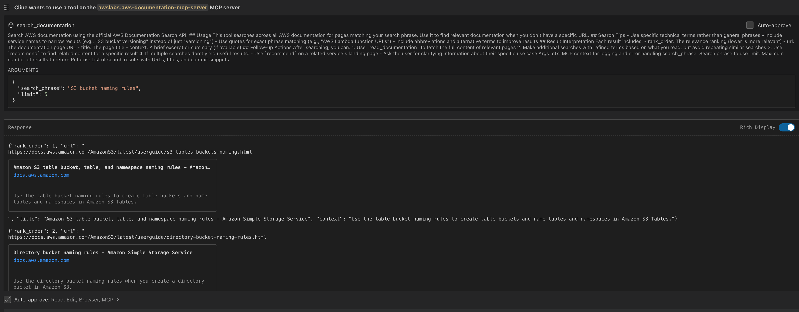
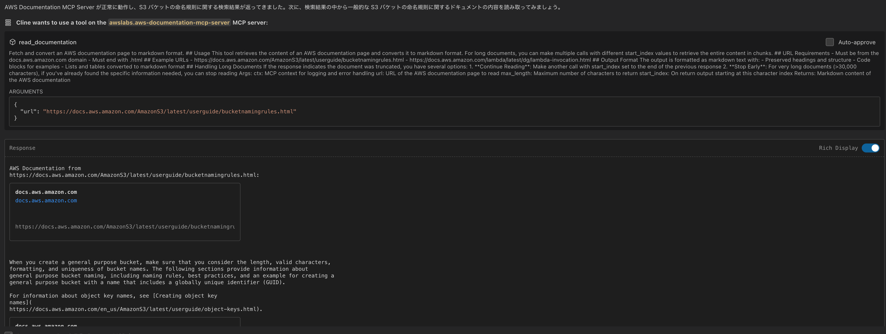

# AWS MCP サーバーで開発ワークフローを強化する

## はじめに

AWS Model Context Protocol (MCP) サーバーは、AWS のベストプラクティスと豊富な情報資源を開発ワークフローに直接統合する革新的なツールです。このワークショップでは、AWS が提供する MCP サーバーの活用方法を学び、AI エージェントを通じて AWS サービスの情報にシームレスにアクセスする方法を習得します。AWS MCP は Cline の MCP Marketplace から導入できるようになっており、本手順の情報が古くなっている可能性があるため公式ドキュメントのインストール手順を正として導入してください。

AWS MCP サーバーの最新情報は、公式の [GitHub リポジトリ](https://github.com/aws/aws-mcp/tree/main) で確認できます。

## 開発環境の準備

Amazon Bedrock Knowledge Bases MCP 等の AWS サービスへのアクセスを伴う MCP を試す場合、このワークショップを始める前に、いくつかの準備が必要です。まず、Python 3.10 以上と、パッケージ管理ツールである uv がインストールされていることを確認してください。uv は [Astral](https://astral.sh/) または [GitHub](https://github.com/astral-sh/uv) からインストールできます。

次に、AWS 認証情報を設定します。AWS CLI がインストールされていない場合は、以下のコマンドでインストールしてください。

```bash
curl "https://awscli.amazonaws.com/awscli-exe-linux-x86_64.zip" -o "awscliv2.zip"
unzip awscliv2.zip
sudo ./aws/install
```

インストール後、`aws configure` コマンドを実行して、AWS Access Key ID、Secret Access Key、デフォルトリージョン（例：us-east-1）、出力形式（json）を設定します。

また、使用する MCP サーバーに応じて、適切な IAM 権限が必要です。AWS Documentation MCP Server には `docs.aws.amazon.com` へのアクセス権限が、Bedrock KB Retrieval MCP Server には `bedrock:*` および関連する権限が必要です。

最後に、VSCode と Cline の環境セットアップが完了していることと、MCP 設定ファイルへのアクセス権限があることを確認してください。

## AWS MCP サーバーの世界

AWS は、開発者の生産性向上と AWS サービスの効果的な活用を支援するために、複数の MCP サーバーを提供しています。それぞれのサーバーは特定の目的に特化しており、連携して使用することで強力な開発環境を構築できます。

### 開発ワークフローの中心となる Core MCP Server

Core MCP Server は、AWS Labs MCP サーバー群の中心的な役割を担います。このサーバーを通じて、他の MCP サーバーの管理や調整、設定の一元化を行うことができます。

Core MCP Server をインストールするには、以下のコマンドを実行します。

```bash
uv pip install awslabs.core-mcp-server
```

設定ファイルには、以下のような内容を追加します。

```json
{
  "mcpServers": {
    "awslabs.core-mcp-server": {
      "command": "uvx",
      "args": ["awslabs.core-mcp-server@latest"],
      "env": {
        "FASTMCP_LOG_LEVEL": "ERROR",  // ログレベル: ERROR, INFO, DEBUG, TRACE
        "MCP_SETTINGS_PATH": "/home/coder/.local/share/code-server/User/globalStorage/saoudrizwan.claude-dev/settings/cline_mcp_settings.json",
        "AWS_SDK_LOAD_CONFIG": "1"  // AWS SDK の設定ファイルを読み込む
      }
    }
  }
}
```

### AWS の膨大な知識にアクセスする AWS Documentation MCP Server

AWS Documentation MCP Server は、AWS の公式ドキュメントを効率的に検索、探索、活用するためのサーバーです。このサーバーを使用することで、AI エージェントは AWS の膨大なドキュメントから必要な情報を素早く見つけ出し、マークダウン形式で提供できます。

AWS Documentation MCP Server をインストールするには、以下のコマンドを実行します。

```bash
uv pip install awslabs.aws-documentation-mcp-server
```

設定ファイルには、以下のような内容を追加します。

```json
{
  "mcpServers": {
    "awslabs.aws-documentation-mcp-server": {
      "command": "uvx",
      "args": ["awslabs.aws-documentation-mcp-server@latest"],
      "env": {
        "FASTMCP_LOG_LEVEL": "ERROR",  // ログレベル: ERROR, INFO, DEBUG, TRACE
        "AWS_SDK_LOAD_CONFIG": "1",     // AWS SDK の設定ファイルを読み込む
        "DOCS_CACHE_TTL": "3600"        // ドキュメントキャッシュの有効期限（秒）
      }
    }
  }
}
```

### カスタム知識ベースを活用する Amazon Bedrock Knowledge Bases Retrieval MCP Server

Amazon Bedrock Knowledge Bases Retrieval MCP Server は、Amazon Bedrock の知識ベースを効率的に活用するためのツールです。このサーバーを使用することで、自然言語クエリを用いて知識ベースから情報を検索し、結果をフィルタリングやリランキングすることができます。

Bedrock KB Retrieval MCP Server をインストールするには、以下のコマンドを実行します。

```bash
uv pip install awslabs.bedrock-kb-retrieval-mcp-server
```

設定ファイルには、以下のような内容を追加します。

```json
{
  "mcpServers": {
    "awslabs.bedrock-kb-retrieval-mcp-server": {
      "command": "uvx",
      "args": ["awslabs.bedrock-kb-retrieval-mcp-server@latest"],
      "env": {
        "AWS_PROFILE": "default",           // AWS プロファイル名
        "AWS_REGION": "us-east-1",          // AWS リージョン
        "FASTMCP_LOG_LEVEL": "ERROR",       // ログレベル
        "BEDROCK_KB_CACHE_TTL": "3600",     // ナレッジベースキャッシュの有効期限（秒）
        "BEDROCK_MAX_TOKENS": "2000",       // 生成するトークンの最大数
        "BEDROCK_TEMPERATURE": "0.7"        // 生成時の温度パラメータ
      }
    }
  }
}
```

AWS MCP サーバーの詳細な情報と使用例については、AWS ブログ記事「[Introducing AWS MCP Servers for code assistants (Part 1)](https://aws.amazon.com/jp/blogs/machine-learning/introducing-aws-mcp-servers-for-code-assistants-part-1/)」を参照してください。この記事では、各サーバーの機能や利点、実際の使用シナリオについて詳しく説明されています。

## 複数の AWS MCP サーバーを連携させる

AWS MCP サーバーの真の力は、複数のサーバーを連携させることで発揮されます。以下は、全ての MCP サーバーを統合した設定ファイルの例です。

```json
{
  "mcpServers": {
    "awslabs.core-mcp-server": {
      "command": "uvx",
      "args": ["awslabs.core-mcp-server@latest"],
      "env": {
        "FASTMCP_LOG_LEVEL": "ERROR",
        "MCP_SETTINGS_PATH": "path to your mcp settings file"
      }
    },
    "awslabs.aws-documentation-mcp-server": {
      "command": "uvx",
      "args": ["awslabs.aws-documentation-mcp-server@latest"],
      "env": {
        "FASTMCP_LOG_LEVEL": "ERROR"
      }
    },
    "awslabs.bedrock-kb-retrieval-mcp-server": {
      "command": "uvx",
      "args": ["awslabs.bedrock-kb-retrieval-mcp-server@latest"],
      "env": {
        "AWS_PROFILE": "your-aws-profile",
        "AWS_REGION": "us-east-1",
        "FASTMCP_LOG_LEVEL": "ERROR"
      }
    }
  }
}
```

この設定により、AI エージェントは状況に応じて最適な AWS MCP サーバーを選択し、シームレスに情報を取得できるようになります。

## AWS MCP サーバーの実践的な活用例

AWS MCP サーバーの活用方法を具体的に理解するために、AWS Documentation MCP Server を使用して AWS S3 バケットの命名規則に関する情報を検索・取得する例を見てみましょう。

まず、S3 バケットの命名規則に関するドキュメントを検索します。Cline に対して、AWS Documentation MCP Server の `search_documentation` ツールを使用するよう指示します。

```
AWS S3 バケットの命名規則について調べてください
```

Cline は内部的に以下のようなクエリを実行します：

```json
{
  "search_phrase": "S3 bucket naming rules",
  "limit": 5
}
```

検索結果として、関連性の高いドキュメントが表示されます。



検索結果から、最も関連性の高いドキュメント「General purpose bucket naming rules - Amazon Simple Storage Service」を選択し、その内容を取得します。Cline は内部的に `read_documentation` ツールを使用して、ドキュメントの内容を読み取ります。



取得したドキュメントには、S3 バケットの命名規則に関する詳細な情報が含まれています：

- バケット名は 3 文字以上 63 文字以下である必要がある
- バケット名には小文字、数字、ピリオド (.)、ハイフン (-) のみを使用できる
- バケット名は文字または数字で始まり、文字または数字で終わる必要がある

このように、AWS Documentation MCP Server を使用することで、AWS のドキュメントを効率的に検索し、必要な情報を素早く取得することができます。検索結果は関連性でランク付けされ、ドキュメントの内容は読みやすいマークダウン形式で提供されるため、AI エージェントが情報を理解し、適切な回答を生成するのに役立ちます。

## 問題解決とトラブルシューティング

AWS MCP サーバーを使用する際に問題が発生した場合は、以下の点を確認することで解決できる場合があります。

サーバーの接続問題が発生した場合は、各サーバーが正しく起動しているか、環境変数が正しく設定されているかを確認してください。詳細な情報を得るには、ログレベルを DEBUG に設定することが有効です。

認証関連の問題が発生した場合は、AWS 認証情報が正しく設定されているか、必要な IAM 権限が付与されているかを確認してください。特に、Bedrock サービスを使用する場合は、適切な権限が必要です。

パフォーマンスの問題が発生した場合は、サーバーのリソース使用状況を確認し、必要に応じて設定を最適化することを検討してください。

問題の詳細な分析には、ログの確認が役立ちます。ログレベルを変更するには、各サーバーの環境変数を更新します：

```json
"env": {
  "FASTMCP_LOG_LEVEL": "DEBUG"  // ERROR, INFO, DEBUG, TRACE から選択
}
```

ログは VSCode の「出力」パネルで確認できます。また、ファイルログを有効にする場合は、以下の環境変数を追加します：

```json
"env": {
  "MCP_LOG_FILE": "/path/to/logfile.log",
  "MCP_LOG_ROTATION": "daily"  // none, hourly, daily, weekly から選択
}
```

ログには、リクエスト/レスポンスの詳細、エラーのスタックトレース、パフォーマンスメトリクス、AWS API コールの詳細（DEBUG レベル以上）などが含まれており、問題の原因特定に役立ちます。

## さらなる学習と探求のために

AWS MCP サーバーの可能性をさらに探求するために、以下のリソースを活用してください。

- [AWS Labs MCP 公式ドキュメント](https://awslabs.github.io/mcp/) - AWS MCP サーバーの詳細な仕様と使用方法
- [GitHub リポジトリ](https://github.com/awslabs/mcp) - ソースコードと最新の開発情報
- [AWS ドキュメント](https://docs.aws.amazon.com/) - AWS サービスの包括的な情報
- [Amazon Bedrock ドキュメント](https://docs.aws.amazon.com/bedrock/) - Amazon Bedrock サービスの詳細

これらのリソースを活用することで、AWS MCP サーバーの機能を最大限に引き出し、AI エージェントと AWS サービスを効果的に連携させることができます。AWS MCP サーバーは常に進化しており、新しい機能や改善が定期的に追加されるため、最新の情報をチェックすることをお勧めします。
