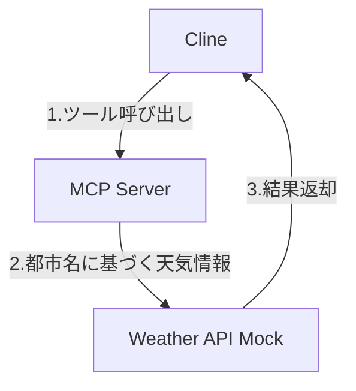
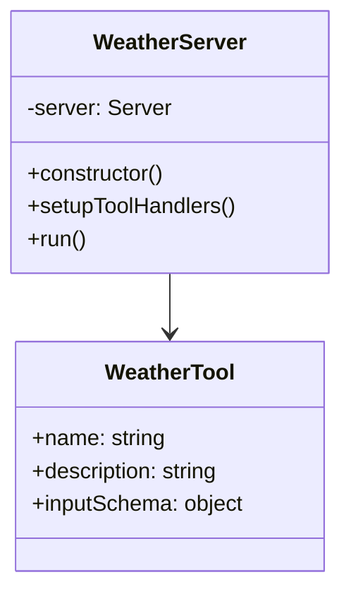
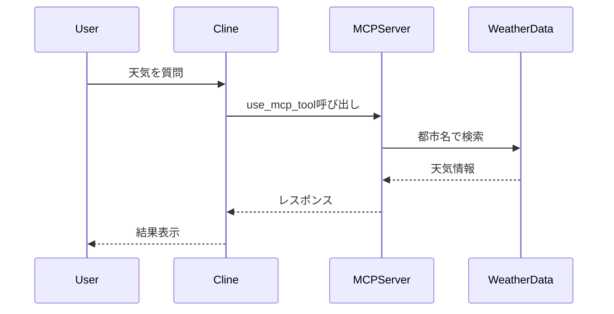

# MCP Server Implementation Workshop

このワークショップでは、Cline の利用習熟の題材として、Model Context Protocol (MCP) サーバーの実装方法を学び、AI コーディングエージェントとの連携について理解を深めます。

## 学習目標と進め方

このワークショップを通じて以下を習得できます：

1. MCP サーバーの基本的な実装方法
   - TypeScript による MCP サーバーの作成
   - ツールとリソースの実装方法
   - エラーハンドリングの実装

2. AI コーディングエージェントとの連携方法
   - MCP プロトコルの理解
   - ツールの登録と利用
   - レスポンス形式の標準化

3. MCP の概念とその重要性の理解
   - AI エージェントの拡張性
   - セキュリティ考慮事項
   - 標準化されたプロトコル

## 環境要件

このワークショップを開始する前に、以下の環境が必要です：

- Node.js の基本的な知識
- TypeScript の基本的な理解
- VSCode と Cline の環境セットアップ

## Cline を使った MCP サーバーの実装

### Step 1: プロジェクトの作成

まず、以下のコマンドでプロジェクトを作成します：

```bash
npx @modelcontextprotocol/create-server weather-server && \
  cd weather-server && \
  npm install
```

### Step 2: Cline への実装依頼

Cline に MCP サーバーの実装を依頼します。以下のようなプロンプトを使用してください：

```
天気予報の MCP サーバーを作成してください。以下の要件で実装をお願いします：

要件：
1. 都市名を入力として受け取り、その都市の天気予報を返すツールを提供する
2. 実際の API 通信は行わず、以下の固定値を返す：
   - 晴れ（sunny）: 東京、大阪、福岡
   - 雨（rainy）: ロンドン、シアトル
   - 曇り（cloudy）: パリ、ニューヨーク
3. TypeScript で実装する
4. MCP の SDK を使用する
5. 天気情報は以下の形式で返す：
   {
     city: string;
     weather: "sunny" | "rainy" | "cloudy";
     temperature: number;
   }

また、以下の点に注意して実装してください：
- エラーハンドリングを適切に行う
- コードの可読性を意識する
- TypeScript の型定義を活用する
```

Cline は要件に基づいて必要なファイルを作成し、実装を行います。実装中に質問がある場合は、適切に回答してください。

### Step 3: 実装の確認とテスト

Cline が作成したコードをレビューし、必要に応じて以下のような追加の要望を出すことができます：

```
以下の点について改善をお願いします：
1. エラーメッセージをより具体的にする
2. 温度の範囲に制限を追加する
3. コメントを追加して処理の説明を充実させる
```

### Step 4: ビルドとセットアップ

実装が完了したら、以下の手順でビルドとセットアップを行います：

1. ビルド:
```bash
cd weather-server
npm run build
```

2. MCP サーバーの設定:
- VSCode の設定から MCP Settings を開く
- `/home/coder/.local/share/code-server/User/globalStorage/rooveterinaryinc.roo-cline/settings/cline_mcp_settings.json` に設定を追加:


```json
{
  "mcpServers": {
    "weather": {
      "command": "node",
      "args": ["ビルドされたサーバーのパス/build/index.js"],
      "disabled": false,
      "alwaysAllow": []
    }
  }
}
```

3. 動作確認:
設定が完了したら、Cline に天気を質問して動作を確認します。


## 実装例の確認

実装がうまくいかない時は、`answer` ディレクトリにある解答例と比較してみてください。

## アーキテクチャと実装の解説

### システム構成



### サーバー構造



### データフロー



## MCP の重要性

MCP（Model Context Protocol）は、AI モデルとデータソースやツールを接続するための標準化されたオープンプロトコルです。USB-C のように、異なるシステム間の互換性を確保する役割を果たします。MCP の本質は、LLM アプリケーションがさまざまなコンテキスト情報にアクセスするための共通言語を提供することです。これにより、AI システムは必要な情報を適切なタイミングで取得し、より正確で関連性の高い応答を生成できるようになります。

主なメリットとしては、異なる LLM プロバイダー間の切り替えが容易になり、ベンダーロックインを回避できる点が挙げられます。また、データをユーザー自身のインフラ内に保持できるため、セキュリティとプライバシーが強化されます。さらに、クライアント-サーバーアーキテクチャにより、ローカルデータソースとリモートサービスの両方と簡単に統合できます。

開発者にとっては、標準化されたインターフェースにより開発時間が短縮され、既存の統合機能を再利用できるメリットがあります。ユーザーにとっては、Claude Desktop などのアプリケーションでのシームレスな統合により、AI との対話体験が向上します。

MCP は AI アプリケーション開発の基盤技術として、データプライバシーを維持しながら多様なツールを活用するという現代の AI 開発における課題に対する効果的なソリューションを提供しています。

## 参考リンク

- [MCP Servers GitHub Repository](https://github.com/modelcontextprotocol/servers)
- [TypeScript Documentation](https://www.typescriptlang.org/docs/)
- [Model Context Protocol Documentation](https://modelcontextprotocol.github.io/)
