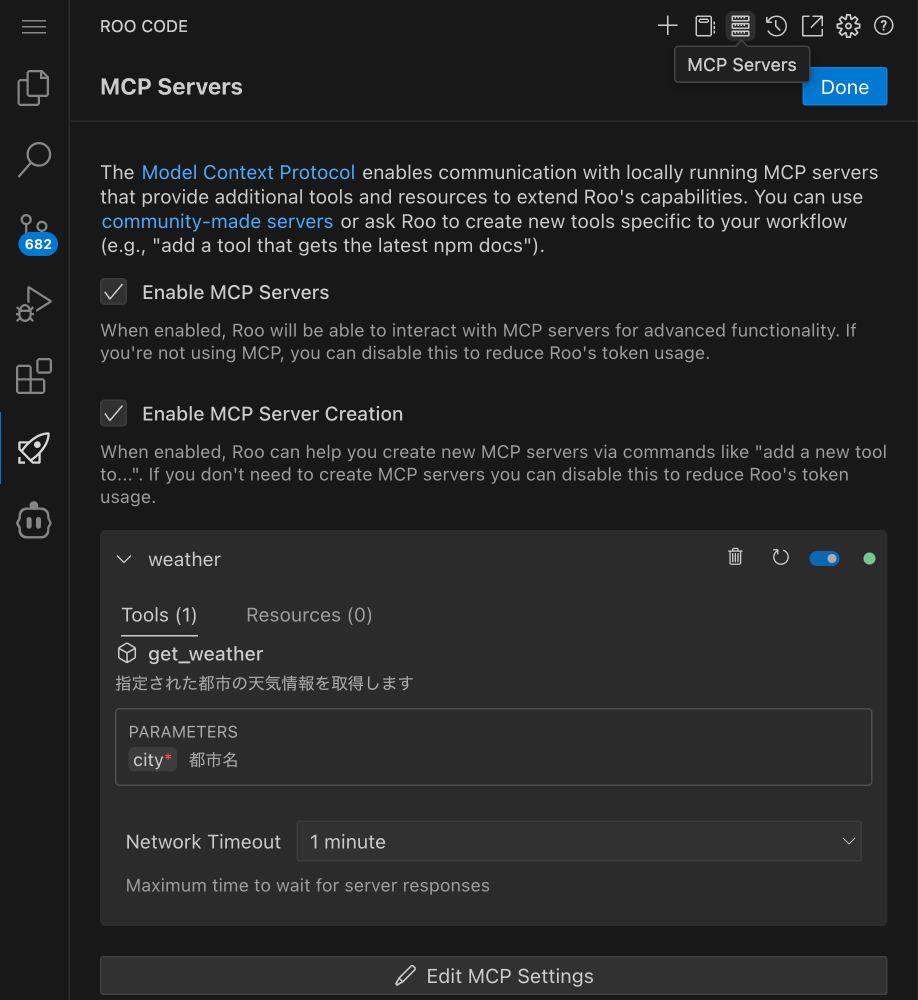
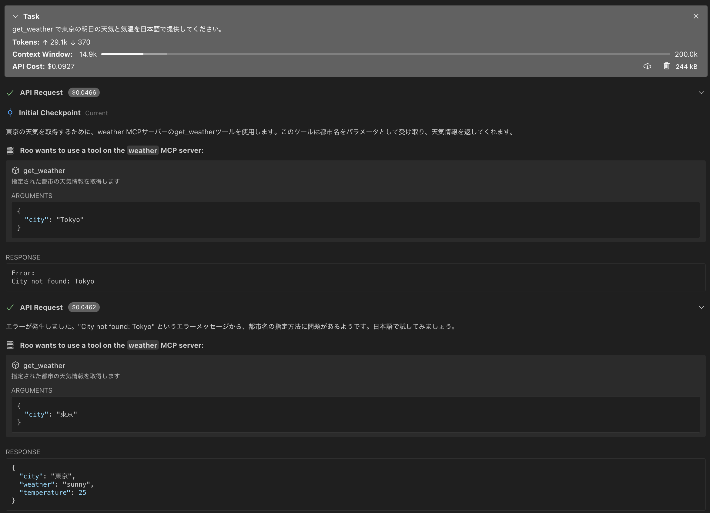
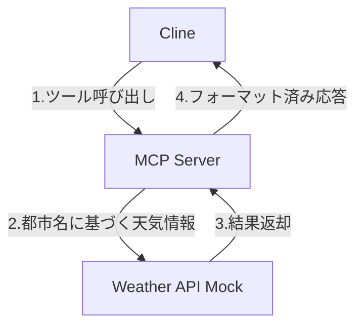
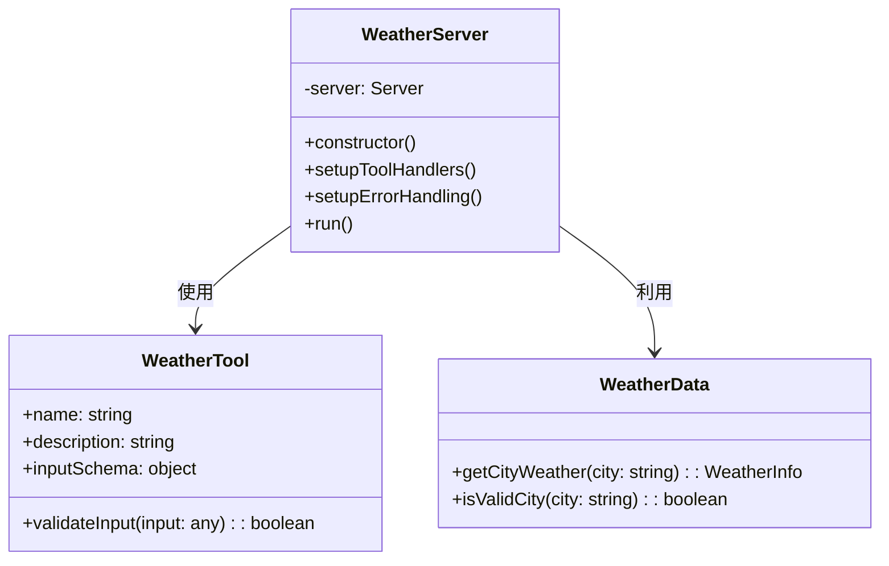
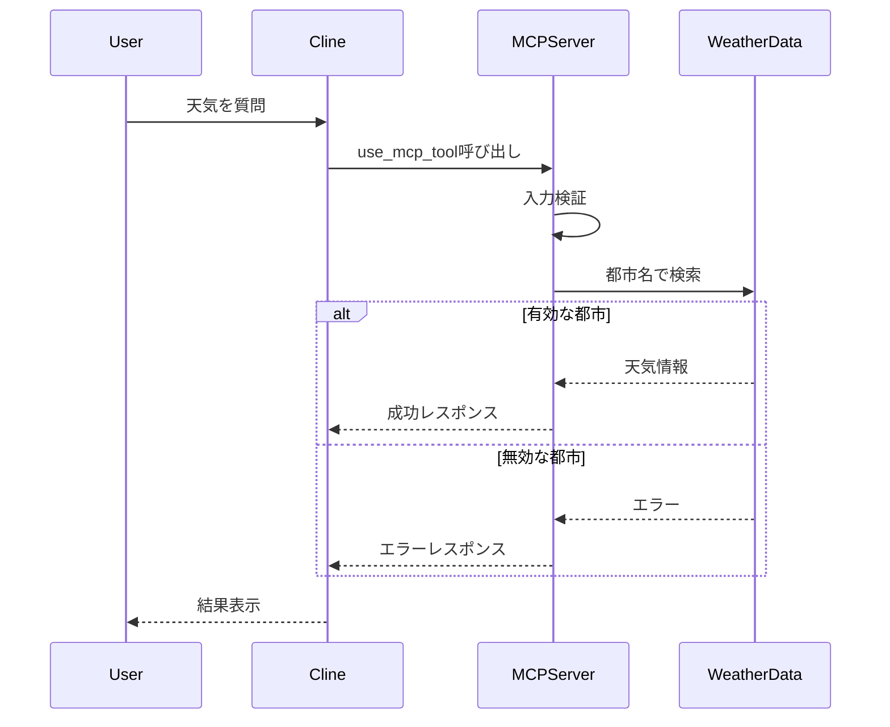
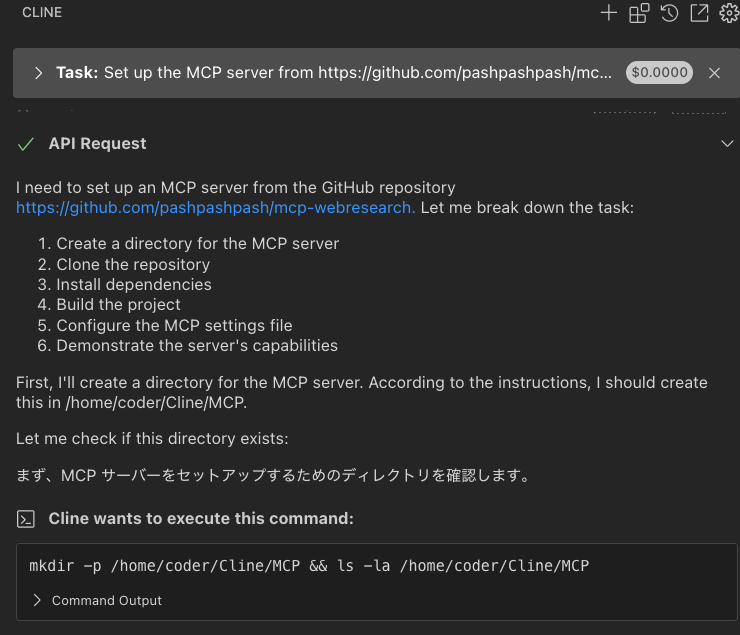
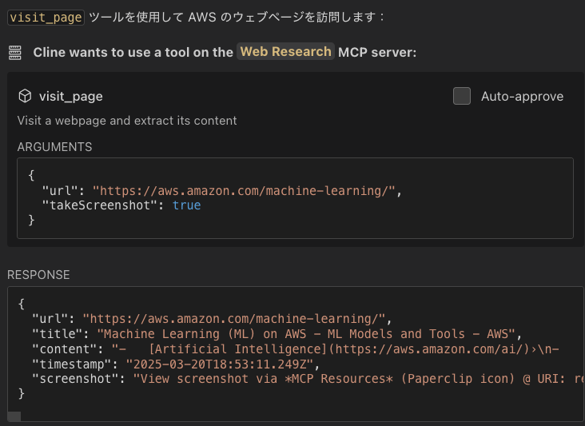

# Model Context Protocol (MCP) サーバー実装ワークショップ

このワークショップでは、Cline の利用習熟度向上を目的として、Model Context Protocol (MCP) サーバーの実装方法を学び、AI コーディングエージェントとの連携について理解を深めます。

## 学習目標と進め方

このワークショップを通じて以下のスキルと知識を習得できます：

1. MCP サーバーの基本的な実装方法
   - TypeScript を活用した MCP サーバーの設計と開発
   - ツールとリソースの効果的な実装手法
   - 堅牢なエラーハンドリング機構の実装

2. AI コーディングエージェントとの連携方法
   - MCP プロトコルの仕組みと基本概念の理解
   - ツールの登録プロセスと効率的な利用方法
   - 標準化されたレスポンス形式の設計と実装

3. MCP の概念とその重要性の理解
   - AI エージェントの機能拡張性とその実現方法
   - セキュリティに関する重要な考慮事項
   - 標準化されたプロトコルがもたらす利点

## 環境要件

このワークショップを開始する前に、以下の環境と知識が必要です：

- Node.js の基本的な知識と開発環境
- TypeScript の基本的な理解と実装経験
- VSCode と Cline の環境セットアップが完了していること

## Cline を使った MCP サーバーの実装手順

### Step 1: プロジェクトの作成

まず、以下のコマンドを実行してプロジェクトを作成します：

```bash
npx @modelcontextprotocol/create-server weather-server && \
  cd weather-server && \
  npm install
```

このコマンドにより、MCP サーバーの基本的なプロジェクト構造が生成され、必要な依存関係がインストールされます。

### Step 2: Cline への実装依頼

Cline に MCP サーバーの実装を依頼します。以下のようなプロンプトを使用して具体的な要件を伝えましょう：

```
天気予報の MCP サーバーを作成してください。以下の要件で実装をお願いします：

要件：
1. 都市名を入力として受け取り、その都市の天気予報を返すツールを提供する
2. 実際の API 通信は行わず、以下の固定値を返す：
   - 晴れ（sunny）: 東京、大阪、福岡
   - 雨（rainy）: ロンドン、シアトル
   - 曇り（cloudy）: パリ、ニューヨーク
3. TypeScript で実装する
4. MCP の SDK を使用する
5. 天気情報は以下の形式で返す：
   {
     city: string;
     weather: "sunny" | "rainy" | "cloudy";
     temperature: number;
   }

また、以下の点に注意して実装してください：
- エラーハンドリングを適切に行う
- コードの可読性を意識する
- TypeScript の型定義を活用する
```

Cline は要件に基づいて必要なファイルを作成し、実装を行います。実装中に質問がある場合は、技術的な背景を踏まえて適切に回答してください。

### Step 3: 実装の確認とテスト

Cline が作成したコードを詳細にレビューし、必要に応じて以下のような追加の要望を出すことができます：

```
以下の点について改善をお願いします：
1. エラーメッセージをより具体的にして、ユーザーが問題を特定しやすくする
2. 温度の範囲に現実的な制限（例：-50℃〜50℃）を追加する
3. コメントを追加して処理の説明を充実させ、コードの保守性を高める
```

コードレビューの際は、特に以下の点に注目すると良いでしょう：
- 型定義の適切さ
- エラーハンドリングの網羅性
- コードの構造と可読性
- エッジケースへの対応

### Step 4: ビルドとセットアップ

実装が完了したら、以下の手順でビルドとセットアップを行います：

1. ビルド処理の実行:
```bash
cd weather-server
npm run build
```

2. MCP サーバーの設定:
- VSCode の設定から MCP Settings を開きます
- `/home/coder/.local/share/code-server/User/globalStorage/rooveterinaryinc.roo-cline/settings/cline_mcp_settings.json` に以下の設定を追加します:



```json
{
  "mcpServers": {
    "weather": {
      "command": "node",
      "args": ["ビルドされたサーバーのパス/build/index.js"],
      "disabled": false,
      "alwaysAllow": []
    }
  }
}
```

3. 動作確認の実施:
設定が完了したら、Cline に「東京の天気は？」などと質問して動作を確認します。正しく実装されていれば、設定した都市の天気情報が返されるはずです。



## 実装例の確認

実装に困難が生じた場合は、`answer` ディレクトリにある解答例と比較してみてください。この参照実装は、MCP サーバーの基本的な構造と実装パターンを理解するための良い教材となります。

## アーキテクチャと実装の解説

### システム構成

以下の図は、MCP サーバーを利用した天気情報システムの基本的な構成を示しています：



### サーバー構造

MCP サーバーの内部構造は以下のクラス図で表現されます：



### データフロー

ユーザーからの天気情報リクエストの処理フローは以下のシーケンス図で示されます：



## MCP の重要性と利点

MCP（Model Context Protocol）は、AI モデルとデータソースやツールを接続するための標準化されたオープンプロトコルです。USB-C のように、異なるシステム間の互換性を確保する役割を果たします。

### MCP の本質と基本概念

MCP の本質は、LLM アプリケーションがさまざまなコンテキスト情報にアクセスするための共通言語を提供することです。これにより、AI システムは必要な情報を適切なタイミングで取得し、より正確で関連性の高い応答を生成できるようになります。

MCP は以下の主要コンポーネントで構成されています：
- **ツール（Tools）**: 特定の機能を実行するための実行可能なインターフェース
- **リソース（Resources）**: AI モデルがアクセスできる静的または動的なデータソース
- **プロトコル定義**: クライアントとサーバー間の通信規約

### MCP がもたらす主なメリット

1. **相互運用性の向上**：
   - 異なる LLM プロバイダー間の切り替えが容易になり、ベンダーロックインを回避
   - 標準化されたインターフェースによる開発時間の短縮

2. **セキュリティとプライバシーの強化**：
   - データをユーザー自身のインフラ内に保持可能
   - センシティブな情報を外部に送信せずに処理できる

3. **柔軟な統合**：
   - クライアント-サーバーアーキテクチャにより、ローカルデータソースとリモートサービスの両方と簡単に統合
   - 既存のシステムやツールとの連携が容易

4. **ユーザーエクスペリエンスの向上**：
   - Claude Desktop などのアプリケーションでのシームレスな統合
   - コンテキストに応じた適切な情報提供による AI との対話体験の向上

MCP は AI アプリケーション開発の基盤技術として、データプライバシーを維持しながら多様なツールを活用するという現代の AI 開発における課題に対する効果的なソリューションを提供しています。

## MCP Marketplace の活用

MCP エコシステムでは、様々な機能を提供する MCP サーバーが Marketplace を通じて公開されています。ここでは、Web 検索機能を提供する MCP サーバーの導入方法を紹介します。

### [MCP Web Research Server](https://github.com/pashpashpash/mcp-webresearch) の導入

MCP Marketplace には、Web 検索機能を提供する「Web Research」サーバーが公開されています。以下の手順で導入できます：

1. Cline の MCP Servers 設定ページを開き、検索欄に "web research" と入力します
2. 検索結果に表示される Web Research MCP サーバーの「Install」ボタンをクリックします


3. Install ボタンをクリックすると、Cline が起動し、自動的にインストール処理タスクを開始します



4. インストールが完了すると、Cline は自動的に `visit_page` ツールを使用して動作確認を行います



### セキュリティに関する注意事項

MCP サーバーを導入・実行する際には、以下のセキュリティ上の注意点に留意してください：

- 組織内での MCP サーバー利用に関するポリシーや許可を事前に確認すること
- 外部サイトへのアクセスを行う MCP は、情報漏洩のリスクがあることを認識すること
- 機密情報や個人情報を扱う際は、適切なセキュリティ対策が施された MCP のみを使用すること
- 信頼できるソースから提供される MCP のみをインストールすること
- 定期的に MCP の動作やアクセス先を監査し、不審な挙動がないか確認すること


## 参考リンク

- [MCP Servers GitHub リポジトリ](https://github.com/modelcontextprotocol/servers)
- [TypeScript 公式ドキュメント](https://www.typescriptlang.org/docs/)
- [Model Context Protocol 公式ドキュメント](https://modelcontextprotocol.github.io/)
- [Anthropic Claude 開発者ドキュメント](https://docs.anthropic.com/)
- [MCP サーバー開発ガイド](https://modelcontextprotocol.github.io/docs/server-development-guide)
