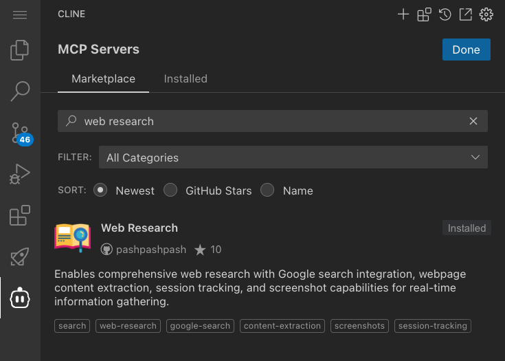

# MCP Workshop Images

This directory contains images referenced in the MCP workshop documentation.

## Required Images

The following images are referenced in the documentation but need to be added:

### MCP Marketplace Workshop
- `mcp-marketplace.png` - Screenshot of the MCP Marketplace interface
- `mcp-management-page.png` - Screenshot of the MCP server management page

### AWS MCP Workshop  
- `aws-document-mcp-search-document.png` - AWS Documentation MCP search results
- `aws-document-mcp-read-document.png` - AWS Documentation MCP document reading interface

## Image Guidelines

When adding images to this directory:

1. Use descriptive filenames
2. Optimize images for web display (PNG or JPG format)
3. Keep file sizes reasonable (< 1MB per image)
4. Update documentation links if filenames change
5. Include alt text in documentation for accessibility

## Usage in Documentation

Images are referenced in markdown using relative paths:

```markdown

```

Make sure the relative path is correct based on the location of the markdown file.