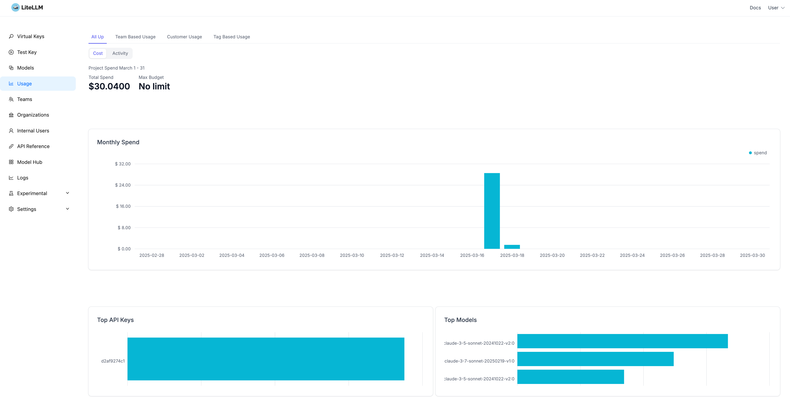

# LiteLLM Proxy

LiteLLM を使用して Amazon Bedrock 上の Claude (Sonnet 3.7, 3.5) を利用するためのサーバーです。エラーが発生した場合は自動的にフォールバックする機能を備えています。

## 環境要件

- Docker
- Python 3.9 以上
- AWS 認証情報（Bedrock へのアクセス権限必須）

## セットアップ手順

1. 環境変数の設定

```bash
# .env ファイルを作成
cp .env.example .env
# .env ファイルを編集して必要な環境変数を設定
# AWS_ACCESS_KEY_ID=your-access-key-id
# AWS_SECRET_ACCESS_KEY=your-secret-access-key
```

2. 設定ファイルの説明

`default_config.yml` では以下の設定が可能です：

- モデルの優先順位とフォールバック設定
- 各モデルの最大トークン数
- リトライ設定
- レート制限

詳細な設定例は[設定例](#設定例)セクションを参照してください。

3. サービスの起動

```bash
# サービスの起動
./manage-services.sh start

# サービスの停止
./manage-services.sh stop

# サービスの再起動
./manage-services.sh restart

# ヘルプの表示
./manage-services.sh --help
```

4. 動作確認

```bash
export LITELLM_MASTER_KEY=sk-litellm-test-key

# モデル一覧の取得
curl http://localhost:4000/v1/models \
  -H "Authorization: Bearer ${LITELLM_MASTER_KEY}"

# 基本的な補完リクエスト
curl -X POST 'http://0.0.0.0:4000/chat/completions' \
-H 'Content-Type: application/json' \
-H "Authorization: Bearer ${LITELLM_MASTER_KEY}" \
-d '{
      "model": "bedrock-converse-us-claude-3-7-sonnet-v1",
      "messages": [
        {
          "role": "user",
          "content": "what llm are you"
        }
      ]
    }'

# フォールバックのテスト
curl -X POST 'http://0.0.0.0:4000/chat/completions' \
-H 'Content-Type: application/json' \
-H "Authorization: Bearer ${LITELLM_MASTER_KEY}" \
-d '{
  "model": "bedrock-converse-us-claude-3-7-sonnet-v1",
  "messages": [
    {
      "role": "user",
      "content": "ping"
    }
  ],
  "mock_testing_fallbacks": true
}'
```

## Cline での LiteLLM 設定

### LiteLLM Proxy を Cline に接続する方法

1. Cline の設定画面から「API Provider」セクションを開きます
2. 「Add Provider」ボタンをクリックします
3. 以下の情報を入力します：
   - **Provider Type**: LiteLLM
   - **Name**: 任意の識別名（例：「Local LiteLLM Proxy」）
   - **API Key**: 環境変数 `LITELLM_MASTER_KEY` で設定した値（例：`sk-litellm-test-key`）
   - **Base URL**: `http://localhost:4000`
4. 「Save」ボタンをクリックして設定を保存します

この設定により、Cline はエラー発生時に LiteLLM Proxy を介してフェイルオーバーする構成となります。複数のモデルを設定している場合、LiteLLM の設定ファイルで指定した優先順位に従ってフォールバックが行われます。

設定完了後、簡単なタスクを実行して動作確認することをお勧めします。


## LiteLLM 管理画面（Admin UI）

LiteLLM には、サービスの監視や管理を行うための Web インターフェースが用意されています。この管理画面では、モデルの一覧確認、使用状況の分析、ログの閲覧などが可能です。

### アクセス方法

1. LiteLLM Proxy が起動している状態で、ブラウザから以下の URL にアクセスします：
   ```
   http://localhost:4000/ui
   ```

2. ログイン画面が表示されます。認証情報は `.env` ファイルに設定した値を使用します。

### デフォルトの認証情報

`.env` ファイルに認証情報を設定していない場合は、デフォルト値が使用されます：

```
# 設定例
UI_USERNAME=litellm
UI_PASSWORD=litellm
```


### 主な機能

#### モデル一覧

利用設定したモデルとその設定情報を確認できます。Setting 画面ではフォールバック設定やモデルの優先順位を設定することが可能です。


#### 使用状況分析

API の使用状況や料金情報を確認できます。期間別の使用量やコスト分析が可能です。



## ログ機能

LiteLLM のログ機能では、以下の情報が確認できます：

### デフォルトのログ設定

| ログタイプ | デフォルトで記録 |
|------------|-----------------|
| 成功ログ | ✅ はい |
| エラーログ | ✅ はい |
| リクエスト/レスポンスの内容 | ❌ いいえ（デフォルトでは無効） |

デフォルトでは、LiteLLM はリクエストとレスポンスの内容（プロンプトや回答の本文）を記録しません。

### リクエスト/レスポンス内容のログ記録を有効にする方法

ログページでリクエストとレスポンスの内容を表示したい場合は、以下の設定を `default_config.yml` に追加する必要があります：

```yaml
general_settings:
  store_prompts_in_spend_logs: true
```

この設定を有効にすると、ログページで各リクエストの詳細な内容（プロンプトや回答）を確認できるようになります。


