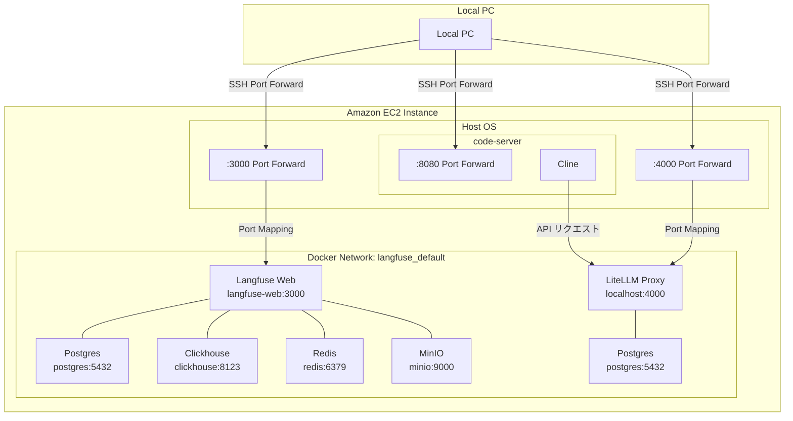
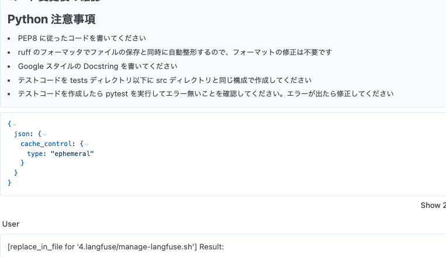

# LiteLLM と Langfuse を用いた LLM 利用状況の分析

本セクションでは、Cline VSCode Plugin で LiteLLM を API Provider として使用する際の詳細な利用状況を分析するための Langfuse 統合について説明します。この構成により、以下のような情報を詳細に把握することが可能になります：

- LLM の利用状況とコスト分析
- リクエスト・レスポンスの詳細な記録
- パフォーマンスとレイテンシの監視
- エラー発生時のトラブルシューティング

## ファイル構成

```
.
├── .env.example             # 環境変数のテンプレート
├── default_config.yml       # LiteLLM の基本設定ファイル
├── prompt_caching.yml       # Prompt Caching 機能用の設定ファイル
├── manage-langfuse.sh       # Langfuse 管理スクリプト
└── test_litellm_langfuse.py # テストスクリプト
```

## アーキテクチャ



## ネットワーク構成

### コンテナネットワーク
- すべてのサービスは `langfuse_default` ネットワーク内で実行
- コンテナ間通信には Docker DNS 名を使用（例：`langfuse-web`, `postgres`）
- 内部ポートはネットワーク内で公開

### 重要な注意点
- コンテナ内では `localhost` は自身のコンテナを指すため、使用を避ける
- 代わりに Docker サービス名を使用（例：`http://langfuse-web:3000`）
- MinIO は 9000 ポートを使用

## セットアップ手順

1. 環境変数の設定
   ```bash
   cp .env.example .env
   ```
   以下の環境変数を設定します：
   - `LANGFUSE_INIT_USER_EMAIL`: 初期管理者アカウントのメールアドレス
   - `LANGFUSE_INIT_USER_PASSWORD`: 初期管理者アカウントのパスワード
   - その他必要な環境変数は `.env.example` を参照してください

2. サービスの起動
   ```bash
   # Langfuse コンテナの起動
   ./manage-langfuse.sh start
   
   # LiteLLM Proxy の設定更新（Langfuse との連携設定）
   ./manage-langfuse.sh update-config
   ```

3. 動作確認
   ```bash
   # ポートフォワーディングの設定 (Local PC で実行してください)
   ../scripts/port_forward.py
   
   # ブラウザで Langfuse Web UI にアクセス
   # http://localhost:3000
   ```

## 設定ファイル

### default_config.yml
- モデルの設定（Bedrock Claude など）
- フォールバックとリトライの設定
- Langfuse コールバックの設定
- アクセスキーによる Amazon Bedrock アクセス (IAM role によるアクセスについては [../2.litellm/README.md](../2.litellm/README.md) を参照)

## デバッグツール

`../scripts/debug_langfuse.sh` スクリプトを使用してトラブルシューティングを行えます：

```bash
bash -x ../scripts/debug_langfuse.sh
```

このスクリプトは以下を確認します：
- Langfuse と LiteLLM コンテナの状態
- 環境変数の設定
- コンテナのログ
- ネットワーク接続状態

## テストの実行

```bash
pip install langfuse
python test_litellm_langfuse.py
```

テストスクリプトは以下を実行します：
- LiteLLM を通じた Bedrock Claude の呼び出し
- Langfuse へのログ送信
- 接続テストとデバッグ情報の出力

## Langfuse の利用方法

[Langfuse](https://langfuse.com/) は LLM アプリケーションの観察とモニタリングを行うためのオープンソースプラットフォームです。

### Langfuse の主要機能

1. **LLM アプリケーション観測性（Observability）**：
   アプリケーションを計測し、Langfuse にトレースを取り込むことで、LLM 呼び出しや検索、埋め込み、エージェントアクションなどの関連ロジックを追跡します。複雑なログやユーザーセッションを検査・デバッグできます。

2. **プロンプト管理**：
   プロンプトを一元管理し、バージョン管理や共同反復作業を行えます。サーバーとクライアント側の強力なキャッシングにより、アプリケーションのレイテンシを増加させることなくプロンプトを改善できます。

3. **評価システム**：
   LLM アプリケーション開発ワークフローの重要な部分として、Langfuse はニーズに合わせた評価を提供します。LLM-as-a-judge、ユーザーフィードバック収集、手動ラベリング、API/SDK を介したカスタム評価パイプラインをサポートしています。

4. **データセット機能**：
   LLM アプリケーションを評価するためのテストセットとベンチマークを提供します。継続的な改善、デプロイ前テスト、構造化された実験、柔軟な評価、LangChain や LlamaIndex などのフレームワークとのシームレスな統合をサポートします。

5. **LLM プレイグラウンド**：
   プロンプトやモデル設定をテストし反復するためのツールで、フィードバックループを短縮し開発を加速します。トレースで問題のある結果を見つけた場合、直接プレイグラウンドに移動して改善できます。

6. **包括的な API**：
   Langfuse は API を通じて提供される基本要素を使用しながら、カスタム LLMOps ワークフローを強化するために頻繁に使用されます。OpenAPI 仕様、Postman コレクション、Python や JS/TS 用の型付き SDK が利用可能です。

### Langfuse Web UI の利用方法

#### ログイン方法

1. ブラウザで http://localhost:3000 にアクセスします
   - `cline/scripts/port_forward.py` でポートフォワーディングが必要です

2. 初期アカウントでログイン
   - メールアドレス：`.env` ファイルの `LANGFUSE_INIT_USER_EMAIL` の値
   - パスワード：`.env` ファイルの `LANGFUSE_INIT_USER_PASSWORD` の値


#### Dashboard

ダッシュボードでは、以下のような重要な情報をグラフィカルに確認することができます：

- **トレース概要**: 時系列でのリクエスト数とエラー率の推移
- **モデル使用状況**: モデルごとの使用量とコスト分析
- **パフォーマンス指標**: 平均レイテンシや応答時間の分布
- **エラー分析**: エラーの種類と発生頻度の統計

これらの情報を活用することで、LLM の利用状況を包括的に把握し、最適化のための意思決定を行うことができます。


#### Traces

トレースとは LLM アプリケーションの実行フローを記録したものです。各 LLM 呼び出しの詳細情報（入力プロンプト、出力レスポンス、実行時間、コストなど）を時系列で追跡できます。トレースからリクエストとレスポンスの詳細を見ることができ、アプリケーションの動作を詳細に分析することが可能です。


## Prompt Caching 機能と Langfuse の連携

LiteLLM config ファイルの認証情報に関する設定の詳細は [2.litellm の README.md](../2.litellm/README.md) を参照ください。

### Langfuse と Prompt Caching の組み合わせ

`prompt_caching.yml` を使用することで、Prompt Caching 機能を利用しつつ Langfuse でログを確認することができます。

### 利用方法

1. IAM ロールの設定（既に `set-policy` を実行済みであることを前提とします）
   ```bash
   cd ../2.litellm/ && ./manage-litellm.sh set-policy
   ```

2. Prompt Caching 設定ファイルを指定して LiteLLM を起動
   ```bash
   ./manage-langfuse.sh -c prompt_caching.yml start
   ```

3. Cline の設定で LiteLLM Proxy を API Provider として設定し、Prompt Caching 設定を有効化

### Langfuse でのキャッシュヒット確認

Langfuse の Traces 詳細では、キャッシュヒットした場合の json 情報を確認することができます。


