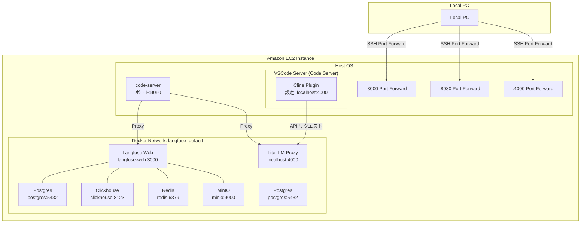
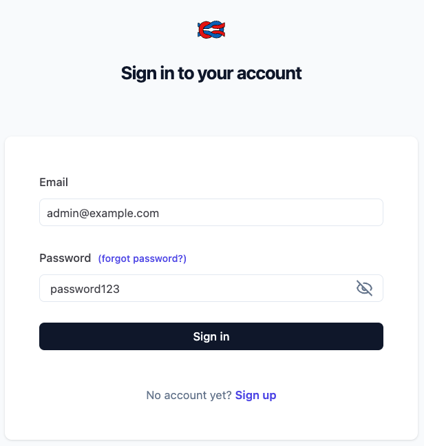
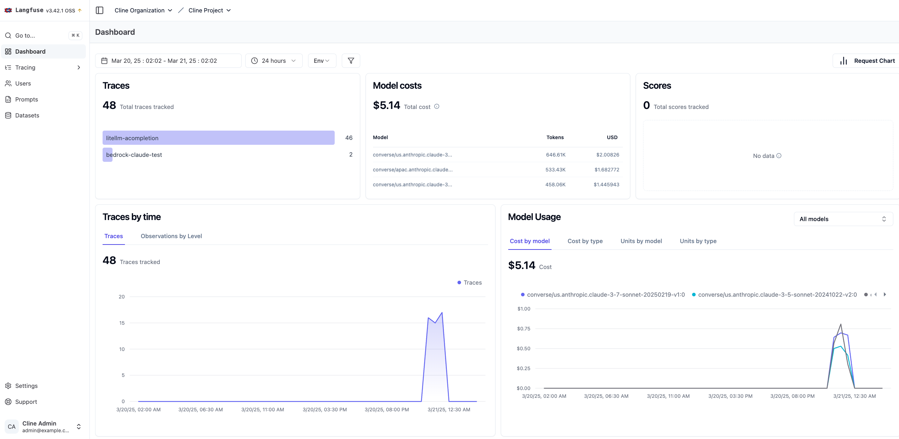
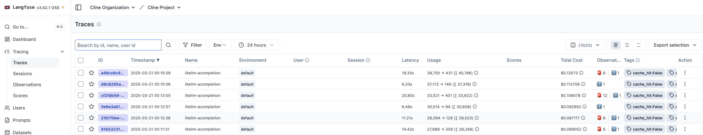

# LiteLLM と Langfuse を用いた LLM 利用状況の分析

Cline VSCode Plugin で LiteLLM を API Provider として使用する際の詳細な利用状況を分析するため、Langfuse を統合しました。この構成により、LLM の利用状況やコスト、パフォーマンスを詳細に把握することが可能になります。

## ファイル構成

```
.
├── .env.example             # 環境変数のテンプレート
├── litellm_config.yml       # LiteLLM の設定ファイル
├── manage-langfuse.sh       # Langfuse 管理スクリプト
└── test_litellm_langfuse.py # テストスクリプト
```

## アーキテクチャ



## ネットワーク構成

### コンテナネットワーク
- すべてのサービスは `langfuse_default` ネットワーク内で実行
- コンテナ間通信には Docker DNS 名を使用（例：`langfuse-web`, `postgres`）
- 内部ポートはネットワーク内で公開

### 重要な注意点
- コンテナ内では `localhost` は自身のコンテナを指すため、使用を避ける
- 代わりに Docker サービス名を使用（例：`http://langfuse-web:3000`）
- MinIO は内部で 9000 ポートを使用（外部からは 9090）

## セットアップ手順

1. 環境変数の設定
```bash
cp .env.example .env
# .env ファイルを編集
```

2. サービスの起動
```bash
./manage-langfuse.sh start         # Langfuse コンテナの起動
./manage-langfuse.sh update-config # LiteLLM Proxy の設定更新
```

## 設定ファイル

### litellm_config.yml
- モデルの設定（Bedrock Claude など）
- フォールバックとリトライの設定
- Langfuse コールバックの設定

## デバッグツール

`../scripts/debug_langfuse.sh` スクリプトを使用してトラブルシューティングを行えます：

```bash
bash -x ../scripts/debug_langfuse.sh
```

このスクリプトは以下を確認します：
- Langfuse と LiteLLM コンテナの状態
- 環境変数の設定
- コンテナのログ
- ネットワーク接続状態

## テストの実行

```bash
pip install langfuse
python test_litellm_langfuse.py
```

テストスクリプトは以下を実行します：
- LiteLLM を通じた Bedrock Claude の呼び出し
- Langfuse へのログ送信
- 接続テストとデバッグ情報の出力

## Langfuse の利用方法

[Langfuse](https://langfuse.com/) は LLM アプリケーションの観察とモニタリングを行うためのオープンソースプラットフォームです。

### Langfuse の主要機能

1. **LLM アプリケーション観測性（Observability）**：
   アプリケーションを計測し、Langfuse にトレースを取り込むことで、LLM 呼び出しや検索、埋め込み、エージェントアクションなどの関連ロジックを追跡します。複雑なログやユーザーセッションを検査・デバッグできます。

2. **プロンプト管理**：
   プロンプトを一元管理し、バージョン管理や共同反復作業を行えます。サーバーとクライアント側の強力なキャッシングにより、アプリケーションのレイテンシを増加させることなくプロンプトを改善できます。

3. **評価システム**：
   LLM アプリケーション開発ワークフローの重要な部分として、Langfuse はニーズに合わせた評価を提供します。LLM-as-a-judge、ユーザーフィードバック収集、手動ラベリング、API/SDK を介したカスタム評価パイプラインをサポートしています。

4. **データセット機能**：
   LLM アプリケーションを評価するためのテストセットとベンチマークを提供します。継続的な改善、デプロイ前テスト、構造化された実験、柔軟な評価、LangChain や LlamaIndex などのフレームワークとのシームレスな統合をサポートします。

5. **LLM プレイグラウンド**：
   プロンプトやモデル設定をテストし反復するためのツールで、フィードバックループを短縮し開発を加速します。トレースで問題のある結果を見つけた場合、直接プレイグラウンドに移動して改善できます。

6. **包括的な API**：
   Langfuse は API を通じて提供される基本要素を使用しながら、カスタム LLMOps ワークフローを強化するために頻繁に使用されます。OpenAPI 仕様、Postman コレクション、Python や JS/TS 用の型付き SDK が利用可能です。

### 主な機能

1. **LLM 利用状況の分析**
   - モデルごとの使用量とコスト
   - レイテンシと応答時間の分布
   - エラー率とその原因分析

2. **プロンプトの評価**
   - プロンプトのバージョン管理
   - A/Bテストの実施と結果分析
   - プロンプトの効果測定

3. **品質管理**
   - 応答品質のモニタリング
   - ユーザーフィードバックの収集
   - カスタム評価指標の設定

### Lanfuse Web UI

#### ログイン

localhost:3000 にアクセス(cline/scripts/port-forward.sh でフォワードしている前提)

.env の以下の設定で初期 ID, パスワードを設定しているのですぐログイン可能。
 LANGFUSE_INIT_USER_EMAIL="admin@example.com"
LANGFUSE_INIT_USER_PASSWORD="password123"



#### Dashboard

ダッシュボードで、トレース、モデルごとのコスト、レイテンシーなどの情報を見ることができる。



#### Traces

トレースとは LLM アプリケーションの実行フローを記録したものです。各 LLM 呼び出しの詳細情報（入力プロンプト、出力レスポンス、実行時間、コストなど）を時系列で追跡できます。トレースからリクエストとレスポンスの詳細を見ることができ、アプリケーションの動作を詳細に分析することが可能です。



