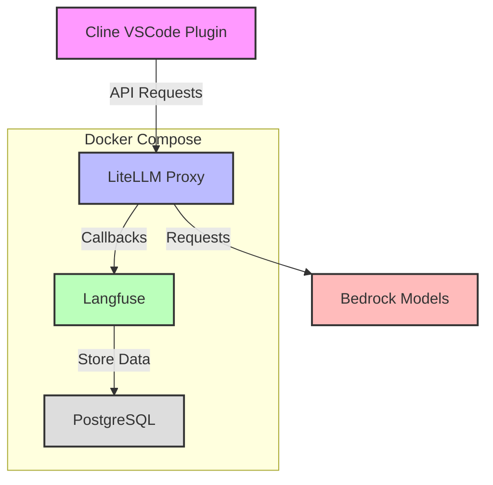
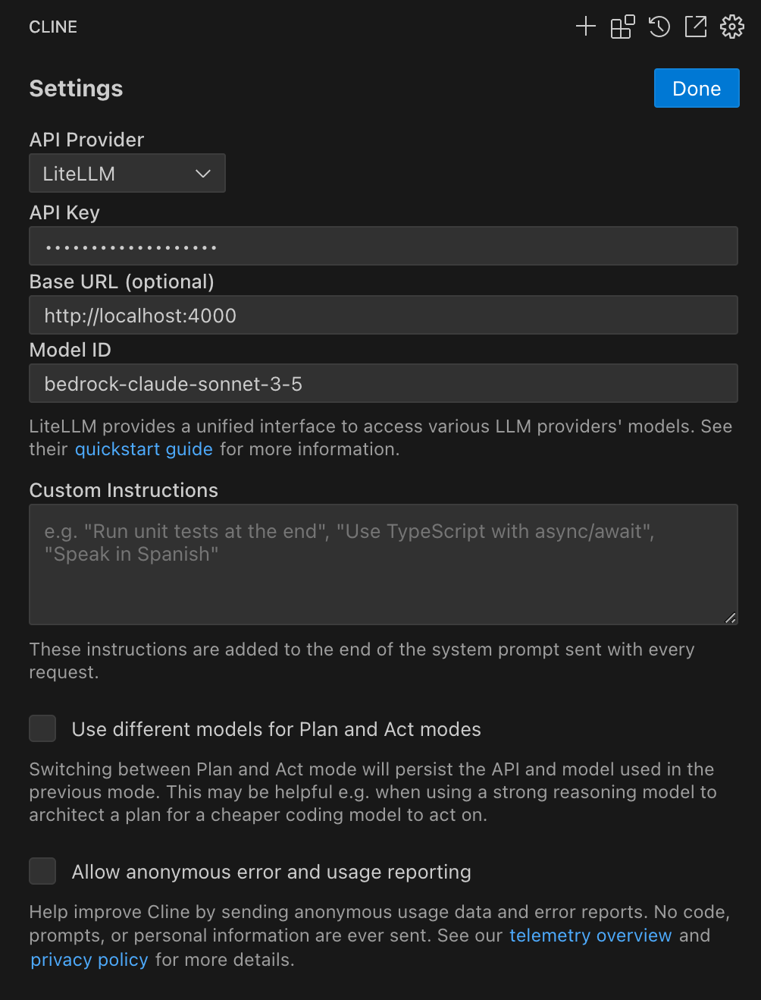

# LiteLLM と Langfuse を用いた LLM コスト可視化
Cline VSCode Plugin で LiteLLM を API Provider として使用する際に発生する料金表示の問題（$0 と表示される）を解決するため、Langfuse を統合しました。この実装により、以下が可能になります：

1. **コスト可視化の実現**
   - LiteLLM を通じて利用される様々なモデル（Bedrock 上の Claude 等）の使用状況を追跡
   - モデルごとのトークン使用量と料金の詳細な分析
   - 総コストの可視化とモニタリング

2. **アーキテクチャの特徴**
   - LiteLLM Proxy が Langfuse にコールバックを送信
   - 共有 PostgreSQL データベースでデータを管理
   - Langfuse ダッシュボードで使用状況を可視化

> **企業での利用に関する推奨事項**: 本リポジトリは開発環境での利用を想定しています。実際の企業組織での本番環境での LiteLLM Proxy と Langfuse の利用には、AWS ECS (Elastic Container Service) や AWS Fargate でのコンテナ化デプロイ、Amazon RDS や Aurora PostgreSQL でのデータベース管理、AWS Secrets Manager での認証情報管理など、適切なクラウドサービスを活用したアーキテクチャを推奨します。また、セキュリティ、スケーラビリティ、高可用性を考慮した設計が必要です。

## アーキテクチャ



## 環境要件

- Docker
- Python 3.9 以上
- AWS 認証情報（Bedrock へのアクセス権限必須）

## セットアップ手順

1. 環境変数の設定

```bash
# .env ファイルを作成
cp .env.example .env
# .env ファイルを編集して必要な環境変数を設定
```

主な環境変数：
- AWS_ACCESS_KEY_ID: AWS アクセスキー
- AWS_SECRET_ACCESS_KEY: AWS シークレットキー
- AWS_REGION_NAME: AWS リージョン
- POSTGRES_USER: PostgreSQL ユーザー名
- POSTGRES_PASSWORD: PostgreSQL パスワード
- POSTGRES_DB: データベース名
- LITELLM_MASTER_KEY: LiteLLM API キー
- NEXTAUTH_SECRET: Langfuse 認証用シークレット
- SALT: Langfuse 暗号化用ソルト
- CLICKHOUSE_URL: ClickHouse 接続 URL
- REDIS_AUTH: Redis 認証パスワード

2. 設定ファイルの説明

`default_config.yaml` では以下の設定が可能です：

- モデルの優先順位とフォールバック設定
- 各モデルの最大トークン数
- リトライ設定
- レート制限
- Langfuse コールバック設定

3. サービスの起動

```bash
# 実行権限を付与
chmod +x manage-services.sh

# サービスの起動
./manage-services.sh start

# サービスの停止
./manage-services.sh stop

# サービスの再起動
./manage-services.sh restart

# ヘルプの表示
./manage-services.sh --help
```

初回起動時には Langfuse リポジトリが自動的にクローンされ、必要なサービスが起動します。

4. 動作確認

```bash
export LITELLM_MASTER_KEY=sk-litellm-test-key

# モデル一覧の取得
curl http://localhost:4000/v1/models \
  -H "Authorization: Bearer ${LITELLM_MASTER_KEY}"

# 基本的な補完リクエスト
curl -X POST 'http://0.0.0.0:4000/chat/completions' \
-H 'Content-Type: application/json' \
-H "Authorization: Bearer ${LITELLM_MASTER_KEY}" \
-d '{
      "model": "bedrock-converse-us-claude-3-7-sonnet-v1",
      "messages": [
        {
          "role": "user",
          "content": "what llm are you"
        }
      ]
    }'
```

## Langfuse での使用状況確認

1. Langfuse UI へのアクセス
   - ブラウザで http://localhost:3000 にアクセス

2. 確認可能な情報
   - モデルごとの使用量
   - トークン数
   - 推定コスト
   - レイテンシ
   - エラー率

## Cline での LiteLLM 設定

作成した LiteLLM Proxy を Cline の API Provider に設定します。これによりエラー時には LiteLLM Proxy を介してフェイルオーバーする構成となります。

API Key: (環境変数 LITELLM_MASTER_KEY で設定した値)



## トラブルシューティング

1. Langfuse UI にアクセスできない場合
   - コンテナの起動状態を確認: `docker compose ps`
   - ログの確認: `docker compose logs langfuse`
   - 環境変数の設定を確認

2. コスト情報が表示されない場合
   - LiteLLM の callback_settings を確認
   - Langfuse への接続状態を確認
   - リクエストが正しく送信されているか確認
