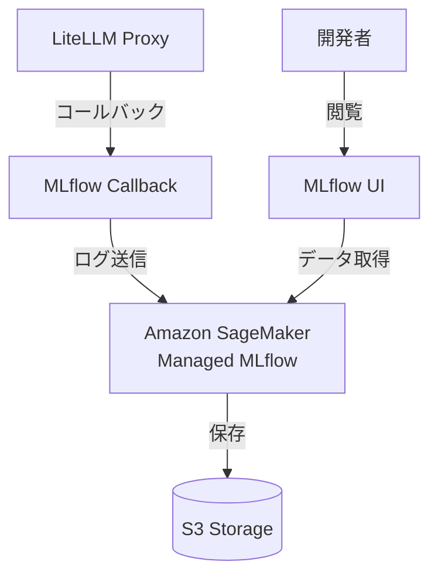
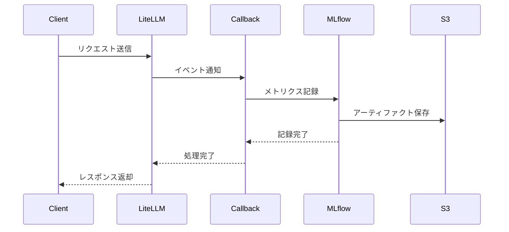
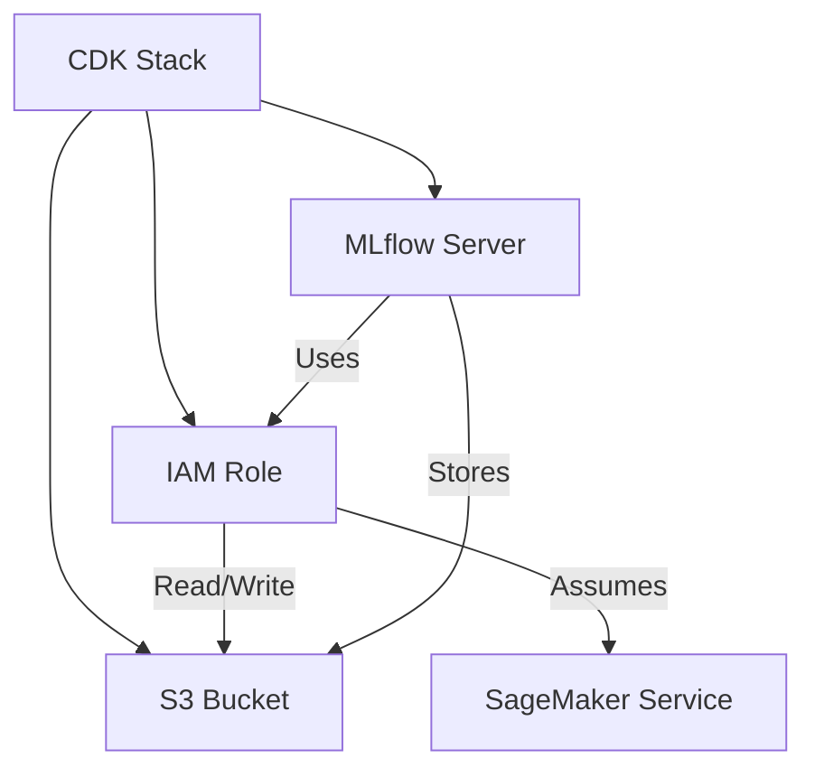
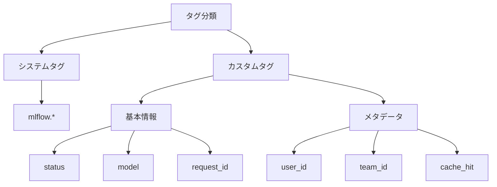

# MLflow による LiteLLM Proxy のモニタリング

## 概要

Amazon SageMaker の Managed MLflow を使用して、LiteLLM Proxy の実行ログを収集・分析する機能を提供します。これにより以下のメリットが得られます：

1. **統合的なログ管理**
   - LLM の呼び出し履歴を一元管理
   - リクエスト/レスポンスの詳細な記録
   - コスト、レイテンシ、トークン使用量の追跡

2. **高度な分析機能**
   - MLflow の実験管理機能を活用
   - タグベースでの検索・フィルタリング
   - メトリクスの可視化とトレンド分析

3. **運用効率の向上**
   - マネージドサービスによる運用負荷の軽減
   - スケーラブルなログストレージ
   - セキュアなアクセス制御



## アーキテクチャ

### コンポーネント構成

1. **MLflow Callback (`mlflow_callback.py`)**
   - LiteLLM Proxy のイベントをキャプチャ
   - メトリクス計測とタグ付け
   - MLflow への非同期ログ送信

2. **管理スクリプト (`manage-mlflow.sh`)**
   - MLflow トラッキングサーバーの管理
   - LiteLLM サービスとの連携設定
   - 環境変数と認証情報の管理

3. **テストスクリプト**
   - `test_litellm_mlflow.py`: LiteLLM API 経由のテスト
   - `test_mlflow_callback_only.py`: コールバック単体テスト



## インフラストラクチャ

### CDK スタック構成

MLflow の環境は AWS CDK を使用して構築されています。以下のリソースが作成されます：

1. **S3 バケット**
   - MLflow のアーティファクト保存用
   - 暗号化: S3 マネージド暗号化
   - バージョニング有効化

2. **IAM ロール**
   - MLflow サーバー用の実行ロール
   - S3 バケットへの読み書き権限

3. **MLflow トラッキングサーバー**
   - サイズ: Small
   - アーティファクトストア: 作成した S3 バケット
   - IAM ロール: 作成したサーバー実行ロール



## セットアップ手順

1. **パッケージのインストール**
   ```bash
   # uv を使用してパッケージをインストール
   uv sync
   ```

2. **環境変数の設定**
   ```bash
   # 必須環境変数
   export AWS_REGION_NAME="us-east-1"
   export MLFLOW_TRACKING_SERVER_NAME="mlflow-tracking-server"
   export MLFLOW_EXPERIMENT_NAME="/litellm-monitoring"
   
   # AWS 認証情報
   export AWS_ACCESS_KEY_ID="your-access-key"
   export AWS_SECRET_ACCESS_KEY="your-secret-key"
   ```

3. **MLflow トラッキングサーバーの起動**
   ```bash
   ./manage-mlflow.sh start
   ```

4. **LiteLLM の設定更新**
   ```bash
   ./manage-mlflow.sh update-config
   ```

## 主要機能

### 1. メトリクス記録

- **基本メトリクス**
  - レイテンシ（ミリ秒）
  - トークン使用量（prompt/completion/total）
  - コスト（USD）

- **カスタムメトリクス**
  - キャッシュヒット率
  - エラー率
  - モデルごとの使用状況

### 2. タグ管理



### 3. エラー追跡

- エラータイプの分類
- トレースバック情報の保存
- エラー発生コンテキストの記録

## 運用管理

### 1. サービス管理コマンド

```bash
# MLflow サービス
./manage-mlflow.sh start      # サービス開始
./manage-mlflow.sh stop       # サービス停止
./manage-mlflow.sh restart    # サービス再起動

# LiteLLM 連携
./manage-mlflow.sh litellm-start    # LiteLLM 開始
./manage-mlflow.sh litellm-stop     # LiteLLM 停止
./manage-mlflow.sh update-config    # 設定更新

# 認証関連
./manage-mlflow.sh get-url    # presigned URL の取得（有効期限: 30 分）
```

### 4. presigned URL の利用

MLflow UI にアクセスするための一時的な認証付き URL を取得できます：

```bash
./manage-mlflow.sh get-url
```

実行例：
```
[INFO] MLflow presigned URL: https://t-xxxxx.us-east-1.experiments.sagemaker.aws/auth?authToken=eyJhbGciOiJIUzI1NiJ9...
```

この URL は以下の特徴があります：
- 有効期限: 30 分（`--expires-in-seconds 300`）
- セッション有効期限: 約 5.5 時間（`--session-expiration-duration-in-seconds 20000`）
- ブラウザで開くと MLflow UI に直接アクセス可能
```

### 2. テストの実行

```bash
# LiteLLM API 経由のテスト
uv run test_litellm_mlflow.py

# コールバック単体テスト
uv run test_mlflow_callback_only.py
```

### 3. トラブルシューティング

1. **接続エラー**
   ```bash
   # トラッキングサーバー情報の確認
   ./manage-mlflow.sh get-tracking-info
   
   # 認証情報の確認
   aws sts get-caller-identity
   ```

2. **ログ記録の問題**
   ```bash
   # テストの実行
   ./manage-mlflow.sh test
   ```

<!-- TODO: スクリーンショットの追加
1. MLflow UI のダッシュボード
2. メトリクス可視化の例
3. エラートラッキングの表示
4. タグフィルタリングの使用例
-->

## 参考リンク

- [Amazon SageMaker MLflow](https://docs.aws.amazon.com/sagemaker/latest/dg/mlflow.html)
- [MLflow Documentation](https://mlflow.org/docs/latest/index.html)
- [LiteLLM Documentation](https://docs.litellm.ai/)

## Future Tasks

### 1. span 関連エラーの問題

span 関連でエラーが発生しており、動作に影響はありませんが調査が必要な状況です。

```bash
litellm-1   | 2025/04/18 17:30:41 DEBUG mlflow.tracing.utils: Failed to get attribute mlflow.experimentId with from span _Span(name="litellm-acompletion", context=SpanContext(trace_id=0xe6cbe5b4e9802359f4aba821e6443add, span_id=0xecf2926cba77bf4c, trace_flags=0x01, trace_state=[], is_remote=False)).
litellm-1   | Traceback (most recent call last):
litellm-1   |   File "/usr/lib/python3.13/site-packages/mlflow/tracing/utils/__init__.py", line 201, in get_otel_attribute
litellm-1   |     return json.loads(span.attributes.get(key))
litellm-1   |            ~~~~~~~~~~^^^^^^^^^^^^^^^^^^^^^^^^^^
litellm-1   |   File "/usr/lib/python3.13/json/__init__.py", line 339, in loads
litellm-1   |     raise TypeError(f'the JSON object must be str, bytes or bytearray, '
litellm-1   |                     f'not {s.__class__.__name__}')
litellm-1   | TypeError: the JSON object must be str, bytes or bytearray, not NoneType
```

### 2. 認証方式の改善

現在、`mlflow_callback.py` は以下の認証方式をサポートしていますが、さらなる改善が必要です：

1. **アクセスキー認証**
   - 現在の実装: boto3 でアクセスキーを使用
   - 課題: セキュリティリスク

2. **IAM ロール認証**
   - 今後の実装: コンテナの IAM ロールを使用
   - メリット: セキュアな認証方式

### 3. 設定ファイルの拡充

以下の機能を設定ファイルに追加予定：

1. **Prompt Caching の設定**
   - キャッシュ有効化オプション
   - キャッシュ保存期間
   - キャッシュキーの設定

2. **認証設定**
   - IAM ロール ARN
   - アクセス権限の詳細設定
   - セッション管理オプション
