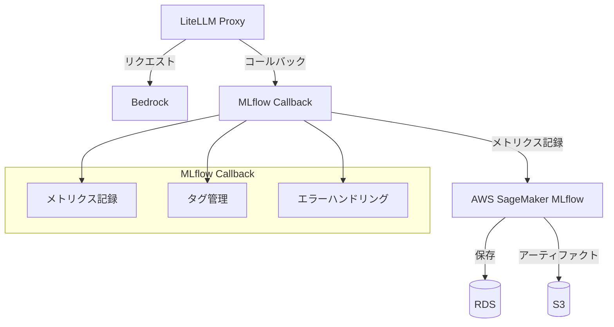
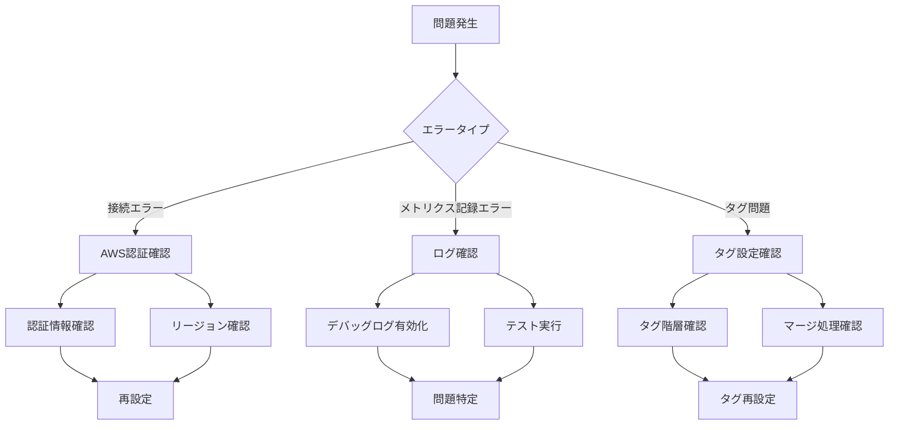

# LiteLLM と MLflow を用いた LLM 利用状況の分析

## 実装の概要

### アーキテクチャ


### MLflow Callback の主要機能
1. **メトリクス記録**
   - レイテンシ（ミリ秒単位）
   - トークン使用量（prompt/completion/total）
   - コスト（USD）

2. **タグ管理**
   ```mermaid
   graph TD
       A[タグ] --> B[システムタグ]
       A --> C[カスタムタグ]
       
       B --> D[mlflow.*]
       
       C --> E[基本タグ]
       C --> F[メタデータタグ]
       
       E --> G[status]
       E --> H[model_provider]
       
       F --> I[user_id]
       F --> J[team_alias]
       F --> K[cache_hit]
       F --> L[api_key_alias]
       F --> M[user_email]
       F --> N[end_user_id]
       F --> O[model_group]
       F --> P[deployment]
   ```

3. **エラーハンドリング**
   - エラー情報の記録
   - トレースバック情報の保存
   - エラータイプのタグ付け

### 実装のポイント

1. **時間計測**
   ```python
   # datetime と Unix タイムスタンプの両方に対応
   try:
       if isinstance(start_time, datetime) and isinstance(end_time, datetime):
           latency = (end_time - start_time).total_seconds() * 1000
       else:
           latency = (end_time - start_time) * 1000
       
       # 数値型に変換できることを確認
       latency = float(latency)
   except Exception as e:
       logger.warning(f"latency の計算に失敗: {str(e)}、デフォルト値を使用します")
       latency = 0.0  # デフォルト値
   ```

2. **タグの階層管理**
   ```python
   # システムタグとカスタムタグの分離
   system_tags = {k: v for k, v in current_tags.items() if k.startswith("mlflow.")}
   custom_tags = {k: v for k, v in filtered_tags.items() if not k.startswith("mlflow.")}
   
   # マージしてセット（システムタグを基本にカスタムタグで上書き）
   final_tags = {**system_tags, **custom_tags}
   ```

3. **メタデータ抽出**
   ```python
   metadata_mapping = {
       "user_id": "user_api_key_user_id",
       "team_alias": "user_api_key_team_alias",
       "cache_hit": "cache_hit",
       "cache_key": "cache_key",
       "api_key_alias": "user_api_key_alias",
       "user_email": "user_api_key_user_email",
       "end_user_id": "user_api_key_end_user_id",
       "model_group": "model_group",
       "deployment": "deployment"
   }
   ```

4. **OpenTelemetry スパン属性の設定**
   ```python
   # 実験IDを文字列として設定
   span.set_attribute("mlflow.experimentId", str(experiment_id))
   span.set_attribute("mlflow.experimentId.raw", experiment_id)  # バックアップとして生の値も保存
   ```

5. **ネストされたメタデータの取得**
   ```python
   def _get_nested_metadata(self, metadata, key, default=None):
       """ネストされたメタデータから値を取得するヘルパーメソッド"""
       try:
           # ドット記法でネストされたキーをサポート
           keys = key.split('.')
           value = metadata
           for k in keys:
               if isinstance(value, dict):
                   value = value.get(k)
               else:
                   return default
           return value
       except Exception as e:
           logger.debug(f"メタデータ '{key}' の取得に失敗: {str(e)}")
           return default
   ```

### テスト実装のポイント

1. **基本テスト**
   ```python
   # MLflowCallback インスタンスの作成
   callback = MLflowCallback()
   
   # テスト用のダミーデータ
   kwargs = {
       "model": "test-model",
       "messages": [{"role": "user", "content": "テストメッセージ"}],
       "user": "test-user",
       "temperature": 0.7,
       "max_tokens": 100,
       "litellm_params": {
           "metadata": {
               "user_id": "test-user-id"
           }
       }
   }
   
   # 成功イベントのテスト
   start_time = datetime.now().timestamp()
   end_time = start_time + 1.0
   
   await callback.async_log_success_event(
       kwargs=kwargs,
       response_obj=response_obj,
       start_time=start_time,
       end_time=end_time
   )
   ```

2. **統合テスト**
   ```python
   # リクエストボディ
   data = {
       "model": "bedrock-converse-us-claude-3-7-sonnet-v1",
       "messages": [
           {
               "role": "user",
               "content": "こんにちは、今日の天気を教えてください。"
           }
       ],
       "user": "mlflow-test-user",
       "temperature": 0.2,
       "max_tokens": 100
   }
   
   # リクエスト送信
   response = requests.post(url, headers=headers, json=data)
   ```

## デバッグとトラブルシューティング

### 一般的な問題と解決策

1. **タグが表示されない**
   - MLflow UI の「runs」ページでタグを確認
   - タグのマージ処理を確認
   - システムタグとカスタムタグの分離を確認

2. **メトリクス計算エラー**
   - 時間値の型を確認（datetime または float）
   - エラーハンドリングを追加
   - デフォルト値の設定

3. **OpenTelemetry スパン属性エラー**
   - 属性値を文字列に変換
   - バックアップ属性の設定
   - エラーハンドリングの追加

### ログレベルの設定

詳細なデバッグ情報を取得するには、ログレベルを DEBUG に設定します：

```python
# ロガーの設定
logger = logging.getLogger("mlflow_callback")
logger.setLevel(logging.DEBUG)

# MLflow のデバッグログを有効化
logging.getLogger('mlflow').setLevel(logging.DEBUG)
logging.getLogger('botocore').setLevel(logging.DEBUG)
```

## パフォーマンス最適化のポイント

1. **非同期処理**
   - MLflow へのログ記録は非同期で実行
   - メインスレッドをブロックしない

2. **エラーハンドリング**
   - 例外をキャッチして処理を継続
   - デフォルト値の設定

3. **メモリ使用量の最適化**
   - 大きなオブジェクトのログ記録を避ける
   - 必要な情報のみを抽出

## セキュリティ考慮事項

1. **認証情報の保護**
   - 環境変数を使用
   - ログに認証情報を含めない

2. **データの保護**
   - センシティブな情報のフィルタリング
   - 必要に応じてデータの匿名化

## カスタマイズガイド

### カスタムメトリクスの追加

`mlflow_callback.py` を編集することで、追加のメトリクスを記録できます：

```python
# メトリクスの例
metrics = {
    "latency_ms": latency,
    "prompt_tokens": usage.get("prompt_tokens", 0),
    "completion_tokens": usage.get("completion_tokens", 0),
    "total_tokens": usage.get("total_tokens", 0),
    "cost_usd": cost,
    # カスタムメトリクスを追加
    "your_metric": value
}
```

### カスタムタグの追加

メタデータマッピングを拡張することで、追加のタグを設定できます：

```python
metadata_mapping = {
    "user_id": "user_api_key_user_id",
    "team_alias": "user_api_key_team_alias",
    # ... 既存のマッピング
    "your_tag": "your_metadata_key"  # 新しいタグを追加
}
```

---

## 前提条件

このディレクトリは以下のコンポーネントが既に設定・実行されていることを前提としています：

1. LiteLLM Proxy（`2.litellm/`）
   - LiteLLM サーバーが実行中
   - 設定ファイルが適切に構成済み

2. Langfuse（`4.langfuse/`）
   - Langfuse サーバーが実行中
   - 必要な認証情報が設定済み

## ファイル構成

```
.
├── .env.example                # 環境変数のテンプレート
├── docker-compose.yml          # MLflow の Docker Compose 設定
├── litellm_config.yml         # LiteLLM の設定ファイル（MLflow 連携用）
├── mlflow_callback.py         # MLflow コールバック実装
├── manage-mlflow.sh          # MLflow 管理スクリプト
└── test_litellm_mlflow.py    # テストスクリプト
```

## コンポーネント構成

1. **AWS SageMaker MLflow**
   - バックエンドストア: AWS RDS (PostgreSQL)
   - アーティファクトストア: Amazon S3
   - セキュアなアクセス制御
   - スケーラブルなインフラストラクチャ

## セットアップ手順

1. 環境変数の設定
   ```bash
   # 環境変数の設定
   ../scripts/setup_env.sh .
   ```
   以下の環境変数が設定されます：
   - AWS 認証情報（AWS_ACCESS_KEY_ID, AWS_SECRET_ACCESS_KEY）
   - AWS リージョン（AWS_REGION_NAME）
   - MLflow トラッキングサーバー名（MLFLOW_TRACKING_SERVER_NAME）
   - MLflow 実験名（MLFLOW_EXPERIMENT_NAME）

2. MLflow サーバーの起動と設定
   ```bash
   # MLflow トラッキングサーバーの起動
   sudo ./manage-mlflow.sh start
   
   # LiteLLM の設定を MLflow 用に更新
   sudo ./manage-mlflow.sh update-config
   ```

3. 動作確認
   ```bash
   # トラッキングサーバーの情報を取得
   sudo ./manage-mlflow.sh get-tracking-info
   
   # presigned URL を取得して MLflow UI にアクセス
   sudo ./manage-mlflow.sh get-url
   ```

## MLflow の利用方法

[MLflow](https://mlflow.org/) は機械学習のライフサイクル管理のためのオープンソースプラットフォームです。本プロジェクトでは、LLM の実験管理とメトリクス追跡に使用します。

### MLflow の主要機能

1. **実験管理**：
   - 各 LLM リクエストを実験として記録
   - パラメータ（モデル、温度など）の追跡
   - メトリクス（レイテンシ、トークン数、コストなど）の記録

2. **メトリクス可視化**：
   - リアルタイムなメトリクス追跡
   - カスタムチャートとダッシュボード
   - 実験間の比較分析

3. **アーティファクト管理**：
   - プロンプトとレスポンスのテキスト保存
   - エラーログの保存
   - カスタムデータの保存

### MLflow Web UI の利用方法

AWS SageMaker MLflow の Web UI にアクセスするには、以下の手順を実行します：

<!-- TODO: MLflow UI のスクリーンショット
1. MLflow UI のログイン画面
2. 実験一覧画面
3. 実行詳細画面（パラメータ、メトリクス、タグ）
4. メトリクスの可視化画面
-->

1. presigned URL の取得
   ```bash
   sudo ./manage-mlflow.sh get-url
   ```
   - URL の有効期限: 5分（AWS の制限により）
   - セッション有効期限: 約5.5時間
   - 一度のみ使用可能

2. ブラウザでアクセス
   - 取得した presigned URL を使用
   - 実験一覧から "litellm-monitoring" を選択
   - 各実行の詳細を確認：
     - パラメータ（モデル、設定など）
     - メトリクス（レイテンシ、トークン数など）
     - アーティファクト（プロンプト、レスポンス）

### AWS SageMaker MLflow の管理

AWS SageMaker MLflow は CDK を使用してインフラストラクチャをコードとして管理します。

#### CDK による MLflow インフラストラクチャの定義

`cdk/` ディレクトリには以下のコンポーネントが含まれています：

1. **MLflow スタック（`lib/mlflow-stack.ts`）**
   - S3 バケット: MLflow アーティファクトストア用
   - IAM ロール: SageMaker サービス用
   - MLflow トラッキングサーバー
   - スタック出力:
     - サーバー ARN
     - バケット名
     - ロール ARN

2. **デプロイ手順**
   ```bash
   # 環境変数が設定されていることを確認
   env | grep -E "AWS_|MLFLOW_"
   
   # CDKのデプロイ
   cd cdk
   npm install
   npx cdk deploy
   ```

#### MLflow トラッキングサーバーへのアクセス

1. **presigned URL の取得**
   ```bash
   sudo ./manage-mlflow.sh get-url
   ```
   - URL の有効期限: 5分（AWS の制限により）
   - セッション有効期限: 約5.5時間（20,000秒）
   - 一度のみ使用可能（セキュリティのため）

2. **環境変数の確認**
   ```bash
   # 環境変数が正しく設定されているか確認
   env | grep -E "AWS_|MLFLOW_"
   ```

3. **MLflow UI からの実験データ確認**
   - 取得した presigned URL を使用してアクセス
   - 実験データの閲覧と分析
   - メトリクスの可視化

#### 注意事項
- AWS CLI のインストールが必要
- 適切な AWS 認証情報の設定が必要
- CDK スタックのデプロイが必要
- presigned URL は一度のみ使用可能で、有効期限は 30 分に設定している

## トラブルシューティング

### 問題解決フロー


### MLflow 関連の問題

1. **接続エラー**
   ```bash
   # AWS 認証情報の確認
   aws configure list
   aws sts get-caller-identity
   
   # トラッキングサーバーの情報を再取得
   sudo ./manage-mlflow.sh get-tracking-info
   ```

2. **presigned URL の問題**
   ```bash
   # 新しい presigned URL を取得
   sudo ./manage-mlflow.sh get-url
   ```

3. **メトリクス記録の問題**
   ```bash
   # テストの実行
   sudo ./manage-mlflow.sh test
   ```

## 今後の実装予定

### アクセスキーを用いない認証方法

現在の実装では AWS アクセスキーを使用して MLflow にアクセスしていますが、セキュリティ向上のため以下の認証方法を今後実装予定です：

1. **IAM ロールベースの認証**
   ```mermaid
   graph LR
       A[EC2/ECS] -->|AssumeRole| B[IAM Role]
       B -->|アクセス権限| C[MLflow]
   ```
   - EC2/ECS インスタンスプロファイルを使用
   - 一時的な認証情報の自動更新
   - アクセスキーの保存が不要

2. **AWS IAM Identity Center (SSO) 連携**
   ```python
   # SSO 認証情報プロバイダーの実装例
   from mlflow.tracking.request_auth.registry import RequestAuthProviderRegistry
   
   class SSOAuthProvider:
       def get_auth(self):
           # SSO トークンを取得
           token = get_sso_token()
           return {"Authorization": f"Bearer {token}"}
   
   # 認証プロバイダーの登録
   registry = RequestAuthProviderRegistry()
   registry.register(SSOAuthProvider)
   ```
   - シングルサインオンによる認証
   - 細かなアクセス制御
   - 監査ログの強化

3. **コンテナ認証情報プロバイダー**
   ```python
   # ECS タスクロールを使用した認証
   import boto3
   from botocore.credentials import ContainerProvider
   
   provider = ContainerProvider()
   credentials = provider.load()
   
   # 認証情報を使用して MLflow にアクセス
   mlflow.set_tracking_uri(tracking_uri)
   os.environ["AWS_ACCESS_KEY_ID"] = credentials.access_key
   os.environ["AWS_SECRET_ACCESS_KEY"] = credentials.secret_key
   os.environ["AWS_SESSION_TOKEN"] = credentials.token
   ```
   - コンテナ環境での安全な認証
   - 認証情報の自動更新
   - 最小権限の原則に基づくアクセス

これらの認証方法を実装することで、ハードコードされた認証情報やアクセスキーの使用を排除し、セキュリティを強化します。

## 参考リンク

- [MLflow Documentation](https://mlflow.org/docs/latest/index.html)
- [AWS SageMaker MLflow](https://docs.aws.amazon.com/sagemaker/latest/dg/mlflow.html)
- [LiteLLM Documentation](https://docs.litellm.ai/)
- [Langfuse Documentation](https://langfuse.com/docs)
- [AWS IAM ロールベースのアクセス](https://docs.aws.amazon.com/IAM/latest/UserGuide/id_roles.html)
- [AWS IAM Identity Center](https://aws.amazon.com/iam/identity-center/)
