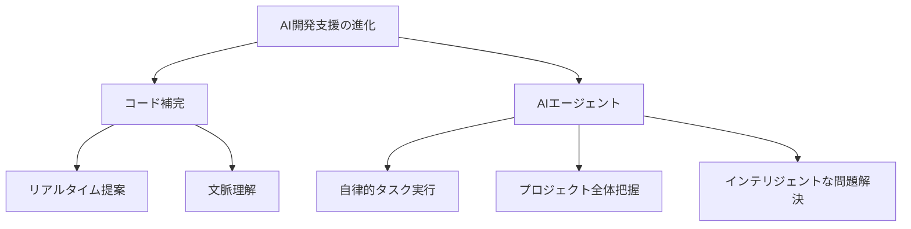

# AI コーディングエージェント時代における開発生産性の革新

ソフトウェア開発の世界は、生成 AI の台頭により大きな転換期を迎えています。特に 2024 年以降、AI を活用した開発支援ツールは急速な進化を遂げ、開発者の働き方に革新的な変化をもたらしています。本記事では、AI コーディングエージェント「Cline」と Amazon Bedrock を組み合わせることで、いかにして開発生産性を向上させ、現代のソフトウェア開発が直面する課題を解決できるかについて解説します。

## なぜ今、開発生産性の向上が重要なのか

グローバル競争の激化とテクノロジーの急速な進化により、企業は従来以上のスピードでソフトウェアを開発・展開することを求められています。新しい機能の実装や既存システムの改善において、開発者の生産性は企業の競争力を左右する重要な要素となっています。

特に注目すべきは、AI 時代における開発プロセスの根本的な変化です。従来の開発手法では、増大する開発需要と技術の複雑化に対応することが困難になってきています。例えば、クラウドネイティブアプリケーションの開発では、マイクロサービスアーキテクチャの採用やコンテナ化の推進により、開発者が理解し管理すべき技術スタックが著しく増加しています。

## 現代のエンジニアが直面する課題

開発者は日々、複数の重要な課題に直面しています。まず、コードの品質を維持しながら開発速度を向上させる必要があります。これは単なる生産性の問題ではなく、ビジネスの成功に直結する重要な課題です。実際、多くの企業で開発者一人あたりの工数は限られており、その中で最大の価値を生み出すことが求められています。

また、セキュリティとコンプライアンスの要件も年々厳格化しています。特に企業システムの開発では、コードの品質管理だけでなく、セキュリティ基準への準拠や監査対応など、考慮すべき要素が増加の一途をたどっています。

さらに、チーム開発における知識共有と技術継承も重要な課題となっています。プロジェクトの規模が大きくなるにつれ、コードベースの理解や保守が困難になり、新規メンバーの参画にかかる時間も増加傾向にあります。

## AI コーディングツールの進化

このような課題に対して、AI コーディングツールは急速な進化を遂げています。特に注目すべきは、単なるコード補完から、より高度な AI エージェントへの発展です。従来の GitHub Copilot のようなツールは、主にコードの補完機能を提供していましたが、新世代の AI コーディングエージェントは、プロジェクト全体の理解と自律的なタスク実行を可能にしています。

## 本ブログシリーズの目的

本ブログシリーズでは、AI コーディングエージェント「Cline」と Amazon Bedrock を組み合わせることで、これらの課題をどのように解決できるのかを具体的に解説していきます。特に、開発生産性の向上、コスト管理の最適化、セキュリティとガバナンスの強化という3つの重要な側面に焦点を当てます。

また、実際の導入事例や具体的な設定方法、運用のベストプラクティスについても詳しく説明していきます。これにより、読者の皆様が自身の開発環境に Cline を効果的に導入し、AI 時代における開発生産性の向上を実現するための具体的な指針を提供します。

次のセクションでは、Cline の特徴と、なぜこのツールが現代の開発課題に対する効果的なソリューションとなりうるのかについて詳しく見ていきます。
