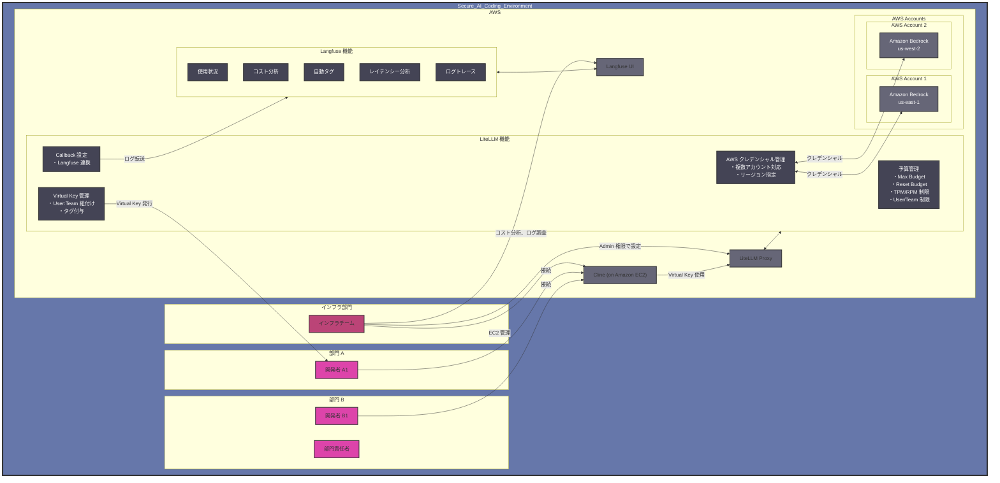

# Cline による開発生産性とガバナンスの両立

## Cline の概要と基本機能

近年、開発者の生産性向上を支援する様々な AI ツールが登場していますが、本記事ではその中でも Cline に着目します。Cline は、単なるコード補完ツールではなく、開発者の意図を理解し自律的にタスクを実行できる AI コーディング支援エージェントです。Visual Studio Code などの統合開発環境（IDE）に完全に統合され、プロジェクトの立ち上げからコード生成、Git コミットまでをシームレスにサポートします。

特筆すべき点として、Cline は現状オープンソースとして開発されており、開発者コミュニティと連携しながら日々進化を続けています。これにより、企業固有のニーズに合わせたカスタマイズや、新しい機能の追加が容易に行えます。

## Cline の主要な特徴

### 自律的なタスク実行と柔軟なカスタマイズ

Cline は開発者の意図を理解し、必要な一連の作業を自律的に実行できます。例えば、「新しい API エンドポイントを追加して」という指示に対して、ルーティングの設定、コントローラーの作成、テストコードの生成まで一貫して行うことができます。また、.clinerules ファイルを通じて、プロジェクト固有の規約やガイドラインを設定できます。これにより、チームの開発規約に準拠したコード生成や、セキュリティポリシーに基づいた制約の設定が可能です。

### Pilot アプローチと Plan/Act モードの分離

Cline は Pilot として自律的にタスクを遂行し、人間が Copilot として問題解決をサポート・誘導するスタイルを採用しています。この関係性により、開発者は高度な判断や方向性の決定に集中し、細かな実装タスクはある程度 AI に委ねることができます。

Plan モードでは、アーキテクチャ設計や実装方針の検討、Mermaid 図による視覚的な設計の共有、低・中コストモデルでの事前確認を行い、人間との合意形成を図ります。一方、Act モードでは、Plan で合意された内容の実装、高性能モデルによる正確なコード生成、ファイル操作や環境設定の実行を行い、継続的な進捗確認とフィードバックを提供します。

### Model Context Protocol による拡張性

Cline は、Model Context Protocol（MCP）による高度な拡張性を備えています。このプロトコルにより、開発者は外部サービスやツールとのシームレスな連携を実現できます。Web 検索エンジンとの連携により最新の技術情報を取り込んだり、社内の専用 API と接続してプロプライエタリなデータにアクセスしたりすることが可能です。さらに、チーム固有のワークフローやツールチェーンとの統合により、組織の開発文化に完全に適応した AI アシスタントとして機能します。

### リスク管理と安全性の確保

Cline の自律的なファイル操作能力は生産性を飛躍的に向上させる一方で、不用意なファイル削除やデータ消失のリスクも内包しています。特に Git 操作や AWS CLI などのコマンド実行は、誤った使用により深刻な問題を引き起こす可能性があります。また、API キーなどの機密情報が意図せず漏洩するリスクも考慮する必要があります。

これらのリスクに対して、重要な操作に対する承認フローの設定、Git 操作の制限と保護ブランチの活用、AWS CLI 操作の監査ログ有効化など、多層的な防御策を講じています。セキュリティとユーザビリティのバランスを取りながら、組織に最適な設定を見つけることで、Cline の利点を最大化しながらリスクを最小限に抑えることができます。

## Amazon Bedrock と Claude 3.7 Sonnet がもたらす価値

Cline と Amazon Bedrock の組み合わせは、単なる技術的な選択肢を超えた戦略的な意思決定です。この組み合わせにより、企業は開発生産性とガバナンスを高いレベルで両立させることができます。

### エンタープライズ環境に最適化された AWS エコシステム

AWS は創業以来、セキュリティを最優先事項として設計・運用されてきました。この「セキュリティファースト」の哲学は、Amazon Bedrock にも深く根付いています。大規模組織での AI 活用に関する豊富な知見と実績を持ち、顧客からのフィードバックを積極的に取り入れながらサービスを進化させ続けています。

金融、医療、公共部門など厳格な規制が求められる業界においても、AWS の包括的なコンプライアンス対応により、安心して AI を活用できる環境と実績が整っています。これにより、企業は業界固有の規制要件を満たしながら、最新の AI 技術を活用することが可能になります。

### データ主権とプライバシーの保護

企業データの保護は、AI 活用における最重要課題の一つです。Amazon Bedrock は、この課題に正面から取り組んでいます。モデルへの入出力をデフォルトで学習に利用せず、ログ記録も標準では無効化されているため、機密性の高い企業データを安全に処理できます。

さらに、データの取り扱いポリシーを組織の要件に合わせて詳細に設定できるため、規制の厳しい業界でも安心して利用できます。これは特に、知的財産や個人情報を含むコードベースを扱う開発環境において重要な要素となります。

### 運用面での柔軟性とスケーラビリティ

Amazon Bedrock の大きな強みは、その運用面での柔軟性です。バッチ推論による大規模データ処理、利用リージョン選択、オンデマンドでの柔軟な利用、[Provisioned Throughput](https://docs.aws.amazon.com/ja_jp/bedrock/latest/userguide/prov-throughput.html) による安定したパフォーマンス保証など、ビジネスニーズに合わせた選択肢が用意されています。

データ主権やコンプライアンス要件に応じて最適なリージョンを選択できるため、グローバル企業でも各国の法規制に対応した AI 活用が可能です。また、組織の成長に合わせてスケールアップできる柔軟性も備えています。

### マルチモデル戦略による最適化

Amazon Bedrock は、複数のプロバイダが提供する最先端モデルを統一的なインターフェースで利用できる点に強みがあります。Claude 3.7 Sonnet をはじめ、Amazon Nova Pro、Llama 3.1 など、様々なモデルにアクセスできます。

これにより、タスクの性質や要件に応じて最適なモデルを選択できるだけでなく、コストと性能のバランスを考慮した戦略的な使い分けが可能になります。例えば、初期の概念検討には軽量モデルを、最終的なコード生成には高性能モデルを使用するといった柔軟な運用が実現します。

### Claude 3.7 Sonnet による開発体験の革新

Anthropic の [Claude 3.7 Sonnet](https://aws.amazon.com/jp/blogs/news/anthropics-claude-3-7-sonnet-the-first-hybrid-reasoning-model-is-now-available-in-amazon-bedrock/) は、特にソフトウェア開発領域において卓越した能力を発揮します。大規模で複雑なコードベースを深く理解し、プロジェクト全体の文脈を把握した上で的確な提案を行います。

その正確なコード生成能力は、単に動作するコードを提供するだけでなく、プロジェクトの規約やベストプラクティスに準拠した高品質なコードを生成します。これにより、開発者はより創造的な問題解決や設計に集中できるようになります。

### コスト効率と投資対効果

Amazon Bedrock の利用コストは、エンジニア 1 人あたり月額 $0.5K〜$1.0K 程度と見積もられます。エンジニアの人件費を月額 100 万円と仮定すると、生産性が 10% 向上するだけでコストを回収できる計算になります。

さらに、Preview 中の Prompt Caching 機能により、リクエスト間で繰り返されるプロンプトプレフィックスをキャッシュでき、長期的な運用コストの最適化が期待できます。これにより、組織全体での AI 活用の経済的な持続可能性が高まります。

## 組織向け AI コーディング支援エージェント環境の構築

Cline、LiteLLM、Langfuse を組み合わせた包括的なアーキテクチャにより、企業における AI コーディング支援エージェントの活用における主要な課題を効果的に解決します。以下のアーキテクチャ図は、各コンポーネントの関係性と、組織全体での運用方法を示しています。

企業が AI コーディング支援エージェントを導入する際には、トークン消費の最適化、セキュリティの確保、コスト管理など、複数の重要な課題に直面します。本アーキテクチャは、これらの課題を包括的に解決し、組織全体での効果的な AI 活用を実現します。

### トークン消費と API 制限の最適化

AI コーディング支援エージェントの運用において、トークン消費の管理は重要な課題です。特に Cline のような自律型エージェントは、コードベースの理解や複数ファイルの操作により、従来の AI チャットと比較して多くのトークンを消費します。これは API 制限への頻繁な抵触につながる可能性があります。

本アーキテクチャでは、LiteLLM Proxy を中核に据えることでこの課題を解決します。複数のモデルやリージョンへのリクエスト分散により、単一エンドポイントの制限を超えた処理能力を実現します。また、インテリジェントなリトライ機能により、一時的な API 制限にも柔軟に対応します。

さらに、Virtual Key による部門別のトークン制限管理を導入し、組織全体でのリソース配分を最適化します。これにより、開発者は API 制限を意識することなく、創造的な作業に集中できる環境が整います。

### セキュリティとコンプライアンスの包括的な強化

企業環境での AI 活用において、セキュリティとコンプライアンスは最重要課題です。本アーキテクチャは、多層的な防御戦略によりこれらの課題に対応します。基盤となる Amazon Bedrock は、モデルへの入出力を学習に利用せず、デフォルトでログを記録しないため、機密性の高いコードや情報の外部漏洩リスクを最小化します。

Amazon EC2 上での Cline 運用により、セキュリティをさらに強化しています。[code-server](https://github.com/coder/code-server) や [Remote Development using SSH](https://code.visualstudio.com/docs/remote/ssh) の活用により、ローカル PC 上での直接実行に伴うリスクを緩和します。開発者は慣れ親しんだ VSCode インターフェースを使用しながら、実際の処理は EC2 インスタンス上で安全に実行されます。

AWS Systems Manager の Session Manager を用いた EC2 へのアクセス制御により、外部への SSH ポート公開を不要とし、ネットワークレベルでの攻撃面を最小化します。また、LiteLLM の Virtual Key 機能により、AWS クレデンシャルの直接的な取り扱いを回避し、アクセス権限を厳密に管理します。

インフラ部門による一元管理体制も重要な要素です。CloudTrail や CloudWatch Logs、サードパーティのコマンド履歴収集ツールにより、詳細な監査証跡を確保します。これにより、不審な活動の早期検出やインシデント発生時の原因究明が容易になります。

### コスト管理の精緻化と最適化

AI モデルの利用コストは、大規模組織での導入における重要な検討事項です。本アーキテクチャでは、LiteLLM による部門別予算設定と制限機能を実装し、各チームや部門の予算枠内での運用を自動的に保証します。予算上限到達時には、自動的な利用制限や承認プロセスを経た追加予算割り当てなど、柔軟な運用が可能です。

Langfuse による詳細なコスト分析ダッシュボードにより、リアルタイムでの使用状況モニタリングと長期的なコスト傾向の分析が可能になります。使用パターンの詳細な分析に基づき、初期の概念検討には軽量モデルを、最終的なコード生成には高性能モデルを使用するなど、コストパフォーマンスを最大化する戦略を採用できます。

このように、本アーキテクチャは企業における AI コーディング支援エージェントの安全かつ効率的な活用を実現します。LiteLLM と Langfuse の組み合わせにより、セキュリティとガバナンスを確保しながら、開発者の生産性を最大限に引き出すことが可能です。以降のセクションでは、このアーキテクチャの各コンポーネントについて詳細に解説していきます。
