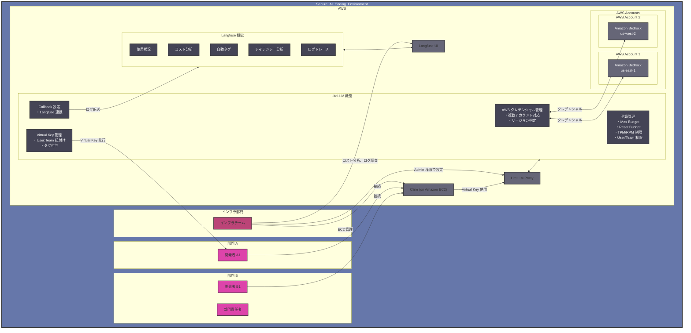

## 開発生産性とガバナンスを両立するアーキテクチャ

近年、開発者の生産性向上を支援する様々な AI ツールが登場していますが、本記事ではその中でも Cline に着目します。本セクションでは、Cline の特徴、開発生産性とガバナンスを両立するアーキテクチャ全体像、について説明します。

**Cline の概要と特徴**: Cline は、単なるコード補完ツールではなく、開発者の意図を理解し自律的にタスクを実行できる AI コーディング支援エージェントです。Visual Studio Code などの統合開発環境（IDE）に完全に統合され、プロジェクトの立ち上げからコード生成、Git コミットまでをシームレスにサポートします。特筆すべき点として、Cline は現状オープンソースとして開発されており、開発者コミュニティと連携しながら日々進化を続けています。これにより、企業固有のニーズに合わせたカスタマイズや、新しい機能の追加が容易に行えます。**1. 自律的なタスク実行**: 開発者の意図を理解し、必要な一連の作業を自律的に実行できます。例えば、「新しい API エンドポイントを追加して」という指示に対して、ルーティングの設定、コントローラーの作成、テストコードの生成まで一貫して行うことができます**2. 柔軟なカスタマイズ性**: .clinerules ファイルを通じて、プロジェクト固有の規約やガイドラインを設定できます。これにより、チームの開発規約に準拠したコード生成や、セキュリティポリシーに基づいた制約の設定が可能です。**3. Pilot アプローチ**: Cline は Pilot として自律的にタスクを遂行し、人間が Copilot として問題解決をサポート・誘導するようなスタイルです。この関係性により、開発者は高度な判断や方向性の決定に集中し、細かな実装タスクはある程度 AI に委ねることができます。**4. 安全性を重視した Plan/Act モード**: Cline は Plan モードと Act モードを明確に分離することで、安全性と効率性を両立しています：

- **Plan モード**:
  - アーキテクチャ設計や実装方針の検討
  - Mermaid 図による視覚的な設計の共有
  - 低・中コストモデルでの事前確認
  - 人間との合意形成

- **Act モード**:
  - Plan で合意された内容の実装
  - 高性能モデルによる正確なコード生成
  - ファイル操作や環境設定の実行
  - 継続的な進捗確認とフィードバック

**5. Model Context Protocol（MCP）による拡張性**: Cline は、Model Context Protocol（MCP）による拡張性を備えています。このプロトコルにより、開発者は外部サービスやツールとのシームレスな連携を実現できます。Web 検索エンジンとの連携により最新の技術情報を取り込んだり、社内の専用 API と接続してプロプライエタリなデータにアクセスしたりすることが可能です。さらに、チーム固有のワークフローやツールチェーンとの統合により、組織の開発文化に完全に適応した AI アシスタントとして機能します。これは単なるツール連携ではなく、組織の知識基盤と AI の融合を意味しています。**6. リスク管理と適切な対策**: ツール利用には常にリスクが伴います。Cline も例外ではありません。自律的なファイル操作能力は生産性を飛躍的に向上させる一方で、不用意なファイル削除やデータ消失のリスクも内包しています。特に Git 操作や AWS CLI などのコマンド実行は、誤った使用により深刻な問題を引き起こす可能性があります。また、API キーなどの機密情報が意図せず漏洩するリスクも考慮する必要があります。こうしたリスクに対しては、組織的なアプローチが重要です。重要な操作に対する承認フローの設定、Git 操作の制限と保護ブランチの活用、AWS CLI 操作の監査ログ有効化など、多層的な防御策を講じることで、Clineの 利点を最大化しながらリスクを最小限に抑えることができます。セキュリティとユーザビリティのバランスを取りながら、組織に最適な設定を見つけることが成功の鍵となります。

### Amazon Bedrock と Claude 3.7 Sonnet がもたらす価値

Cline と Amazon Bedrock の組み合わせは、単なる技術的な選択肢を超えた戦略的な意思決定です。**エンタープライズ環境に最適化された AWS エコシステム**: AWS は創業以来、セキュリティを最優先事項として設計・運用されてきました。この「セキュリティファースト」の哲学は、Amazon Bedrock にも深く根付いています。大規模組織での AI 活用に関する豊富な知見と実績を持ち、顧客からのフィードバックを積極的に取り入れながらサービスを進化させ続けています。金融、医療、公共部門など厳格な規制が求められる業界においても、AWS の包括的なコンプライアンス対応により、安心して AI を活用できる環境と実績が整っています。**データ主権とプライバシーを尊重する Amazon Bedrock**: 企業データの保護は、AI 活用における最重要課題の一つです。Amazon Bedrock は、この課題に正面から取り組んでいます。モデルへの入出力をデフォルトで学習に利用せず、ログ記録も標準では無効化されているため、機密性の高い企業データを安全に処理できます。さらに、データの取り扱いポリシーを組織の要件に合わせて詳細に設定できるため、規制の厳しい業界でも安心して利用できます。**運用面での柔軟性**: Amazon Bedrock の大きな強みは、その運用面での柔軟性です。バッチ推論による大規模データ処理、利用リージョン選択、オンデマンドでの柔軟な利用、[Provisioned Throughput](https://docs.aws.amazon.com/ja_jp/bedrock/latest/userguide/prov-throughput.html) による安定したパフォーマンス保証など、ビジネスニーズに合わせた選択肢が用意されています。データ主権やコンプライアンス要件に応じて最適なリージョンを選択できるため、グローバル企業でも各国の法規制に対応した AI 活用が可能です。**マルチモデル戦略による最適化**: Amazon Bedrock は、複数のプロバイダが提供する最先端モデルを統一的なインターフェースで利用できる点に強みがあります。Claude 3.7 Sonnet をはじめ、Amazon Nova Pro、 Llama 3.1 など、様々なモデルにアクセスできます。これにより、タスクの性質や要件に応じて最適なモデルを選択できるだけでなく、コストと性能のバランスを考慮した戦略的な使い分けが可能になります。例えば、初期の概念検討には軽量モデルを、最終的なコード生成には高性能モデルを使用するといった柔軟な運用が実現します。**Claude 3.7 Sonnet による開発体験の革新**: Anthropic の [Claude 3.7 Sonnet](https://aws.amazon.com/jp/blogs/news/anthropics-claude-3-7-sonnet-the-first-hybrid-reasoning-model-is-now-available-in-amazon-bedrock/) は、特にソフトウェア開発領域において卓越した能力を発揮します。大規模で複雑なコードベースを深く理解し、プロジェクト全体の文脈を把握した上で的確な提案を行います。その正確なコード生成能力は、単に動作するコードを提供するだけでなく、プロジェクトの規約やベストプラクティスに準拠した高品質なコードを生成します。**コスト効率と ROI**: Amazon Bedrock 利用コストを、エンジニア 1 人あたり月額 $0.5K〜$1.0K と仮定します。エンジニアの人件費を月額 100 万円と仮定すると、生産性が 10% 向上するだけでコストを回収できる計算になります。さらに、Preview 中の Prompt Caching 機能により、リクエスト間で繰り返されるプロンプトプレフィックスをキャッシュでき、長期的な運用コストの最適化が期待できます。

### 組織向け AI コーディング支援エージェント環境

Cline、LiteLLM、Langfuse を組み合わせた包括的なアーキテクチャにより、企業における AI コーディング支援エージェントの活用における主要な課題を効果的に解決します。以下のアーキテクチャ図は、各コンポーネントの関係性と、組織全体での運用方法を示しています。

企業が AI コーディング支援エージェントを導入する際には、いくつかの重要な課題に直面します。本アーキテクチャは、これらの課題を包括的に解決し、組織全体での効果的な AI 活用を実現します。

**トークン消費と API 制限の最適化**: AI コーディング支援エージェントは、従来の AI チャットと比較して多くのトークンを消費します。特に Cline のような自律型エージェントは、コードベースを理解し、複数のファイルを操作するため、API 制限に頻繁に抵触する可能性があります。本アーキテクチャでは、LiteLLM Proxy を中核に据えることでこの問題を緩和します。複数のモデル・リージョンへのリクエスト分散により、単一エンドポイントの制限を超えた処理能力を実現します。さらに、インテリジェントなリトライ機能により、一時的な API 制限に対応します。そして、Virtual Key による部門別のトークン制限管理も導入し、組織全体でのリソース配分を行います。これにより、開発者は制限を意識することなく、創造的な作業に集中できる環境が整います。

**セキュリティとコンプライアンスの強化**: 企業環境での AI 活用において、セキュリティとコンプライアンスは最重要課題です。本アーキテクチャは、多層的な防御戦略によりこれらの懸念に対応します。基盤となる Amazon Bedrock はモデルへの入出力を学習に利用することはなく、デフォルトでログを記録することもありません。これにより、機密性の高いコードや情報が外部に漏洩するリスクを最小化します。

本アーキテクチャでは、Amazon EC2 上で Cline を運用することで、セキュリティを強化しています。[code-server](https://github.com/coder/code-server) や [Remote Development using SSH](https://code.visualstudio.com/docs/remote/ssh) を活用することにより、ローカル PC 上でエージェントを直接実行する場合に懸念されるファイル削除や意図しない外部公開などのリスクを緩和できます。開発者は慣れ親しんだ VSCode インターフェースを使いながら、実際の処理は EC2 インスタンス上で実行されるため、ローカル環境への影響を遮断できます。また、Amazon EC2 へのアクセスに AWS Systems Manager の Session Manager を活用することで、外部に SSH ポートを公開することなく安全にインスタンスに接続できます。これにより、ネットワークレベルでの攻撃面を最小化します。

LiteLLM の Virtual Key 機能を採用することで、AWS クレデンシャルを扱う必要がなくなります。これにより、AWS アカウントへの不正アクセスリスクを軽減できます。Virtual Key は LiteLLM へのアクセスのみに利用されるため、万が一漏洩した場合でも影響範囲が LiteLLM 利用に閉じ、即時無効化が可能です。LiteLLM による部門単位でのアクセス制御により、必要な権限を持つユーザーのみが適切なモデルにアクセスできる環境を実現しています。さらに、Langfuse による詳細なログの記録により、AI リクエストの履歴を可視化しています。グローバル企業においては、Amazon Bedrock はデータ主権に配慮したリージョン選択により、GDPR や各国の法規制にも柔軟に対応可能です。

インフラ部門による一元管理体制も重要なセキュリティ要素です。EC2 インスタンスの管理をインフラ部門が担当し、CloudTrail や CloudWatch Logs、3rd Party のコマンド履歴収集ツールを活用してコマンド実行の監査証跡を残すことができます。これにより、「誰が」「いつ」「どのようなコマンドを」実行したかを詳細に把握でき、不審な活動の早期検出や、インシデント発生時の原因究明が容易になります。これらの多層的なセキュリティ対策により、セキュリティチームや監査部門の厳格な要件を満たしながら、開発者の生産性を最大限に引き出すことが可能になります。

**コスト管理の精緻化**: AI モデルの利用コストは、大規模な組織での導入において重要な検討事項です。本アーキテクチャは、コスト管理メカニズムを実装しています。LiteLLM による部門別予算設定と制限機能により、各チームや部門の予算枠内での運用を自動的に保証します。予算上限に達した場合は、自動的に利用を制限するか、承認プロセスを経て追加予算を割り当てる柔軟な運用が可能です。Langfuse による詳細なコスト分析ダッシュボードは、リアルタイムでの使用状況モニタリングと、長期的なコスト傾向の分析を提供します。さらに、使用パターンの詳細な分析に基づき、コスト最適化の提案を自動生成します。例えば、初期の概念検討には軽量モデルを、最終的なコード生成には高性能モデルを使用するといったマルチモデル戦略により、コストパフォーマンスを最大化します。

このアーキテクチャにより、企業は AI コーディング支援エージェントを安全かつ効率的に活用できます。特に、LiteLLM と Langfuse の組み合わせにより、セキュリティとガバナンスを確保しながら、開発者の生産性を最大限に引き出すことが可能になります。以降のセクションではこのアーキテクチャについて詳細を解説します。
