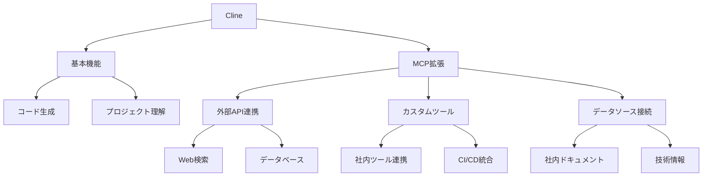

# 2. Cline とは：AI コーディングエージェントの新たな可能性

近年、開発者の生産性向上を支援する様々な AI ツールが登場していますが、その中でも Cline は特に注目を集めています。本セクションでは、Cline の特徴と、なぜこのツールが現代の開発課題に対する効果的なソリューションとなりうるのかについて詳しく解説します。

## Cline の概要と特徴

Cline は、単なるコード補完ツールではなく、開発者の意図を理解し自律的にタスクを実行できる AI コーディングエージェントです。Visual Studio Code などの統合開発環境（IDE）に完全に統合され、プロジェクトの立ち上げからコード生成、Git コミットまでをシームレスにサポートします。

特筆すべき点として、Cline はオープンソースとして開発されており、開発者コミュニティと連携しながら日々進化を続けています。これにより、企業固有のニーズに合わせたカスタマイズや、新しい機能の追加が容易に行えます。

### 主要な機能と利点

1. **プロジェクト全体の理解**
   
   Cline は、プロジェクトのコードベース全体を理解し、文脈に応じた適切な提案を行います。これは、単なるファイル単位の理解ではなく、プロジェクト全体のアーキテクチャや依存関係を考慮した高度な理解に基づいています。

2. **自律的なタスク実行**
   
   開発者の意図を理解し、必要な一連の作業を自律的に実行できます。例えば、「新しい API エンドポイントを追加して」という指示に対して、ルーティングの設定、コントローラーの作成、テストコードの生成まで一貫して行うことができます。

3. **高度なエラー検出**
   
   コードの構文エラーだけでなく、ロジックの矛盾や潜在的なセキュリティの問題まで検出できます。これにより、開発初期段階でのバグの発見と修正が可能になります。

4. **柔軟なカスタマイズ性**
   
   .clinerules ファイルを通じて、プロジェクト固有の規約やガイドラインを設定できます。これにより、チームの開発規約に準拠したコード生成や、セキュリティポリシーに基づいた制約の設定が可能です。

## 他の AI コーディングツールとの比較

現在、開発者支援ツールは大きく分けて「コード補完ツール」と「AI エージェント」の 2 つのカテゴリーに分類できます。以下の表で、主要なツールの特徴を比較します：

| 機能 | Cline | GitHub Copilot | Amazon Q Developer | Cursor |
|------|-------|----------------|-------------------|--------|
| 主な特徴 | AI エージェント型 | コード補完型 | コード補完型 | エディタ統合型 |
| コード生成 | ◎ | ○ | ○ | ○ |
| プロジェクト理解 | ◎ | △ | ○ | ○ |
| 自律的タスク実行 | ◎ | × | △ | ○ |
| カスタマイズ性 | ◎ | △ | ○ | ○ |
| コスト | 従量課金 | 定額制 | AWS サービス料金 | 定額制 |

### Cline の優位性

Cline が他のツールと比較して特に優れている点は、以下の通りです：

1. **深い文脈理解**
   
   プロジェクト全体の構造を理解し、関連するファイル間の依存関係を考慮したコード生成が可能です。これにより、プロジェクトの一貫性を保ちながら、効率的な開発を実現できます。

2. **柔軟な拡張性**
   
   Model Context Protocol（MCP）を通じて、外部サービスやツールとの連携が容易です。これにより、チーム固有のワークフローやツールチェーンとの統合が実現できます。

3. **コスト効率**
   
   従量課金制を採用しており、使用量に応じた適切なコスト管理が可能です。特に Amazon Bedrock との連携により、企業レベルでのコスト管理と最適化が実現できます。

## Claude 3.7 Sonnet の優位性

Cline と Amazon Bedrock を組み合わせる際、特に注目すべきは Claude 3.7 Sonnet モデルの優位性です。このモデルは、ソフトウェア開発タスクにおいて特に高いパフォーマンスを発揮します。

### SWE-bench での優位性

Claude 3.7 Sonnet は、ソフトウェア開発性能を測定する「SWE-bench」において、他のモデルを大きく上回る性能を示しています。特に以下の点で優れています：

1. **コード理解力**
   
   複雑なコードベースの理解と、適切な修正提案の生成において高い精度を誇ります。

2. **問題解決能力**
   
   バグ修正や機能改善において、より適切な解決策を提案できます。

3. **文脈把握力**
   
   プロジェクトの要件や制約を正確に理解し、それに沿った提案が可能です。

## Model Context Protocol（MCP）による機能拡張

Cline の強力な特徴の一つが、MCP を通じた機能拡張性です。MCP により、以下のような拡張が可能になります：

この拡張性により、チーム固有のニーズに合わせたカスタマイズが可能となり、より効率的な開発環境の構築が実現できます。

次のセクションでは、Amazon Bedrock で Cline を活用するメリットについて、より詳しく解説していきます。
