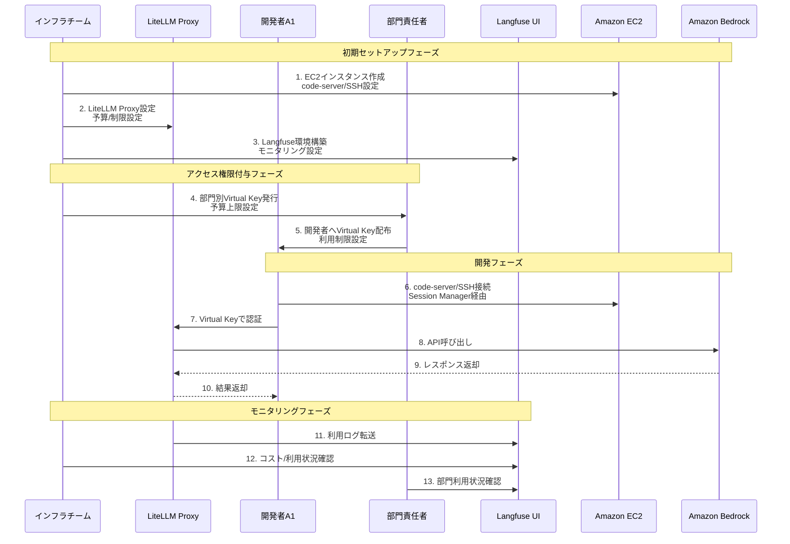
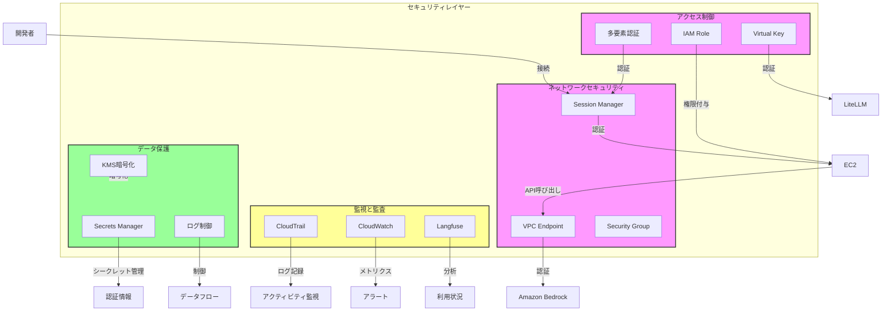

# Cline アーキテクチャの詳細設計

本セクションでは、Cline を企業環境で活用するためのアーキテクチャについて、詳細な設計と運用フローを解説します。特に、セキュリティ、コスト管理、アクセス制御の観点から、各コンポーネントの役割と相互作用を説明します。

## 1. アクセス制御とキー管理フロー

以下の図は、インフラチーム、開発者、部門責任者の権限管理とアクセスフローを示しています。

### 1.1 アクセス制御の詳細

本アーキテクチャにおけるアクセス制御は、明確な役割分担と段階的な権限委譲によって実現されています。

インフラチームは、システム全体の基盤を担う重要な存在です。彼らはEC2インスタンスの作成から運用管理まで一貫して担当し、LiteLLM Proxyの設定や監視を通じてシステム全体の安定性を確保します。また、組織の最上位権限として、Virtual Keyの発行と権限管理を行い、各部門への適切なリソース配分を決定します。さらに、コスト制限やリソース制限の設定を通じて、組織全体の利用状況を適切に制御し、監査ログの収集と分析によってセキュリティインシデントの早期発見と対応を可能にしています。

部門責任者は、インフラチームと開発者の間を繋ぐ重要な役割を果たします。彼らは部門内のVirtual Key管理を担当し、各開発者の業務内容や役割に応じた適切なアクセス権限を付与します。また、部門全体の予算管理と監視を行い、コスト効率の高いAI活用を促進します。定期的な利用状況のレポーティングを通じて、部門内のAI活用状況を可視化し、継続的な改善につなげる役割も担っています。

開発者のアクセスフローは、セキュリティと利便性のバランスを考慮して設計されています。まず、AWS Systems Manager の Session Managerを使用したセキュアなEC2接続により、外部に公開されたSSHポートを必要とせず、安全に開発環境にアクセスできます。次に、Virtual Keyによる認証を経て、個々の開発者に割り当てられた権限の範囲内でのみシステム利用が可能となります。最終的に、LiteLLM Proxyを介してAI機能を利用することで、直接的なAWS認証情報の取り扱いを回避し、セキュリティリスクを最小化しています。

## 2. セキュリティ対策の実装

以下の図は、多層的なセキュリティ対策の実装を示しています。

### 2.1 セキュリティ対策の詳細

本アーキテクチャのセキュリティは、多層的な防御戦略に基づいて設計されています。まず、ネットワークセキュリティの観点では、AWS Systems Manager の Session Manager を採用することで、従来のSSH接続に伴うセキュリティリスクを大幅に低減しています。VPCエンドポイントを介した通信は全て暗号化され、セキュリティグループによる厳密なアクセス制御により、不正なネットワークアクセスを防止しています。

アクセス制御においては、最小権限の原則を徹底しています。IAMロールによって各リソースに必要最小限の権限のみを付与し、Virtual Keyシステムによって一時的かつ制限されたアクセス権限を提供します。特に重要な操作に対しては多要素認証を必須とすることで、不正アクセスのリスクを最小化しています。

監視と監査の面では、複数のツールを組み合わせた包括的な可視化を実現しています。CloudTrailによってすべてのAPI呼び出しを記録し、CloudWatchを用いたリアルタイムモニタリングによって異常を即座に検知します。さらに、Langfuseによる詳細な利用分析により、セキュリティ上の潜在的なリスクを早期に特定し、対応することが可能です。

## 3. コスト管理とリソース制御

以下の図は、コスト管理とリソース制御の仕組みを示しています。

```mermaid
graph TB
    subgraph Cost_Control["コスト管理システム"]
        subgraph Budget["予算管理"]
            MB[月次予算設定]
            DB[部門別予算]
            AB[アラート設定]
        end

        subgraph Resource["リソース制御"]
            TPM[TPM制限]
            RPM[RPM制限]
            QUE[キューイング]
        end

        subgraph Optimization["最適化"]
            MC[モデル選択]
            PC[Prompt Caching]
            BC[バッチ処理]
        end

        subgraph Analytics["分析"]
            CA[コスト分析]
            UA[利用分析]
            TA[トレンド分析]
        end
    end

    MB -->|制限設定| LiteLLM
    DB -->|配分| Team[チーム]
    AB -->|通知| Admin[管理者]

    TPM -->|制御| API[API呼び出し]
    RPM -->|制御| API
    QUE -->|管理| Request[リクエスト]

    MC -->|選択| Model[モデル]
    PC -->|最適化| Cache[キャッシュ]
    BC -->|効率化| Process[処理]

    CA -->|レポート| Report[レポート]
    UA -->|分析| Insight[インサイト]
    TA -->|予測| Forecast[予測]

    classDef budget fill:#f99,stroke:#333,stroke-width:2px
    classDef resource fill:#9f9,stroke:#333,stroke-width:2px
    classDef optimize fill:#99f,stroke:#333,stroke-width:2px
    classDef analytics fill:#ff9,stroke:#333,stroke-width:2px
    class Budget budget
    class Resource resource
    class Optimization optimize
    class Analytics analytics
```

### 3.1 コスト管理の詳細

コスト管理は、AI活用における重要な課題の一つです。本アーキテクチャでは、予算管理、リソース制御、最適化の三つの側面から包括的なコスト管理を実現しています。

予算管理においては、組織全体の月次予算を基準として、各部門への適切な予算配分を行います。部門別の予算管理システムにより、それぞれの部門が独自の利用計画に基づいてリソースを活用できます。予算の消化状況は常時モニタリングされ、設定された閾値を超過した場合には、関係者に自動的にアラートが通知されます。

リソース制御の面では、TPM（Tokens Per Minute）とRPM（Requests Per Minute）の二つの指標を用いて、APIの利用を適切に制御しています。これらの制限は、コスト超過を防ぐだけでなく、システムの安定性も確保します。また、高度なキューイングシステムにより、優先度に基づいたリクエストの処理が可能となり、重要な業務への影響を最小限に抑えています。

最適化戦略としては、タスクの性質や重要度に応じた最適なモデル選択を行います。例えば、初期の概念検討には軽量なモデルを使用し、本格的な開発フェーズでは高性能モデルを活用するといった使い分けが可能です。また、Prompt Cachingシステムにより、類似のリクエストに対する重複した処理を削減し、コストの最適化を図っています。さらに、バッチ処理の活用により、大量のリクエストを効率的に処理することで、全体的なコストパフォーマンスを向上させています。

本アーキテクチャは、02_about_cline.mdで示した主要な課題に対して、包括的な解決策を提供します。セキュリティとコンプライアンスの面では、多層的な防御戦略と詳細な監査ログ記録により、企業レベルのセキュリティ要件を満たしています。コスト管理においては、予算管理の自動化とリソース使用の最適化により、効率的なAI活用を実現します。運用管理の観点では、明確な役割分担と自動化されたモニタリングにより、安定した運用を可能にしています。

これらの機能が有機的に連携することで、企業はClineを安全かつ効率的に活用できる環境を構築できます。特に、インフラチーム、部門責任者、開発者の各層が適切に連携し、それぞれの役割を果たすことで、組織全体としての価値創出を最大化することが可能となります。
