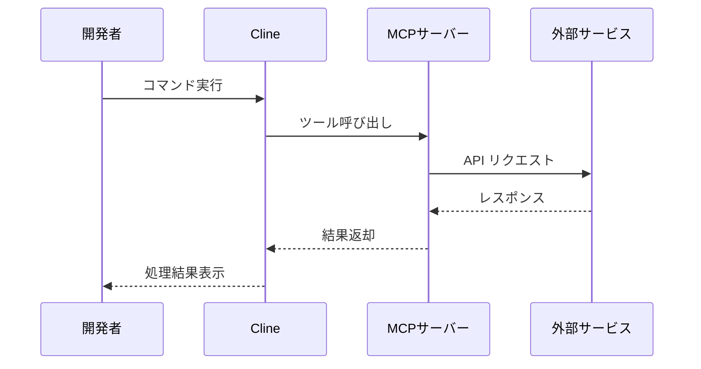

# Cline ワークショップの実践的アプローチ

本セクションでは、Cline を実際の開発環境で活用するための具体的な手順と、各コンポーネントの設定方法について解説します。このワークショップを通じて、開発者は Cline の基本的な使用方法から高度な機能の活用まで、段階的に学ぶことができます。

## 基本セットアップと環境構築

開発環境のセットアップは、Cline を効果的に活用するための重要な第一歩です。Visual Studio Code に Cline 拡張機能をインストールし、Amazon Bedrock との連携を設定することから始めます。

AWS 認証情報の設定では、セキュリティを考慮しつつ適切なアクセス権限を付与することが重要です。例えば、AWS プロファイルを使用して認証情報を管理し、必要最小限の権限を持つ IAM ロールを設定します。これにより、セキュアな開発環境を維持しながら、Cline の機能を最大限に活用できます。

また、プロジェクト固有の要件や規約を .clinerules ファイルで定義することで、チーム全体で一貫した開発プラクティスを確立できます。このファイルでは、コーディング規約、セキュリティポリシー、実装方針などを明確に指定し、Cline がこれらの規約に従ってコードを生成するよう設定できます。

## Model Context Protocol（MCP）の活用

MCP は Cline の機能を大きく拡張する重要な機能です。このプロトコルを活用することで、外部サービスやツールとの連携が可能になり、より柔軟な開発環境を構築できます。

TypeScript を使用した MCP サーバーの実装では、ツールとリソースの効果的な実装方法を学びます。例えば、Web API との連携、データベースアクセス、カスタムツールの作成など、プロジェクトのニーズに応じた機能拡張が可能です。実装時には、エラーハンドリングやセキュリティ考慮事項にも十分な注意を払います。

## LiteLLM Proxy による高度なモデル管理

LiteLLM Proxy を導入することで、複数の AI モデルを効率的に管理し、フォールバック機能やコスト最適化を実現できます。この設定により、システムの信頼性と効率性が大きく向上します。

LiteLLM の設定では、モデルの優先順位やフォールバックルール、リトライ設定などを細かく制御できます。例えば、主要なモデルが一時的に利用できない場合に、自動的に代替モデルにフォールバックする仕組みを構築できます。また、各モデルの利用状況やパフォーマンスを監視し、コストとパフォーマンスの最適なバランスを見つけることができます。

管理画面（Admin UI）を通じて、サービスの状態をリアルタイムで監視し、必要に応じて設定を調整することも可能です。これにより、運用面での透明性が向上し、問題の早期発見と対応が容易になります。

## Langfuse による利用状況の分析

Langfuse は、Cline と AI モデルの利用状況を包括的に分析するためのツールです。この統合により、開発チームは AI の利用パターンを詳細に把握し、効率的な運用を実現できます。

Langfuse のダッシュボードでは、以下のような重要な指標をリアルタイムで確認できます：

- リクエスト数とレスポンス時間の推移
- モデルごとの利用状況とコスト分析
- エラー発生率とトラブルシューティング情報
- ユーザーごとの利用パターン

これらの情報を活用することで、システムの最適化やコスト管理の改善が可能になります。例えば、特定のユースケースで過剰なトークン消費が発生している場合、その原因を特定し、より効率的なプロンプト設計や適切なモデル選択を行うことができます。

## 実践的なユースケース

ワークショップでは、実際の開発シナリオに基づいた具体的な例を通じて、Cline の活用方法を学びます。以下のようなユースケースを取り上げ、実践的なハンズオン形式で理解を深めます：

**新規プロジェクトの立ち上げ**: Cline を使用して、プロジェクトの初期設定やボイラープレートコードの生成を効率的に行う方法を学びます。.clinerules ファイルを活用して、プロジェクト固有の要件や規約を適切に設定し、一貫性のある開発環境を構築します。

**既存コードの改善**: レガシーコードの最新化や、パフォーマンス最適化などの実践的なタスクを通じて、Cline の問題解決能力を体験します。特に、大規模なコードベースでの作業における効率的なアプローチを学びます。

**テストコードの生成**: ユニットテストや統合テストの自動生成を通じて、品質の高いテストコードを効率的に作成する方法を学びます。テストカバレッジの向上や、エッジケースの考慮など、テスト品質の向上にも焦点を当てます。

## セキュリティとベストプラクティス

ワークショップを通じて、以下のようなセキュリティ考慮事項とベストプラクティスも学びます：

**アクセス制御**: IAM ロールと権限の適切な設定、セキュリティグループの構成など、基本的なセキュリティ設定を確実に行います。特に、機密情報の取り扱いには細心の注意を払い、適切な保護措置を講じます。

**コード品質管理**: Cline が生成するコードの品質を確保するため、コードレビューのベストプラクティスや、自動化されたテストの活用方法について学びます。また、生成されたコードのセキュリティチェックも重要な要素として取り上げます。

**運用管理**: 本番環境での Cline の活用方法、トラブルシューティングのアプローチ、継続的な改善プロセスなど、実践的な運用管理のノウハウを共有します。

次のセクションでは、実際の課題解決事例を通じて、これらの知識と技術がどのように活用されているかを見ていきます。
