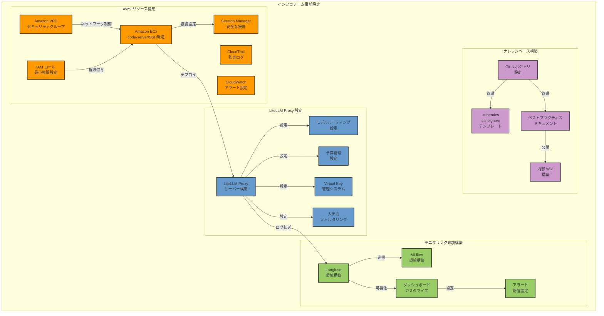
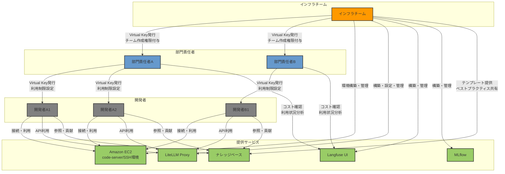
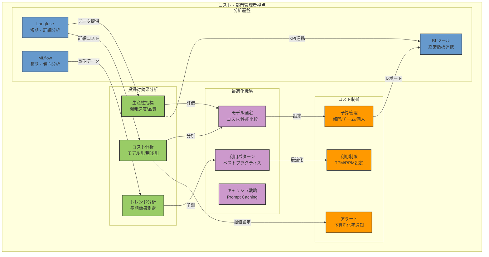
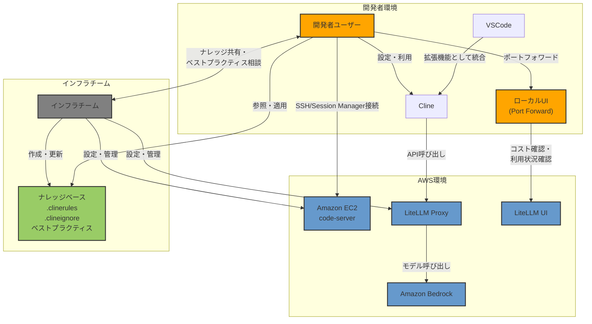

# AI コーディング支援エージェント時代における開発生産性とガバナンスの両立

## はじめに

ソフトウェア開発の世界は、生成 AI の台頭により大きな転換期を迎えています。特に AI を活用したコーディング支援エージェントは急速な進化を遂げ、開発者の働き方に革新的な変化をもたらし始めています。しかし、企業における AI の活用には、生産性の向上だけでなく、適切なガバナンス体制の構築が不可欠です。

本記事では、以下のツールを組み合わせることで、開発生産性の向上とセキュアな運用を両立する方法を解説します：

- [**Cline**](https://github.com/cline/cline): 開発者の意図を理解し自律的にタスクを実行できる AI コーディング支援エージェントです。VSCode に統合され、コード生成から Git 操作までをシームレスにサポートします。
- [**Amazon Bedrock**](https://aws.amazon.com/jp/bedrock/): AWS が提供する生成 AI のマネージドサービスです。複数の基盤モデルに統一的なインターフェースでアクセスでき、企業のセキュリティ要件に対応します。
- [**LiteLLM Proxy**](https://github.com/BerriAI/litellm): 複数の LLM プロバイダーを統一的に扱うプロキシサーバーです。アクセス制御、コスト管理、リクエスト分散などの機能を提供します。
- [**Langfuse**](https://langfuse.com/): LLM アプリケーションの観察とモニタリングを行うオープンソースプラットフォームです。使用状況やコスト分析、トレーシングなどの機能を提供します。
- [**MLflow**](https://mlflow.org/): 機械学習の実験管理とモデル追跡のためのプラットフォームですが、Tracing 機能を有しています。長期的な分析と最適化に活用できます。

## 開発生産性とガバナンスの両立が求められる背景

グローバル競争の激化とテクノロジーの急速な進化により、企業は従来以上のスピードでソフトウェアを開発・展開することを求められています。同時に、組織における AI の活用においては適切なコスト管理、セキュリティ対策、コンプライアンス遵守が不可欠です。新しい機能の実装や既存システムの改善において、開発者の生産性は企業の競争力を左右する重要な要素となっていますが、それは適切な管理体制の下で実現される必要があります。

### 現代のエンジニアと組織が直面する課題

開発者と組織は日々、複数の重要な課題に直面しています。特に AI コーディング支援エージェントの活用においては、従来の開発環境とは異なる新たな課題が浮上しています。

第一に、トークン消費と API 制限の課題があります。AI コーディング支援エージェントは、従来の AI 利用と比較して大幅に多くのトークンを消費します。これは、複雑なコードベースの理解や長いコンテキスト処理が必要なためです。また、API Provider による制限（Requests Per Minute/Tokens Per Minute）への抵触リスクも高く、開発フローが中断されるリスクが常に存在します。

第二に、セキュリティとコンプライアンスの課題があります。AI による支援を活用しつつ、機密情報の保護を確実にする必要があります。部門やチーム単位での適切なアクセス制御の実現、セキュリティ基準への準拠と監査対応、社内ポリシーと法規制への対応など、多岐にわたる要件を満たす必要があります。

第三に、コスト管理の課題があります。AI 利用に関するコストの可視化と最適化は、組織全体の効率的な運営に直結します。部門単位での予算管理と使用状況のモニタリング、コスト効率の高いモデル選択と利用戦略の策定が求められています。

第四に、生産性と知識共有の課題があります。コード品質を維持しながら開発速度を向上させる必要性、プロジェクトにおけるコードベースの理解と保守、AI 活用に関するベストプラクティスの共有、新規メンバーの参画における効率的な技術継承など、組織的な取り組みが必要です。

これらの課題に対して、本アーキテクチャは LiteLLM Proxy と Langfuse/MLflow を組み合わせることで、包括的な解決策を例示します。トークン消費の最適化、セキュリティの確保、コスト管理など、複数の重要な課題に対して、組織全体での効果的な AI 活用を検討します。

## Cline 導入における課題

Cline は、開発者の意図を理解し自律的にタスクを実行できる AI コーディング支援エージェントです。Visual Studio Code IDEに統合され、プロジェクトの立ち上げからコード生成、Git コミットまでをシームレスにサポートします。オープンソースとして開発されており、企業固有のニーズに合わせたカスタマイズが可能です。

企業環境で Cline を導入する際には、複数の重要な課題に対処する必要があります。これらの課題は主にセキュリティ、コスト管理、アクセス制御、拡張機能の管理に分類されますが、適切な対策を講じることで対処可能です。

### 課題 1: セキュリティリスクへの対応

企業における AI コーディング支援エージェントの導入において、最も重要な懸念事項の一つがセキュリティリスクです。以下の課題とその解決策について説明します。

#### 課題 1-1: 社内コードが AI モデルの学習データとして利用される懸念
企業の機密コードや知的財産が外部に漏洩し、モデルの改善に使用されることは、多くの組織にとって受け入れがたいリスクです。

この課題に対して、Amazon Bedrock は効果的な解決策を提供します。Bedrock では、入力・出力データがデフォルトで学習に利用されず、モデルプロバイダーとデータが共有されない設計になっており、これが Cline の API Provider として Amazon Bedrock を利用する価値の一つです。

### Amazon Bedrock によるエンタープライズグレードの解決策

AWS は創業以来、セキュリティを最優先事項として設計・運用されてきました。この「セキュリティファースト」の哲学は、Amazon Bedrock にも深く根付いています。大規模組織での AI 活用に関する豊富な知見と実績を持ち、顧客からのフィードバックを積極的に取り入れながらサービスを進化させ続けています。金融、医療、公共部門など厳格な規制が求められる業界においても、AWS の包括的なコンプライアンス対応により、安心して AI を活用できる環境と実績が整っています。

**データ主権とプライバシーの保護**

企業データの保護は、AI 活用における最重要課題の一つです。Amazon Bedrock は、この課題に正面から取り組んでいます。モデルへの入出力をデフォルトで学習に利用せず、ログ記録も標準では無効化されているため、機密性の高い企業データを安全に処理できます。さらに、データの取り扱いポリシーを組織の要件に合わせて詳細に設定できるため、規制の厳しい業界でも安心して利用できます。

**運用面での柔軟性とスケーラビリティ**

Amazon Bedrock の大きな強みは、その運用面での柔軟性です。バッチ推論による大規模データ処理、利用リージョン選択、オンデマンドでの柔軟な利用、[Provisioned Throughput](https://docs.aws.amazon.com/ja_jp/bedrock/latest/userguide/prov-throughput.html) による安定したパフォーマンス保証など、ビジネスニーズに合わせた選択肢が用意されています。データ主権やコンプライアンス要件に応じて最適なリージョンを選択できるため、グローバル企業でも各国の法規制に対応した AI 活用が可能です。

**マルチモデル戦略と開発体験の革新**

Amazon Bedrock は、複数のプロバイダが提供する最先端モデルを統一的なインターフェースで利用できる点に強みがあります。Claude 3.7 Sonnet をはじめ、Amazon Nova Pro、Llama 3.1 など、様々なモデルにアクセスできます。これにより、タスクの性質や要件に応じて最適なモデルを選択できるだけでなく、コストと性能のバランスを考慮した戦略的な使い分けが可能になります。

特に Anthropic の [Claude 3.7 Sonnet](https://aws.amazon.com/jp/blogs/news/anthropics-claude-3-7-sonnet-the-first-hybrid-reasoning-model-is-now-available-in-amazon-bedrock/) は、ソフトウェア開発領域において卓越した能力を発揮します。大規模で複雑なコードベースを深く理解し、プロジェクトの規約やベストプラクティスに準拠した高品質なコードを生成します。

**コスト効率と投資対効果**

Amazon Bedrock の利用コストは、エンジニア 1 人あたり月額 $0.5K〜$1.0K 程度と見積もられます。エンジニアの人件費を月額 100 万円と仮定すると、生産性が 10% 向上するだけでコストを回収できる計算になります。さらに、Preview 中の Prompt Caching 機能により、リクエスト間で繰り返されるプロンプトプレフィックスをキャッシュでき、長期的な運用コストの最適化が期待できます。

さらに、Preview 中の Prompt Caching 機能により、リクエスト間で繰り返されるプロンプトプレフィックスをキャッシュでき、長期的な運用コストの最適化が期待できます。これにより、組織全体での AI 活用の経済的な持続可能性が高まります。

#### 課題 1-2: センシティブデータの外部流出リスク
アクセスキーなどのセンシティブデータが意図せず外部に送信されるリスクも無視できません。この問題に対しては、多層的な防御策が効果的です。具体的には、`.clineignore` や `.gitignore` による機密ファイルの除外、Cline 自体のセンシティブデータの検知機能、LiteLLM Proxy による入力フィルタリング、そして Amazon Bedrock の Guardrails 機能などを組み合わせることで、機密情報の漏洩リスクを低減できます。

#### 課題 1-3: 危険なコマンド実行リスク
AI エージェントによる危険なコマンド実行（ファイル削除など）のリスクも考慮する必要があります。これに対しては、重要操作に対する承認フローの設定、AWS CLI 操作の監査ログ有効化、LiteLLM Proxy による出力ガードレール設定などの対策が有効です。これらの措置により、エージェントの行動を適切に制限しながら、その有用性を最大限に活用することが可能になります。

### 課題 2: コスト管理の最適化

AI コーディング支援エージェントの利用拡大に伴い、コスト管理も重要な課題となります。以下の課題とその解決策について説明します。

#### 課題 2-1: 予測不能なコスト増大
利用量の急増に伴う予算超過リスクは、特に大規模な開発チームを抱える組織にとって深刻な問題です。

この課題に対して、LiteLLM Proxy は効果的なコントロール手段を提供します。チームや個人単位でのレートリミット設定、予算上限の設定と自動制限、TPM/RPM 制限の適用などの機能により、コストの予測可能性と管理可能性が大幅に向上します。例えば、部門ごとに月間予算を設定し、その範囲内での利用を自動的に制限することで、予算超過を防止できます。

#### 課題 2-2: 費用対効果の可視化
AI 利用コストと生産性向上の関係性把握も重要な課題です。この点において、Langfuse は詳細な分析機能を提供します。ユーザーやチーム単位での使用状況可視化、コスト内訳の詳細分析、利用パターンの分析と最適化提案などにより、投資対効果を明確に把握し、継続的な改善を図ることが可能になります。これらのデータに基づいて、より効率的なモデル選択や利用戦略を策定することで、コスト効率を最大化できます。

### 課題 3: アクセス管理の強化

#### 課題 3-1: AWS 認証情報の直接配布リスク
企業環境では、開発者への AWS アクセスキー直接提供のリスクが存在します。多数の開発者に直接 AWS 認証情報を配布することは、セキュリティ上の脆弱性を生み出す可能性があります。

この課題に対して、Virtual Key による間接アクセスが効果的な解決策となります。LiteLLM Proxy の Virtual Key 機能を活用することで、AWS クレデンシャルを一元管理し、開発者には限定的な権限を持つ Virtual Key のみを提供することが可能です。さらに、SSO 認証との連携により、既存の認証システムとシームレスに統合できます。これにより、アクセス権限の管理が簡素化され、セキュリティリスクの低減と運用効率の向上が同時に実現します。

### 課題 4: MCP (Model Context Protocol) 管理の適正化

#### 課題 4-1: 外部サービスへの制御されていないアクセス
Cline の強力な機能の一つである Model Context Protocol (MCP) は、外部ツールとの連携を可能にする一方で、不適切なアクセスのリスクも伴います。MCP を通じた外部サービスへの制御されていないアクセスは、データ漏洩やセキュリティ侵害につながる可能性があります。

この課題に対しては、MCP アクセス制御の実装が効果的です。許可された MCP サーバーのホワイトリスト化、アクセス権限の細かな制御、使用状況の監査とモニタリングなどの対策により、MCP の利便性を維持しながらセキュリティリスクを最小化できます。例えば、社内で承認された Web 検索エンジンや API のみにアクセスを制限することで、情報漏洩のリスクを大幅に低減できます。

これらの課題と解決策を総合的に組み合わせることで、Cline の生産性向上メリットを最大化しながら、企業のセキュリティとガバナンス要件を満たすことが可能になります。重要なのは、各組織の特性やニーズに合わせてこれらの対策をカスタマイズし、継続的に改善していくことです。適切に設計された環境では、開発者は安全かつ効率的に AI の支援を受けながら、より創造的な問題解決に集中できるようになります。

## Cline 導入課題の緩和

Cline 導入における課題を効果的に緩和するためには、組織内の各ロールが連携して包括的な対策を講じる必要があります。以下では、先に挙げた課題に対応する形で、ロールごとの解決策を整理します。

### インフラチーム視点でのソリューション

インフラチームは、AI コーディング支援エージェントの導入において中核的な役割を担います。彼らの専門知識と技術力が、Cline 導入の成功を左右するといっても過言ではありません。インフラチームは、開発者（灰色）が安全かつ効率的に Cline を活用できるよう、基盤となる環境を構築し、継続的に運用・改善していく責任を負っています。

**ソリューション 1-1: エンタープライズグレードの LiteLLM Proxy 基盤の構築**

インフラチームは、組織全体の AI 利用の中核となる LiteLLM Proxy の環境を構築します。この基盤は単なるプロキシサーバーではなく、セキュリティ、コスト管理、アクセス制御を包括的に実現するガバナンスフレームワークとして機能します。Amazon EC2 インスタンス上に LiteLLM Proxy をデプロイし、Amazon Bedrock との安全な接続を確立します。

Amazon Bedrock の特性（入力・出力データがデフォルトで学習に利用されない点）を最大限に活用するため、適切な IAM ロールと VPC エンドポイントを設定し、アクセス経路を厳密に制御します。また、複数の AWS アカウントやリージョンにまたがる Bedrock エンドポイントを一元管理できるよう構成し、組織のグローバルな展開や部門ごとのデータ主権要件にも対応できる柔軟性を確保します。

- **自動タグ付与**: user_api_key_user_email、user_api_key_user_id、user_api_key_team_alias

**ソリューション 1-2 & 1-3: 安全な開発環境とナレッジ共有基盤の提供**

インフラチームは、Amazon EC2 上に code-server/SSH 環境を構築し、AWS Systems Manager Session Manager を通じた安全な接続経路を確保します。この環境には、監査ログ等の設定が施されたサンドボックスとして、AWS CloudTrail による操作ログの記録や CloudWatch アラートの設定を実装し、不適切な操作があった場合に迅速に検知・対応できる体制を整えます。

同時に、開発者のナレッジを蓄積・共有するためのリポジトリを準備します。このリポジトリには、`.clinerules` や `.clineignore` のテンプレートやベストプラクティス、セキュリティガイドラインなどが含まれ、開発者が Cline を安全かつ効果的に活用するための知識基盤となります。インフラチームは定期的にこのナレッジベースを更新し、新たな脅威や最適化手法に対応した情報を提供し続けます。

**ソリューション 2-1 & 2-2: 部門責任者への権限委譲と可視化基盤の提供**

インフラチームは、LiteLLM Proxy 上に部門ごとのチームを作成し、部門責任者に対してチーム管理権限を付与します。これにより、部門責任者は自部門の開発者に対して Virtual Key の発行や RPM/TPM 制限の設定、予算上限の管理などを自律的に行えるようになります。インフラチームは、部門責任者向けのトレーニングや定期的なレビューを実施し、権限委譲が適切に機能するようサポートします。

また、Langfuse UI や MLflow といったモニタリングツールを構築・提供し、部門責任者やコスト管理者が AI 利用状況やコストを可視化できる環境を整備します。これらのダッシュボードは、部門ごとのカスタマイズが可能であり、それぞれの組織の KPI や重要指標に合わせた分析ビューを提供します。インフラチームは、これらのツールの運用保守を担当し、継続的な改善を図ります。

**ソリューション 3-1: Virtual Key による安全なアクセス管理の実現**

AWS 認証情報の直接配布リスクを排除するため、インフラチームは LiteLLM Proxy の Virtual Key 機能を活用した間接アクセスの仕組みを構築します。AWS クレデンシャルは厳重に管理され、開発者には必要最小限の権限を持つ Virtual Key のみが提供されます。さらに、既存の SSO システムとの連携を実装し、組織の認証基盤と統合することで、アクセス権限の管理を簡素化し、セキュリティリスクの低減と運用効率の向上を同時に実現します。

Virtual Key の発行プロセスは自動化され、部門責任者からのリクエストに基づいて適切な権限設定が行われます。また、未使用の Virtual Key の自動無効化や定期的な権限レビューなど、セキュリティを継続的に担保する仕組みも導入します。

**ソリューション 4-1: MCP サーバーのホワイトリスト管理と監視体制の構築**

Model Context Protocol (MCP) の安全な活用を実現するため、インフラチームは許可された MCP サーバーのホワイトリスト化と厳格なアクセス制御を実装します。社内で承認された Web 検索エンジンや API のみにアクセスを制限するポリシーを設定し、定期的に使用状況の監査とモニタリングを行います。

新たな MCP サーバーの追加要求に対しては、セキュリティ評価プロセスを確立し、潜在的なリスクを事前に特定・軽減します。また、MCP サーバーの利用状況を Langfuse に記録し、どのユーザーがどのような外部サービスにアクセスしているかを可視化することで、透明性を確保します。

### インフラチームを持たない組織での対応

すべての組織がインフラチームを持っているわけではありません。小規模なスタートアップや、専任のインフラエンジニアを雇用していない組織では、上記の役割を柔軟に分担する必要があります。例えば：

- 技術力のあるリードエンジニアが基本的なインフラ構築を担当
- クラウドマネージドサービスを最大限活用し、運用負荷を軽減
- AWS Marketplace から提供される LiteLLM Enterprise 版などの商用サービスの利用
- 外部のマネージドサービスプロバイダー (MSP) との連携
- 段階的な導入アプローチ（まずは小規模な PoC から始め、徐々に拡大）

重要なのは、組織の規模や技術力に関わらず、セキュリティとガバナンスの基本原則を守ることです。インフラチームの役割を誰が担うにせよ、AWS クレデンシャルの安全な管理、適切なアクセス制御、コスト管理の仕組み、そして監査可能性の確保は必須の要件となります。

また、組織の成長に合わせて柔軟にアーキテクチャを進化させることも重要です。初期段階では最小限の構成から始め、利用拡大に伴って段階的に機能を追加していくアプローチが効果的でしょう。AWS の Well-Architected Framework に基づいた定期的な評価を行い、セキュリティ、信頼性、パフォーマンス効率、コスト最適化、運用上の優秀性の観点から継続的に改善を図ることが推奨されます。

### コスト・部門管理者視点でのソリューション

コスト・部門管理者は、AI コーディング支援エージェントの導入において、投資対効果の最大化と予算内での運用を実現する重要な役割を担います。Langfuse や MLflow といった分析基盤から情報を抽出し、Cline 導入の効果を多角的に分析することで、組織全体の AI 活用戦略を最適化します。

**ソリューション 2-1: データドリブンなコスト管理体制の構築**

課題 2-1（予測不能なコスト増大）に対応するため、コスト・部門管理者は Langfuse と MLflow から抽出したデータを活用した精緻なコスト管理体制を構築します。Langfuse のリアルタイムなコスト追跡機能により、部門・チーム・個人レベルでの AI 利用状況を常時モニタリングし、予算消化のペースを可視化します。これにより、予算超過のリスクを早期に検知し、適切な対応策を講じることが可能になります。

具体的には、LiteLLM Proxy の管理画面を通じて、部門ごとの月間予算上限を設定し、予算消化率に応じた段階的なアラートシステムを構築します。例えば、予算の 70% 到達時に部門責任者へ通知、90% 到達時には自動的に低コストモデルへのルーティングを強制するといった仕組みを実装します。また、MLflow の長期的なデータ分析により、季節変動や開発サイクルに応じた予算配分の最適化も実現します。

「予算を使い切る前に成果を出す」という観点から、コスト効率の高いモデル利用を促進するため、Langfuse から抽出した利用パターンデータを基に、各開発フェーズに最適なモデル選択ガイドラインを策定します。例えば、初期の概念検討には低コストモデル、詳細設計には中コストモデル、最終実装には高性能モデルといった使い分けを推奨し、コスト効率の高い開発プロセスを確立します。

**ソリューション 2-2: 多角的な投資対効果分析フレームワークの確立**

課題 2-2（費用対効果の可視化）に対応するため、コスト・部門管理者は Langfuse と MLflow のデータを統合した包括的な ROI 分析フレームワークを構築します。このフレームワークでは、AI 利用コストだけでなく、開発速度の向上、コード品質の改善、バグ修正時間の短縮など、複数の生産性指標を組み合わせて Cline 導入の総合的な効果を評価します。

Langfuse からは、モデル別・用途別のコスト内訳、プロンプトの効率性、応答時間などの短期的・詳細なデータを抽出し、日次・週次の分析に活用します。一方、MLflow からは、長期的な生産性トレンド、モデルパフォーマンスの変化、組織的な学習曲線などのマクロ視点のデータを抽出し、月次・四半期の戦略的分析に活用します。

これらのデータを統合し、部門ごとの「AI 投資効率指標」を算出します。例えば、「1,000 トークンあたりの生産コード行数」や「AI コスト対人件費削減率」といった指標を定義し、部門間で比較可能な形で可視化します。高い効率性を示している部門の利用パターンを分析し、ベストプラクティスとして全社に展開することで、組織全体の AI 活用効率を継続的に向上させます。

**ソリューション 3-1: 部門特性に応じた権限委譲モデルの設計**

課題 3-1（AWS 認証情報の直接配布リスク）に関連して、コスト・部門管理者はインフラチームと協力し、部門の特性や成熟度に応じた権限委譲モデルを設計します。Langfuse のデータから各部門の AI 利用パターンと成熟度を分析し、適切な自律性レベルを判断します。

例えば、AI 活用が進んでいる部門には、LiteLLM Proxy の管理画面を通じて、チーム内での Virtual Key 発行や予算配分の権限を委譲します。一方、まだ経験の浅い部門には、より制限的な権限設定と手厚いサポートを提供します。この権限委譲モデルは固定ではなく、Langfuse と MLflow から得られる利用実績データに基づいて定期的に見直され、各部門の成長に合わせて段階的に拡大していきます。

**ソリューション 4-1: MCP 活用の費用対効果分析と戦略的導入**

課題 4-1（外部サービスへの制御されていないアクセス）に関連して、コスト・部門管理者は MCP サーバーの活用についても費用対効果の観点から分析します。Langfuse のデータから、どの MCP サーバーがどのような開発シナリオで最も価値を生み出しているかを特定し、戦略的な導入判断をサポートします。

例えば、Web 検索 MCP の利用パターンを分析し、どのような質問や検索クエリが開発効率向上に最も貢献しているかを特定します。また、社内 API と連携する MCP の利用状況を分析し、どのようなデータアクセスが最も頻繁に行われ、価値を生み出しているかを把握します。これらの分析結果に基づいて、MCP サーバーの優先順位付けや投資判断を行い、限られたリソースを最も効果的な領域に集中させます。

### 経営層への報告と戦略的意思決定支援

コスト・部門管理者の重要な役割の一つに、Cline 導入効果の経営層への報告があります。Langfuse と MLflow から抽出したデータを基に、経営指標と連携した形で AI 投資の効果を可視化し、戦略的な意思決定をサポートします。

具体的には、四半期ごとに「AI 活用成熟度レポート」を作成し、以下の観点から Cline 導入効果を報告します：

1. **財務的効果**: AI コスト対開発生産性向上の ROI 分析
2. **品質的効果**: コード品質、バグ率、テストカバレッジなどの変化
3. **時間的効果**: 開発サイクル時間、市場投入までの期間短縮効果
4. **人材的効果**: 開発者満足度、技術的負債の削減、創造的タスクへの時間シフト

これらの多角的な分析により、Cline 導入が単なるコスト項目ではなく、組織の競争力強化に貢献する戦略的投資であることを定量的に示し、継続的な改善と投資の最適化を実現します。

### 開発者（Cline 利用者）視点でのソリューション

開発者は Cline の直接的な利用者として、その機能を最大限に活用しながら、組織のガバナンス要件に準拠した形で効率的な開発を行う役割を担っています。Amazon EC2 上で動作する code-server/Remote SSH 環境と LiteLLM Proxy を介した Cline の利用は、単なる技術的な接続方法にとどまらず、組織全体のセキュリティとコスト管理の枠組みの中で機能する重要な仕組みです。

**ソリューション 1-2 & 1-3: インフラチームと連携したセキュリティプラクティスの確立**

開発者とインフラチームの緊密な連携は、Cline を安全に活用するための基盤となります。インフラチームが構築・維持する組織的なナレッジベースを活用し、`.clineignore` や `.gitignore` の適切な設定パターンを共有することで、センシティブデータを含むファイルが AI モデルに送信されるリスクを組織全体で低減できます。開発者は定期的にインフラチームと情報交換を行い、最新のセキュリティベストプラクティスを学び、自身のプロジェクトに適用します。

Amazon EC2 上の code-server 環境を利用する際には、AWS Systems Manager Session Manager を通じた安全な接続方法を採用し、直接的な SSH 接続を避けることでセキュリティを強化します。また、Cline のセンシティブデータ検知機能の設定をインフラチームと協力して最適化し、プロジェクト固有の機密情報パターンを登録することで、意図せぬデータ漏洩を防止します。重要な Git 操作や AWS CLI コマンドの実行前には、インフラチームが設定した承認フローに従い、潜在的なリスクを事前に評価することが重要です。

**ソリューション 2-1 & 2-2: データドリブンなコスト最適化アプローチ**

LiteLLM Proxy を介した Cline の利用により、開発者は自身の AI 利用コストをリアルタイムで把握できるようになります。ローカル環境から SSH ポートフォワーディングを設定し、LiteLLM UI にアクセスすることで、個人やチームの利用状況、コスト推移、予算残高などを視覚的に確認できます。この透明性により、開発者は自身の行動がチーム全体の予算にどのような影響を与えるかを常に意識しながら作業を進められます。

Plan/Act モードの戦略的な使い分けも、コスト効率を高める重要な手法です。初期の概念検討や設計段階では、EC2 上の LiteLLM Proxy が提供する低・中コストモデルへのルーティング機能を活用し、最終的なコード生成や重要な実装フェーズでのみ高性能モデルを使用するといった効率的な利用パターンを確立します。インフラチームが提供する利用パターン分析レポートを定期的に確認し、自身の利用スタイルを継続的に改善することで、より少ないトークン消費で同等以上の成果を得られるよう工夫します。

**ソリューション 4-1: ガバナンスに準拠した MCP 活用戦略**

Model Context Protocol (MCP) の活用においても、インフラチームとの連携が鍵となります。開発者は、インフラチームがホワイトリスト化した MCP サーバーのカタログを参照し、組織のセキュリティポリシーに準拠したサービスのみを利用します。新たな MCP サーバーの追加が必要な場合は、インフラチームと協議し、セキュリティ評価とガバナンス要件の確認を経た上で導入を検討します。

EC2 環境上での MCP サーバーの利用は、Amazon VPC エンドポイントを通じた安全な接続経路が確保されており、外部サービスへのアクセスも適切に監視・制御されています。開発者は MCP を通じて得られた情報や知見を組織のナレッジベースに積極的に還元し、チーム全体の技術力向上に貢献します。また、インフラチームが提供する MCP 利用状況のレポートを定期的に確認し、より効果的な活用方法を模索し続けることが重要です。

このように、開発者は単独で Cline を利用するのではなく、インフラチームが構築した安全で効率的な環境の中で、組織全体のガバナンスフレームワークに沿った形で AI コーディング支援エージェントを活用します。技術的な接続方法や利用パターンの最適化だけでなく、組織的なナレッジ共有と継続的な改善プロセスに参加することで、個人の生産性向上と組織全体のセキュリティ・コスト効率の両立を実現します。

### 部門責任者視点での解決策

部門責任者は、チーム全体の AI 活用を監督し、生産性とコンプライアンスのバランスを取る重要な役割を担います。

**提案 3-1: アクセス権限の適切な管理と配布**

部門責任者は、インフラチームから発行された Virtual Key を開発者に適切に配布し、各メンバーの役割や経験に応じた利用制限を設定します。これにより、新人開発者が過度に高コストなモデルを使用することを防ぎつつ、経験豊富な開発者には必要に応じて高度な機能へのアクセスを許可するといった柔軟な運用が可能になります。また、チーム全体の利用状況を定期的に監視し、不適切な利用パターンがあれば早期に是正指導を行います。

**提案 2-1 & 2-2: 部門予算の戦略的管理**

部門責任者は、割り当てられた AI 利用予算を戦略的に管理し、プロジェクトの優先度や重要度に応じて適切に配分します。Langfuse による部門利用状況の詳細な分析を基に、コスト効率の高いモデル選択と利用戦略を策定し、限られた予算で最大の成果を上げられるよう工夫します。また、定期的なレビューを通じて予算配分を最適化し、重要プロジェクトに十分なリソースが確保されるよう調整します。

**提案 1-1 & 1-2 & 1-3: ガバナンス強化とベストプラクティスの共有**

部門責任者は、AI 活用に関するベストプラクティスを積極的に収集・共有し、チーム全体のスキルと意識の向上を図ります。セキュリティポリシーの遵守状況を定期的に確認し、必要に応じて追加のトレーニングや指導を行います。また、新規メンバーの参画時には、効率的な技術継承の仕組みを整え、Cline の安全かつ効果的な活用方法を迅速に習得できるようサポートします。

これらのロールごとの解決策を組織全体で有機的に連携させることで、Cline 導入における課題を効果的に緩和し、生産性向上とガバナンス強化の両立が実現します。インフラチームによる堅牢な基盤整備、コスト管理者による最適化、開発者の適切な利用、そして部門責任者による戦略的な監督が一体となって機能することで、AI コーディング支援エージェントの真の価値を引き出すことができるのです。

# まとめ
LiteLLM Proxy は、複数の LLM プロバイダーを統一的に扱うためのプロキシサーバーです。AWS Solutions Library では、[Multi-Provider Generative AI Gateway](https://github.com/aws-solutions-library-samples/guidance-for-multi-provider-generative-ai-gateway-on-aws) として ECS/EKS 上での実装サンプルが提供されています。また、AWS Marketplace では [LiteLLM LLM Gateway](https://aws.amazon.com/marketplace/pp/prodview-gdm3gswgjhgjo) として Enterprise 版が提供されており、SSO 対応などの高度な機能を利用できます。

Langfuse は LLM アプリケーションの観察とモニタリングを行うためのオープンソースプラットフォームです。AWS Fargate 上での実装サンプルが [deploy-langfuse-on-ecs-with-fargate](https://github.com/aws-samples/deploy-langfuse-on-ecs-with-fargate) として提供されています。また、AWS Marketplace では [Self-hosted](https://aws.amazon.com/marketplace/pp/prodview-4ilxkwxiwx6xo) と [SaaS](https://aws.amazon.com/marketplace/pp/prodview-vg55ffyixbuym) の両方のオプションが提供されています。

階層的な Observability アプローチ：
1. 基本メトリクス（レイテンシー、エラー率など）
2. マイクロサービストレース（RAG、AI Agent など）
3. ユーザーフィードバックと KPI 追跡
4. 変動監視（Drift、Bias など）

Amazon SageMaker の Managed MLflow を活用することで、より高度な分析と LLMOps への展開が可能です。MLflow は以下の利点を提供します：

- 統合的なログ管理
- 高度な分析機能
- AWS Console からのアクセス
- Presigned URL によるダッシュボードアクセス

本記事では、AI コーディング支援エージェント時代における開発生産性とガバナンスの両立について、具体的な実装アプローチを提示しました。Cline、Amazon Bedrock、LiteLLM Proxy、Langfuse、MLflow といったツールを組み合わせることで、包括的なソリューションを実現できることを示しました。

セキュリティとコンプライアンスの観点では、Amazon Bedrock による機密データの保護を基盤としつつ、Virtual Key を活用した安全なアクセス管理、MCP サーバーのホワイトリスト化と監視、多層的なセキュリティ対策の実装により、企業の要件に応える堅牢な環境を構築できます。同時に、リアルタイムなコスト追跡と予算管理、データドリブンな投資対効果分析、部門別の予算配分と利用制限、Prompt Caching による最適化など、経済合理性を追求する仕組みも整備できます。

組織的な運用体制の確立においては、インフラチームによる基盤整備、部門責任者による戦略的管理、開発者の効率的な利用促進、ナレッジ共有の仕組み化が重要な役割を果たします。各ロールが明確な責任と権限を持ち、連携しながら AI 活用を推進することで、組織全体としての成熟度を高めることができます。

さらに、Langfuse と MLflow による詳細な分析基盤を活用することで、利用パターンのベストプラクティス化や部門間での知見共有、定期的な効果測定と戦略の見直しなど、継続的な改善サイクルを確立することができます。これにより、AI コーディング支援エージェントの導入を、単なる開発効率化ツールの導入ではなく、組織全体のデジタルトランスフォーメーションを加速させる戦略的な取り組みとして位置づけることができます。

特に重要なのは、インフラチーム、部門責任者、開発者という各ロールが、それぞれの視点から AI 活用の最適化に取り組むことです。この多角的なアプローチにより、生産性の向上とガバナンスの確保を両立させながら、組織全体の競争力を高めることが可能になります。

今後は、より多くの組織で AI コーディング支援エージェントの活用が進むことが予想されます。本記事で示したアプローチが、その際の参考となれば幸いです。
