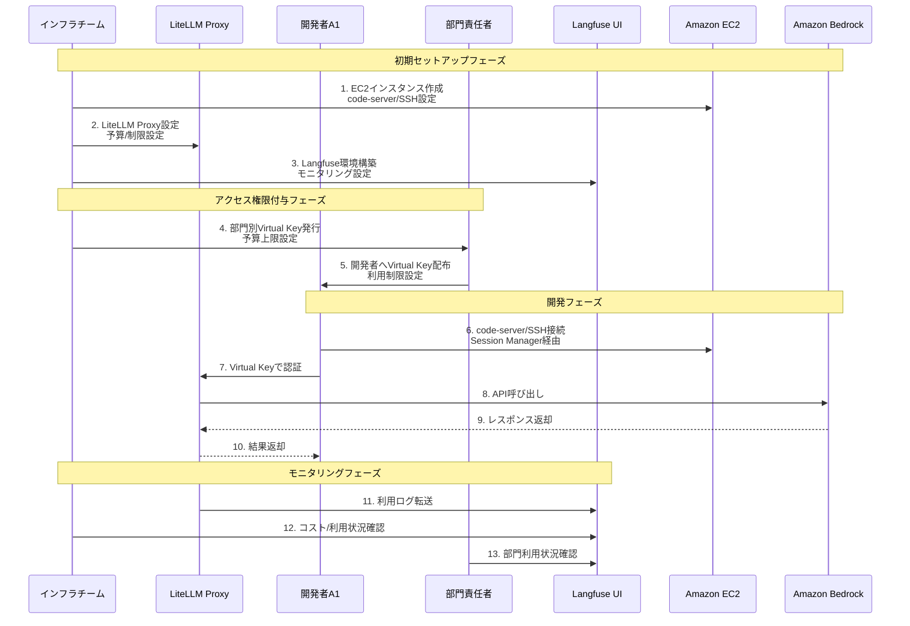
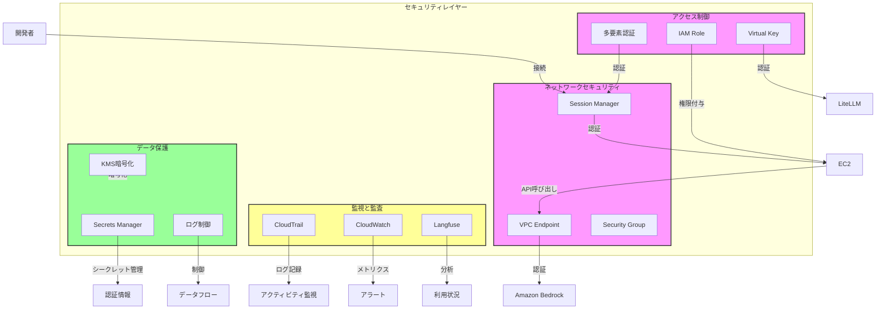
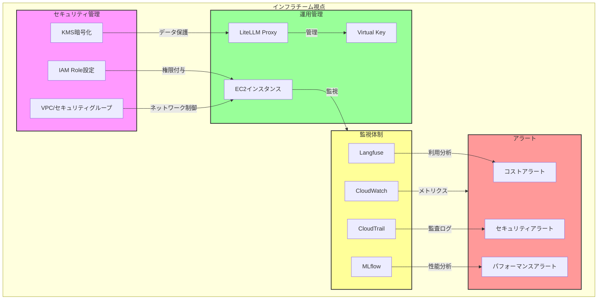
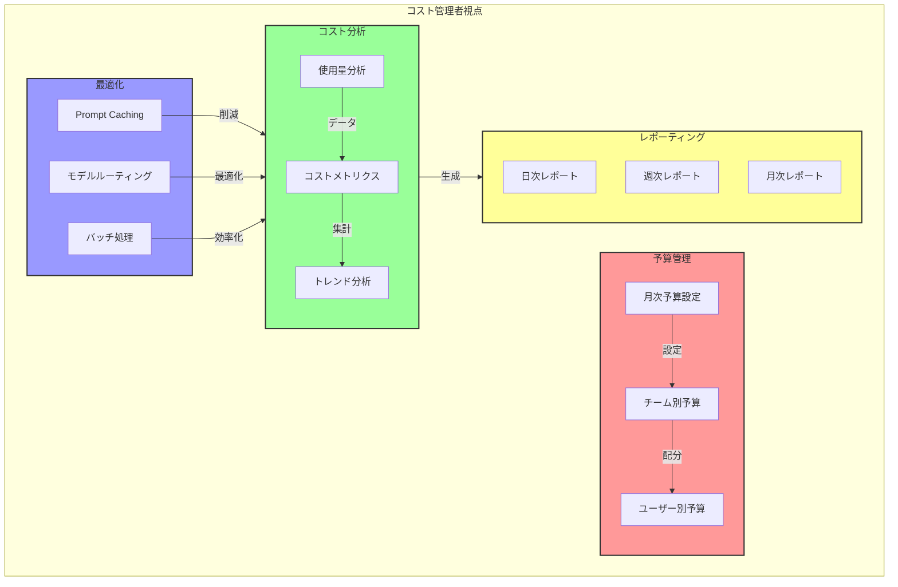
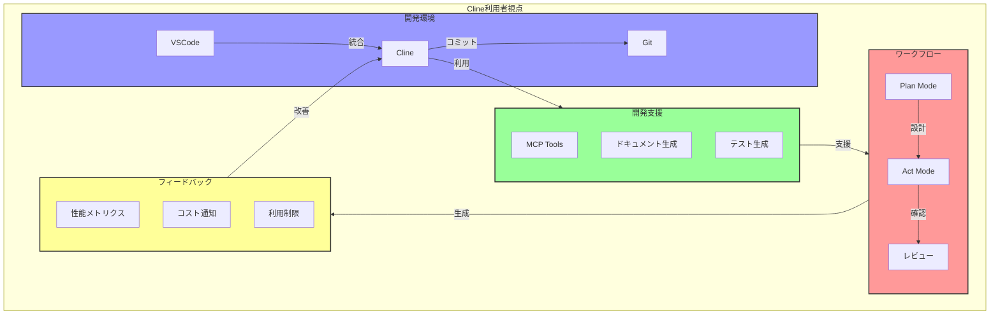
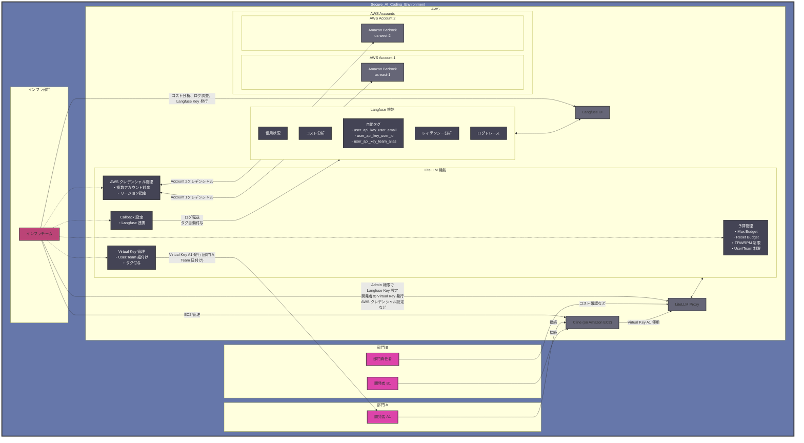

# AI コーディング支援エージェント時代における開発生産性とガバナンスの両立

## はじめに

ソフトウェア開発の世界は、生成 AI の台頭により大きな転換期を迎えています。特に AI を活用したコーディング支援エージェントは急速な進化を遂げ、開発者の働き方に革新的な変化をもたらし始めています。しかし、企業における AI の活用には、生産性の向上だけでなく、適切なガバナンス体制の構築が不可欠です。

本記事では、AI コーディング支援エージェント[「Cline」](https://github.com/cline/cline)と[Amazon Bedrock](https://aws.amazon.com/jp/bedrock/) を組み合わせ、[LiteLLM](https://github.com/BerriAI/litellm)、[Langfuse](https://langfuse.com/)、[MLflow](https://mlflow.org/) を活用することで、いかにして開発生産性の向上とセキュアな運用を両立できるのかに注目します。

### Langfuse と MLflow の使い分け

組織での AI 活用を成功させるためには、適切な監視と分析が不可欠です。Langfuse と MLflow は、それぞれ異なる特徴と利点を持っています：

**Langfuse の特徴：**
- LLM に特化した詳細なトレーシング
- プロンプトとレスポンスの完全な記録
- ユーザー/チーム単位での使用状況分析
- リアルタイムなコスト追跡
- 直感的な UI による分析

**MLflow の特徴：**
- 幅広い ML 実験の追跡
- モデルのバージョン管理
- パラメータとメトリクスの記録
- 再現性の確保
- AWS との深い統合

**使い分けの指針：**
1. **日常的なモニタリング → Langfuse**
   - コスト管理
   - 使用状況分析
   - パフォーマンス監視
   - 問題のトラブルシューティング

2. **長期的な分析と最適化 → MLflow**
   - モデル性能の比較
   - プロンプトの実験管理
   - システム全体の最適化
   - AWS サービスとの連携

## Cline 導入における課題と解決策

企業環境で Cline を導入する際には、いくつかの重要な課題に対処する必要があります。以下では、主な課題とその解決策を整理します。

### 課題1: セキュリティリスク

#### 1-1: 社内コードが AI モデルの学習データになる懸念
- **課題**: 企業の機密コードや知的財産が AI モデルの学習データとして利用される可能性
- **解決策**: Amazon Bedrock の活用
  - Bedrock では入力・出力データがデフォルトで学習に利用されない
  - モデルプロバイダーとデータが共有されない
  - オプトアウト設定が一括で管理可能

#### 1-2: センシティブデータの外部流出リスク
- **課題**: アクセスキーなどの機密情報が意図せず外部に送信されるリスク
- **解決策**: 多層的な防御策
  - `.clineignore`、`.gitignore` による機密ファイルの除外
  - Cline 自体のアクセスキー検知機能
  - LiteLLM Proxy による入力フィルタリング
  - Amazon Bedrock の Guardrails 機能

#### 1-3: 危険なコマンド実行リスク
- **課題**: エージェントによる危険なコマンド実行（ファイル削除など）
- **解決策**: 実行制限と監査
  - 重要操作に対する承認フローの設定
  - AWS CLI 操作の監査ログ有効化
  - LiteLLM Proxy による出力ガードレール設定

### 課題2: コスト管理

#### 2-1: 予測不能なコスト増大
- **課題**: 利用量増加に伴う予算超過リスク
- **解決策**: LiteLLM Proxy によるコントロール
  - チーム/個人単位でのレートリミット設定
  - 予算上限の設定と自動制限
  - TPM/RPM 制限の適用

#### 2-2: 費用対効果の可視化
- **課題**: AI 利用コストと生産性向上の関係性把握
- **解決策**: Langfuse による詳細な分析
  - ユーザー/チーム単位での使用状況可視化
  - コスト内訳の詳細分析
  - 利用パターンの分析と最適化提案

### 課題3: アクセス管理

#### 3-1: AWS アクセスキー管理
- **課題**: 開発者への AWS アクセスキー直接提供のリスク
- **解決策**: Virtual Key による間接アクセス
  - LiteLLM Proxy の Virtual Key 機能
  - AWS クレデンシャルの一元管理
  - SSO 認証との連携

### 課題4: MCP (Model Context Protocol) 管理

#### 4-1: 外部ツールへの不適切なアクセス
- **課題**: MCP を通じた外部サービスへの制御されていないアクセス
- **解決策**: MCP アクセス制御
  - 許可された MCP サーバーのホワイトリスト化
  - アクセス権限の細かな制御
  - 使用状況の監査とモニタリング

これらの課題と解決策を適切に組み合わせることで、Cline の生産性向上メリットを最大化しながら、企業のセキュリティとガバナンス要件を満たすことが可能になります。

## 開発生産性とガバナンスの両立が求められる背景

グローバル競争の激化とテクノロジーの急速な進化により、企業は従来以上のスピードでソフトウェアを開発・展開することを求められています。同時に、AI の活用においては適切なコスト管理、セキュリティ対策、コンプライアンス遵守が不可欠です。新しい機能の実装や既存システムの改善において、開発者の生産性は企業の競争力を左右する重要な要素となっていますが、それは適切な管理体制の下で実現される必要があります。

### 現代のエンジニアと組織が直面する課題

開発者と組織は日々、以下のような重要な課題に直面しています：

1. **トークン消費と API 制限**
   - 従来の AI 利用より大幅に多いトークン消費
   - 複雑なコードベースの理解による長いコンテキスト処理
   - API Provider による制限（RPM/TPM）への抵触リスク
   - 開発フローの中断リスク

2. **セキュリティとコンプライアンス**
   - 機密情報の保護要件
   - 部門/チーム単位でのアクセス制御
   - セキュリティ基準への準拠と監査対応
   - 社内ポリシーと法規制への対応

3. **コスト管理**
   - AI 利用コストの可視化と最適化
   - 部門単位での予算管理
   - 使用状況のモニタリング
   - コスト効率の高いモデル選択

4. **生産性と知識共有**
   - コード品質を維持しながらの開発速度向上
   - プロジェクトのコードベース理解と保守
   - AI 活用のベストプラクティス共有
   - 新規メンバーの効率的な技術継承

## Cline による開発生産性とガバナンスの両立

### Cline の概要と基本機能

Cline は、単なるコード補完ツールではなく、開発者の意図を理解し自律的にタスクを実行できる AI コーディング支援エージェントです。Visual Studio Code などの統合開発環境（IDE）に完全に統合され、プロジェクトの立ち上げからコード生成、Git コミットまでをシームレスにサポートします。

特筆すべき点として、Cline は現状オープンソースとして開発されており、開発者コミュニティと連携しながら日々進化を続けています。これにより、企業固有のニーズに合わせたカスタマイズや、新しい機能の追加が容易に行えます。

### Cline の主要な特徴

#### 自律的なタスク実行と柔軟なカスタマイズ

Cline は開発者の意図を理解し、必要な一連の作業を自律的に実行できます。例えば、「新しい API エンドポイントを追加して」という指示に対して、ルーティングの設定、コントローラーの作成、テストコードの生成まで一貫して行うことができます。また、.clinerules ファイルを通じて、プロジェクト固有の規約やガイドラインを設定できます。これにより、チームの開発規約に準拠したコード生成や、セキュリティポリシーに基づいた制約の設定が可能です。

#### Pilot アプローチと Plan/Act モードの分離

Cline は Pilot として自律的にタスクを遂行し、人間が Copilot として問題解決をサポート・誘導するスタイルを採用しています。この関係性により、開発者は高度な判断や方向性の決定に集中し、細かな実装タスクはある程度 AI に委ねることができます。

Plan モードでは、アーキテクチャ設計や実装方針の検討、Mermaid 図による視覚的な設計の共有、低・中コストモデルでの事前確認を行い、人間との合意形成を図ります。一方、Act モードでは、Plan で合意された内容の実装、高性能モデルによる正確なコード生成、ファイル操作や環境設定の実行を行い、継続的な進捗確認とフィードバックを提供します。

### Model Context Protocol による拡張性

Cline は、Model Context Protocol（MCP）による高度な拡張性を備えています。このプロトコルにより、開発者は外部サービスやツールとのシームレスな連携を実現できます。Web 検索エンジンとの連携により最新の技術情報を取り込んだり、社内の専用 API と接続してプロプライエタリなデータにアクセスしたりすることが可能です。さらに、チーム固有のワークフローやツールチェーンとの統合により、組織の開発文化に完全に適応した AI アシスタントとして機能します。

### リスク管理と安全性の確保

Cline の自律的なファイル操作能力は生産性を飛躍的に向上させる一方で、不用意なファイル削除やデータ消失のリスクも内包しています。特に Git 操作や AWS CLI などのコマンド実行は、誤った使用により深刻な問題を引き起こす可能性があります。また、API キーなどの機密情報が意図せず漏洩するリスクも考慮する必要があります。

これらのリスクに対して、重要な操作に対する承認フローの設定、Git 操作の制限と保護ブランチの活用、AWS CLI 操作の監査ログ有効化など、多層的な防御策を講じています。セキュリティとユーザビリティのバランスを取りながら、組織に最適な設定を見つけることで、Cline の利点を最大化しながらリスクを最小限に抑えることができます。

## Amazon Bedrock と Claude 3.7 Sonnet の活用

### エンタープライズ環境に最適化された AWS エコシステム

AWS は創業以来、セキュリティを最優先事項として設計・運用されてきました。この「セキュリティファースト」の哲学は、Amazon Bedrock にも深く根付いています。大規模組織での AI 活用に関する豊富な知見と実績を持ち、顧客からのフィードバックを積極的に取り入れながらサービスを進化させ続けています。

金融、医療、公共部門など厳格な規制が求められる業界においても、AWS の包括的なコンプライアンス対応により、安心して AI を活用できる環境と実績が整っています。これにより、企業は業界固有の規制要件を満たしながら、最新の AI 技術を活用することが可能になります。

### データ主権とプライバシーの保護

企業データの保護は、AI 活用における最重要課題の一つです。Amazon Bedrock は、この課題に正面から取り組んでいます。モデルへの入出力をデフォルトで学習に利用せず、ログ記録も標準では無効化されているため、機密性の高い企業データを安全に処理できます。

さらに、データの取り扱いポリシーを組織の要件に合わせて詳細に設定できるため、規制の厳しい業界でも安心して利用できます。これは特に、知的財産や個人情報を含むコードベースを扱う開発環境において重要な要素となります。

### 運用面での柔軟性とスケーラビリティ

Amazon Bedrock の大きな強みは、その運用面での柔軟性です。バッチ推論による大規模データ処理、利用リージョン選択、オンデマンドでの柔軟な利用、[Provisioned Throughput](https://docs.aws.amazon.com/ja_jp/bedrock/latest/userguide/prov-throughput.html) による安定したパフォーマンス保証など、ビジネスニーズに合わせた選択肢が用意されています。

データ主権やコンプライアンス要件に応じて最適なリージョンを選択できるため、グローバル企業でも各国の法規制に対応した AI 活用が可能です。また、組織の成長に合わせてスケールアップできる柔軟性も備えています。

### マルチモデル戦略による最適化

Amazon Bedrock は、複数のプロバイダが提供する最先端モデルを統一的なインターフェースで利用できる点に強みがあります。Claude 3.7 Sonnet をはじめ、Amazon Nova Pro、Llama 3.1 など、様々なモデルにアクセスできます。

これにより、タスクの性質や要件に応じて最適なモデルを選択できるだけでなく、コストと性能のバランスを考慮した戦略的な使い分けが可能になります。例えば、初期の概念検討には軽量モデルを、最終的なコード生成には高性能モデルを使用するといった柔軟な運用が実現します。

### Claude 3.7 Sonnet による開発体験の革新

Anthropic の [Claude 3.7 Sonnet](https://aws.amazon.com/jp/blogs/news/anthropics-claude-3-7-sonnet-the-first-hybrid-reasoning-model-is-now-available-in-amazon-bedrock/) は、特にソフトウェア開発領域において卓越した能力を発揮します。大規模で複雑なコードベースを深く理解し、プロジェクト全体の文脈を把握した上で的確な提案を行います。

その正確なコード生成能力は、単に動作するコードを提供するだけでなく、プロジェクトの規約やベストプラクティスに準拠した高品質なコードを生成します。これにより、開発者はより創造的な問題解決や設計に集中できるようになります。

### コスト効率と投資対効果

Amazon Bedrock の利用コストは、エンジニア 1 人あたり月額 $0.5K〜$1.0K 程度と見積もられます。エンジニアの人件費を月額 100 万円と仮定すると、生産性が 10% 向上するだけでコストを回収できる計算になります。

さらに、Preview 中の Prompt Caching 機能により、リクエスト間で繰り返されるプロンプトプレフィックスをキャッシュでき、長期的な運用コストの最適化が期待できます。これにより、組織全体での AI 活用の経済的な持続可能性が高まります。

## アーキテクチャと実装

### アクセス制御とキー管理フロー

以下の図は、インフラチーム、開発者、部門責任者の権限管理とアクセスフローを示しています。

### セキュリティ対策の実装

多層的なセキュリティ対策を実装し、企業レベルの要件を満たします：

### コスト管理とリソース制御

コスト管理システムの全体像を以下の図で示します：

```mermaid
graph TB
    subgraph Cost_Control["コスト管理システム"]
        subgraph Budget["予算管理"]
            MB[月次予算設定]
            DB[部門別予算]
            AB[アラート設定]
        end

        subgraph Resource["リソース制御"]
            TPM[TPM制限]
            RPM[RPM制限]
            QUE[キューイング]
        end

        subgraph Optimization["最適化"]
            MC[モデル選択]
            PC[Prompt Caching]
            BC[バッチ処理]
        end

        subgraph Analytics["分析"]
            CA[コスト分析]
            UA[利用分析]
            TA[トレンド分析]
        end
    end

    MB -->|制限設定| LiteLLM
    DB -->|配分| Team[チーム]
    AB -->|通知| Admin[管理者]

    TPM -->|制御| API[API呼び出し]
    RPM -->|制御| API
    QUE -->|管理| Request[リクエスト]

    MC -->|選択| Model[モデル]
    PC -->|最適化| Cache[キャッシュ]
    BC -->|効率化| Process[処理]

    CA -->|レポート| Report[レポート]
    UA -->|分析| Insight[インサイト]
    TA -->|予測| Forecast[予測]

    classDef budget fill:#f99,stroke:#333,stroke-width:2px
    classDef resource fill:#9f9,stroke:#333,stroke-width:2px
    classDef optimize fill:#99f,stroke:#333,stroke-width:2px
    classDef analytics fill:#ff9,stroke:#333,stroke-width:2px
    class Budget budget
    class Resource resource
    class Optimization optimize
    class Analytics analytics
```

## 組織における異なる視点からの利用体験

### インフラチーム視点

インフラチームは、システム全体の安全性と安定性を確保する重要な役割を担っています。主な責務には以下が含まれます：

- セキュリティ設定の一元管理
- インフラストラクチャの監視と最適化
- アクセス権限の管理と監査
- コスト効率の監視と改善提案
- インシデント対応と問題解決

### コスト管理者視点

コスト管理者は、組織全体の AI 利用コストを最適化する責任を負っています。主な活動には以下が含まれます：

- 部門別予算の設定と管理
- コスト効率の分析と改善
- 使用パターンの分析と最適化提案
- 定期的なレポーティング
- コスト超過の早期検知と対応

### Cline 利用者視点

開発者は Cline を通じて、効率的な開発体験を得ることができます。主な利点には以下が含まれます：

- シームレスな IDE 統合
- Plan/Act モードによる段階的な開発
- 豊富な開発支援ツール
- リアルタイムなフィードバック
- コスト意識の醸成

## AWS サービスとの統合

### LiteLLM Proxy による統合管理

LiteLLM Proxy は、複数の LLM プロバイダーを統一的に扱うためのプロキシサーバーです。AWS Solutions Library では、[Multi-Provider Generative AI Gateway](https://github.com/aws-solutions-library-samples/guidance-for-multi-provider-generative-ai-gateway-on-aws) として ECS/EKS 上での実装サンプルが提供されています。また、AWS Marketplace では [LiteLLM LLM Gateway](https://aws.amazon.com/marketplace/pp/prodview-gdm3gswgjhgjo) として Enterprise 版が提供されており、SSO 対応などの高度な機能を利用できます。

主な機能と実装ポイント：

1. **基本機能**
   - 複数モデルへのリクエスト分散
   - Virtual Key 管理によるアクセス制御
   - AWS クレデンシャル管理の一元化
   - キューイングとリトライ機能
   - Prompt Caching によるコスト最適化

2. **AWS アカウント管理機能**
   - 複数の AWS アカウントの認証情報を一元管理
   - アカウントごとに異なる Bedrock エンドポイントの利用
   - チーム/部門ごとに異なる AWS アカウントの割り当て

3. **実装上の重要ポイント**
   - Virtual Key 発行時に部門情報をメタデータとして付与
   - ユーザー識別情報を Langfuse へ転送するよう設定
   - 部門ごとのクォータ設定の実装

4. **コスト管理の一元化**
   - インフラチームによる統合管理（責任の所在を明確化）
   - 管理フローの簡略化
   - AWS 環境全体の管理とコスト管理の一元化

### Langfuse による Observability の実現

Langfuse は LLM アプリケーションの観察とモニタリングを行うためのオープンソースプラットフォームです。AWS Fargate 上での実装サンプルが [deploy-langfuse-on-ecs-with-fargate](https://github.com/aws-samples/deploy-langfuse-on-ecs-with-fargate) として提供されています。また、AWS Marketplace では [Self-hosted](https://aws.amazon.com/marketplace/pp/prodview-4ilxkwxiwx6xo) と [SaaS](https://aws.amazon.com/marketplace/pp/prodview-vg55ffyixbuym) の両方のオプションが提供されています。

階層的な Observability アプローチ：
1. 基本メトリクス（レイテンシー、エラー率など）
2. マイクロサービストレース（RAG、AI Agent など）
3. ユーザーフィードバックと KPI 追跡
4. 変動監視（Drift、Bias など）

### MLflow との連携

Amazon SageMaker の Managed MLflow を活用することで、より高度な分析と LLMOps への展開が可能です。MLflow は以下の利点を提供します：

- 統合的なログ管理
- 高度な分析機能
- AWS Console からのアクセス
- Presigned URL によるダッシュボードアクセス

## LiteLLM と Langfuse を用いた組織向け AI コーディングエージェント環境の全体像

以下の図は、LiteLLM と Langfuse を組み合わせた組織向け AI コーディングエージェント環境の全体像を示しています。この構成により、部門単位でのコスト管理、ユーザー単位での使用状況追跡、および全社的なコスト分析が可能になります。

### 主要コンポーネントと関係性

#### 1. 組織構造
- 組織内に複数の部門（部門A、部門B）が存在
- 各部門に所属する開発者がClineを使用
- インフラ部門がAWS環境全体を管理

#### 2. LiteLLM の主要機能
- **Teams管理**: 部門ごとにTeamを作成し、独立した設定と管理が可能
- **予算管理**: Max Budget、Reset Budget、TPM/RPM制限などを設定
- **Virtual Key管理**: ユーザーとTeamの紐付け、タグ付与による詳細な識別情報の管理
- **Callback設定**: Langfuseとの連携設定

#### 3. Langfuse の主要機能
- **使用状況モニタリング**: ユーザー別、部門別、モデル別の使用状況
- **コスト分析**: 予算対比、使用量トレンド分析
- **自動タグ付与**: user_api_key_user_email、user_api_key_user_id、user_api_key_team_alias

#### 4. 運用フロー
- **初期設定**: インフラチームがLangfuse Key発行、LiteLLM設定、Team作成、予算設定、Virtual Key発行を実施
- **利用**: 開発者はClineにVirtual Keyを設定し、LiteLLM経由でBedrockにアクセス
- **モニタリング**: インフラチームがLangfuseダッシュボードでコスト分析、予算超過監視、使用パターン分析を実施

## まとめと今後の展望

AI コーディング支援エージェントは、開発生産性の向上に大きな可能性を秘めています。Cline、LiteLLM、Langfuse などのツールを組み合わせることで、セキュリティとガバナンスを確保しながら、その可能性を最大限に引き出すことができます。特に AWS のマネージドサービスと組み合わせることで、より安全で効率的な運用が実現可能です。

今後は、さらなる自動化と最適化が進み、開発者の創造的な作業にフォーカスできる環境が整っていくことが期待されます。同時に、組織的な導入と運用のベストプラクティスも確立されていくでしょう。
