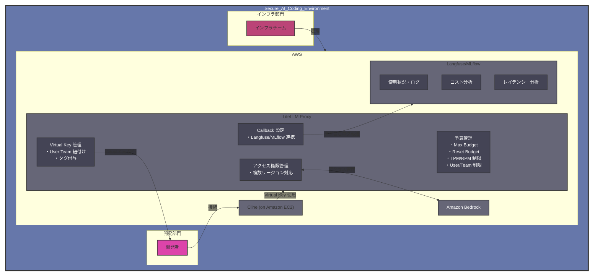
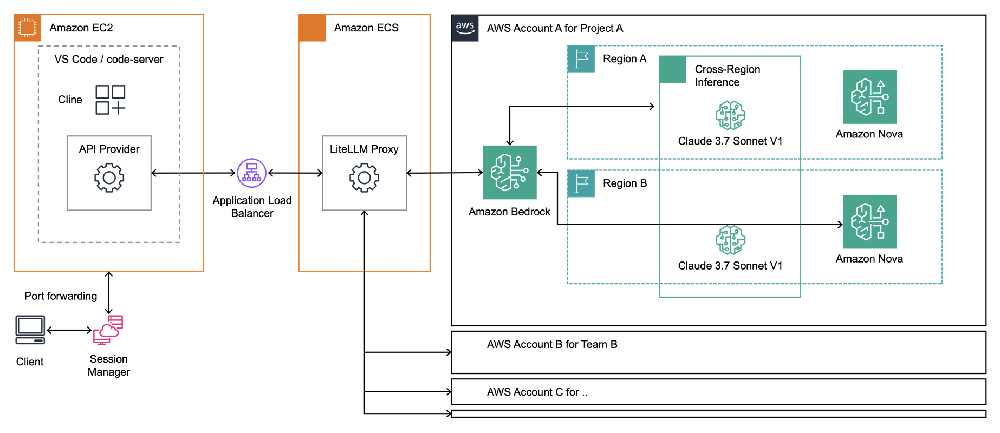

# AI コーディング支援エージェントにおける開発生産性とガバナンスの両立

## はじめに

ソフトウェア開発の世界は、生成 AI の台頭により大きな転換期を迎えています。特に AI を活用したコーディング支援エージェントは急速な進化を遂げ、開発者の働き方に革新的な変化をもたらし始めています。しかし、企業における AI の活用には、生産性の向上だけでなく、適切なガバナンス体制の構築が不可欠です。

本記事では、開発生産性の向上とセキュアな運用を両立する方法を解説します。

## 開発生産性とガバナンスの両立が求められる背景

グローバル競争の激化とテクノロジーの急速な進化により、企業は従来以上のスピードでソフトウェアを開発・展開することを求められています。同時に、組織における AI の活用においては適切なコスト管理、セキュリティ対策、コンプライアンス遵守が不可欠です。

### AI コーディング支援エージェントの活用に組織が直面する課題

特に AI コーディング支援エージェントの活用においては、従来の開発環境とは異なる新たな課題が浮上しています。

第 1 に、セキュリティとコンプライアンスの課題があります。AI による支援を活用しつつ、機密情報の保護を確実にする必要があります。部門やチーム単位での適切なアクセス制御の実現、セキュリティ基準への準拠と監査対応、社内ポリシーと法規制への対応など、多岐にわたる要件を満たす必要があります。

第 2 に、トークン消費と API 制限の課題があります。AI コーディング支援エージェントは、従来の AI 利用と比較して大幅に多くのトークンを消費します。これは、複雑なコードベースの理解や長いコンテキスト処理が必要なためです。また、API Provider による制限（Requests Per Minute/Tokens Per Minute）への抵触リスクも高く、コード生成が制限により頻繁に中断されることは開発者の開発体験の低下を招きます。

第 3 に、コスト管理の課題があります。AI 利用に関するコストの可視化と最適化は、組織全体の効率的な運営に直結します。部門単位での予算管理と使用状況のモニタリング、コスト効率の高いモデル選択と利用戦略の策定が求められています。チームや個人単位で自由にトークン消費を許すことで組織全体としてのコストの大幅な増加が想定されるため、チームや個人単位での適切な利用制約が必要となります。

第 4 に、生産性と知識共有の課題があります。コード品質を維持しながら開発速度を向上させる必要性、プロジェクトにおけるコードベースの理解と保守、AI 活用に関するベストプラクティスの共有、新規メンバーの参画における効率的な技術継承など、全社での効果的な AI コーディング支援エージェントの活用には組織的な取り組みが必要です。この課題については本記事のスコープ外としますが、組織全体での Cline 活用に関するナレッジ蓄積を意識する必要があります。

本記事では、これらの課題に対して Amazon Bedrock、LiteLLM Proxy、そして Langfuse/MLflow を組み合わせたソリューションを提案します。組織全体で効果的に AI を活用するための具体的な方法を検討していきます。

## Cline 導入課題と Amazon Bedrock による課題の緩和

[Cline](https://github.com/cline/cline) は、開発者からのタスクの意図を理解し自律的にタスクを遂行する AI コーディング支援エージェントです。[Visual Studio Code](https://code.visualstudio.com/) IDE（VS Code）に Extension として統合されています。Cline を組織導入する際には、上記で取り上げた課題への対処が必要となります。

### 課題 1: セキュリティリスクへの対応

企業における AI コーディング支援エージェントの導入において、最も重要な懸念事項の一つがセキュリティリスクです。企業の機密コードや知的財産が外部に漏洩したり、モデルの改善に使用されたりすることは、多くの組織にとって受け入れがたいリスクです。


AWS はセキュリティを常に最優先事項としており、AWS の包括的なセキュリティ・コンプライアンス対応により、安心して AI を活用するための仕組みが整っています。[Amazon Bedrock](https://aws.amazon.com/jp/bedrock/) では、入出力データが学習に利用されることはなく、モデルプロバイダーとデータが共有されない設計になっています。プロンプトログすらもデフォルトでは収集が無効化されているため、機密性の高い企業データを安全に処理できます。Amazon Bedrock は入出力に対する [Guardrails](https://aws.amazon.com/jp/bedrock/guardrails/) 機能の提供を行っており、ユーザーによる入出力データへのリスク対応が可能です。

**ニーズ 1-1: Cline は [AWS IAM Identity Center](https://aws.amazon.com/jp/iam/identity-center/) を通じて Amazon Bedrock へのセキュアなアクセスを実現できます。しかし、開発者のローカル PC 上で Cline を利用する場合、悪意のあるツールによる機密情報の外部送信や重要ファイルの誤削除といったリスクを完全に防ぐことは困難です。そのため、ローカル PC から分離された開発環境の利用を推奨します。**

### 課題 2: トークン消費と API 制限

API プロバイダーによる RPM/TPM の制限への抵触リスクを緩和し、開発者の開発体験と生産性を向上させる必要があります。


Amazon Bedrock は、運用面に関する柔軟性に強く配慮しており、オンデマンド推論でのリアルタイムの推論、バッチ推論による一括データ処理、[Provisioned Throughput](https://docs.aws.amazon.com/ja_jp/bedrock/latest/userguide/prov-throughput.html) によるスループットパフォーマンス保証など、ニーズに合わせた推論の選択肢が用意されています。そして Amazon Bedrock は、複数プロバイダが提供する最先端モデルを統一的なインターフェースで利用できる点にも強みがあります。Anthropic の [Claude](https://aws.amazon.com/jp/bedrock/claude/) をはじめ、[Amazon Nova](https://aws.amazon.com/jp/ai/generative-ai/nova/)、Meta の [Llama](https://aws.amazon.com/jp/bedrock/llama/) など、様々なモデルにアクセスできます。モデルを適切に使い分けることでモデル単位での API 制限による影響を緩和できる点も重要です。更には [Cross-Region inference](https://docs.aws.amazon.com/bedrock/latest/userguide/cross-region-inference.html) 機能を活用することで自動的に複数リージョンに推論リクエストを分散することができ、これにより TPM 制限等の影響を緩和します。

**ニーズ 2-1: 組織全体で AI モデルを効率的に利用するため、複数の AWS アカウントやリージョンを跨いだリクエストの分散制御が必要です。特に、レート制限に達した際の自動的なモデル切り替えや、チーム・個人単位での利用制限を柔軟に設定できる仕組みが求められています。これにより、開発者の生産性を維持しながら、組織全体での AI リソースの効率的な活用を実現する必要があります。**

### 課題 3: コスト管理

AI コーディング支援エージェントの組織内の利用拡大に伴い、コスト管理が重要な課題となるでしょう。

Amazon Bedrock では [Application Inference Profile](https://aws.amazon.com/jp/blogs/machine-learning/track-allocate-and-manage-your-generative-ai-cost-and-usage-with-amazon-bedrock/) を使用することで、チームや個人単位での使用状況の追跡が可能です。[Amazon CloudWatch](https://aws.amazon.com/jp/cloudwatch/) メトリクスでプロファイルごとの呼び出し回数、処理時間、トークン数などを監視でき、[AWS Cost Explorer](https://aws.amazon.com/jp/aws-cost-management/aws-cost-explorer/) でタグベースのコスト分析も実現できます。

application inference profile 作成時に、組織構造を反映したタグを Profile に付与することで、きめ細かなコスト配分が可能になります。これらのタグは AWS Cost Explorer で自動的に認識され、タグベースのコスト配分レポートを生成できます。各プロファイルの使用状況は Amazon CloudWatch メトリクスで詳細に追跡され、`ModelId` ディメンションでフィルタリングすることで、特定のプロファイルの使用パターンを分析できます。これにより、異常な使用量の検出や予算管理が可能となります。

ただし、2025/04/23 時点では Cline での application inference profile のサポート [PR](https://github.com/cline/cline/pull/2078) はリリースに至っていません。そして、複数 AWS アカウントを跨いだモデル ID 連携の設定はサポートされていません。

**ニーズ 3-1: 組織として、チームや個人単位での AI モデル利用を効率的に管理する必要があります。利用可能なモデルの制限や TPM/RPM の設定を、過度な管理オーバーヘッドなく実現できる仕組みが求められています。現状の AWS アカウント分割や IAM ポリシー設計による方法では、運用負荷が高くなってしまうため、より効率的な管理方法が必要です。**

**ニーズ 3-2: 組織として、AI モデル利用の詳細な分析と可視化を実現する必要があります。チームや個人単位での利用状況、目的に応じたモデル選択の適切性、コストパフォーマンスなど、複数アカウントやリージョンにまたがる情報を統合的に分析・評価できる基盤が求められています。これにより、組織全体での AI 活用の最適化とコスト効率の向上を図る必要があります。**

### AWS の継続的なサービス改善と今後の期待

ここで重要な点は、これらのニーズは独自の実装や後述するソリューションにより緩和が可能であり、AWS の継続的なサービス改善の取り組みによって今後解決されていく可能性があるということです。AWS は常にユーザーからのフィードバックを重視し、それをサービスの改善に活かすことを基本理念としています。チーム単位での詳細な利用分析やコスト管理、より柔軟なアクセス制御など、現在のニーズとして挙げた機能についても、ユーザーからのフィードバックを基に継続的に改善されていくことが期待されます。例えば、[Amazon Bedrock Intelligent Prompt Routing](https://aws.amazon.com/jp/blogs/machine-learning/use-amazon-bedrock-intelligent-prompt-routing-for-cost-and-latency-benefits/) はモデルのレスポンスの質とコストを考慮してルーティングを行う機能を提供しており、このような機能がユーザーの声を元に改善すれば、ニーズ 2-1 をマネージドで解決することができるでしょう。そのほか、application inference profile が TPM/RPM 等の制限の機能に対応すればニーズ 3-1 を解決するでしょう。

## ニーズに対するソリューション例

このセクションでは、 ニーズ 1-1、2-1、3-1、3-2 に対応する包括的なソリューションを例示します。あくまで構成の一例であり、組織体制や組織ルール等に基づいて柔軟に変更する余地があります。

全体としてニーズを満たすためにソリューションとして必要なことは、1. アカウント・リージョン等を跨いだモデルの柔軟な選択、エラー時のフォールバック、等の設定ができること、2. チーム・個人・プロジェクト等の単位でモデルの利用可否とリクエスト制限の設定ができること、3. コストをモデル、組織階層の単位で集計・可視化できること、4. セキュアに全体の仕組みを提供すること、です。

本ソリューションでは、以下の主要なコンポーネントを活用して、前述のニーズに対応します。



**code-server on Amazon EC2 (code-server)**：開発者のローカル PC から切り離された、セキュアな開発環境を提供します。[Amazon EC2](https://aws.amazon.com/jp/ec2/) 上に構築され、ブラウザベースの VS Code 環境を提供します。[Amazon VPC](https://aws.amazon.com/jp/vpc/) 内での安全な通信、[IAM](https://aws.amazon.com/jp/iam/) ロールによる適切な権限管理、統一された開発環境の提供を実現します。

**[LiteLLM Proxy](https://docs.litellm.ai/docs/simple_proxy)**：複数の LLM プロバイダーへのアクセスを統一的に管理するプロキシサーバーです。Amazon Bedrock を含む様々な LLM プロバイダーへのリクエストを一元管理し、複数アカウント・リージョンのモデル選択、レート制限、フォールバック、コスト追跡などの機能を提供します。

**[Langfuse](https://langfuse.com/)**：LLM アプリケーションのモニタリングとオブザーバビリティを実現するプラットフォームです。リクエストの詳細な追跡、パフォーマンス分析、コスト分析などの機能を提供し、LLM の利用状況を可視化します。LiteLLM Proxy の簡単な設定のみでトレース等の情報を Langfuse で記録することができます。

**[MLflow](https://mlflow.org/)**：機械学習ライフサイクル全体を管理するためのプラットフォームです。実験の追跡、モデルのバージョン管理、デプロイメント管理などの機能を提供し、LLM の利用状況やパフォーマンスを記録・分析することもできます。AWS では [Amazon SageMaker](https://aws.amazon.com/jp/sagemaker/) が [managed MLflow](https://aws.amazon.com/jp/blogs/aws/manage-ml-and-generative-ai-experiments-using-amazon-sagemaker-with-mlflow/) を提供しており、構築と管理のコストを削減することができます。そして、Amazon SageMaker の枠組みに統合されているため取得されたトレースや [Amazon S3](https://aws.amazon.com/jp/s3/) に格納される入出力プロンプトを用いて、評価、モデルチューニング、チューニングモデルのバージョン管理、モデルデプロイメントまで一貫して活用することができます。LiteLLM Proxy から managed MLflow にトレース等の情報を送信するためには [Custom Callback](https://docs.litellm.ai/docs/proxy/logging#custom-callback-class-async) のコードを書く必要があります。

各コンポーネントは以下のように各ニーズに対応します：

| ニーズ | code-server | LiteLLM Proxy | Langfuse | MLflow |
|-------|------------|--------------|----------|--------|
| 1-1: セキュアな実行環境 | VPC 内での安全な通信、IAM ロールによる権限管理、統一された開発環境 | OIDC / JWT / Virtual Key による認証、RBAC による権限制御、SSO 統合 | - | - |
| 2-1: モデルリクエスト分散とフェイルオーバー | - | 仮想モデルによるルーティング制御、アカウント/リージョン間のフェイルオーバー | - | - |
| 3-1: チーム・個人単位の利用制限 | - | 仮想モデルグループごとの利用制限、チーム/個人単位の TPM/RPM 制御 | - | - |
| 3-2: 詳細な分析と可視化 | - | 使用状況とコスト可視化 | リアルタイムなトレース分析、コストトラッキング | リアルタイムなトレース分析、コストトラッキング |

これらの OSS を組み合わせることで、Amazon Bedrock の機能を拡張し、組織のニーズに合わせた柔軟な AI コーディング支援環境を構築できます。

### ソリューション 1-1: セキュアな実行環境の実現



ニーズ 1-1 に対するソリューションでは、開発者のローカル PC から直接 AWS サービスにアクセスする代わりに、クラウド上に構築された Amazon EC2 による安全な実行環境を通じて Cline を利用します。EC2 インスタンスでは [code-server](https://github.com/coder/code-server) や VS Code の [Remote Development](https://code.visualstudio.com/docs/remote/remote-overview) を利用して開発者に VS Code 環境を提供できます。これらの環境への接続方法としては、[AWS Systems Manager Session Manager](https://docs.aws.amazon.com/systems-manager/latest/userguide/session-manager.html) を介した安全なポートフォワーディングによる方法や、code-server を利用したブラウザベースの接続を提供する方法などが考えられます。

LiteLLM Proxy は [Guidance for Multi-Provider Generative AI Gateway on AWS](https://github.com/aws-solutions-library-samples/guidance-for-multi-provider-generative-ai-gateway-on-aws?tab=readme-ov-file) リポジトリに [Amazon ECS](https://aws.amazon.com/jp/ecs/)、[Amazon EKS](https://aws.amazon.com/jp/eks/) でサービングするガイダンスが提供されており、Amazon EC2 の実行環境から AWS ネットワークに閉じてセキュアに LiteLLM Proxy にアクセスすることもできます。あくまでガイダンスであり本番利用に際してはセキュリティや負荷試験等を実施してください。

LiteLLM Proxy のユーザー認証については、複数の選択肢から組織に適した方式を選択できます。[Virtual Key](https://docs.litellm.ai/docs/proxy/virtual_keys) のみの利用、[Custom Auth](https://docs.litellm.ai/docs/proxy/custom_auth)、[RBAC](https://docs.litellm.ai/docs/proxy/users#team-based-access-control) などが標準機能として利用可能です。AWS Marketplace で提供される [LiteLLM Enterprise](https://aws.amazon.com/marketplace/pp/prodview-gdm3gswgjhgjo) を利用すれば、OIDC/JWT ベースの認証を追加できます。


この構成により、以下のメリットが得られます：
- Amazon VPC に閉じた安全な通信経路の確保
- IAM ロールによる適切な権限管理
- 統一された開発環境の提供によるイレギュラーな事態の回避
- セキュリティパッチや改善の迅速な適用
- 柔軟な認証方式の選択と詳細な権限制御

### ソリューション 2-1: 効率的なモデルリクエスト分散とフォールバックの実現

ニーズ 2-1 に対するソリューションとして、LiteLLM Proxy を活用した統合的なモデルアクセス制御を提案します。LiteLLM Proxy は複数の AWS アカウントやリージョンにまたがる Amazon Bedrock エンドポイントを一元管理し、トラフィックの自動分散やエラー時のフォールバック実現します。

例えば、Claude 3.7 Sonnet V1 (using US Cross-Region Inferencce) がレート制限に達した場合に、Claude 3.5 Sonnet V2 (using US Cross-Region Inference) に自動的に切り替わるようなフォールバックルールを設定できます。これにより、開発者は TPM/RPM 制限による頻繁な中断による影響を緩和することができ、開発生産性を維持することができます。

設定ファイルでは、モデルごとの優先順位、フォールバックルール、リージョン設定などを定義し、組織のニーズに合わせた柔軟なルーティング戦略を実装できます。これにより、コスト効率とパフォーマンスのバランスを取りながら、組織全体での AI リソースの効率的な活用を実現します。

```yaml
# 設定例
model_list:
  - model_name: bedrock-converse-us-claude-3-7-sonnet-v1
    litellm_params:
      model: bedrock/converse/us.anthropic.claude-3-7-sonnet-20250219-v1:0
      aws_region_name: os.environ/AWS_REGION_NAME
  - model_name: bedrock-us-claude-3-5-sonnet-v2
    litellm_params:
      model: bedrock/converse/us.anthropic.claude-3-5-sonnet-20241022-v2:0
      aws_region_name: os.environ/AWS_REGION_NAME
litellm_settings:
  fallbacks: [
    {"bedrock-converse-us-claude-3-7-sonnet-v1":
      [
        "bedrock-us-claude-3-5-sonnet-v2",
      ]
    }
  ]
...
router_settings:
  default_model: bedrock-converse-us-claude-3-7-sonnet-v1
  failover: true
...
```

#### 発展トピック

[Guidance for Multi-Provider Generative AI Gateway on AWS](https://github.com/aws-solutions-library-samples/guidance-for-multi-provider-generative-ai-gateway-on-aws?tab=readme-ov-file) のガイダンス実装を元に複数 AWS アカウントの Amazon Bedrock 活用に対応する場合、現状のガイダンス実装ではタスクロールに [bedrock:*](https://github.com/aws-solutions-library-samples/guidance-for-multi-provider-generative-ai-gateway-on-aws/blob/b3a86de721f65c4947e944f39af4756c2ec1a180/litellm-terraform-stack/modules/ecs/iam.tf#L99) アクションが設定されており単一アカウントの Amazon Bedrock アクセスを想定しています。マルチアカウント化するためには、LiteLLM が提供する [STS AssumeRole](https://docs.litellm.ai/docs/providers/bedrock#sts-role-based-auth) 機能を活用することで実現できます。

##### ECSでの負荷に応じたスケーリングとマルチアカウント対応

LiteLLM Proxy は Amazon ECS 上で負荷に応じた自動スケーリングが可能です。Guidance for Multi-Provider Generative AI Gateway on AWS では、Amazon ECS Service として LiteLLM Proxy をデプロイしており、Amazon CloudWatch メトリクスを使用した [Application Auto Scaling](https://docs.aws.amazon.com/AmazonECS/latest/developerguide/service-auto-scaling.html) の設定が可能です。CPU 使用率、メモリ使用率、[Application Load Balancer](https://aws.amazon.com/jp/elasticloadbalancing/application-load-balancer/) のリクエスト数などに基づいてスケーリングすることで、トラフィック増加時にも安定したサービスを提供できます。

また、複数の AWS アカウントの Bedrock モデルを単一の LiteLLM Proxy から利用するには、以下の設定が必要です：

1. **ECS タスクロールの拡張**

   ECS タスクロールに `sts:AssumeRole` アクションを追加し、アクセスしたい他アカウントの IAM ロールを指定します：

   ```hcl
   data "aws_iam_policy_document" "task_role_policy_doc" {
     // 既存の設定...

     statement {
       sid       = "STSAssumeRole"
       actions   = ["sts:AssumeRole"]
       resources = [
         "arn:aws:iam::ACCOUNT1:role/bedrock-role",
         "arn:aws:iam::ACCOUNT2:role/bedrock-role"
       ]
     }
   }
   ```

2. **各アカウントの信頼関係設定**

   各アカウントの Bedrock アクセス用 IAM ロールには、LiteLLM Proxy のタスクロールからの AssumeRole を許可する信頼関係を設定します：

   ```json
   {
     "Version": "2012-10-17",
     "Statement": [
       {
         "Effect": "Allow",
         "Principal": {
           "AWS": "arn:aws:iam::MAIN_ACCOUNT:role/litellm-ecs-task-role"
         },
         "Action": "sts:AssumeRole"
       }
     ]
   }
   ```

3. **LiteLLM 設定でのマルチアカウント定義**

   LiteLLM の設定ファイルで、異なるアカウントの Bedrock モデルを定義します：

   ```yaml
   model_list:
     - model_name: bedrock-account1-claude-3-7-sonnet-v1
       litellm_params:
         model: bedrock/converse/us.anthropic.claude-3-7-sonnet-20250219-v1:0
         aws_role_name: "arn:aws:iam::ACCOUNT1:role/bedrock-role"
         aws_session_name: "litellm-account1-session"
         
     - model_name: bedrock-account2-claude-3-7-sonnet-v1
       litellm_params:
         model: bedrock/converse/us.anthropic.claude-3-7-sonnet-20250219-v1:0
         aws_role_name: "arn:aws:iam::ACCOUNT2:role/bedrock-role"
         aws_session_name: "litellm-account2-session"
   ```

この構成により、単一の LiteLLM Proxy から複数の AWS アカウントの Bedrock モデルにアクセスでき、負荷に応じて自動的にスケールしながら、ユーザーやチームごとに異なるアカウントのモデルを使用するよう制御できます。これにより、組織全体での Bedrock リソースの効率的な活用と、きめ細かなアクセス制御を両立させることが可能になります。

### ニーズ 3-1

#### チーム・個人単位での柔軟な利用制限の実現

ニーズ 3-1 に対するソリューションとして、LiteLLM Proxy の Virtual Key と [Budgets, Rate Limits](https://docs.litellm.ai/docs/proxy/users) によるきめ細かなアクセス制御を活用することができます。この機能により、AWS アカウントの分割や複雑な IAM ポリシー設計に頼ることなく、チームや個人単位での詳細な利用制限を LiteLLM Proxy で一元的に管理できます。

LiteLLM Proxy では、組織構造を反映したユーザーとチームの階層を定義し、その単位で Virtual Key を発行し、それぞれに適切な制限を設定できます。例えば、ソフトウェアエンジニアチームには高性能モデルへのアクセスと大きな TPM 制限を、マーケティングチームには中程度の性能モデルと適切な予算上限を設定するといった柔軟な管理が可能です。さらに、チーム内の個人ごとに異なる制限を適用することもできるため、経験や役割に応じた細やかな制御が実現します。

管理者は Web インターフェースと API を通じて、これらの設定を簡単に変更できます。ビジネスニーズの変化や予算状況に応じて、動的に制限を調整することが可能です。また、ユーザーやチームは自分たちの利用状況や制限を確認できるため、リソースの効率的な活用が促進されます。

このソリューションにより、組織は過度な管理オーバーヘッドなく、チームや個人単位での AI モデル利用を効率的に管理できます。AWS Marketplace で提供される Enterprise 版を利用すれば、既存の SSO システムとの統合も可能となり、より統合的な管理体制を構築できます。

```bash
# 設定例
curl --location 'http://localhost:4000/team/new' \
--header 'Authorization: Bearer <your-master-key>' \
--header 'Content-Type: application/json' \
--data-raw '{
  "team_alias": "my-new-team_4",
  "members_with_roles": [{"role": "admin", "user_id": "5c4a0aa3-a1e1-43dc-bd87-3c2da8382a3a"}],
  "rpm_limit": 99
}' 
```

### ニーズ 3-2

#### 詳細な分析と可視化基盤の構築

ニーズ 3-2 に対するソリューションとして、Langfuse や MLflow を組み合わせた統合的な分析・可視化基盤を提案します。Langfuse は LLM アプリケーションの観察とモニタリングに特化したオープンソースプラットフォームで、[AWS Fargate](https://aws.amazon.com/jp/fargate/) 上に展開する[サンプル](https://github.com/aws-samples/deploy-langfuse-on-ecs-with-fargate?tab=readme-ov-file)があります。MLflow は Amazon SageMaker managed MLflow を利用することができます。Langfuse、MLflow のどちらを利用するのかについては構築・運用や利用方法などで柔軟に選択することが可能です。


この統合基盤では、LiteLLM Proxy からチームやユーザー ID などのメタデータタグを含むログデータを Langfuse や MLflow に送信することで、リアルタイムな利用状況の可視化、コスト分析、パフォーマンス分析が可能です。個人・チーム単位やモデル単位でのコストトラッキングや利用パターンの分析を行うこともできます。

LiteLLM Proxy の設定で Langfuse へのログ送信の簡単な設定を記載するだけで、この包括的な分析環境を利用できますが、Langfuse の場合はインフラストラクチャの構築と管理が必要となります。AWS Marketplace に [Langfuse](https://aws.amazon.com/marketplace/seller-profile?id=seller-nmyz7ju7oafxu) が提供されているためこれらを利用することも選択肢となるでしょう。managed MLflow の場合は LiteLLM Proxy からのログ送信のためにカスタムコードを記述する必要がありますが、インフラストラクチャはマネージドサービスを利用することができ迅速な構築と負荷の少ない管理が可能です。

Langfuse trace 画面:


managed MLflow 画面:


## まとめ

本記事では、AI コーディング支援エージェントの組織導入における課題と、それに対するソリューションを紹介しました。セキュリティリスク、API 制限、コスト管理といった課題に対して、Amazon Bedrock を基盤としながら、LiteLLM Proxy、Langfuse、MLflow などのツールを組み合わせることで、開発生産性とガバナンスを両立する方法を例示しました。

特に、開発者のローカル PC から切り離された安全な実行環境の構築、複数アカウント・リージョンにまたがるモデルアクセスの一元管理、チーム・個人単位での柔軟な利用制限、そして詳細な分析・可視化基盤の構築が重要です。これらのソリューションを組織状況に応じて取捨選択しながら適切に組み合わせることで、組織は AI コーディング支援エージェントの導入による生産性向上と、適切なガバナンス体制の構築を同時に実現できます。

AWS の継続的なサービス改善により、今後はさらに多くの課題がマネージドサービスとして解決されていくことも期待されます。組織は自社の状況に合わせて、本記事で紹介したソリューションを参考にしながら、最適な AI コーディング環境を構築していくことが重要です。
