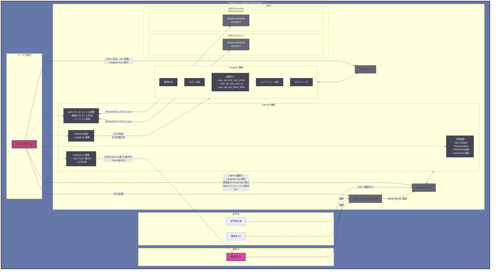

# LiteLLM と Langfuse を用いた組織向け AI コーディングエージェント環境

このドキュメントでは、LiteLLM と Langfuse を組み合わせた組織向け AI コーディングエージェント環境のアーキテクチャについて説明します。この構成により、部門単位でのコスト管理、ユーザー単位での使用状況追跡、および全社的なコスト分析が可能になります。

## アーキテクチャ図

## 主要コンポーネントと関係性

### 1. 組織構造
- 組織内に複数の部門（部門A、部門B）が存在
- 各部門に所属する開発者がClineを使用
- インフラ部門がAWS環境全体を管理

### 2. LiteLLM の主要機能
- **Teams管理**: 部門ごとにTeamを作成し、独立した設定と管理が可能
- **予算管理**: Max Budget、Reset Budget、TPM/RPM制限などを設定
- **Virtual Key管理**: ユーザーとTeamの紐付け、タグ付与による詳細な識別情報の管理
- **Callback設定**: Langfuseとの連携設定

### 3. Langfuse の主要機能
- **使用状況モニタリング**: ユーザー別、部門別、モデル別の使用状況
- **コスト分析**: 予算対比、使用量トレンド分析
- **自動タグ付与**: user_api_key_user_email、user_api_key_user_id、user_api_key_team_alias

### 4. 運用フロー
- **初期設定**: インフラチームがLangfuse Key発行、LiteLLM設定、Team作成、予算設定、Virtual Key発行を実施
- **利用**: 開発者はClineにVirtual Keyを設定し、LiteLLM経由でBedrockにアクセス
- **モニタリング**: インフラチームがLangfuseダッシュボードでコスト分析、予算超過監視、使用パターン分析を実施

## 実装上の重要ポイント

1. **LiteLLMの設定**
   - Virtual Keyの発行時に部門情報をメタデータとして付与
   - ユーザー識別情報をLangfuseへ転送するよう設定
   - 部門ごとのクォータ設定

2. **Langfuseの設定**
   - 部門情報をタグとして記録
   - 部門別ダッシュボードの作成
   - 全社データアクセス権設定

この構成により、部門単位での予算管理と使用制限、ユーザー単位での識別と追跡、そして全社的なコスト分析が可能になります。LiteLLMのTeam機能とVirtual Key管理を活用することで、組織構造に合わせた柔軟な権限管理と予算配分が実現できます。

## 補足説明

### LiteLLM の AWS アカウント管理機能
LiteLLM では複数の AWS アカウントのクレデンシャルを管理することができます。これにより、以下のような運用が可能になります：

- 複数の AWS アカウントの認証情報を一元管理
- アカウントごとに異なる Bedrock エンドポイントの利用
- チーム/部門ごとに異なる AWS アカウントの割り当て

### コスト管理の一元化
当初はコスト管理者を独立した役割として設計していましたが、以下の理由からインフラチームに統合することにしました：

- 責任の所在を明確化
- 管理フローの簡略化
- AWS 環境全体の管理とコスト管理の一元化

### 図の簡略化について
アーキテクチャ図は以下の方針で簡略化を行いました：

1. 部門の表示を必要最小限に抑制（部門 A、B のみ表示）
2. Virtual Key の流れは代表的な例（開発者 A1）のみ表示
3. データベース（Postgres、Clickhouse など）の詳細は省略
4. LiteLLM と Langfuse の内部構成は主要機能のみ表示

これにより、組織構造、認証フロー、コスト管理の流れが視覚的に理解しやすくなっています。
