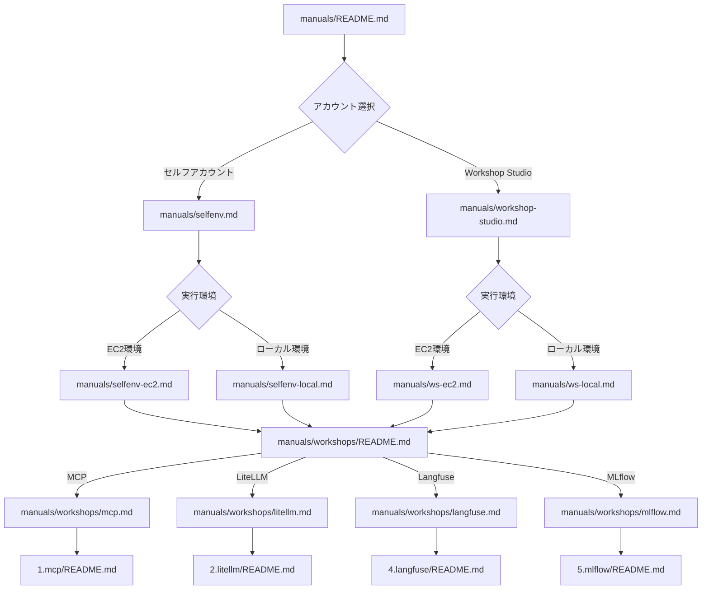

# Cline ワークショップ

このワークショップでは、AI コーディング支援エージェント Cline を活用した実践的なハンズオンを行います。

## ワークショップの概要

このワークショップでは Cline に加えて組織利用を想定した以下の内容を学びます：

1. **MCP（Model Context Protocol）**
   - MCP Server の構築
   - AWS ドキュメント検索との統合

2. **LiteLLM Proxy**
   - Amazon Bedrock との連携
   - 複数モデルの統合管理

3. **Langfuse**
   - コスト・レイテンシー可視化

4. **MLflow**
   - AI 応答のモニタリング
   - コストと品質の追跡
   - 継続的な改善プロセス

## ドキュメント構成

フローチャートの各ノードをクリックすると、対応するドキュメントにジャンプできます。例えば、「セルフアカウント」をクリックするとセルフアカウントのセットアップガイドに移動します。

このドキュメント構成に従って、環境のセットアップからワークショップの実施まで段階的に進めることができます。

## 環境選択

ワークショップを開始する前に、ワークショップで使用する AWS アカウントを選択してください：

### 1. 企業の AWS アカウントを使用

自社の AWS アカウントを使用してワークショップを実施する場合：

- Amazon Bedrock の有効化が必要
- 適切な IAM 権限の設定が必要
- クオータの確認と調整が必要

👉 [企業アカウントでの環境セットアップへ](./selfenv.md)

### 2. Workshop Studio を使用

AWS が提供する Workshop Studio 環境を使用する場合：

- 事前に設定された環境を利用可能
- 制限時間内での利用

👉 [Workshop Studio 環境セットアップへ](./workshop-studio.md)

## 前提知識

ワークショップ実施のために以下の前提知識を必要とします。

- AWS の基本的な知識
- コマンドラインの基本操作
- Git の基本的な使用方法
- Docker の基本的な操作

## 所要時間

- 環境セットアップ：約 20-30 分
- 各ワークショップ：約 0.5-1 時間

## サポート

問題が発生した場合は、以下を確認してください：
- 各セクションのトラブルシューティングガイド

---

**[次のステップ]**
- [企業アカウントでの環境セットアップ](./selfenv.md)
- [Workshop Studio 環境セットアップ](./workshop-studio.md)
