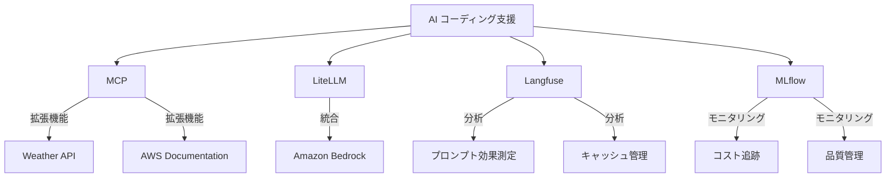

# AI コーディングワークショップ

このワークショップでは、AI エージェントを活用したコーディング支援の実践的なハンズオンを行います。

## ドキュメント構成

フローチャートの各ノードをクリックすると、対応するドキュメントにジャンプできます。例えば、「企業アカウント」をクリックすると企業アカウントのセットアップガイドに移動します。

## ワークショップの概要

フローチャートの各ワークショップ名（MCP、LiteLLM、Langfuse、MLflow）をクリックすると、対応するワークショップのガイドにジャンプできます。

このワークショップでは以下の内容を学びます：

1. **MCP（Model Context Protocol）**
   - AI エージェントの機能拡張
   - 外部 API との連携
   - AWS ドキュメント検索との統合

2. **LiteLLM**
   - Amazon Bedrock との連携
   - プロンプトのキャッシュ管理
   - 複数モデルの統合管理

3. **Langfuse**
   - プロンプトの効果測定
   - 応答品質の分析
   - コスト最適化の分析

4. **MLflow**
   - AI 応答のモニタリング
   - コストと品質の追跡
   - 継続的な改善プロセス

## 環境選択

ワークショップを開始する前に、使用する AWS アカウントを選択してください：

### 1. 企業の AWS アカウントを使用

自社の AWS アカウントを使用してワークショップを実施する場合：

- Amazon Bedrock の有効化が必要
- 適切な IAM 権限の設定が必要
- クオータの確認と調整が必要

👉 [企業アカウントでの環境セットアップへ](./selfenv.md)

### 2. Workshop Studio を使用

AWS が提供する Workshop Studio 環境を使用する場合：

- 事前に設定された環境を利用可能
- 追加の権限設定不要
- 制限時間内での利用

👉 [Workshop Studio 環境セットアップへ](./workshop-studio.md)

## 前提知識

- AWS の基本的な知識
- コマンドラインの基本操作
- Git の基本的な使用方法

## 所要時間

- 環境セットアップ：約30分
- 各ワークショップ：約1-2時間

## サポート

問題が発生した場合は、以下を確認してください：
- 各セクションのトラブルシューティングガイド
- ワークショップ中の質問チャンネル
- [AWS Support](https://aws.amazon.com/jp/support/)

---

**[次のステップ]**
- [企業アカウントでの環境セットアップ](./selfenv.md)
- [Workshop Studio 環境セットアップ](./workshop-studio.md)
