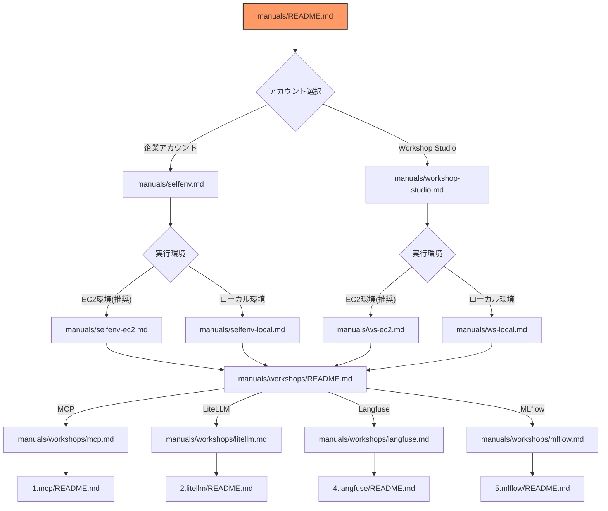

# AI コーディングワークショップ

このワークショップでは、AI エージェントを活用したコーディング支援の実践的なハンズオンを行います。

## ドキュメント構成

ワークショップは実施環境の違いを考慮した複数のドキュメントから構成されます。
以下の図をご確認の上で、ご自身の環境に合わせて作業を進めてください。
AWS アカウント選択として、セルフアカウント、もしくは Workshop Studio アカウント、を利用してください。
そして、VS Code の実行環境としてローカル PC もしくは、Amazon EC2、を利用してください。

フローチャートの各ノードをクリックすると、対応するドキュメントにジャンプできます。
例えば、「manuals/selfenv.md」をクリックするとセルフアカウントのセットアップガイドに移動します。

## ワークショップの概要

本ワークショップで用いる Cline、LiteLLM Proxy、Langufuse などの説明や組み合わせ方については [ブログ](../blog/README.md) を参照してください。

このワークショップでは以下の内容を学びます：

1. **MCP（Model Context Protocol）**
   - 自作の MCP Server の構築
   - AWS ドキュメント検索 MCP 等の公開されている MCP の利用

2. **LiteLLM**
   - Amazon Bedrock との連携
   - 複数モデルの統合管理

3. **Langfuse/MLflow**
   - コストやレイテンシー、トレースログの分析

## 環境選択

ワークショップを開始する前に、使用する AWS アカウントを選択してください：

### 1. 企業の AWS アカウントを使用

自社の AWS アカウントを使用してワークショップを実施する場合：

- Amazon Bedrock の有効化が必要
- 適切な IAM 権限の設定が必要
- クオータの確認と調整が必要

👉 [企業アカウントでの環境セットアップへ](./selfenv.md)

### 2. Workshop Studio を使用

AWS が提供する Workshop Studio 環境を使用する場合：

- 事前に設定された環境を利用可能
- 追加の権限設定不要
- 制限時間内での利用

👉 [Workshop Studio 環境セットアップへ](./workshop-studio.md)

## 前提知識

- AWS の基本的な知識
- コマンドラインの基本操作
- Git の基本的な使用方法

## 所要時間

- 環境セットアップ：約 30 分
- 各ワークショップ：約 0.5-1 時間

## サポート

問題が発生した場合は、以下を確認してください：
- 各セクションのトラブルシューティングガイド

---

**[次のステップ]**
- [企業アカウントでの環境セットアップ](./selfenv.md)
- [Workshop Studio 環境セットアップ](./workshop-studio.md)
