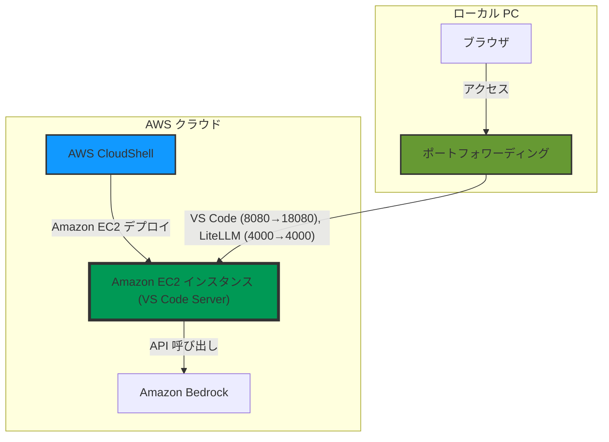

# L200: Cline による AI コーディング支援エージェント体験

本資料ではワークショップの一連の流れをまとめます。

> **注意**: 手順実行中に問題が発生した場合は、まず本ドキュメント末尾の「トラブルシューティング」セクションをご確認ください。特に Windows PowerShell をご利用の方は、ポートフォワーディングコマンドが異なりますので、トラブルシューティングセクションの Windows 向け手順をご参照ください。

## はじめに

本ワークショップでは、AI コーディング支援エージェント Cline を使用して開発生産性を向上させる方法を学びます。参加者は自身の AWS アカウントを利用して環境を構築します。ワークショップ参加にあたっての事前準備や環境要件については、[prerequisites.md](./prerequisites.md) をご確認ください。

## 座学 (おおよそ 30 分)

AI コーディング支援エージェントは、開発者の生産性を大幅に向上させる可能性を秘めています。本ワークショップの座学セクションでは、まず AI コーディング支援エージェントの概要と、特に Cline と Amazon Bedrock の特徴や利点について解説します。また、企業環境での AI 活用におけるガバナンスの重要性についても概要を説明します。

1. ご挨拶と本日のワークショップに関する全体の説明
2. [座学用ブログ](https://github.com/littlemex/aws-samples/blob/main/workshops/ai-coding-workshop/cline/blog/README.md) の説明と質疑応答

## ハンズオン (おおよそ 2 時間)

本ハンズオンでは、AWS 環境上で AI コーディング支援エージェントを構築し、適切なガバナンスを確保しながら運用するための一連の作業を体験します。まず AWS マネジメントコンソールから AWS CloudShell を起動し、AWS CloudFormation テンプレートを使用して Amazon EC2 インスタンスをデプロイします。次に、ポートフォワーディングを設定してローカルブラウザから VS Code Server にアクセスし、開発環境を整えます。この環境内で Cline 拡張機能をインストールし、Amazon Bedrock との連携設定を行います。

続いて、LiteLLM Proxy をコンテナとして起動し、Cline からアクセスできるよう設定します。Amazon EC2 インスタンスのプロファイルに、Amazon Bedrock アクセス用の AWS Identity and Access Management (IAM) ロールが付与されているため、アクセスキーなどの認証情報を明示的に設定することなく、数ステップで安全に Amazon Bedrock の LLM モデルを利用できます。LiteLLM Proxy の管理 UI にアクセスして、モデルの設定状況やログを確認する方法も学びます。

このハンズオンを通じて、参加者は開発生産性の向上を実現する環境構築のスキルを習得できます。

> **注意**: このワークショップでは、LiteLLM Proxy や Languse を Amazon EC2 インスタンス上で実行します。これは、開発環境でのインタラクティブな設定と操作の体験を重視するためです。本番環境では、[AWS ガイダンスのサンプルソリューション](blog/README.md#ソリューション-1-1-セキュアな実行環境の実現)を参考に、Amazon ECS や Amazon EKS などのコンテナオーケストレーションサービスへのデプロイを検討してください。


## 作業環境の概要

ハンズオンでは以下の 3 つの環境を使い分けて作業を進めます。各環境の役割と実施する作業を明確にすることで、スムーズにハンズオンを進めることができます。



### 各環境での作業内容

1. **AWS CloudShell**
   - **目的**: EC2 インスタンスの起動のみ
   - **作業**: CloudFormation テンプレートのデプロイ
   - **特徴**: 権限が既に設定されており、誤って別環境にデプロイするリスクを回避できます

2. **ローカル PC**
   - **目的**: ポートフォワーディングの設定のみ
   - **作業**: 以下のポートフォワーディングを設定
     - VS Code Server: 8080 → 18080
     - LiteLLM: 4000 → 4000
   - **注意点**: 一定時間接続がないとポートフォワーディングが終了するため、必要に応じてコマンドを再実行してください

3. **EC2 上の VS Code Server**
   - **目的**: 実際のハンズオン作業の実施
   - **作業**: Cline のセットアップ、LiteLLM Proxy の設定など
   - **アクセス方法**: ローカル PC のブラウザから http://localhost:18080 にアクセス

この環境構成により、AWS の権限管理を適切に行いながら、効率的にハンズオンを進めることができます。

## 手順リスト

### 0. 事前準備

ワークショップ参加前に [prerequisites.md](./prerequisites.md) に記載された事前準備を完了してください。

ローカル PC に必要なツールのインストールを実施します。既に実施されている方は実施済み作業をスキップしてください。

1. [AWS CLIをインストール](https://docs.aws.amazon.com/ja_jp/cli/latest/userguide/getting-started-install.html)します
1. [AWS Systems Manager Session Manager プラグインをインストール](https://github.com/littlemex/aws-samples/blob/main/workshops/ai-coding-workshop/cline/0.setup/README.md#%E3%83%AD%E3%83%BC%E3%82%AB%E3%83%AB-pc-%E3%81%AB%E5%BF%85%E8%A6%81%E3%81%AA%E3%83%84%E3%83%BC%E3%83%AB%E3%81%AE%E3%82%A4%E3%83%B3%E3%82%B9%E3%83%88%E3%83%BC%E3%83%AB)します
2. [AWS 認証情報の設定](https://github.com/littlemex/aws-samples/tree/main/workshops/ai-coding-workshop/cline/0.setup/1.cline#2-amazon-bedrock-%E3%81%AE%E8%AA%8D%E8%A8%BC%E6%83%85%E5%A0%B1%E8%A8%AD%E5%AE%9A) を行います

### 1. 環境構築

1. [AWS マネジメントコンソール](https://console.aws.amazon.com/)にログインします
2. [AWS CloudShell を起動](https://github.com/littlemex/aws-samples/blob/main/workshops/ai-coding-workshop/cline/0.setup/cfn/README.md#aws-cloudshell-を使用する場合)します
3. [AWS CloudFormation テンプレートをダウンロード](https://github.com/littlemex/aws-samples/blob/main/workshops/ai-coding-workshop/cline/0.setup/cfn/README.md#共通操作)します
   ```bash
   curl -O https://raw.githubusercontent.com/littlemex/aws-samples/main/workshops/ai-coding-workshop/cline/0.setup/cfn/ec2-ssm.yml
   ```
4. [AWS CloudFormation スタックをデプロイ](https://github.com/littlemex/aws-samples/blob/main/workshops/ai-coding-workshop/cline/0.setup/cfn/README.md#1-ec2-ssmyml-を使用する場合)します
   ```bash
   export USERNAME=<任意の値（- 使用可、_ 使用不可）>
   aws cloudformation deploy \
     --template-file ec2-ssm.yml \
     --stack-name ai-workshop-${USERNAME} \
     --parameter-overrides UserName=${USERNAME} Environment=dev \
     --capabilities CAPABILITY_NAMED_IAM
   ```
   ※ EC2 インスタンスの起動には 5-10 分程度かかります。この待ち時間を利用して次のステップを実施します。

#### 1.1 Amazon Bedrock のモデルアクセス設定

EC2 インスタンスが起動している間に、[Amazon Bedrock のモデルアクセスを設定](https://github.com/littlemex/aws-samples/blob/main/workshops/ai-coding-workshop/cline/0.setup/README.md#amazon-bedrock-モデルアクセスの設定)します。

- 「us-east-1」、「us-east-2」、「us-west-2」で Anthropic 全モデルを有効にします
-  モデルの利用可能状態になるまで数分待ちます

#### 1.2 Amazon EC2 へのアクセス

スタックの出力を確認してデプロイが完了しているか確認します。

5. [スタックの出力を確認](https://github.com/littlemex/aws-samples/blob/main/workshops/ai-coding-workshop/cline/0.setup/cfn/README.md#アクセス方法)します
   ```bash
   aws cloudformation describe-stacks \
     --stack-name ai-workshop-${USERNAME} \
     --query 'Stacks[0].Outputs' \
     --output table
   ```
6. ローカル PC で[ポートフォワーディングを設定](https://github.com/littlemex/aws-samples/blob/main/workshops/ai-coding-workshop/cline/0.setup/cfn/README.md#vs-code-server-へのアクセス)します（Windows PowerShell をご利用の方は、トラブルシューティングセクションをご参照ください）
   ```bash
   aws ssm start-session \
     --target <インスタンス ID> \
     --document-name AWS-StartPortForwardingSession \
     --parameters '{"portNumber":["8080"],"localPortNumber":["18080"]}'
   ```
7. ブラウザで [VS Code Server にアクセス](https://github.com/littlemex/aws-samples/blob/main/workshops/ai-coding-workshop/cline/0.setup/cfn/README.md#vs-code-server-へのアクセス)します（http://localhost:18080）

### 2. Cline のセットアップ

1. [Cline 拡張機能をインストール](https://github.com/littlemex/aws-samples/blob/main/workshops/ai-coding-workshop/cline/0.setup/1.cline/README.md#1-cline-拡張機能のインストール)します
2. [Cline の認証設定](https://github.com/littlemex/aws-samples/blob/main/workshops/ai-coding-workshop/cline/0.setup/1.cline/README.md#2-amazon-bedrock-の認証情報設定)を行います。
    - API Provider に Amazon Bedrock を指定する場合は、プロファイル or アクセスキー設定が必要です。
3. [Cline の詳細設定](https://github.com/littlemex/aws-samples/blob/main/workshops/ai-coding-workshop/cline/0.setup/1.cline/README.md#3-cline-の詳細設定)を行います

### 3. LiteLLM Proxy の設定

1. LiteLLM ディレクトリに移動します
   ```bash
   cd ~/aws-samples/workshops/ai-coding-workshop/cline/2.litellm/
   ```
2. [環境変数を設定](https://github.com/littlemex/aws-samples/blob/main/workshops/ai-coding-workshop/cline/2.litellm/README.md#1-iam-ロールを使用する方法推奨)します
   ```bash
   cp .env.example .env
   # アクセスキー等の設定は不要
   ```
3. [LiteLLM Proxy を起動](https://github.com/littlemex/aws-samples/blob/main/workshops/ai-coding-workshop/cline/2.litellm/README.md#1-iam-ロールを使用する方法推奨)します
   ```bash
   ./manage-litellm.sh start
   ```
4. [動作確認](https://github.com/littlemex/aws-samples/blob/main/workshops/ai-coding-workshop/cline/2.litellm/README.md#3-動作確認)を行います
   ```bash
   export LITELLM_MASTER_KEY=sk-litellm-test-key
   curl http://localhost:4000/v1/models \
     -H "Authorization: Bearer ${LITELLM_MASTER_KEY}"
   ```
5. [Cline と LiteLLM Proxy を連携](https://github.com/littlemex/aws-samples/blob/main/workshops/ai-coding-workshop/cline/2.litellm/README.md#cline-での-litellm-設定)します
6. 追加で Port Forward を設定します（Windows PowerShell をご利用の方は、トラブルシューティングセクションをご参照ください）
   ```bash
   aws ssm start-session \
     --target <インスタンス ID> \
     --document-name AWS-StartPortForwardingSession \
     --parameters '{"portNumber":["4000"],"localPortNumber":["4000"]}'
   ```
6. [LiteLLM Proxy 管理画面](https://github.com/littlemex/aws-samples/blob/main/workshops/ai-coding-workshop/cline/2.litellm/README.md#litellm-管理画面admin-ui)にアクセスします（http://localhost:4000/ui)

### 4. AWS AI コーディングワークショップ

LiteLLM の設定が完了したら、以降のハンズオンは [AWS AI コーディングワークショップ](https://catalog.us-east-1.prod.workshops.aws/workshops/8f8ffcbc-af1f-4421-98cc-68ba5bc20d08/ja-JP/03-try-ai-coding) の手順に従って進めてください。

このワークショップでは、AWS の AI サービスを活用したコーディング支援の実践的な方法を学ぶことができます。

### 5. オプショナルハンズオン（時間に余裕がある場合）

#### 5.1 MCP の活用

MCP（Model Context Protocol）を活用することで、Cline の機能を拡張できます。

1. [MCP Marketplace の活用](https://github.com/littlemex/aws-samples/blob/main/workshops/ai-coding-workshop/cline/1.mcp/1.marketplace-mcp/README.md)を体験します - **推奨**

## トラブルシューティング

### Windows PowerShell でのポートフォワーディング

Windows PowerShell をご利用の方は、[prerequisites.md](./prerequisites.md) の「Windows と Mac/Linux の違い」セクションをご参照ください。コマンドの形式が異なりますので、必ず事前に確認をお願いします。

**重要**: プロファイルを設定している場合は、コマンドに `--profile <プロファイル名>` を追加する必要があります。詳細は [prerequisites.md](./prerequisites.md) の「プロファイル設定に関する注意点」をご確認ください。

### その他の問題

- 組織の制約で session-manager-plugin をローカル PC に入れることができない場合
  - ローカルの VS Code を用いて Remote Development using SSH を利用してみてください。設定方法は[こちら](https://github.com/littlemex/aws-samples/blob/main/workshops/ai-coding-workshop/cline/0.setup/0.remotessh/README.md)

- Cline の認証エラーが発生する場合
  - [AWS 認証情報が正しく設定されているか確認](https://github.com/littlemex/aws-samples/blob/main/workshops/ai-coding-workshop/cline/0.setup/1.cline/README.md#トラブルシューティング)してください
  - リージョンが正しく設定されているか確認してください

- モデルにアクセスできない場合
  - [AWS アカウントで Amazon Bedrock のモデルへのアクセスが有効になっているか確認](https://github.com/littlemex/aws-samples/blob/main/workshops/ai-coding-workshop/cline/0.setup/README.md#amazon-bedrock-モデルアクセスの設定)してください
  - 「Use cross-region inference」が有効になっているか確認してください

- LiteLLM Proxy の接続エラーが発生する場合
  - [LiteLLM Proxy が正常に起動しているか確認](https://github.com/littlemex/aws-samples/blob/main/workshops/ai-coding-workshop/cline/2.litellm/README.md#3-動作確認)してください
  - API キーが正しく設定されているか確認してください
  - `403 You don't have access to the model with the specified model ID.` が出る場合は、モデルアクセスの有効化の手順を改めて確認してください
