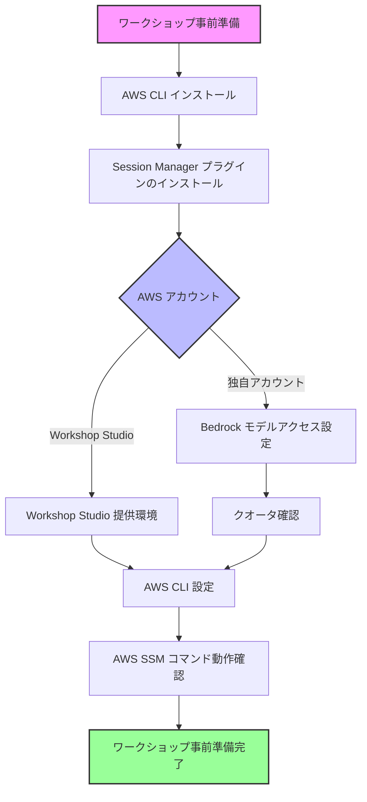

# Cline ワークショップの前提条件

このドキュメントでは、Cline ワークショップを実施するための前提条件と環境設定について説明します。
ローカル PC に直接 Cline を導入して利用するケースは本ドキュメントでは扱いません。

## 必要な環境と設定



## 事前準備の詳細

### 共通要件

- **利用可能リージョン**: us-east-1, us-east-2, us-west-2
- **AWS CLI v2**: ローカル PC にインストールされていること
- **AWS Systems Manager Session Manager プラグイン**: ローカル PC にインストールされていること

### AWS CLI の設定と動作確認

Windows, Mac, Linux など OS によらず以下のコマンドを実行できます。Windows の場合は WSL2 または PowerShell で実行してください。

1. **認証情報の設定**:
   ```bash
   # IAM ユーザーの場合
   aws configure

   # または IAM Identity Center (SSO) の場合
   aws configure sso
   ```

2. **プロファイル設定の確認**:
   ```bash
   # 設定されているプロファイルの一覧を表示
   aws configure list-profiles
   ```

3. **AWS SSM コマンドの動作確認**:
   ```bash
   # デフォルトプロファイルの場合
   aws sts get-caller-identity

   # プロファイル名を指定する場合（例: cline）
   aws sts get-caller-identity --profile cline
   ```
   
   正常に動作すると、以下のような情報が表示されます：
   ```json
   {
       "UserId": "XXXXXXXXXXXXXXXXXXXXX",
       "Account": "123456789012",
       "Arn": "arn:aws:iam::123456789012:user/username"
   }
   ```

### プロファイル設定に関する注意点

- プロファイル名を `cline` などデフォルト以外に設定した場合、**すべての AWS コマンドに `--profile` オプションが必要**です
- 環境変数で指定することも可能です：
  ```bash
  export AWS_PROFILE=cline
  ```
- プロファイルの設定内容は `~/.aws/config` と `~/.aws/credentials` に保存されます

### AWS アカウントの事前設定（独自アカウントを利用する場合）

1. **Amazon Bedrock の有効化**:
   - us-east-1, us-east-2, us-west-2 リージョンで Anthropic 全モデルを有効化
   - ワークショップ実施前にインフラ部門やワークショップ実施の代表者が自社のアカウントで有効化を確認ください

2. **Amazon Bedrock のクオータの確認**:
   - TPM (Tokens per minute) が 1,000,000 であることを確認
   - Cross-region model inference tokens per minute for Anthropic Claude 3.7 Sonnet V1 の確認

## Windows と Mac/Linux の違い

ワークショップ当日、ローカル PC の OS の違いによる主な違いはポートフォワーディングコマンド形式です。

### Mac/Linux の場合

```bash
aws ssm start-session \
  --target <インスタンス ID> \
  --document-name AWS-StartPortForwardingSession \
  --parameters '{"portNumber":["8080"],"localPortNumber":["18080"]}'
```

### Windows PowerShell の場合

```powershell
aws ssm start-session `
  --target <インスタンス ID> `
  --document-name AWS-StartPortForwardingSession `
  --parameters '{\"portNumber\":[\"8080\"],\"localPortNumber\":[\"18080\"]}'
```

主な違い:
1. 行継続文字: Mac/Linux では `\`、Windows PowerShell では `` ` `` (バッククォート)
2. JSON 文字列内のクォート: Windows PowerShell では `\"` でエスケープ

**注意**: プロファイルを設定している場合は、コマンドに `--profile <プロファイル名>` を追加してください。

## 事前準備チェックリスト

以下の項目を確認して、ワークショップの準備が整っているか確認してください：

- [ ] AWS CLI v2 がインストールされている
- [ ] AWS Systems Manager Session Manager プラグインがインストールされている
- [ ] AWS 認証情報が設定されている（`aws configure` または `aws configure sso`）
- [ ] `aws sts get-caller-identity` コマンドが正常に動作する（プロファイルを設定した場合は `--profile` オプション付きで）
- [ ] OS に応じたポートフォワーディングコマンドの形式を確認している
- [ ] プロファイルを設定した場合、プロファイル名を記録している
