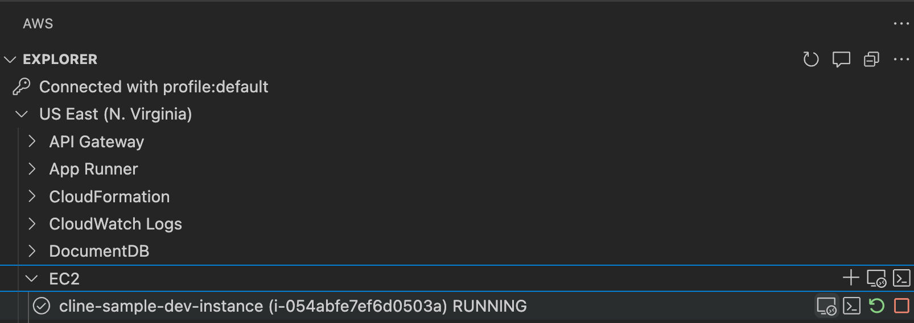
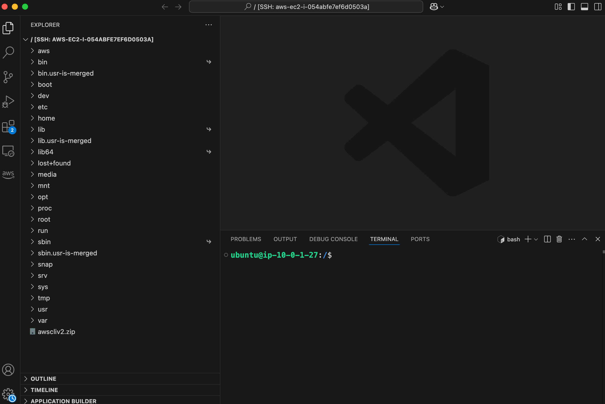
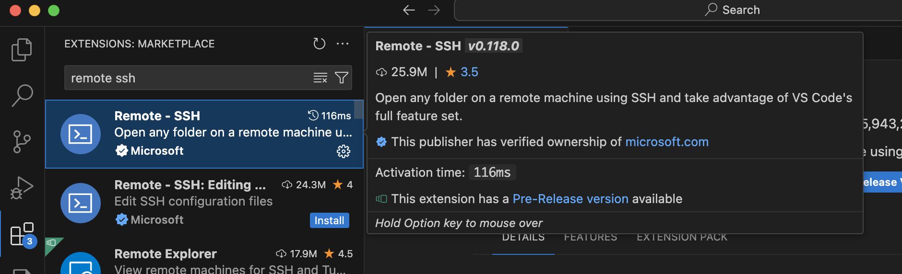
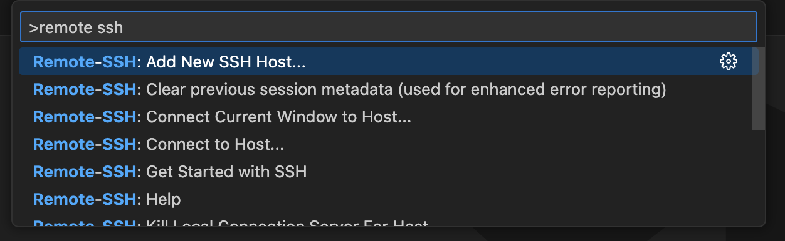
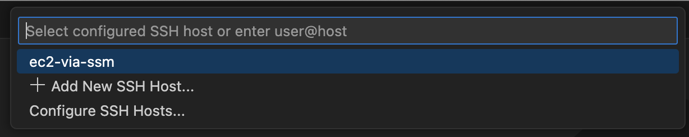

# VS Code Remote Development using SSH 接続セットアップガイド

このガイドでは、AWS Systems Manager (SSM) を使用して EC2 インスタンスに VS Code から Remote Development using SSH で接続する方法を説明します。
自ら設定を行って導入するパターンと AWS Toolkit を利用するパターンを紹介します。

# 1. AWS Toolkit を利用するパターン

事前にローカル PC で `aws configure --profile cline` 等の AWS 認証情報の設定が適切に行われていることを前提とします。

まず、VS Code の Extensions から [AWS Toolkit](https://aws.amazon.com/visualstudiocode/) をインストールします。  
そして、サイドバーの AWS Toolkit を選択し、「EXPLORER」>「EC2」> 「${USERNAME}-dev-instance」の「Connect VS Code to EC2 Instance」ボタンを押下します。



必要な SSM Plugin や SSH Config などの設定が自動的に実行され、Amazon EC2 に Remote Development で接続できます。



# 2. 自ら設定を行って導入するパターン

## 1. SSH キーペアの設定

既にキーペアが生成されている場合はスキップで構いません。

```bash
# SSH キーペアの生成
ssh-keygen -t rsa -b 4096 -f ~/.ssh/id_rsa

# 権限の設定
chmod 600 ~/.ssh/id_rsa
chmod 644 ~/.ssh/id_rsa.pub
```

## 2. Amazon EC2 インスタンスの SSH 設定

1. SSM セッションを開始：
```bash
export INSTANCE_ID=<インスタンス ID>
aws ssm start-session \
  --target $INSTANCE_ID \
  --document-name AWS-StartPortForwardingSession \
  --parameters '{"portNumber":["22"],"localPortNumber":["2222"]}'
```

2. EC2 インスタンス上での設定：
```bash
# .ssh ディレクトリの作成と権限設定
mkdir -p ~/.ssh && chmod 700 ~/.ssh

# authorized_keys ファイルの作成
touch ~/.ssh/authorized_keys && chmod 600 ~/.ssh/authorized_keys

# ローカルの公開鍵を authorized_keys に追加
# ローカルマシンで実行：
cat ~/.ssh/id_rsa.pub
# 表示された公開鍵をコピー

# EC2 インスタンスで実行：
echo "コピーした公開鍵" >> ~/.ssh/authorized_keys
```

## 3. SSH 設定ファイルの作成

ローカルマシンで以下の手順を実行します。
すでに `../../scripts/port_forward.py` でポートフォワードされている前提です。

1. SSH config ファイルを作成または編集：
```bash
touch ~/.ssh/config
chmod 600 ~/.ssh/config
```

2. `~/.ssh/config` に以下の内容を追加：

```
Host ec2-via-ssm
    HostName localhost
    User coder
    Port 2222
    IdentityFile ~/.ssh/id_rsa
    StrictHostKeyChecking no
    UserKnownHostsFile /dev/null
    ServerAliveInterval 60

Host ec2-via-ssm-forward-4000-4000
    HostName localhost
    User coder
    Port 2222
    StrictHostKeyChecking no
    IdentityFile ~/.ssh/id_rsa  # 秘密鍵ファイルのパスを指定
    UserKnownHostsFile /dev/null
    ServerAliveInterval 60
    LocalForward 4000 localhost:4000 # http://127.0.0.1:4000 で LiteLLM に接続する場合必要
```

## 4. VS Code の設定と接続

1. VS Code に Remote Development 拡張機能をインストール：

::image::


VS Code の拡張機能タブから「Remote - SSH」を検索してインストールします。

2. VS Code での接続：
   - VS Code を開く
   - 左下の緑色のアイコンをクリック (コマンドパレットから検索も可能)
   - 「Remote-SSH: Connect to Host...」を選択
   - `ec2-via-ssm` を選択





接続が成功すると、左下のステータスバーに「SSH: ec2-via-ssm」と表示されます。
以降は VS Code Server 同様に Cline インストール等の作業を進めてください。

## トラブルシューティング

### 権限の確認
```bash
# ローカルマシンでの確認
ls -la ~/.ssh/id_rsa
ls -la ~/.ssh/config

# EC2 インスタンスでの確認
ls -la ~/.ssh/authorized_keys
ls -la ~/.ssh
```

### SSH 接続のデバッグ
```bash
ssh -v -p 2222 coder@localhost
```

### ポート転送の確認
```bash
# 実行中のポート転送を確認
netstat -an | grep LISTEN
```

## セキュリティに関する重要な注意点

### ファイルとディレクトリの権限設定
- SSH キーの権限は必ず 600 に設定（`chmod 600 ~/.ssh/id_rsa*`）
- `.ssh` ディレクトリの権限は 700 に設定（`chmod 700 ~/.ssh`）
- `authorized_keys` ファイルの権限は 600 に設定（`chmod 600 ~/.ssh/authorized_keys`）

### ネットワークセキュリティ
- 不要なポート転送は必ず終了する（`ps aux | grep "ssh -L"` で確認）
- ポート転送は必要最小限のポートのみを使用
- 使用していない SSH セッションは切断する

### AWS セキュリティ
- AWS IAM ロールは必要最小限の権限に制限する
- セッションマネージャーのログを有効化する
- 定期的に認証情報とアクセス権限を見直す

### その他のセキュリティ対策
- SSH 接続は信頼できるネットワークからのみ行う
- 定期的に SSH キーを更新する
- セッションタイムアウトを適切に設定する