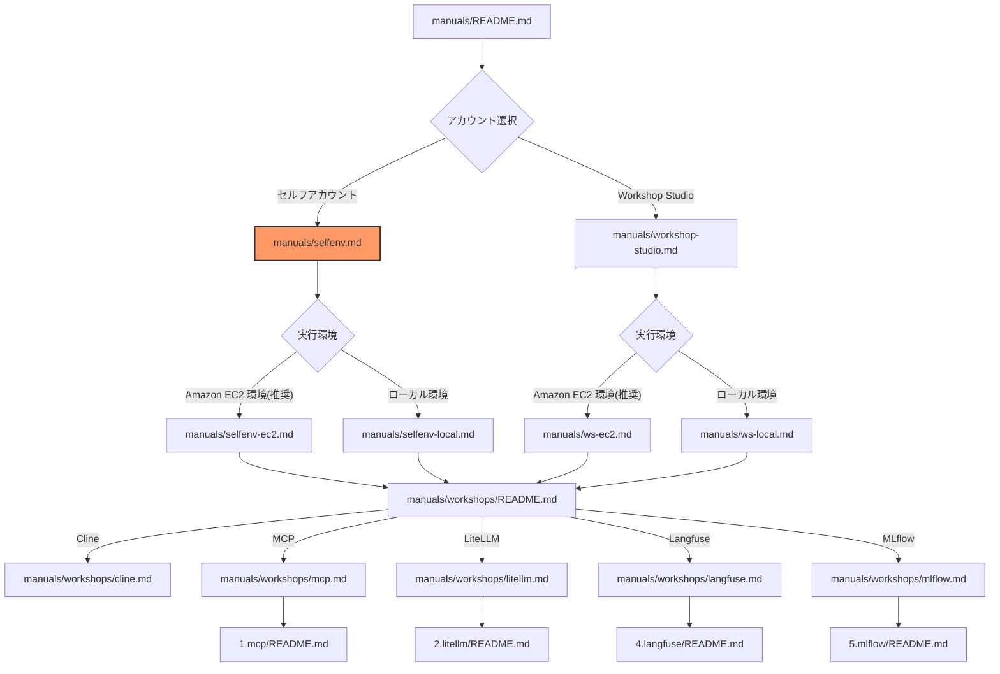

# セルフアカウントでの環境セットアップ

このガイドでは、セルフ AWS アカウントを使用してワークショップ環境をセットアップする手順を説明します。
可能であればワークショップ当日までにこのページの準備が完了していることが望ましいです。

## ドキュメント構成

## 前提条件

### 最低限必要な権限

このワークショップでは、以下の AWS サービスを利用します。Administrator アクセス権限を保有していることを推奨します。
`aws congigure` もしくは `aws configure sso` で AWS CLI もしくは boto3 をローカル PC 上で適切な権限で実行できることが前提です。
AWS Console にアクセスして AWS CloudShell を利用する必要があります。

- Amazon SageMaker
- Amazon S3
- AWS CloudFormation スタックの作成と管理
- Amazon VPC、サブネット、Internet Gateway、NAT Gateway、ルートテーブルなどのネットワークリソースの作成と管理
- Amazon EC2 インスタンスの作成と管理
- IAM ロールとポリシーの作成と管理
- AWS Systems Manager 関連の権限
- AWS Lambda 関数の作成と実行
- Amazon Bedrock モデルの呼び出し権限
   - モデルアクセス有効化の権限をワークショップ受講者に付与できない場合は、インフラ管理者等が事前に利用アカウントのモデルアクセス有効化を実施ください。
- AWS CloudShell へのアクセス

### 必要なツール

| ツール | バージョン | 用途 |
|--------|-----------|------|
| AWS CLI | v2 | AWS 操作 |

## 実行環境の選択

Cline ワークショップの VS Code 実行環境として、以下の 2 つのオプションがあります：

### 1. Amazon EC2 環境（推奨）

Amazon EC2 インスタンスを使用してワークショップを実施する場合：

- AWS CloudFormation によって事前設定済みの環境を利用可能
- IAM Role による認証が可能
- セキュアな実行環境

👉 [Amazon EC2 環境のセットアップへ](./selfenv-ec2.md)

### 2. ローカル PC 環境

ローカル PC を使用してワークショップを実施する場合：

- 既存の開発環境を利用可能
- ローカル PC の環境依存によるトラブルシューティングの複雑化
- ワークショップ実施に制限あり

👉 [ローカル PC 環境のセットアップへ](./selfenv-local.md)

## セキュリティ注意事項

ワークショップ実施時には必ず開発用 AWS アカウントと IAM ユーザー等をご用意ください。
本番環境で使っている AWS アカウントはクォータ影響やセキュリティリスクがあるため絶対に利用しないでください。
ワークショップはあくまでリファレンスであるため実利用時には以下の確認をお願いします。

- SSH キーと設定ファイルの適切な権限設定
- AWS IAM ロールの最小権限原則の適用
- API キーの安全な管理
- 不要なポート転送の終了
- 開発環境のセキュリティ設定の確認

---

**[次のステップ]**
- [Amazon EC2 環境のセットアップ](./selfenv-ec2.md)
- [ローカル PC 環境のセットアップ](./selfenv-local.md)
- [ワークショップ一覧に戻る](./README.md)
